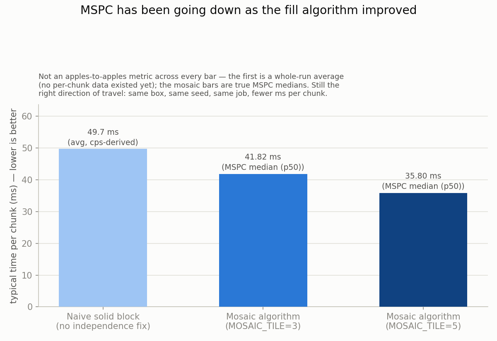

# WorldgenD

Headless, real-vanilla Minecraft chunk generation. No network, no RCON, no tick loop —
just Mojang's own `net.minecraft.server.dedicated.DedicatedServer` reflectively pried open
far enough to call `loadLevel()` and then `ServerChunkCache.getChunkFuture(x, z, FULL, true)`
directly, in parallel, using nothing but the official server jar.

WorldgenD's own compiled classes contain **zero references** to any `net.minecraft.*` or
`com.mojang.*` symbol — no Mojang dependency in `build.gradle.kts`, static or otherwise.
Every Mojang class it touches is a string literal fed to `Class.forName` at runtime, against
a jar *you* provide. Delete the jar and WorldgenD is an inert pile of reflection glue. See
[`TUTORIAL.md`](TUTORIAL.md) for the full how-and-why.

## Requirements

- The official Mojang dedicated server jar. Legally obtained, by you, for you. Not bundled,
  not compiled against, not checked into git (`/servers/*.jar` is gitignored on principle).
- Java 25 (the build pins `jvmToolchain(25)`).

## Setup

```
WorldgenD/
  servers/
    mojang-26-1-1-server.jar   <- put it here, or symlink it here
```

That's the whole install.

## Running

```
./gradlew run
```

Watch the logs for the mosaic fill — a gapless 80x80 block (6400 chunks) tiled across 256
phases, each one provably independent by construction (see `scientific-findings.md` #7-#8
for why 16 is the magic modulus). Every run ends with two summary lines:

```
Done: 6400 chunks generated, 0 failed in 235167ms across 256 phases (fastest=88ms, slowest=16208ms).
MSPC (ms/chunk, n=6400): min=0.04 p1=1.57 p25=8.20 p50=35.80 p75=44.05 p99=137.03 max=1492.91
```

The second line is **MSPC** (milliseconds per chunk) — per-chunk submission-to-completion
latency, reported as a full percentile spread rather than one misleading average.

**In plain terms**: picture ordering 6,400 coffees one at a time and timing every single
cup, from "I'll have a latte" to it hitting the counter. Most come out fast; a few get
unlucky and land behind a rush. MSPC is that stopwatch, run per chunk instead of per
coffee — reported as fastest, typical, and worst-1%, instead of one average that blurs
the good cups and the bad one together. Smaller is better, everywhere. No CPU-architecture
knowledge required. Full formal definition in `scientific-findings.md` #11.



That's the whole point of building MSPC in the first place: a number you can watch go
down as the fill algorithm improves, instead of an average that hides whether it
actually did. See `scientific-findings.md` #13 for the thread-pool experiment that
motivated bumping the mosaic tile size, #14 for a three-way GC comparison (default G1
vs. a throughput-tuned G1 vs. ZGC, all at a fixed pretouched heap), and #15 for the
full chart set.

To test a different `Util.getMaxThreads()` cap without editing code:

```
./gradlew run -PmaxBgThreads=4
```

This forwards `-Dmax.bg.threads=N` to the forked JVM (wired up in `build.gradle.kts`). Note
it's a **ceiling**, not a target: `threads = clamp(availableProcessors() - 1, 1, N)`, so on
an 8-core box any `N ≥ 7` clamps to the same 7 workers you already had — only `N < 7` (like
the `4` above) actually changes anything. Verified live with `jcmd <pid> Thread.print` in
`scientific-findings.md` #13, which also has the more interesting follow-up: cutting workers
from 7 to 4 didn't cost any measurable throughput either.

To try a different garbage collector (or any other raw JVM flags):

```
./gradlew run -PgcArgs="-Xms16g -Xmx16g -XX:+AlwaysPreTouch -XX:+UseZGC"
```

`-PgcArgs` is a plain string, space-split into `jvmArgs` — pass whatever flags you want.
Every run now logs `Active GC(s): ...` at startup (via `ManagementFactory.getGarbageCollectorMXBeans()`),
so you can confirm what actually loaded instead of trusting the flag. `scientific-findings.md`
#14 ran this three ways (default G1, a throughput-tuned G1, and generational ZGC) at a fixed
16GB pretouched heap — ZGC came out ~6% ahead across every MSPC percentile, G1's own tuning
knob made basically no difference.

## Project layout

| File | What it is |
|---|---|
| `src/main/kotlin/io/github/eath1283/worldgend/HeadlessWorldgen.kt` | The whole heist: bootstrap replay, `DedicatedServer` construction, the mosaic fill loop, MSPC instrumentation |
| `src/main/kotlin/io/github/eath1283/worldgend/ServerRuntime.kt` | Finds the server jar, unpacks the bundler payload, builds the `URLClassLoader` |
| `src/main/kotlin/io/github/eath1283/worldgend/Reflect.kt` | Thin `Class`/`Method`/`Constructor` lookup helpers (`Mc`) |
| `TUTORIAL.md` | The narrative: what this does and why it works, written for a human |
| `scientific-findings.md` | The lab notebook: every empirical claim above, backed by `jcmd` thread dumps and `javap` bytecode disassembly instead of vibes |
| `findings/` | Raw data (`mspc_results.csv`, `algorithm_progress.csv`) and the matplotlib script (`plot_results.py`) that generates every chart in this README and in `scientific-findings.md` |

## Docs

- **[`TUTORIAL.md`](TUTORIAL.md)** — start here. How the reflection heist works, step by
  step, and the ground rules that keep it correct (`managedBlock()` is load-bearing, the
  seed is pinned to `69`, etc).
- **[`scientific-findings.md`](scientific-findings.md)** — the evidence. Thread-pool sizing,
  the confirmed radius-8 chunk dependency ceiling (straight out of the jar's bytecode), the
  mosaic algorithm it justifies, the MSPC metric, and an open-questions list for anyone
  picking this up next.

## Legal

Not one byte of Mojang's compiled game ships in this repo or its build output. The jar lives
in a directory you control, is read at runtime, and is never redistributed. This is a remote
control, not a copy of the TV.
