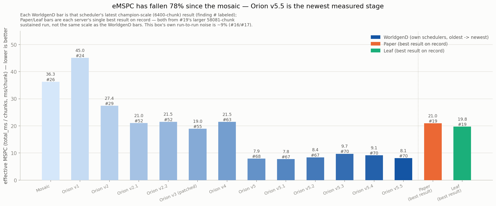

# WorldgenD

Headless, real-vanilla Minecraft chunk generation. No network, no RCON, no tick loop —
just Mojang's own `net.minecraft.server.dedicated.DedicatedServer` reflectively pried open
far enough to call `loadLevel()` and then `ServerChunkCache.getChunkFuture(x, z, FULL, true)`
directly, in parallel, using nothing but the official server jar.

WorldgenD's own compiled classes contain **zero references** to any `net.minecraft.*` or
`com.mojang.*` symbol — no Mojang dependency in `build.gradle.kts`, static or otherwise.
Every Mojang class it touches is a string literal fed to `Class.forName` at runtime, against
a jar *you* provide. Delete the jar and WorldgenD is an inert pile of reflection glue. See
[`TUTORIAL.md`](TUTORIAL.md) for the full how-and-why.

## Requirements

- The official Mojang dedicated server jar. Legally obtained, by you, for you. Not bundled,
  not compiled against, not checked into git (`/servers/*.jar` is gitignored on principle).
- Java 25 (the build pins `jvmToolchain(25)`).

## Setup

```
WorldgenD/
  servers/
    mojang-26-1-1-server.jar   <- put it here, or symlink it here
```

That's the whole install.

## Running

```
./gradlew run
```

Watch the logs for the mosaic fill — a gapless 96x96 block (9216 chunks) tiled across 256
phases, each one provably independent by construction (see `scientific-findings.md` #7-#8
for why 16 is the magic modulus). Every run ends with two summary lines:

The seed defaults to `69`. User-facing launchers may set a signed 64-bit seed with
`-Dworldgen.seed=<seed>` and request machine-readable Orion v5 progress lines with
`-Dworldgen.progress=true`. A launcher that cannot rely on post-bootstrap stdout may
instead set `-Dworldgen.progressfile=<path>`; all options are inert when omitted.

```
Done: 9216 chunks generated, 0 failed in NNms across 256 phases (fastest=NNms, slowest=NNms).
MSPC (ms/chunk, n=9216): min=NN p1=NN p25=NN p50=NN p75=NN p99=NN max=NN
```

The second line is **MSPC** (milliseconds per chunk) — per-chunk submission-to-completion
latency, reported as a full percentile spread rather than one misleading average.

Scheduler modes are selected with `-Dscheduler=mosaic|orion|orion2|orion2.1|orion2.2|orion3|orion4|orion5|orion5.1|orion5.2|orion5.3|orion5.4|orion5.5`.

| Generator | Adds | Measured effective MSPC | Current reading |
|---|---|---:|---|
| Orion v4 | thread-safe structure generation | 20.68–20.80 | serial worldgen lane remains the ceiling |
| Orion v5 | parallel chunk-generation steps | 8.16–8.65 | removes that ceiling; matches Moonrise at seven workers |
| Orion v5.1 | SIMD density batches | 7.77–8.25 | isolated SIMD win, full-generation effect inside noise |
| Orion v5.2 | optimized ImprovedNoise kernel | 8.05–8.40 | Perlin CPU share falls; full-generation effect inside noise |
| Orion v5.3 | allocation-pressure fixes (Ap2/Context/SequenceRule/Aquifer) | 7.87–9.34 | bit-exact, real GC-frequency drop, no confirmed throughput win |
| Orion v5.4 | C1GC bounded chunk reclamation | 8.66–9.17 (champion scale, post batching-fix), 8.75 (256x256) | fixes a real large-tile hang/OOM; champion-scale cost cut from ~13% to ~6% (inside noise) after fixing a per-chunk distance-graph-settle bottleneck |

**Orion v5 is the architectural jump** (`scientific-findings-41-80.md` #62): **~2.5x faster than v4**
at champion scale (eMSPC 8.16-8.65 vs 20.68-20.80, interleaved, n=2 each), steady-state CPU
~709% vs ~313%. The bottleneck v3/v4 hit was never Orion's scheduler or radius-8 scarcity: vanilla
runs every chunk-generation step through one `ConsecutiveExecutor("worldgen")`, so surface,
carvers, and features ran one at a time. v5's agent patch (`-Dorion.patchParallelSteps=true`)
moves `ChunkMap.applyStep`'s step execution onto the background pool under Moonrise-style
write-radius area locks (0 for noise/surface/carvers, 1 for features), with structure steps on
one global lock per C2ME's known structure-piece races, and admission becomes a plain bounded
window with no Orion-side exclusion. Requires the agent with `-Dorion.patchReentrancy=true
-Dorion.patchStructureGenState=true -Dorion.patchParallelSteps=true`; `orion5` fails fast without
them. Block-histogram diffs against v4 show only MC-55596-style vegetation/ore drift.
In #63's interleaved drag race (3 rotating rounds) v5 ran **65% faster than stock Paper** and at
**parity with Paper given the same 7 chunk workers** (8.61 vs 9.13 ms/chunk, inside the noise band):
stock Paper ships 2 Moonrise workers, and once both engines parallelize chunk steps over 7 workers
they converge. #64 extends that to Leaf and Leaf-on-crack: at 7 workers all four land within 8%
(v5 8.84, Paper 9.07, Leaf 9.33, Leaf-on-crack 9.54 ms/chunk), inside the noise band.
#65 introduced deterministic feature scheduling: `-Dorion.deterministicFeatures=region` plus
`-Dorion.patchWorldgenLight=true` was measured at +6.7% (inside noise), and
`closure` at +19.3%. Its original block-equality and mushroom-count claims used a palette-only checker;
finding #66 corrects that measurement. The light-view change can affect mushroom placement.
**Orion v5.1** (`-Dscheduler=orion5.1`) adds SIMD batches for `Mapped`, `MulOrAdd`, and
`Clamp` density arrays. It keeps v5's scheduler and requires the same three safety patches
and agent. `run_direct.py` and the harness enable `jdk.incubator.vector` automatically and
rebuild the agent before use. Direct Java launches should add
`--add-modules=jdk.incubator.vector`; without that module, `auto` falls back to scalar batches.
`-Dorion.simd=scalar` selects the scalar batch control. The result file reports the actual
backend and lane count. All operations retain vanilla's rounding order; FMA is not substituted.
The harness defaults to v5.1 and retains v5 for comparisons. See finding #66 for correctness,
measured performance, and the correction to earlier palette-based world checks.

**Orion v5.2** (`-Dscheduler=orion5.2`) adds an optimized `ImprovedNoise` kernel to v5.1.
The patch removes repeated permutation masking and nested gradient-array access from the hottest
noise path while retaining vanilla interpolation order. It is bit-exact in randomized kernel and
full block-position checks. Matched JFR profiles show the combined hot path falling 12.5%, while
three rotated 6,400-chunk rounds remain a throughput tie with v5.1; see finding #67.

**Orion v5.3** (`-Dscheduler=orion5.3`) patches four allocation-pressure sites found by a JFR
allocation profile of v5.1 (`memory-issue.md`): `DensityFunctions$Ap2.fillArray`'s ADD-branch
scratch buffer, `SurfaceRules$Context.updateY`'s per-call memoizing supplier,
`SurfaceRules$SequenceRule.tryApply`'s `List.iterator()`, and `Aquifer$NoiseBasedAquifer`'s
`MutableDouble` output box — all replaced with reused/cached-in-place state instead of a fresh
allocation per call. It keeps v5's scheduler and requires the same three safety patches and
agent; `-Dorion.patchAllocations=true` is auto-enabled for this scheduler. Bit-exact against v5
(0/256 block-position hashes differ, controlling for #65's spawn-prep caveat). A champion-scale
young-GC count dropped 28% (18 -> 13 collections), confirming the allocation reduction is real,
but total GC pause time and whole-generation throughput were a wash to slightly worse across two
interleaved rounds — inside the noise band, same pattern as v5.1/v5.2. See finding #68.

**Orion v5.4** (`-Dscheduler=orion5.4`, C1GC — Chunk-First Garbage Collector) keeps the v5
prerequisites and v5.3's allocation patch, and adds bounded chunk reclamation for sustained/
large-tile runs. Every chunk generated so far stayed permanently resident (`ChunkEvictor.kt`'s
existing, off-by-default fix aside); at 6,400 chunks that's a rounding error, at 65,536 it's a
16GB heap pinned at its ceiling with no progress for 45+ minutes. C1GC pushes each chunk through
`ACTIVE -> QUARANTINED -> COLLECTIBLE -> DETACHED -> PERSISTED`: only once a chunk clears the
same retain-radius heuristic *and* has its ticket/POI/distance-manager state provably cleared
does it get copied into a compact `SerializableChunkData` record and handed to a bounded,
elastic IO worker pool that writes it to a real `.mca` region file through vanilla's own
`IOWorker`. The same 256x256 mosaic that hung under v5.3 completed cleanly under v5.4 in 9.56
minutes (65,536/65,536 chunks, eMSPC 8.75 ms/chunk, 0 leaked cells). The first cut of this wasn't
free: two interleaved champion-scale rounds (6,400 chunks) showed v5.4 a real 10-16% slower than
v5.3, outside the ~9% noise band. A JFR profile explained why: the ticket-removal step was calling
vanilla's `runDistanceManagerUpdates()` (a full distance/light graph settle) up to 8 times *per
chunk* — ~40% of total CPU time in `ChunkTracker`/`DynamicGraphMinFixedPoint` internals, not
anything C1GC's own code was doing. Batching ticket removals (`BATCH_SIZE = 64`) so that settle
happens once per batch instead of once per chunk cut that share to 0.7% and brought a clean
champion-scale pair down to +6.0% — inside the noise band. See finding #69 and `c1gc/README.md`.

**Orion v5.5** (`-Dscheduler=orion5.5`) is v5.4 with C1GC's cost made conditional, plus the v5.1
SIMD and v5.2 Perlin kernels and a new `WorldGenRegion.getChunk` memo (`RegionChunkMemo.kt`), all
auto-enabled by the agent. Needs the same three v5 patch flags and `--add-modules=jdk.incubator.vector`
(`run_direct.py` and the harness add it). C1GC only starts reclaiming once old-gen occupancy passes
`-Dorion.c1gc.pressure` (default `0.5`; `0` is v5.4's always-on behavior), reclaims on the poll
thread instead of whichever thread completed the chunk (fixes a v5.4 `DistanceManager` race, also
applied to `orion5.4`), and writes vanilla's LZ4 region codec (`-Dorion.c1gc.compression`, default
`lz4`). Bit-exact vs v5.4 in deterministic mode. It's about 12% faster than v5.4 at champion scale,
because at 6,400 chunks C1GC never arms. That's parity with v5.3: the compute patches stay inside
noise, as they did individually. At 65,536 chunks it's at parity with v5.4 (two pairs: -6.1%, +1.0%).
Deferring reclamation costs more full-GC time there, and the compute patches offset it. See finding #70.

Orion v4 is v3 plus a ported structure-generator thread-safety fix (`-Dorion.patchStructureGenState=true`,
required alongside `-Dorion.patchReentrancy=true` — orion4 fails fast without both); see
`scientific-findings-41-80.md` #56. A DFC (density-function compiler) Stage 1 prototype also
exists (`-Dorion.patchDfc=true`, needs `--add-opens java.base/java.lang=ALL-UNNAMED`) but is
**not** required by default — #59/#60 measured it as a real regression at champion scale in two
cache designs (~23-27%, then ~16.6%; both root-caused to dispatch shape, not lookup cost), and
#61 fixed the actual cause (one shared, parameterized interpreter class instead of one bespoke
class per tree shape), landing at +2.7% vs. `orion4` without DFC — inside the ~9% noise band,
parity rather than a confirmed win. Opt-in pending replication; see #61.
Orion v2.1 uses raster target order; Orion v2.2 is the explicitly scatter-ordered variant.

**In plain terms**: picture ordering 9,216 coffees one at a time and timing every single
cup, from "I'll have a latte" to it hitting the counter. Most come out fast; a few get
unlucky and land behind a rush. MSPC is that stopwatch, run per chunk instead of per
coffee — reported as fastest, typical, and worst-1%, instead of one average that blurs
the good cups and the bad one together. Smaller is better, everywhere. No CPU-architecture
knowledge required. Full formal definition in `scientific-findings.md` #11.


Zooming out past the mosaic to every scheduler generation this project has shipped —
**effective MSPC** (`total_ms / chunks`, the same "true average" #18 introduced) has
fallen roughly 77% from the original mosaic to Orion v5.2, favoring each scheduler's
latest result rather than its first. Real Paper and Leaf, at each server's own best
result on record, are plotted alongside for scale.



That's the whole point of building MSPC in the first place: a number you can watch go
down as the fill algorithm improves, instead of an average that hides whether it
actually did. See `scientific-findings.md` #13 for the thread-pool experiment that
motivated bumping the mosaic tile size, #14 for a three-way GC comparison (default G1
vs. a throughput-tuned G1 vs. ZGC, all at a fixed pretouched heap), #15 for what
happens when GC choice is crossed with a smaller worker pool (short version: the
7-worker GC ranking from #14 flips at 4 workers), #16 for a JFR profile of the champion config
(reflection costs ~0.02% of runtime — already invisible — and "obviously faster" `MethodHandle`s
turned out to be an 8% regression on this JDK), #17 for an attempt to tune ParallelGC harder
(the result was indistinguishable from this box's own ~9% run-to-run noise — there was no
headroom left after #16 already proved GC costs under 0.4% of wall time), #18 for the
uncomfortable one (a real, unmodified Paper server with the Chunky plugin beats this whole
project's own best-tuned config by ~53% throughput, using *fewer* dedicated worker threads —
strong evidence that Paper's fork-level generator patches, not concurrency tuning, are where
the real headroom was this whole time), #19 for the same comparison at ~9x the scale (58081
chunks) — confirms WorldgenD's own throughput holds steady as the job grows, and gives Leaf a
big enough sample to show a real ~6% edge over Paper that #18's smaller run couldn't tell apart
from noise — #20 for the full chart set, #21 for what happened when we tried stealing Paper's Moonrise chunk-scheduler idea directly — calling the vanilla, unmodified `managedBlock()` from more than one thread at once (no timing win, left in as an opt-in `-Dpump.threads=N` flag, off by default), #22 for the correction: the terrain divergence we first blamed on that turned out to be almost entirely [MC-55596](https://bugs.mojang.com/browse/MC-55596), a real, long-standing Mojang bug (background-thread generation order affects same-seed output, independent of anything this project does) — with the real, much smaller, bytecode-confirmed data race (`blockingCount` in `BlockableEventLoop`) isolated separately via `jcmd` and targeted instrumentation — and #23-#26 for **Orion**, a second scheduler built alongside the mosaic rather than replacing it (`-Dscheduler=orion|orion2`, default `mosaic`): #23-24 found that `getChunkFuture()` only blocks when called from vanilla's own designated "main thread," and is genuinely non-blocking called from anywhere else — a real, intended API surface, not a felony; #25 built a multi-threaded dispatcher on exactly that and hit a real, confirmed, still-unexplained correctness bug in a third-party area lock under full integration (isolated tests of the same lock and the same retry logic came back clean); #26 (`OrionV2.kt`) sidesteps it architecturally — one thread owns all conflict-tracking state, worker threads never touch it — and lands the first real win in the whole investigation: **~24% faster wall-clock than the mosaic at champion scale**, trading much higher per-chunk latency (queued behind the real 4-worker ceiling) for a total time the mosaic's own phase barriers never let it reach.

To test a different `Util.getMaxThreads()` cap without editing code:

```
./gradlew run -PmaxBgThreads=4
```

This forwards `-Dmax.bg.threads=N` to the forked JVM (wired up in `build.gradle.kts`). Note
it's a **ceiling**, not a target: `threads = clamp(availableProcessors() - 1, 1, N)`, so on
an 8-core box any `N ≥ 7` clamps to the same 7 workers you already had — only `N < 7` (like
the `4` above) actually changes anything. Verified live with `jcmd <pid> Thread.print` in
`scientific-findings.md` #13, which also has the more interesting follow-up: cutting workers
from 7 to 4 didn't cost any measurable throughput either.

To try a different garbage collector (or any other raw JVM flags):

```
./gradlew run -PgcArgs="-Xms16g -Xmx16g -XX:+AlwaysPreTouch -XX:+UseZGC"
```

`-PgcArgs` is a plain string, space-split into `jvmArgs` — pass whatever flags you want.
Every run now logs `Active GC(s): ...` at startup (via `ManagementFactory.getGarbageCollectorMXBeans()`),
so you can confirm what actually loaded instead of trusting the flag. `scientific-findings.md`
#14 ran this three ways (default G1, a throughput-tuned G1, and generational ZGC) at a fixed
16GB pretouched heap, all at 7 workers — ZGC came out ~6% ahead across every MSPC percentile,
G1's own tuning knob made basically no difference. #15 reran the same collectors (plus a fourth,
ParallelGC) at 4 workers instead of 7, and the ranking flipped: ZGC dropped to *last* place and
tuned-G1/ParallelGC tied for fastest. GC choice and worker count interact — neither axis is safe
to tune in isolation.

## The Leaderboard (deeply, deeply cursed)

Every scheduler this project has ever shipped, plus real unmodified Paper, Leaf, and
Leaf-with-crack-flags, ranked by **effective MSPC** (`total_ms / chunks` — the same "true
average" metric `scientific-findings.md` #18 used to compare against real servers, distinct
from the percentile-spread MSPC everywhere else on this page). Every row is one *individual*
run, not an average — 31 of them, sorted best to worst, generated straight from
`findings/leaderboard_entries.csv` rather than typed by hand:

```
python3 findings/generate_leaderboard.py   # regenerates findings/leaderboard.html
```

Open `findings/leaderboard.html` — sortable by any column, filterable by engine. **It is not a
rigorous ranking and isn't trying to be one**: rows span different sessions and box states, and
two of them are a genuinely different chunk count and scale entirely. `scientific-findings.md`
#16/#17 already put this box's own run-to-run noise at ~9%, and #32 exists specifically because
block-sequential comparisons like most of this table can't be trusted at face value — Orion v2.1
shows up at rank #3 *and* rank #18, sandwiched between two Paper legs, which is the whole point
of leaving every run in separately instead of averaging them away. The rigorous version, with
every caveat intact, is `scientific-findings.md` #1-#35 and its unhinged sibling
`cursed-scientific-advancements.md`.

## Project layout

| File | What it is |
|---|---|
| `src/main/kotlin/io/github/eath1283/worldgend/HeadlessWorldgen.kt` | The whole heist: bootstrap replay, `DedicatedServer` construction, the mosaic fill loop, MSPC instrumentation |
| `src/main/kotlin/io/github/eath1283/worldgend/ServerRuntime.kt` | Finds the server jar, unpacks the bundler payload, builds the `URLClassLoader` |
| `src/main/kotlin/io/github/eath1283/worldgend/Reflect.kt` | Thin `Class`/`Method`/`Constructor` lookup helpers (`Mc`) |
| `TUTORIAL.md` | The narrative: what this does and why it works, written for a human |
| `scientific-findings.md` | The lab notebook: every empirical claim above, backed by `jcmd` thread dumps and `javap` bytecode disassembly instead of vibes |
| `findings/` | Raw data (`mspc_results.csv`, `algorithm_progress.csv`, `gc_results.csv`, `gc_4w_results.csv`, ...) and the matplotlib script (`plot_results.py`) that generates every chart in this README and in `scientific-findings.md` |
| `findings/leaderboard_entries.csv`, `findings/generate_leaderboard.py` | Source data and generator for `findings/leaderboard.html`, the sortable cursed leaderboard |
| `cursed-scientific-advancements.md` | The highlight reel: the whole Orion arc, same receipts, deliberately unhinged tone |

## Docs

- **[`TUTORIAL.md`](TUTORIAL.md)** — start here. How the reflection heist works, step by
  step, and the ground rules that keep it correct (`managedBlock()` is load-bearing, the
  seed is pinned to `69`, etc).
- **[`scientific-findings.md`](scientific-findings.md)** — the evidence. Thread-pool sizing,
  the confirmed radius-8 chunk dependency ceiling (straight out of the jar's bytecode), the
  mosaic algorithm it justifies, the MSPC metric, and an open-questions list for anyone
  picking this up next.

## Legal

Not one byte of Mojang's compiled game ships in this repo or its build output. The jar lives
in a directory you control, is read at runtime, and is never redistributed. This is a remote
control, not a copy of the TV.
