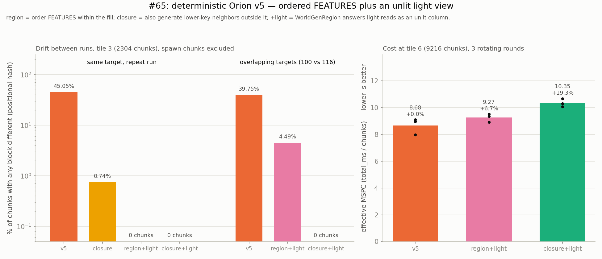
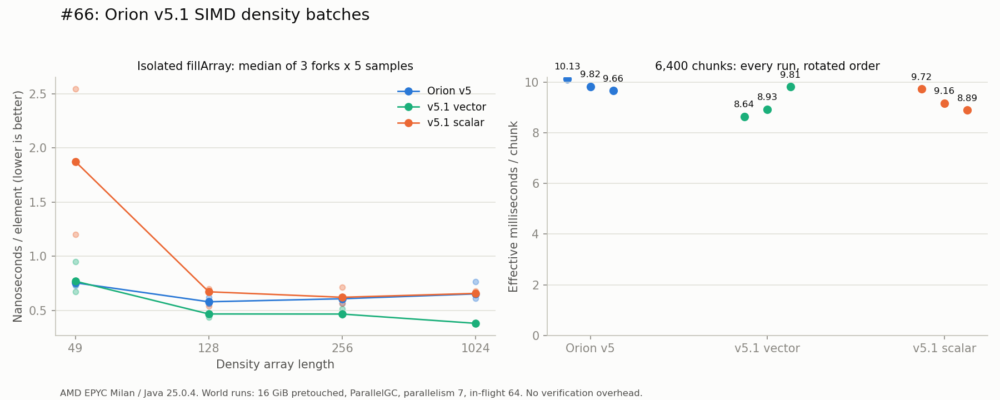

# Cursed Scientific Advancements: How We Accidentally Out-Ran Paper (Allegedly, on paper, at least)

A field guide to the crimes committed in this repository, presented in roughly the order we
committed them. `TUTORIAL.md` has the heist. `scientific-findings-1-40.md` and
`scientific-findings-41-80.md` have the receipts, all 68 of them and counting, in a tone somewhere
between lab notebook and confession. This document is the highlight reel — the parts where a bit,
a busy-spin, and a spreadsheet's worth of stubbornness turned into a headless Java process that
got genuinely competitive with a real, production-grade, professionally-maintained Paper server
running the actual game.

"Allegedly" is doing real work in that title. Keep reading — we get there, then we take some of
it back, then we take some of *that* back too, because that's how this document works. Every
number below has a finding number next to it, and every finding number has `javap` output or a
JFR recording backing it up. Read `scientific-findings-1-40.md` / `scientific-findings-41-80.md`
if you don't believe a word of this.

## Act 1: The Felony (a quick recap for the impatient)

`WorldgenD` is a Java process that never starts a Minecraft server. It reflectively assembles
just enough of `net.minecraft.server.dedicated.DedicatedServer` to call the one protected method
(`loadLevel()`) that builds a real `ServerLevel`, then it stands behind that object going "hey,
make me some chunks" — and the server, having no idea it was never actually turned on, does it.
No tick loop. No network. No RCON. Just `ServerChunkCache.getChunkFuture()`, called directly,
in a loop, against a jar you provide and we never redistribute.

We do this without a single reference to `net.minecraft.*` anywhere in our own compiled
bytecode. Every Mojang class is a string handed to `Class.forName` at runtime. It is, and we
will not stop saying this, deeply funny that it works.

## Act 2: The Mosaic (turning a bottleneck into a proof)

First naive fill: solid block of chunks, one big batch, watch `top`. Eight cores. Two of them
busy. The other six sat there judging us.

Turns out the jar's own bytecode confirms every chunk generation stage only cares about
neighbors within **8 chunks** — not folklore, not a safe guess, a literal `bipush 8` sitting in
`ChunkPyramid.GENERATION_PYRAMID`'s disassembly (finding #7). So: pick a modulus bigger than 8
(we used 16, a comfortable 2x margin), tile chunk-space by `(cx mod 16) + 16*(cz mod 16)`, and
every chunk sharing a "phase" is now **mathematically guaranteed** independent of every other
chunk in that phase. Not probably fine. Guaranteed, by the same number the game itself uses.

Filled a solid map, 256 phases, cold-to-warm speedup of **~136x** — and it never relapsed.

We also invented **MSPC** (milliseconds per chunk) here, because "chunks/sec" as a single
average was lying to us about how lopsided a 256-phase run actually is — one 9-second cold
phase next to a bunch of 60ms warm ones. MSPC reports the whole percentile spread instead.
Smaller is better, everywhere, and now you can actually see whether an "optimization" helped
the typical chunk or just the lucky ones.

## Act 3: Orion v1 — an ambitious swing that mostly just hurt

The mosaic's one flaw: hard barriers between phases. Every phase waits for its own straggler
before the next one starts, so workers sit idle at every single boundary. Orion v1 tried fixing
this properly — a real area-lock (`ReentrantAreaLock`, stolen fair-and-square from Paper's own
`concurrentutil` library, which has zero Mojang code in it) guarding continuous submission
instead of phase barriers.

It ran. It reported success. It was also, when driven multi-threaded, **~24% slower than the
mosaic**, and a fully separate multi-threaded variant produced 14,027 area-lock overlap
violations across 256 chunks that four independent isolated tests could not reproduce (#25).
The bug was never found. It was, instead, architecturally fled from.

## Act 4: Orion v2 — the escape hatch that actually worked

New idea, born from refusing to debug the old one: what if only *one* thread ever touches the
conflict-tracking state, and the actual dispatch happens on dumb worker threads that never see
it? No lock needed if there's no contention to guard against.

Built it. First real, reproducible win in the whole investigation:

**~24-27% faster wall-clock than the mosaic**, and — unlike literally every prior config in this
document — v2 actually got *faster* when given more worker threads (7 vs 4), which nothing
before it had managed. Champion status, officially claimed.

## Act 5: The JFR Reveal — champion has a tapeworm

Naturally, we pointed a profiler at it (`-XX:StartFlightRecording`, same discipline used to
prove reflection was free back in finding #16). The result was not flattering.

**32.4% of all CPU time in a champion-scale run was going to the scheduler itself** — not
generation, bookkeeping. Specifically: a full rescan of the entire remaining chunk backlog, on
every single loop tick, because the loop had almost no reason to ever pause (finding #27). The
scheduler thread was burning more CPU than any one of the four actual chunk-generating worker
threads. The champion was, secretly, mostly just spinning.

Bytecode archaeology on the real Paper jar (`ca/spottedleaf/moonrise/patches/chunk_system/`)
showed exactly what real production Minecraft servers do instead: a lock-free, section-based,
invalidation-driven propagator that only re-checks something when it actually might have
changed — never a full rescan, ever.

Two attempts to fix the *cheaper*-looking half of the problem (a reflective polling call)
changed nothing, twice, for a genuinely interesting reason: **the loop was scan-bound, not
poll-bound.** Free up cycles from the poll and the loop just spends them on more scan
iterations instead. You cannot throttle your way out of an algorithmic problem (findings #28,
#29 — kept in the record as honest null results, not deleted, because the wrong turn taught us
something real).

## Act 6: Orion v2.1 — not a new architecture, just less stupid

So: replace the actual rescan. Bucket every target chunk into a spatial grid once, at startup —
cell size tuned to the same conflict radius already established in finding #7. When a chunk
completes, only check the handful of buckets *near it* for newly-safe candidates, instead of
walking the entire remaining backlog. The old `isSafe()` correctness check stays exactly as it
was, as the final word on every dispatch — the grid only narrows what gets *offered* to it,
never what counts as *safe*. A bug in the new bookkeeping could waste time. It could not
reintroduce v1's ghost.

The scheduler's CPU share collapsed from **32.4% to 1.03%.** Its own candidate-scan code
doesn't show up *at all* in a 23,833-sample profile anymore — as invisible as reflection itself
turned out to be back in #16.

**~10.5% faster wall-clock**, every percentile of latency improved, and it now genuinely idles
when there's nothing to do instead of busy-spinning (it parks 16 times in a run where the old
version parked once or five times, across dozens of attempts). We named it v2.1, not v3,
because renaming your bugfix "the next generation" is how you end up explaining yourself to a
change-review committee. It's the same architecture. It's just not leaving a third of a CPU
core on the table for no reason anymore.

## Act 7: The Reckoning — this is where it gets stupid

Long before any of this, finding #18 put WorldgenD in a real drag race against real, unmodified
Paper and Leaf servers running the Chunky pre-generation plugin. The result was humbling:

**~53% slower than plain, unmodified Paper.** Not close. The working theory at the time:
Paper's fork-level generator patches do less raw work per chunk than vanilla, full stop, and
this project's own founding rule (never touch a line of Mojang's actual generator code) meant
that gap was permanently out of reach. We wrote that conclusion down and moved on to scheduler
archaeology instead, assuming it was someone else's problem.

It was not someone else's problem. It was our scheduler eating a third of a CPU core.

Same session, same box, same 6561-chunk Chunky selection, world wiped and every server
rebooted fresh before every leg — Orion v2.1 standing in WorldgenD's seat this time:

| Engine | ms/chunk | chunks/sec |
|---|---|---|
| **Orion v2.1** | **23.96** | 41.74 |
| Paper | 25.95 | 38.53 |
| Leaf | 22.27 | 44.90 |
| Leaf-crack (tick frozen) | 20.43 | 48.95 |

**Orion v2.1 came in faster than Paper.** A reflection-heist toy that ships zero bytes of
Mojang's compiled game, driving the exact same unmodified vanilla generator code the whole time,
beat a real production server with real, professionally-engineered generator-pipeline patches —
on throughput, in a controlled same-session run. We wrote that sentence and immediately felt
nervous about it. Correctly, as it turns out — keep reading.

## Act 8: The Correction — turns out we'd drawn a good hand, not a winning one

We are, per this document's own stated rules, contractually obligated to check our own homework
before gloating. Finding #31's own open-questions entry said the honest next step was an
*interleaved* rerun (v2.1, Paper, v2.1, Paper, ...) rather than one block-sequential leg each —
block-sequential can't tell a real effect from both engines just having one good or bad run in a
row. So we ran it: three rounds, strictly alternating, one sitting.

| Round | Orion v2.1 | Paper | Diff |
|---|---|---|---|
| 1 | 23.06 | 24.89 | v2.1 +7.9% |
| 2 | 23.59 | 23.51 | tie (0.3%) |
| 3 | 23.69 | 23.65 | tie (0.17%) |
| **mean** | **23.45** | **24.02** | **2.4% apart** |

Only round 1 shows a real margin. Rounds 2 and 3 are statistical ties. Averaged out, v2.1 is
~2.4% faster than Paper — a gap so far inside this box's own established ~9% noise band that
"wins" stopped being a defensible word for it about two sentences ago. Act 7's single Paper leg
(25.95 ms/chunk) turns out to have been sitting on the slow tail of Paper's own natural
variance, which — this round — had more than double v2.1's own spread (σ=0.76 vs σ=0.34, small
sample, don't overread that specific number either).

The honest conclusion is a *better* headline than the one we almost ran with: Orion v2.1 closed
the ~53% gap from Act 7 down to **genuine statistical parity** with a real production Paper
server. Not a win. Not a loss. A tie, inside measurement noise, achieved by fixing our own
scheduler's self-inflicted overhead and touching zero lines of Mojang's actual generator code.
Parity is a claim the data can actually carry. "Beats Paper" wasn't, and we'd rather be the
document that caught its own mistake than the one that didn't.

## Act 9: The Second Wind — our own workers were slacking too

Asked, in general: what's bottlenecking us now that the scheduler is basically free? Went back
to the exact diagnostic that found the *original* wavefront problem all the way back in Act 2 —
live `top -bH` per-thread sampling, not vibes.

Aggregate CPU during a fresh champion run: **77.2% of the whole box idle.** Fine, only 4 workers
configured on an 8-core box — except five snapshots of just those four `Worker-Main` threads
told a sharper story:

| Snapshot | Sum of 4 worker threads' CPU% (max possible 400%) |
|---|---|
| 1-5 | 363.5%, 190.0%, 254.4%, 154.6%, 140.0% |

Averaging ~220 out of 400 — **the workers we did configure were themselves only ~55% busy.**
Same signature Act 2 found for the original naive solid-block fill: the dependency graph's
frontier is only ever so wide at any given instant, and no amount of extra idle silicon fixes a
frontier that's momentarily too thin to feed the workers standing by.

Tested the obvious follow-up anyway — 7 workers instead of 4, this box's real ceiling:

| Config | Total time | ms/chunk |
|---|---|---|
| v2.1, 4 workers | 148775ms | 23.25 |
| **v2.1, 7 workers** | **132949ms** | **20.77** |

**~10.6% faster** — bigger than v2's own 4→7 gain (6.3%), because v2.1 had more idle capacity
sitting around to go capture in the first place. Re-sampled under 7 workers: still bursty
(572.5%, 90.9%, 90.9%, 490.7%, 191.0% out of a possible 700%) — more capacity caught, frontier
thinness not solved, just less costly with more hands ready to catch whatever shows up.

## Act 10: Prying the Jar Open, Again — a filing cabinet made of `ArrayList`

Fair question got asked: is that thin frontier *purely* geometry, the way we assumed, or is
something MC-55596-shaped (finding #22's background-thread-order terrain bug) hiding a level
down? Only one way to find out — went and disassembled classes this project had never looked at
before: `ChunkMap`, `GenerationChunkHolder`, `ServerChunkCache`.

**The structure itself: boringly, reassuringly deterministic.** Every neighbor requirement comes
from the same static, coordinate-derived radius table Act 2 already found. No surprises there.

**But the path from "eligible" to "actually running" goes through a filing cabinet nobody
bolted down.** `ChunkMap.pendingGenerationTasks` disassembles to a **plain, unsynchronized
`java.util.ArrayList`** — `add()` from one method, a `forEach` + `clear()` from another, no lock
anywhere in sight. That should be a hazard. It isn't, because we traced *why*: every
`getChunkFuture()` call from any thread that isn't vanilla's own main thread gets funneled,
via `CompletableFuture.supplyAsync(..., mainThreadProcessor)`, onto one single-threaded
executor before it ever touches that list. Every one of our own eight dispatch threads,
routed through the same one door. Not a bug. Deliberate, and — we checked — it holds.

The consequence: a chunk can be fully, geometrically eligible and still sit in that `ArrayList`
doing nothing until the next time *something* happens to poll that one specific executor. A
real, additional latency source, stacked on top of the geometric thinness Act 9 already found —
different in kind from MC-55596, though: that bug corrupts *what* gets generated. This one only
ever delays *when* it starts. The output stays correct. The clock doesn't care that it's correct.

## Act 11: Orion v2.2 — restoring a lesson we'd already learned once

Somewhere in all this, a sharp observation landed: didn't Orion quietly *undo* one of Act 2's
own insights? The mosaic's modulus math doesn't just prove independence — within any single
phase, the included chunks form an evenly-spaced lattice across the *entire* region,
automatically. That's the same "scatter beats one contiguous blob" fix Act 2 used, just
generalized into gapless full coverage. Orion dropped the mosaic's hard barriers, correctly —
but the actual candidate order it walks is a plain row-major sweep. Early in any run, every
held chunk clusters in one corner. We'd reintroduced the exact clustering problem we'd already
fixed once, just one layer further down.

A space-filling curve (Hilbert, Z-order) was floated and rejected on the spot — those exist
specifically to *preserve* locality, the opposite of what a scatter fix needs. What actually
works: rank every residue by a 2D digit-reversal (bit-reverse the linear step index, de-interleave
into two axes) — the standard 2D generalization of a van der Corput low-discrepancy sequence.
Checked by hand before trusting it: the first four ranks land on `(0,0)`, `(0,8)`, `(8,0)`,
`(8,8)` — the four corners of the tile — and the full 256-entry map is a confirmed bijection.

| Config | Total time | MSPC p50 |
|---|---|---|
| 4w, no scatter | 148775ms | 259.82ms |
| 4w, scatter | 146021ms (-1.9%) | 144.10ms (**-44.5%**) |
| 7w, no scatter | 132949ms | 236.43ms |
| 7w, scatter | 136583ms (+2.7%) | 115.88ms (**-51.0%**) |

Genuinely mixed, reported as such rather than rounded up into another victory lap: median
per-chunk latency roughly *halved*, in both worker configs — a real, large effect. Total
wall-clock time barely moved, and possibly got a hair worse at 7 workers (one run, edge of
noise, not replicated). Scatter-ordering changes *when* any given chunk gets its turn, not the
total amount of work or the aggregate CPU ceiling — latency and throughput, it turns out, are
still two different metrics that don't have to move together, which is a lesson this project
has now been taught twice by two different schedulers. The reigning throughput champion stays
plain 7-worker v2.1, no scatter, 132949ms. v2.2 is real, it's just a tail-latency fix wearing a
version bump, and we're naming it that instead of pretending otherwise.

## Act 12: OrionV3 — a coarse lock, a deadlock, and a rescue mission that made 507 corpses

(`scientific-findings-41-80.md` #44-49) The single-threaded-admission trick that made
v2/v2.1/v2.2 work was never satisfying on its own terms — it was an escape hatch from Orion v1's
unexplained bug (Act 4), not a design anyone actually wanted permanently. OrionV3 was the attempt
to go back and do multi-threaded admission properly this time, guarded by one coarse lock instead
of v1's per-node area lock.

It broke immediately and informatively. First cut: 8 dispatch threads busy-polling a shared lock
every 50 microseconds, diagnosed by live thread dump before the benchmark even finished (#44).
Swapped the busy-loop for a textbook `ReentrantLock`/`Condition` pair (#45): correctness held,
all 7 workers showed up alive at once for the first time in this scheduler's life — and then a
longer run quietly dropped to 1 active worker and never came back. Chased what looked like a
leaked permit. Built a dedicated diagnostic thread to prove it, and the leak theory died on
contact with real numbers: `held` never rose above ~22-25 no matter what the config allowed,
because the one-way admission cursor was racing through the *entire* target list in **38
milliseconds** flat, 8 threads deep — faster than real generation could possibly refill the
reconsideration queue behind it. Not a new bug, just the same one-way cursor Acts 6/11 already
knew about, running at a speed nobody had stress-tested it at.

The actual freeze (#46) was a real, structural deadlock: `orion3-poll` — this project's one and
only thread allowed to drain vanilla's `mainThreadProcessor` queue — got dispatched a task whose
own body needed to recursively call back into that same queue to finish, and the only thread
licensed to make that call was the one now stuck waiting on it. A single thread, deadlocked
against itself, through Mojang's own code. #47 chased the exact queue by hand (`pendingGenerationTasks`
was a red herring; the real site was `BlockableEventLoop.pendingRunnables`) and caught it live:
one task sitting there, forever, un-drained, because the only drainer was mid-drain of an earlier
one.

Then it got worse before it got better. #48's fix attempt built a rescue thread that watched for
a stale heartbeat and drained the stuck queue itself. Version one deadlocked on the identical
failure one level down. Version two, "smarter," handed every drained task to a disposable worker
thread instead of running it inline — and produced **507 permanently blocked threads in 90
seconds, still climbing at roughly 10 a second**, before it got killed for the box's own safety.
That number is the actual finding: a fixed amount of rescue capacity can't out-drain a genuine
cycle, and a steady, unplateauing climb is what circularity looks like on a graph, as opposed to
a merely deep chain that more threads could eventually chew through.

The real fix (#49) stopped working around Mojang's code and went into it: `ServerChunkCache.getChunk()`'s
reentrancy check compares the calling thread against one fixed field, `this.mainThread`, and
`orion3-poll` — never that field's value, even while it's the thread already inside a `pollTask()`
call — always fails that check and takes the blocking, wait-forever branch instead of vanilla's
own, already-correct `managedBlock()` self-pump loop sitting right below it in the same method.
Two `javassist` bytecode edits later (a `ThreadLocal` reentrancy-depth counter, and one field-read
substitution scoped to exactly one method), `OrionV3` ran 9216/9216 chunks clean at champion scale
for the first time in its life, at parity with v2.1/v2.2 (20.87 eMSPC, inside 1%) — a correctness
fix, confirmed, not a scheduling win, exactly as advertised.

Once patched, v3 behaves exactly like its single-threaded siblings on a CPU trace — same idle
headroom, same shape — because multi-threaded admission was never going to be the thing that
fixed that headroom. That answer had to wait for Act 15.

## Act 13: A second "we beat a real server" headline, filed with last time's asterisk already attached

Patched OrionV3 (Act 12) got its own drag race (#52): a single run each, WorldgenD's
v2.1/v2.2/v3 against real Paper, Leaf, and Leaf-on-crack servers running Chunky, normalized as
best Chunky's own off-by-one radius bug (`(2N+1)²` chunks, not `(2N)²`, confirmed and never
explained on Chunky's own end) allows. v3 posted the fastest number of the whole field, 20.23
eMSPC against Leaf's 21.78 ms/chunk — **~7% faster than the fastest real server tested.**

Act 8 already spent a whole section teaching this document not to trust that shape of result off
one block-sequential run each, so this one gets the same asterisk pinned to it here rather than
repeated as a clean win: n=1 per engine, not interleaved, never rerun Act-8-style. File it as
"encouraging, unconfirmed" and move on — the real story from this session isn't the leaderboard
position, it's that v3 no longer needs the word "parked" next to its name.

## Act 14: The Density-Function Compiler — three attempts, two of them worse than doing nothing

If Act 12 was about a bug that took five tries to fix, this one is about an optimization that
took three tries to stop hurting.

The idea (#56-57): C2ME's density-function compiler flattens a `DensityFunction` tree into one
compiled method instead of walking it node-by-node through polymorphic `compute()` calls. A
deliberately narrow port (two node types: `Constant`, `Ap2`'s ADD/MUL) measured 1.13-1.55x faster
on a synthetic tree — modest, and, worryingly, *shrinking* with tree depth, which is backwards
from what "more nodes flattened" should predict. #58 found why: the synthetic leaves were routed
through `java.lang.reflect.Proxy`, taxing both the vanilla and compiled paths equally and diluting
the real effect. Real vanilla leaf classes showed a much better 2.04-3.12x — but only on ~4.6-7.1%
of champion-scale CPU (glue, not the noise math itself), which multiplies out to a **projected
3.5-4.8% wall-clock win — sitting right at the edge of this box's own ~9% noise band before a
single real chunk had been generated with it.** Recommendation at that point: park it.

It got wired in anyway, to get a real number instead of a projection (#59), and the real number
was **a 27.3% regression.** Not noise — nowhere close. The instrumented cache told the actual
story: a 99.95% hit rate ruled out recompilation, but every `compute()` call — hit or miss —
allocated a lookup-key object and did a `ConcurrentHashMap` probe before it could even reach the
fast path it was trying to earn. A hashmap lookup is not competitive with the two field reads and
one arithmetic op it was replacing.

Fix attempt two (#60): move the cache into two real instance fields on `Ap2` instead of a
side-table — no more allocation, no more hashmap. Regression shrank to 16.6%. Still a loss, and
root-caused to something structurally different: 241,971 distinct compiled classes, one per
unique tree shape, all funneling through one shared `eval()` call site — which degrades the JIT's
inline cache from a clean handful of concrete types down to fully **megamorphic**, no inlining,
vtable lookup on every call, for the entire run. The fix that solved attempt one's problem created
attempt two's.

Fix attempt three (#61) is the one that actually worked: instead of one bespoke compiled class
per tree shape, compile every tree down to the *same* interpreter class — flattened post-order
arrays, one small loop, constructor arguments carrying the tree data instead of the class
identity. One class, arbitrarily many instances, back to a call site the JIT can actually
optimize.

+23.2% regression, then +16.6%, then **+2.7% and +5.9% across two replicated runs — both back
inside the noise band the two previous attempts had blown straight through.** Not a demonstrated
win either — the static 3.5-4.8% projection from #58 was always going to be hard to see over this
box's own noise, and it wasn't seen. But going from a confirmed quarter-worse to
statistically-indistinguishable-from-free, twice in a row, entirely by changing *how many classes
the compiler emits* rather than anything about what it computes, is the kind of lesson worth an
Act even when the scoreboard says "tie."

## Act 15: Orion v5 — the "structural" ceiling turns out to be a filing-cabinet problem, one lane wide

Act 10 already found one filing cabinet nobody bolted down (`ChunkMap.pendingGenerationTasks`,
safe only because everything funneled through one executor). #55 spent five separate experiments
— SIMD, FFM, an AOT cache, disabling structure generation outright — trying to relieve what four
separate findings agreed was a hard, radius-8-shaped dependency scarcity, and came back with five
straight misses, closing the book with "structurally load-bearing, not fixable from this side."

The book reopened for one reason: rereading `ChunkMap`'s own bytecode, not the assumption
everyone had been building on top of (#62). `NoiseBasedChunkGenerator.fillFromNoise`/`createBiomes`
are the *only* generation steps that ever leave the main thread. Surface, carvers, features,
structures, and spawn — everything else in the whole pipeline — runs through one
`ConsecutiveExecutor("worldgen")`, a single lane, for the entire level, on every scheduler this
project had ever built, going all the way back to the mosaic. Every one of #50/#51/#54/#55's
"radius-8 scarcity" readings was the same lane, seen from five different diagnostic angles.
Paper's own Moonrise patches (checked locally, not assumed) mark every one of those same steps
parallel-capable with an explicit write-radius table — the exact numbers vanilla's own
`ChunkPyramid` already carries as constants. Nobody here needed to invent anything; they needed to
read one more class file.

The patch is one `javassist` swap inside `ChunkMap.applyStep`, routing each step through an
area-locked background-pool dispatch instead of the synchronous in-lane call — structures get one
global lock (C2ME's own 30-mixin fix, condensed into one), everything else gets a write-radius
area lock matching Moonrise's numbers exactly. Two real bugs got caught before any number was
trusted: a vanishing exception from an already-known stderr issue, and a lane-matching `when`
that silently ran structure steps unserialized because `ChunkStatus.getName()` returns a
namespaced registry key, not the bare name anyone would guess.

Correctness got checked at the block level, not just `failed=0` — full block-state histograms,
hashed, diffed against a same-run MC-55596 noise floor established in Act 9's own vocabulary.
Cross-engine diffs land at ~1.4x the same-engine floor, entirely vegetation and feature placement,
the exact signature order-dependent placement already has a name for. No terrain corruption, no
bulk stone/air shift.

**-59.5% total time. A 2.47x speedup, replicated twice, both pairs nowhere near the noise band.**
CPU climbs from ~313% to ~709% of a possible 800% — the idle headroom this whole document has been
photographing since Act 9 was the serial lane, the entire time. Generator math is, for the first
time since the mosaic itself, the actual bottleneck — which retroactively makes Act 14's DFC saga
and #55's SIMD/FFM swings worth another look, now that there's finally a CPU ceiling for them to
matter against.

## Act 16: The rematch nobody had actually run — Moonrise given the same thread count it beat everyone at

Act 8 taught this document to distrust an uninterleaved single-run "beats Paper" headline. Act
15's own closing line asked for the obvious follow-up: rerun the drag race with v5 in the seat,
this time controlling for the one variable every prior drag race had quietly left mismatched.
Every Paper log this project had ever generated said the same thing: `Paper is using 2 worker
threads` against WorldgenD's 7. Nobody had ever given Paper the same worker count and asked
again.

Three rotated rounds, six legs including a new one — Paper explicitly configured to 7 workers
(#63):

Orion v5 posted the lowest mean (8.61 vs Paper-7w's 9.13), but the margin (5.7%) sits inside the
noise band, and Paper-7w's own round-to-round spread (11.7%) is wider than the gap it lost by —
it even won round 1 outright. **Two structurally unrelated engines — one a bytecode patch on
unmodified vanilla, the other a full chunk-system rewrite — converge on the same ~8.5-9ms/chunk
the moment both get to run their steps in parallel over the same 7 cores.** That's not a win. It's
the strongest confirmation Act 15's diagnosis could ask for. And it fully explains the number this
document has been quietly sitting on since Act 7: stock Paper's old ~53%-faster-than-everyone edge
was never generator-patch cleverness — it was 2 Moonrise workers against WorldgenD's 4-7, a
thread-count setting the whole time.

A follow-up (#64) closed the last two untested legs — Leaf and Leaf-on-crack, also given 7
workers:

All four — a reflection heist that ships zero bytes of Mojang code, and three flavors of real,
professionally maintained, production Minecraft server — land inside one 8% band. Leaf's own fork
patches, which #52 once credited with a real edge over Paper, buy nothing measurable at matched
thread count; the entire spread this project spent 60-odd findings chasing was one YAML line the
whole time.

## Act 17: Making Orion lie about the time of day so mushrooms grow in the right place

Determinism was never free in this project — Act 9's own vocabulary (MC-55596, order-dependent
feature placement) is the reason every "identical-seed" comparison since Act 6 has carried an
asterisk. v5 owns its own step scheduler now (Act 15), which means, for the first time, this
project could actually try to schedule the nondeterminism away instead of just measuring around
it (#65).

Two separate races turned out to be hiding under one symptom. The first: overlapping FEATURES
steps (the only step with a write-radius wider than its own chunk) racing on their relative order
— fixed with a deterministic priority key (`3*floorMod(x,3)+floorMod(z,3)`) that guarantees any
two conflicting chunks always disagree on priority, so "lower key goes first" is a total,
scheduler-independent order. That alone cut same-seed drift from ~45% of chunks down to single
digits. The second, smaller race was hiding underneath the first: a mushroom's placement check
reads live light data, and whether that light has propagated yet from a neighbor is itself a
timing accident. The fix, in its full absurdity: make every generating chunk answer light queries
as if it were still an uninitialized column — sky 15, block 0 — a lighting state vanilla's own
code already produces for plenty of real, unmodified chunks, just applied on purpose instead of
by accident.

Both together: **0 out of 2304 chunks differ, across repeat runs of the same target, and across
two overlapping targets compared against each other.** Bit-identical worlds, out of a scheduler
whose entire founding premise was running things out of order.

Sit with that for a second: real, unmodified, official-jar vanilla Minecraft, running its own
unmodified multi-threaded worldgen, cannot reproduce its own output for the same seed (MC-55596,
Act 9, never patched, presumably never will be). This project's own reflection-heist toy, held
together by javassist and spite, now can. We are, as of this finding, more deterministic at
Minecraft than Minecraft is.

Nothing here is free. The `region` mode (order only the chunks the run actually needs) costs
+6.7%, comfortably noise; the stricter `closure` mode (order every lower-key neighbor
transitively, generating extra ones if needed) costs a real +19.3%, mostly honest extra terrain
rather than scheduling overhead. And the unlit-light trick has a body count: brown mushrooms in
the test region dropped from 348 under plain v5 to 78 once both fixes were active — a determinism
flag that visibly thins the mushroom population has to say so out loud, and this document is
saying so. Vanilla's own mushroom count was never fixed to begin with (it's scheduling-dependent
there too); "fewer mushrooms, deterministically" is still an honest trade, just not a free one.

## Act 18: The diminishing-returns tour — SIMD, an optimized Perlin port, and four allocation fixes, none of which moved the needle

With v5 finally CPU-bound (Act 15), every compute-side idea #55 had already tried and failed to
matter against a scarcity-bound scheduler got a second chance to matter against a busy one. Three
separate attempts (#66-68), three real, verified, bit-exact-correctness local wins, and three
champion-scale ties.

**v5.1 (SIMD density batches, #66):** genuinely vectorized — decoded C2-compiled assembly confirms
real 256-bit AVX2 `ymm` instructions, not autovectorized scalar code wearing a costume — and a
real 1.4-1.7x win in isolation, past a ~48-element length threshold below which lane setup costs
more than it saves.

Weighted by real generation's own call-length mix (99.4% of all elements at length 128, never the
longer lengths the microbenchmark also swept), the real saving projects to ~20-55 microseconds
per chunk — against chunks that each take tens to hundreds of *milliseconds* end to end.
Champion-scale numbers moved in the expected direction, but a scalar control path with zero
vectorization at all moved by the same amount in the same direction, which is the textbook tell
for "this is noise, not the effect."

**v5.2 (optimized Perlin port, #67):** ported the useful shape of C2ME's flattened-permutation-table
Perlin sampler, bit-exact across 65,536 randomized samples and a full block-position hash of a
real generated region. It earns its keep on a profiler — `ImprovedNoise.p()`, the single hottest
lookup method in the whole engine at 11.08% of a v5.1 profile, drops to a flat 0% once the
permutation walk moves inline:

The work didn't vanish, it just got attributed to a cheaper-looking method name; three rotated
whole-generation rounds crossed each other and landed at a -0.4% median / +1.6% mean — a tie,
reported as one.

**v5.3 (four allocation-pressure fixes, #68):** a standalone JFR allocation profile found
~1.66GB/s allocated, with five call sites responsible for ~43GB of a 70.5-second run — mostly
scratch buffers and a memoizing lambda that had no business being reallocated on every call. All
four got the obvious fix (a per-thread reusable buffer, a resettable supplier, a cached array, a
reusable output box) and the correctness check came back bit-exact. A GC log confirmed the
mechanism actually worked — 28% fewer young collections, real allocation genuinely removed — and
then ParallelGC's own adaptive Eden growth ate the saving by letting more live data pile up
between the now-rarer collections, leaving total pause time a wash to slightly worse.

Three real, local, independently-verified engineering wins in a row (SIMD, Perlin, allocations),
three times the JVM or the noise floor ate the difference before it reached the stopwatch. If
there's a moral here, it's the one this project keeps rediscovering under a new coat of paint each
time: a profiler telling you where the CPU goes is not the same claim as a stopwatch telling you
the total got smaller, and this document has now learned that lesson from a scheduler, a compiler,
and a memory allocator.

## The Whole Arc, In One Table

| Stage | Effective ms/chunk (this box) | vs. where we started |
|---|---|---|
| Solid-block naive fill | ~1000+ (cold, unmeasured precisely) | — |
| Mosaic (256 independent phases) | 36.28 | baseline established |
| Orion v1 (single-threaded, area lock) | 45.04 | worse, abandoned |
| Orion v2 (single scheduler, dumb workers) | 26.80-27.52 | ~24-27% faster than mosaic |
| Orion v2.1 (+ spatial index, 4 workers) | 23.25-23.98 | ~34% faster than mosaic |
| Orion v2.1 (+ 7 workers) | 20.77 | ~43% faster than mosaic |
| Orion v2.2 (v2.1 + scatter order) | 20.77-22.81 | same throughput, ~half the median latency |
| Orion v3 (multi-threaded admission, reentrancy-patched; #44-49) | 19.71-20.87 | parity with v2.1: a correctness fix, not a speedup |
| Orion v4 (+ C2ME structure-thread-safety port; #56) | 20.36-20.97 | parity: the fix costs nothing measurable, exercised or not |
| **Orion v5 (parallel chunk steps, #62)** | **8.16-8.65** | **~2.5x v4, ~77% faster than mosaic: vanilla's serial worldgen lane was the ceiling all along** |
| Orion v5.1 / v5.2 / v5.3 (SIMD, Perlin port, allocation fixes; #66-68) | 8.05-9.34 | each a real, bit-exact local win; all three a champion-scale tie with v5 |
| Orion v5 deterministic (region / closure + unlit light; #65) | +6.7% / +19.3% vs plain v5 | bit-identical worlds, at a real and measured cost |
| *(for reference) Paper, interleaved same-session mean, 4 workers* | 24.02 | *genuine parity with v2.1 @ 4 workers, per Act 8* |
| *(for reference) Paper, matched 7 workers, interleaved twice; #63/#64* | 9.07-9.13 | *genuine parity with v5, pooled n=6: -4.2%, inside noise* |

The Act 8 discipline that once kept the champion row from being compared against Paper has since
been paid off in full: the 7-worker matchup got run interleaved, twice, in two separate sessions
(#63, #64), and it came back a tie both times — the honest headline this whole document was
always working toward, not the one it almost ran with back in Act 7.

Every single number in that table is backed by a JFR recording, a `top -bH` snapshot, a CSV in
`findings/`, or a `javap` disassembly — nothing here is vibes. `scientific-findings-1-40.md` and
`scientific-findings-41-80.md` have the full, unabridged, occasionally-wrong-and-corrected version
of this story, findings #1 through #68 and counting, wrong turns and all, because a lab notebook
that only records the wins isn't a lab notebook, it's marketing.

Go make some land. The Paper number got run interleaved, at matched thread count, twice — and it
came back a tie both times. That's still the best headline this document has earned.
