# WorldgenD: Findings #1-40 — Foundation & Orion Discovery

**Archive: Findings 1-40.** Continue reading in [`scientific-findings-41-80.md`](scientific-findings-41-80.md) for Orion deep dives and further investigation.

---

Here's what happened when we pointed a `URLClassLoader` at Mojang's own jar, skipped past `initServer()` like a bouncer who owes us a favor, and started asking a `DedicatedServer` object that has never once been "started" to please make some chunks. It worked. It kept working. Then we got curious and started interrogating *why* it worked, with `jcmd` and bytecode disassembly instead of vibes, because "trust me bro" is not a methodology.

This is the science version. `TUTORIAL.md` has the narrative. Read both, believe neither, verify everything against `HeadlessWorldgen.kt` yourself like a functioning adult.

Environment: 8-core EPYC, OpenJDK 25, seed nailed to the number `69` because we are professionals with a sense of humor and nothing else.

## 1. The jar is naked and doesn't know it

`mojang-26-1-1-server.jar` is a bundler jar, and its payload — every `net/minecraft/**`, every `com/mojang/**` class — ships with **real, human-authored names**. Not proguard soup. Not `a.b.c.class`. `ChunkGenerator.class`, right there, spelled correctly, judging you. Confirmed with `jar tf` and `javap -p`, not assumed, not downloaded from a mappings repo somewhere. Mojang apparently decided obfuscation was more trouble than it was worth, which — fair, deobfuscating your own game to debug it does sound exhausting.

Net effect: zero deobfuscation tax. We reflect on the names Mojang's own engineers typed.

## 2. We wrote a program that contains none of their program

`WorldgenD` compiles to bytecode with **zero references** to any `net.minecraft.*` or `com.mojang.*` symbol — check `build.gradle.kts`, there's no dependency, static or otherwise. Every Mojang class we touch shows up in our source as a string literal handed to `Class.forName`, at runtime, against a jar YOU dropped in a folder, not one we shipped. Delete the jar and `WorldgenD` becomes a very ornate, very useless pile of reflection glue. We are not distributing Mojang's game. We are distributing a universal remote and hoping you already own the TV.

The whole discovery dance (`ServerRuntime.kt`):
1. Stare at `<cwd>/servers/` until a `.jar` shows up.
2. If it's a bundler jar, crack it open, extract the real inner server jar plus every bundled library into `servers/.cache/`, and keep the cache around so we don't do this twice.
3. `URLClassLoader` over the lot, parented to the system loader.

Bonus cheat code: `CompletableFuture`, `Optional`, `Executor`, `BooleanSupplier`, `Thread`, `File`, `Path` are JDK types, so they cross the classloader boundary for free via normal parent delegation — no reflection tax on those. Only the Mojang stuff needs the `Mc` helper (`Reflect.kt`) to babysit it.

## 3. The actual heist, step by step

How to get a fully real, generation-capable `ServerLevel` sitting in memory while **network, RCON, console thread, autosave, watchdog, and the entire tick loop stay stone dead**:

1. `SharedConstants.tryDetectVersion()`, `Bootstrap.bootStrap()` — normal so far, boring even.
2. Replay `net.minecraft.server.Main.main()`'s registry/datapack bootstrap via `WorldLoader.load(...)`, faking out its two functional-interface hooks (`WorldDataSupplier`, `ResultFactory`) with `java.lang.reflect.Proxy` since they're Mojang-defined interfaces, and handing it a dead-simple `Executor { it.run() }` instead of real background/game executors — so the entire bootstrap happens synchronously, on our thread, on our terms.
3. Don't reimplement "how do you make a new world" — steal it. Call Mojang's own private `Main.createNewWorldData(...)` via `setAccessible`. Their logic, our button press.
4. Construct a real `net.minecraft.server.dedicated.DedicatedServer` directly off its public constructor. **Never** `MinecraftServer.spin()` — that hands the object a fresh thread and immediately calls `run()`, which is precisely the "starting the server" part we are here to skip.
5. **The one crime scene we had to clean up ourselves**: `ServerLevel`'s constructor reaches into `getPlayerList().getViewDistance()`. Normally `initServer()` builds that list before anyone gets this far. Since we're never calling `initServer()`, we build a `DedicatedPlayerList` by hand and `setPlayerList()` it in ourselves. This is the single spot where "just start the server properly" would've quietly fixed something for us and we had to fix it manually instead. Everywhere else, Mojang's own machinery just works, blissfully unaware it's being used.
6. Call the protected `MinecraftServer.loadLevel()` directly. This is the whole trick, condensed into one method call: it builds a completely real `ServerLevel` + `ServerChunkCache`, generates real spawn chunks as a totally unbothered side effect, and at no point does `initServer()`, `run()`, or `tickServer()` so much as flinch.
7. Point a loaded gun at it: `ServerChunkCache.getChunkFuture(x, z, ChunkStatus.FULL, true)`.

**The one rule that will bite you if you ignore it**: step 7's futures get awaited via `MinecraftServer.managedBlock(BooleanSupplier)`, never a plain `.join()`. Some generation stages schedule their continuation back onto `MinecraftServer`'s own task queue — it's a `BlockableEventLoop` under the hood — and the only thing that ever pumps that queue is `managedBlock()`, because we murdered the tick loop that would normally do it. Swap it for `.join()` and you get a very quiet, very permanent deadlock, and you will deserve it.

## 4. The legal disclaimer that's actually load-bearing

Not one byte of Mojang's compiled game ends up inside `WorldgenD`'s repo or its own build output. The jar lives in a directory you control, gets read at runtime, gets thrown away conceptually the moment the process exits. `.gitignore` blacklists `/servers/*.jar` and `/servers/.cache/` on principle, not because anyone's watching — because it's the correct thing to do and also because 65MB of someone else's binary has no business in our git history.

## 5. Making the chaos reproducible (a seed, for once)

`level-seed=69` gets written into `servers/.run/server.properties` on every single launch, and `servers/.run/` gets nuked (`deleteRecursively()`) before that write happens. Why nuke it first: `createNewWorldData()` always builds fresh world *data* no matter what's on disk, but a stray region file left over from a previous, differently-seeded run would still get silently reloaded off disk instead of regenerated — meaning you'd think you pinned the seed and actually be looking at yesterday's leftovers wearing today's name tag.

**Verified**, not vibes: ran it twice, diffed the height/biome output. Identical down to the byte. Only the timestamps disagreed.

## 6. The Great 200% CPU Interrogation

**The crime**: hand the pool a solid contiguous block of chunks, one `managedBlock` gate, watch `top`. Eight cores standing by. The thing uses about two of them and looks pleased with itself.

Five suspects, questioned separately, alibis checked against live thread dumps instead of taken at their word:

| # | Suspect | Verdict | How we know |
|---|---|---|---|
| A | The executor pool is just too small | **Not guilty.** | `Util.getMaxThreads()`, read straight out of the disassembled bytecode (`javap -c -p`), computes `Mth.clamp(availableProcessors() - 1, 1, propertyOrDefault255)`. Eight cores, seven workers, exactly as advertised — confirmed by literally counting `Worker-Main-1` through `Worker-Main-7` in a live `jcmd <pid> Thread.print`. Tunable, if you must, via `-Dmax.bg.threads=N`. |
| C | Threads are fighting over a lock | **Not guilty.** | Every idle worker's live stack said `WAITING (parking)` inside `ForkJoinPool.awaitWork()` — genuinely nothing queued, not one single thread caught `BLOCKED` on a monitor, across multiple snapshots. Nothing was locked because there was nothing to fight over. |
| D | The heavy lifting is secretly pinned to our one calling thread | **Not guilty.** | Caught `Beardifier.getBuryContribution`, `SurfaceRules$TestRule.tryApply`, and `DensityFunctions$PureTransformer.compute` all `RUNNABLE` — on the worker pool, where they belong, never on the thread babysitting `managedBlock()`. |
| B/E | The dependency graph itself is the bottleneck | **Guilty as charged.** | Three `top -H` snapshots of the exact same run: 5/7 busy, then 1/7, then 1/7 again. A solid block only ever exposes a thin *ring* of chunks that are simultaneously eligible for whatever `ChunkStatus` is currently being chased. Everyone else just... waits. |

**The fix we tried**: stop handing it one blob. Nine islands (`CLUSTER_RADIUS = 4`, spaced 69 chunks apart — had to pick a number, it may as well be a good one) instead of one contiguous slab. Resampled: 5/7, 6/7, 7/7, 5/7 busy. Troughs, gone.

## 7. We asked the jar how far "far enough" actually is, and it told us: 8

`ChunkPyramid.GENERATION_PYRAMID`'s static initializer is a chain of `Builder.step(STATUS, b -> b.addRequirement(OTHER_STATUS, radius))` calls. Disassemble it (`javap -c -p`, no decompiler needed, no decompiler *available*, we checked) and every single `addRequirement` pushes `iconst_1` — except exactly one. `STRUCTURE_STARTS` pushes `bipush 8`.

That's it. That's the entire dependency graph's absolute ceiling, straight out of the constant pool, not guessed, not padded defensively because "safer number, whatever": **8 chunks.** We had previously been using `69` as a spacing constant purely for comedic value and it turns out we were over-provisioned by a factor of 8.6x. The bit was funnier than we deserved.

## 8. The mosaic: turning "guaranteed independence" into an actual algorithm

Since #7 gives us a hard number, any modulus `N > 8` makes this provably safe:

```
phase(cx, cz) = (cx mod N) + N * (cz mod N)
```

Two chunks sharing a phase differ by a multiple of `N` on *both* axes — meaning the absolute closest they can ever be is exactly `N` apart on one axis, zero on the other. Pick `N = 16` (a comfortable, paranoid 2x over the confirmed 8) and every chunk that shares a phase is mathematically, provably, bytecode-backed independent of every other chunk in that phase. Not "should be fine." Guaranteed. Fill a solid area phase-by-phase, real `managedBlock` barrier between each wave, and you've converted "pray the scheduler finds parallel work" into "there is categorically no dependent work left to stall on."

**Ran it.** `MOSAIC_TILE = 3` → a solid, gapless 48x48 block, 2304 chunks, 256 phases. **2304/2304. Zero failures.**

Phase timing (9 chunks per phase, because that's the shape the geometry gives you):

| Phase | ms | chunks/sec |
|---|---|---|
| 0 (cold) | 9411 | 0.96 |
| 32 | 968 | 9.30 |
| 64 | 966 | 9.32 |
| 96 | 997 | 9.03 |
| 128 | 1043 | 8.63 |
| 160 | 893 | 10.08 |
| 192 | 425 | 21.18 |
| 224 | 352 | 25.57 |
| 255 | 99 | 90.91 |
| fastest single phase | 69 | 130.43 |

~136x, cold to warm, and it **never relapses** — no mid-run spike back to seconds-per-phase the way the solid block had troughs. That flat, monotone drop is the actual fingerprint of "no scheduling stalls left, only JIT catching up." The whole-run average — 2304 / 103.4s ≈ 22.3 cps — is technically true and also a lie by omission, since it's dragged down hard by one 9.4-second cold phase and undersells steady-state throughput by 4-6x.

## 9. Is it HotSpot turning Mojang into an ICBM, or is the world just getting cheaper to make?

**The question**: that 90-130 cps warm tail in #8 — is that pure global JIT compilation (location shouldn't matter once it's hot), or is some part of it secretly a per-region cache making *previously-visited* ground cheaper than virgin territory?

**The experiment**:
1. Warm the JVM on 1681 disposable chunks near `(300,300)` — nowhere else in this experiment goes anywhere near it. Its own timing is thrown in the bin, we only need the JIT compiler to wake up.
2. Time four separate 729-chunk batches (9 islands, `CLUSTER_RADIUS = 4`, 20 chunks apart internally — deliberately tighter than the gap *between* anchors so no batch could accidentally reuse another's homework) at four anchors chosen to split near from far, and to never overlap the warmup zone or each other: `(69,69)`, `(-69,69)`, `(6969,6969)`, `(-6969,-6969)`.

**The verdict, in numbers:**

| Anchor | Chunks | Time | chunks/sec |
|---|---|---|---|
| near NE (69,69) | 729 | 43612ms | 16.7 |
| near NW (-69,69) | 729 | 50497ms | 14.4 |
| far NE (6969,6969) | 729 | 46905ms | 15.5 |
| far SW (-6969,-6969) | 729 | 44945ms | 16.2 |

**It's the ICBM.** All four numbers huddle together in a tight 14.4-16.7 band with zero relationship to distance whatsoever — the slowest run of the whole experiment is a *near* anchor, and both 6969-chunks-into-the-void anchors, territory the process had never so much as glanced at, land smack in the middle of the pack, not trailing behind. If per-region caching were pulling any real weight, "far" should lose to "near" every single time. It doesn't lose once. Once the JIT is hot, walking 6969 chunks into unknown territory costs exactly nothing extra — the entire #8 speedup was HotSpot compiling code, 0% about *where* that code happened to run.

**Plot twist buried in the same data**: 14-17 cps is 5-8x *slower* than the mosaic's warm tail, despite an equally hot JIT in both cases. Not a contradiction — a shape problem. `CLUSTER_RADIUS = 4` makes each island a solid 9x9 block, and 9 chunks wide is barely bigger than the radius-8 dependency we confirmed in #7 — so even though the 9 islands genuinely don't depend on each other, each individual island still can't expose more than a sliver of its own 81 chunks as simultaneously eligible. Mosaic phases hit triple digits because *every single chunk in a phase* is guaranteed eligible by construction. Islands only guarantee that property *between* islands, never within one. Shape matters more than heat, past a certain point.

## 10. Things that lied to us with a straight face

- **`System.out` goes fully buffered, not line-buffered, the second you redirect it to a file.** A long run's later `println`s can sit in a JVM-internal buffer touching nothing on disk until the process actually dies. A log that looks frozen for four minutes might already be finished — before you panic, diff two `jcmd <pid> Thread.print` snapshots a few seconds apart and see if worker CPU time is still climbing. If it's flat, the work is done; your patience is just outrunning `PrintStream`'s flush policy.
- **The process itself hangs around suspiciously long after the last chunk is done.** In the #9 experiment, worker-thread CPU had visibly stopped climbing well before the JVM actually exited. Leading theory (not yet nailed down): `Util.ioPool()` and friends may include non-daemon threads — Mojang's own `makeIoExecutor(String, boolean)` literally takes a daemon-or-not flag as an argument — and we never call `Util.shutdownExecutors()` or touch any part of the real shutdown path, because touching the real shutdown path was never the point. See Open Questions; someone should go actually confirm this instead of just being smug about it in a markdown file.

## 11. MSPC: formalizing "milliseconds per chunk"

**In plain terms, before the formal version**: imagine ordering 6,400 coffees, one at a time, from a shop with a handful of baristas, and writing down — for *every single coffee* — exactly how long it took from "I'll have a latte" to the cup hitting the counter. Most cups come out fast. A few get unlucky and land behind a rush, and take way longer. MSPC is that stopwatch, run once per chunk of land instead of per coffee. We don't just report one "average" time, because an average is one number trying to speak for both the good cups and the one bad cup at once — it always blurs the two together. So instead we report: how fast was the fastest cup, how fast was a typical cup, and how bad did the unluckiest 1-in-100 cup get. Smaller numbers are better, everywhere. A big gap between "typical" and "worst" just means some chunks got stuck waiting their turn — nothing here requires knowing what a thread or a CPU core is.

Now the formal version. "chunks/sec" was always the wrong shape of number for a run built out of 256 barriers with wildly different queue depths — an average over the whole run drowns the one cold phase exactly the way #8 already complained about (`22.3 cps` average vs `90-130 cps` warm tail, same run). MSPC (**m**illi**s**econds **p**er **c**hunk) replaces it with a per-*chunk* latency sample instead of a per-*phase* rate.

**Definition**: for every chunk, stamp `System.nanoTime()` the instant `getChunkFuture(x, z, FULL, true)` is called, and again the instant that specific future completes — via `.whenComplete {}`, which fires on whichever worker thread actually finishes it, not when the phase barrier releases the calling thread. `mspc = (completionNanos - submitNanos) / 1_000_000.0`. One sample per chunk: 2304 of them for the standard `MOSAIC_TILE = 3` run, not 256 phase averages.

**Reported as a distribution, not a mean**, because the mean is exactly the lie-by-omission #8 already flagged for whole-run cps:

| Stat | What it is |
|---|---|
| min | fastest single chunk in the run |
| p1 | fastest 1% |
| p25 | |
| p50 | median |
| p75 | |
| p99 | slowest 1% — cold-JIT and pool-saturation stragglers live here |
| max | single worst chunk (almost always phase 0, before anything's compiled) |

Percentiles use linear interpolation, `rank = p/100 * (n-1)` interpolated between the two bracketing samples — the same convention most stats tooling (numpy's default, `PERCENTILE.INC`) uses, so these numbers compare directly elsewhere without translation.

Lives in `HeadlessWorldgen.kt` as `chunkMspc` (a `Collections.synchronizedList`, since worker threads append to it concurrently), `percentile()`, and `mspcSummary()`. Printed automatically at the end of every run, right after the `Done:` line.

## 12. Reopening #131: does `-Dmax.bg.threads=16` actually do anything at `MOSAIC_TILE = 3`? (superseded, see #13)

Ran the standard 48x48/2304-chunk mosaic twice, everything identical except the JVM flag, both instrumented with MSPC:

| Config | Total | MSPC min | p1 | p25 | p50 | p75 | p99 | max |
|---|---|---|---|---|---|---|---|---|
| default (7 workers) | 97718ms | 0.07 | 1.51 | 8.67 | 41.82 | 49.40 | 141.90 | 2230.50 |
| `-Dmax.bg.threads=16` | 111224ms | 0.03 | 1.56 | 8.65 | 48.25 | 57.13 | 171.08 | 2191.96 |

Not a win — slightly worse across the board (p50 +15%, p99 +21%, total +14%), one trial each, no replication.

At the time this was written down as "the tile is too small to expose a difference." **That diagnosis was wrong**, corrected in #13: the real reason both rows are identical-ish is that `-Dmax.bg.threads=16` never changed the worker count at all. Left here for the record instead of rewritten, because the wrong turn is itself worth keeping — see #13 for why, and for the actual proof.

## 13. `-Dmax.bg.threads` is a ceiling, not a target — proven both directions with `jcmd`, at `MOSAIC_TILE = 5`

The formula was in this document since #6 and got misread anyway: `Util.getMaxThreads()` computes

```
threads = clamp(availableProcessors() - 1, 1, max.bg.threads)
        = max(1, min(availableProcessors() - 1, max.bg.threads))
```

`max.bg.threads` is the **upper bound** of the clamp, not the value it produces. On this 8-core box, `availableProcessors() - 1 = 7` sits below any `max.bg.threads ≥ 7` — so `-Dmax.bg.threads=16`, `=255` (the default), or omitting the flag entirely all clamp to the identical `min(7, N) = 7`. #12's two rows were never two configurations; they were the same 7-worker pool measured twice. That's *why* they looked the same — not because the tile was too small.

Bumped `MOSAIC_TILE` from 3 to 5 (25 chunks/phase, 6400-chunk mosaic, 80x80 block) and ran three configs, catching a live `jcmd <pid> Thread.print` mid-run for the two flagged ones to check the actual worker count instead of trusting the arithmetic:

| Config | Workers, `jcmd`-confirmed | Total | MSPC min | p1 | p25 | p50 | p75 | p99 | max |
|---|---|---|---|---|---|---|---|---|---|
| default | 7 (formula; not re-dumped this run, already confirmed in #6/#12) | 235167ms | 0.04 | 1.57 | 8.20 | 35.80 | 44.05 | 137.03 | 1492.91 |
| `-Dmax.bg.threads=16` | **7** — live dump showed exactly `Worker-Main-1` through `Worker-Main-7`, nothing higher | 256587ms | 0.04 | 1.53 | 8.49 | 40.45 | 48.95 | 149.94 | 1571.50 |
| `-Dmax.bg.threads=4` | **4** — live dump showed exactly `Worker-Main-1` through `Worker-Main-4`, nothing higher | 233174ms | 0.06 | 1.48 | 7.77 | 35.24 | 43.18 | 138.77 | 1496.63 |

**First result, now airtight**: the flag genuinely only ever lowers the pool below `cores - 1`. Setting it above does nothing — verified live, not inferred from timing — because the clamp's own ceiling was already the smaller number.

**Second result, unexpected and still unexplained**: 4 workers finished in 233174ms — statistically identical to 7 workers' 235167ms, MSPC medians 35.24 vs 35.80. A 43% cut in worker count against a phase with 25 chunks in flight (comfortably more than either thread count) produced no measurable slowdown. If worker count between 4 and 7 doesn't move throughput at all here, something else is the active ceiling in that range — not scheduling, not the radius-8 dependency graph (25 chunks/phase already clears that), something else. Two live candidates, neither checked yet: (a) genuinely compute-bound — each chunk's noise/surface/feature math costs enough raw CPU time that 4 saturated cores already match 7, with the other cores going to JIT (C1/C2) and GC threads that compete for the same 8 physical cores regardless of worker-pool size; (b) the explicit "25 chunks requested per phase" undercounts the real task graph — `getChunkFuture` recursively pulls in neighbor chunks at lower statuses as prerequisites, and those recursive sub-tasks may not decompose into as many truly-parallel units as the requested-chunk count suggests. Neither is confirmed. The next diagnostic is the same one #6 already used and it wasn't rerun here: sample thread *states* (`RUNNABLE` vs `WAITING`) live during a 4-worker run — if all 4 are pegged `RUNNABLE` the whole time, it's (a); if there's real idle time even at 4 workers, it's something closer to (b) or a third thing nobody's looked for yet.

## 14. Is G1 the reason 4 workers keeps up with 7? Tried three collectors to find out

#13 left one real open question: cutting the worker pool 7→4 at `MOSAIC_TILE = 5` cost nothing measurable, and nothing in this document explained why. One live candidate: G1's own background threads (concurrent marking, refinement, remembered-set scanning) compete for the same 8 physical cores as the generation workers, so maybe the *collector* — not the dependency graph, not the pool size — is the thing quietly capping throughput regardless of worker count.

Controlled for a variable that had been silently uncontrolled up to now, too: every prior run let the JVM pick its own heap size and grow it on demand. That's its own confound — heap-resize pauses and lazy page commits cost real time and have nothing to do with GC algorithm choice. So every run below fixes `-Xms16g -Xmx16g` (half this box's 32GB) plus `-XX:+AlwaysPreTouch` (commit and zero every page up front, so no first-touch page faults happen mid-run) — same heap footprint across all three, only the collector changes. Confirmed per-run via `ManagementFactory.getGarbageCollectorMXBeans()`, logged as `Active GC(s):` at the top of every run now (`HeadlessWorldgen.kt`), the same "ask the JVM, don't trust the flag" discipline #13 established for thread counts.

Three configs, same `MOSAIC_TILE = 5` mosaic, same 7-worker pool (no `-Dmax.bg.threads` involved this time — that's a separate axis, not crossed with this one yet):

| Config | Confirmed GC | Total | MSPC min | p1 | p25 | p50 | p75 | p99 | max |
|---|---|---|---|---|---|---|---|---|---|
| default (no GC flag) | `G1 Young Generation, G1 Concurrent GC, G1 Old Generation` | 252285ms | 0.05 | 1.68 | 7.91 | 40.05 | 48.28 | 144.33 | 1561.90 |
| `-XX:+UseG1GC -XX:MaxGCPauseMillis=1000` (throughput-tuned: a loose pause budget lets G1 batch bigger, less frequent collections instead of chasing a tight pause target) | `G1 Young Generation, G1 Concurrent GC, G1 Old Generation` | 248592ms | 0.06 | 1.72 | 7.85 | 39.74 | 47.29 | 138.27 | 1513.73 |
| `-XX:+UseZGC` (generational — the only mode ZGC has on JDK 24+; `-XX:+ZGenerational` itself was removed, confirmed by `java -XX:+ZGenerational -version` printing "Ignoring option ZGenerational; support was removed in 24.0") | `ZGC Minor Cycles, ZGC Minor Pauses, ZGC Major Cycles, ZGC Major Pauses` | 237127ms | 0.05 | 1.76 | 8.38 | 37.21 | 44.72 | 134.12 | 1428.92 |

**G1-default vs. G1-throughput-tuned: no real difference** (248592ms vs 252285ms, p50 39.74 vs 40.05) — unsurprising in hindsight, since on this box's actual heap-occupancy pattern (6400 short-lived chunk objects, 16GB pretouched headroom) G1 apparently wasn't hitting its pause-time target often enough for loosening that target to matter.

**ZGC is the one real signal here**: ~6% faster total (237127ms vs 252285ms) and better at every single percentile, not just the median — p50 down 7%, p99 down 7%, max down 8%. Consistent with ZGC's actual design difference from G1: its marking and relocation work runs concurrently on its own threads with much shorter, more predictable pauses, so it should show up exactly where a mild, real GC-pressure signal would show up — the whole distribution shifting down slightly, not one outlier phase getting fixed.

**But it doesn't close #13's question.** A 6-8% gain from switching collectors entirely is nowhere near enough to explain how a 43% cut in worker count (7→4) produced a *0%* throughput cost. If G1's background threads were the dominant reason more workers weren't helping, removing G1 entirely should have unmasked a much bigger jump — not a single-digit-percent one. So: GC pressure is real and measurable (ZGC's clean sweep across every percentile proves that), but it's a minor contributor, not *the* answer to why 4 and 7 workers tie. That still points back at #13's other live candidate — the explicit 25-chunks-per-phase count undercounting the real internal task graph — as the more likely explanation, now with one confound (GC choice) ruled out as the primary cause instead of just unexamined.

**Not yet tried**: crossing this with worker count — rerun `-Dmax.bg.threads=4` *under ZGC* specifically, to see if a cheaper collector changes whether cutting workers costs anything. If GC pressure were secretly protecting the 4-worker run from looking worse, ZGC (less background contention) should make the 4-vs-7 gap *reappear*. If it still doesn't, that's stronger evidence the real ceiling is upstream of the collector entirely.

## 15. Crossing GC choice with the 4-worker experiment — plus a fourth collector, ParallelGC

#14 explicitly flagged this as untried: rerun `-Dmax.bg.threads=4` *under* each collector to see whether a cheaper GC changes anything about #13's 4-vs-7-worker tie. Also added a fourth collector on request — ParallelGC, the plain stop-the-world throughput collector, no concurrent phases at all — and a set of ZGC-specific throughput flags (`-XX:-ZProactive` to stop periodic idle collections, `-XX:ZAllocationSpikeTolerance=4` to make it wait longer before reacting to an allocation spike), the ZGC analogue of #14's `-XX:MaxGCPauseMillis=1000` G1 knob.

Same `MOSAIC_TILE = 5` mosaic, same `-Xms16g -Xmx16g -XX:+AlwaysPreTouch`, four configs, all pinned to `-Dmax.bg.threads=4` (jcmd-confirmed exactly `Worker-Main-1` through `Worker-Main-4` on the first row; the clamp mechanism proven bijective in #13 covers the rest):

| Config | Confirmed GC | Total | MSPC min | p1 | p25 | p50 | p75 | p99 | max |
|---|---|---|---|---|---|---|---|---|---|
| `-XX:+UseZGC -XX:-ZProactive -XX:ZAllocationSpikeTolerance=4` | `ZGC Minor/Major Cycles/Pauses` | 241169ms | 0.05 | 1.80 | 8.21 | 37.34 | 44.82 | 141.52 | 1580.83 |
| `-XX:+UseZGC` (plain) | `ZGC Minor/Major Cycles/Pauses` | 241066ms | 0.03 | 1.76 | 8.20 | 37.44 | 44.55 | 134.74 | 1736.96 |
| `-XX:+UseG1GC -XX:MaxGCPauseMillis=1000` | `G1 Young/Concurrent/Old` | 226112ms | 0.06 | 1.56 | 7.80 | 34.77 | 41.85 | 136.38 | 1588.86 |
| `-XX:+UseParallelGC` | `PS Scavenge, PS MarkSweep` | 225922ms | 0.05 | 1.55 | 7.84 | 34.78 | 41.84 | 135.56 | 1428.65 |

**ZGC's own throughput flags did nothing** (241169ms vs 241066ms plain — inside noise), the same pattern #14 already saw when G1 got a looser pause target: loosening an already-loose collector's own safety margins doesn't move this workload.

**G1-throughput and ParallelGC are now statistically tied** (226112ms vs 225922ms, 0.1% apart) — and that itself is informative. `-XX:MaxGCPauseMillis=1000` sets G1's pause budget so loose that it starts behaving like a plain stop-the-world collector, and at 4 workers it lands exactly where ParallelGC (which never had a pause target to begin with) already sits.

**The real finding: rank order flipped.** At 7 workers (#14), ZGC was the *fastest* of the collectors tested. Here, at 4 workers, ZGC is the *slowest* of all four — beaten by both G1-throughput and ParallelGC by ~6%. Nothing about "ZGC is faster" survived the switch from 7 to 4 workers; it reversed.

This also overturns half of #13's own conclusion. #13 found that cutting workers 7→4 cost *nothing* — but that test used default ergonomic G1 at both worker counts. Compared against #14's G1-throughput row at 7 workers (248592ms), this same G1-throughput config at 4 workers (226112ms) is **~9% faster**, not a tie. Worker count and GC choice interact; "cutting workers is free" isn't a property of the mosaic algorithm in isolation, it's true for some collectors and false for others.

**A candidate mechanism, not yet verified**: ZGC dedicates real CPU cores to concurrent marking/relocation threads that run *alongside* the mutator, whether or not the mutator has spare cores to give up. At 7 workers there's only 1 idle core on this 8-core box — overlapping GC work with mutator work is worth it there, since fully pausing all 7 workers for a G1/Parallel-style STW collection would cost more wall-clock than ZGC's small continuous tax. At 4 workers there are 4 idle cores — a STW pause is now cheap (only 4 live workers to interrupt, plenty of headroom to blast through the collection fast) while ZGC keeps paying its fixed concurrent-thread cost regardless of how few mutator threads it's overlapping with. Not confirmed by a live trace — the direct test is sampling `jcmd <pid> Thread.print` thread *states* for ZGC's concurrent GC threads specifically at both worker counts, to see if they're doing less useful work per core at 4 workers than at 7. Untried.

**Still open**: this doesn't fully explain #13's original 4-vs-7 tie under *default* ergonomic G1 (233174ms vs 235167ms) — that pairing is unaffected by anything tested here, since neither of today's runs used unmodified default G1. What today's experiment does establish is that the tie isn't a fixed, GC-independent property of the mosaic — it's real for default G1, disappears (turns into a 9% win) for tuned G1, and reverses into a small loss for ZGC.

## 16. JFR says the reflection heist is already free — we "optimized" it anyway and made it slower

Every experiment above measured wall-clock time. That answers "how long did it take," not "where did the time go" — so this one brings in `-XX:StartFlightRecording` against the current champion (ParallelGC, 4 workers, 16GB pretouched heap, `MOSAIC_TILE = 5`), `delay=45s` to skip past JIT warmup, `settings=profile` to get CPU (`jdk.ExecutionSample`), allocation (`jdk.ObjectAllocationSample`), lock (`jdk.JavaMonitorEnter`/`Wait`), and GC events in one recording. Every number below comes from `jfr summary` and grep/awk aggregation over `jfr print --events <type>` output — never a raw, unaggregated `jfr print` dump, which for this recording would have been tens of thousands of lines.

**CPU**: 23101 execution samples over the 260s recording. The top 30 leaf frames are 100% `net.minecraft.*`/`com.mojang.*`/`it.unimi.dsi.fastutil.*` — `ImprovedNoise.p`/`.noise`, `SurfaceRules$TestRule.tryApply`, `Aquifer$NoiseBasedAquifer.computeSubstance`, `NoiseChunk`, `BiomeManager.getBiome`, `PalettedContainer`. Exactly 5 samples had `io.github.eath1283.worldgend.*` as the true leaf (currently-executing) frame — all on the `main` thread, none on the 4 worker threads. At the JDK's own documented 10ms `jdk.ExecutionSample` period (confirmed straight from `$JAVA_HOME/lib/jfr/profile.jfc`, not assumed), that's **5 × 10ms = 50ms of WorldgenD's own code actually executing, out of 260,000ms recorded — 0.019%.** Two of those five samples sit at source lines beyond the 301-line file's own length (Kotlin's SMAP attributing inlined-stdlib bytecode, e.g. `mspcSummary`'s `String.format` calls, to synthetic line numbers — a real but harmless compiler artifact, not a bug). A deeper stack dump (depth 8) shows many more samples with `ReflectKt.call`/`Method.invoke` as *callers*, but the leaf beneath them is genuine Mojang code (`DistanceManager.runAllUpdates`, `ChunkMap.runGenerationTasks`, `TicketStorage.addTicket`) — that's the main thread driving `managedBlock()` through Mojang's own single-threaded scheduling, invoked reflectively; the trampoline frame costs nothing, the real work beneath it is 100% Mojang's.

**Allocations**: top 25 `jdk.ObjectAllocationSample` classes are all genuine Mojang scratch objects (`long[]`/`double[]` noise buffers, `SurfaceRules$Context` lambdas, `BlockPos`, `DensityFunctions$*`) — no `Method[]`, no boxed `Integer`, nothing reflection-shaped anywhere in the list.

**Locks**: zero `jdk.JavaMonitorEnter` events above the profile preset's 10ms threshold; 4 `jdk.JavaMonitorWait` events total. No meaningful lock contention in this workload.

**GC**: 17 young collections (`PS Scavenge`, confirming ParallelGC), totaling ~845ms of pause time across the 260s window — under 0.4% of wall time. Consistent with #14/#15: a 16GB pretouched heap for a 6400-chunk run barely troubles the collector regardless of which one it is.

So before touching any code, the profile already answered the question it was built to answer: WorldgenD's own reflection layer costs about 50 milliseconds out of a 230-second run. There was no real problem to fix. Went and looked anyway, because a genuine bug was visible straight from the source: `mc.publicMethod(result.javaClass, "isSuccess").call(result)` re-resolves that method via a fresh `Class.getMethod()` lookup on every one of 6400 chunks, every run, instead of once. Fixed it with a `ConcurrentHashMap<Pair<Class<*>, String>, Method>` cache (`Mc.publicMethodCached()`), and — since the JFR write-up was explicitly asked to bring "the heavy machinery" — also converted the two genuinely hot-path calls (`getChunkFuture`, 6400/run; `managedBlock`, 256/run) from `Method.invoke()` to raw `MethodHandle.invoke()`, on the theory that skipping `Object[]` boxing for `cx`/`cz` would help.

It didn't. Three fresh, back-to-back runs at identical config (no stale numbers reused — an earlier attempt at reusing a 30-minutes-prior baseline number produced a contradiction that turned out to be ordinary session-to-session system drift, not a real regression, which is exactly why this round re-ran everything paired and adjacent-in-time instead of trusting old numbers):

| Variant | Total | MSPC p50 |
|---|---|---|
| Baseline (uncached `isSuccess`, plain `Method.invoke()`) | 229728ms | 35.35ms |
| `MethodHandle` conversion for `getChunkFuture`/`managedBlock` | 247528ms | 39.34ms |
| Cached `Method` (uncached bug fixed, no `MethodHandle`s) — **shipped** | 229674ms | 35.44ms |

The `MethodHandle` version was reproducibly ~7-8% *slower*, not faster (a second, less-controlled pair of runs earlier in this session showed the same direction, ~4-9% slower). The likely reason: since JDK 18 (JEP 416, "Reimplement Core Reflection with Method Handles"), `Method.invoke()` is *already* implemented internally via a generated `MethodHandle`-backed accessor (`jdk.internal.reflect.DirectMethodHandleAccessor`, visible directly in the JFR stack traces above) — so converting our own call sites to a raw `MethodHandle.invoke()` didn't remove a layer of indirection, it added a second, differently-shaped one. Kotlin's polymorphic-signature call sites erase arguments to `Object` (the call sites here pass `chunkSource`/`fullStatus`/`dedicatedServer` all typed as `Any`), so every `invoke()` does a checked-cast/adaptation dance the JDK's own already-specialized accessor apparently avoids. Reverted; kept only the `Method` cache, which is statistically identical to baseline (229674ms vs 229728ms — 0.02% apart, noise) because that's exactly what the profile predicted a reflection fix would look like: correct, and invisible.

**The actual lesson, not the one going in expecting it**: "cache reflection, use MethodHandles" is folk wisdom that doesn't automatically hold on a modern JDK where `Method.invoke()` is already MethodHandle-shaped under the hood. Measure before assuming an "obviously faster" primitive actually is, on this JDK, for this call shape.

## 17. Tuning ParallelGC to "leverage the 8 EPYC cores" — and discovering the box's own noise floor instead

The champion is untouched default ParallelGC (#15). Natural next question: can explicit flags make it collect faster by using this box's 8 cores harder? Checked the ergonomic defaults first instead of guessing (`java -XX:+UseParallelGC -XX:+PrintFlagsFinal -version`) — `ParallelGCThreads=8` and `ParallelRefProcEnabled=true` are *already* the defaults on this box, so pinning them explicitly would be the exact same no-op #13 already caught once with `-Dmax.bg.threads`. The one default actually worth challenging: `UseDynamicNumberOfGCThreads=true`, which lets ParallelGC use *fewer* than 8 threads for small collections — the opposite of "leverage 8 cores." Tested `-XX:-UseDynamicNumberOfGCThreads -XX:GCTimeRatio=199` (force full 8-thread parallelism on every collection, plus a throughput target twice as aggressive as the 99:1 default) against fresh, un-reused baseline runs (#16 already burned the lesson about trusting old numbers across a long session):

| Run (in order) | Total | MSPC p50 |
|---|---|---|
| Default ParallelGC (sample 1) | 247739ms | 39.64ms |
| Forced full parallelism + `GCTimeRatio=199` | 231527ms | 35.37ms |
| Default ParallelGC (sample 2) | 225381ms | 34.81ms |

Read in isolation, the tuned run looks 6.5% faster than the baseline immediately before it. Read against *both* baselines, it looks unremarkable: **two untouched, unmodified default-ParallelGC runs, back to back, spanned 225381-247739ms — a 9% range with zero code or flag changes anywhere.** The tuned sample (231527ms) sits inside that range, not below it. There is no evidence here that the flags did anything; there is good evidence that this box has ~9% run-to-run noise on this workload, which the earlier `MethodHandle` finding in #16 happened to clear (that one showed the same direction twice, in independently-paired comparisons) but this one doesn't even attempt to clear, at n=1 tuned sample.

This is the expected outcome once you already know #16: JFR proved GC costs under 0.4% of wall time on this workload. There is no headroom left to tune away — forcing more parallelism onto collections that already take single-digit milliseconds and happen 17 times in a quarter-hour run cannot move a number that small. The honest conclusion is a null result, not a negative one: **ParallelGC was already about as fast as this workload lets a garbage collector be**, and the interesting number tonight turned out to be the box's own noise floor, not anything about the collector.

## 18. The drag race: WorldgenD vs. real Paper/Leaf servers, and WorldgenD loses badly

Everything above compared WorldgenD against itself. This section compares it against the thing it was never trying to be — a real, ticking Minecraft server — to find out how much of #17's "there's no headroom left" conclusion was true in an absolute sense versus only true *relative to WorldgenD's own ceiling*.

**Setup**: a separate `control/` directory (sibling of `WorldgenD/`), holding unmodified `paper.jar` and `leaf.jar` (Leaf is a Paper fork), the Chunky-Bukkit pre-generation plugin, and three launch scripts — `start-paper.sh`, `start-leaf.sh`, `start-leaf-with-crack.sh` — all three pinned to `-Xms16384M -Xmx16384M` plus the community-standard "Aikar's flags" G1GC tuning (`MaxGCPauseMillis=200`, tuned `G1NewSizePercent`/`G1HeapRegionSize`/`InitiatingHeapOccupancyPercent`, etc. — a different, more elaborate G1 tune than #14's simple `MaxGCPauseMillis=1000` experiment). The crack variant adds `-DLeaf.enableFMA=true -DLeaf.disable-vanilla-profiler=true -DLeaf.disable-vanilla-debug-feature=true`. Driven entirely over RCON (a from-scratch ~30-line Source RCON client, since no `mcrcon` binary was available) rather than piping a console — real servers, real commands, no reflection heist involved at all here.

Chunky configured identically for every run, verified via `chunky selection` after each reboot before starting:

```
chunky world world
chunky shape square
chunky center 0 0
chunky radius 640
```

That's a radius-640 square — 6561 chunks (81×81, since Chunky's radius is inclusive of the center chunk; **not** the same chunk count as WorldgenD's own 6400, a real, acknowledged mismatch, not an oversight). World wiped (`control/wipe-world.sh`) and the server rebooted fresh before every single run, so no run ever benefited from a previous run's cached spawn chunks. Timing taken three independent ways per run and cross-checked: the wall-clock instant `chunky start` was sent via RCON, the server log's own timestamps, and Chunky's self-reported `Total time:` line — all three agreed to within a second on every run. Full `[Chunky]`-tagged log output for all three runs saved in `findings/paper_chunky_run1.log`, `findings/leaf_chunky_run1.log`, `findings/leafcrack_chunky_run1.log`.

| Config | Chunks | Total time | Avg ms/chunk | Chunks/sec |
|---|---|---|---|---|
| **WorldgenD** (headless, ParallelGC, 4 workers — the #15/#16 champion) | 6400 | 229674ms | 35.89 | 27.87 |
| Paper (Aikar's flags) | 6561 | 153770ms | 23.44 | 42.67 |
| Leaf (Aikar's flags, no crack flags) | 6561 | 154670ms | 23.57 | 42.42 |
| Leaf-with-crack (+ FMA/profiler-disable, `/tick freeze` active) | 6561 | 151760ms | 23.13 | 43.23 |

**WorldgenD is ~53% slower, throughput-normalized, than plain unmodified Paper.** Not close, not within this box's demonstrated ~9% noise band (#17) — a real, large gap. All three real-server configs land within 2% of each other (matching #15's own G1-vs-Parallel-vs-ZGC pattern of "GC/flag differences are single-digit-percent, not the dominant effect"); the interesting comparison isn't Paper-vs-Leaf-vs-crack, it's any-of-them-vs-WorldgenD.

**The obvious hypothesis — "Paper just uses more cores" — is wrong, and checkably so.** The server log states plainly: `[MoonriseCommon] Paper is using 2 worker threads, 1 I/O threads`. That's Paper's own auto-sized (`worker-threads: -1` in `paper-global.yml`, confirmed unmodified — not something tuned down for this test) dedicated chunk-generation pool, on this same 8-core box, and it beat WorldgenD's *4* workers while itself using *2*. Whatever is faster here, it isn't "more parallelism."

**Working theory, not yet proven with a source diff**: Paper and its forks carry real, substantial patches to the chunk-generation pipeline itself — caching, restructured data layouts, region-based scheduling that reduces redundant lookups across neighboring chunks — layered *on top of* the same underlying vanilla Mojang algorithms. WorldgenD's entire design constraint, stated since #1, is that it will never touch or replace a single line of Mojang's own generator or concurrency code — it drives the *unmodified* official jar, by design. That constraint is exactly what caps it here: Paper isn't winning by using the hardware differently, it's winning because its generator does measurably less work per chunk than vanilla's, and WorldgenD, being deliberately vanilla, cannot access that speedup without ceasing to be what it is. This reframes #13-#17's whole thread-count/GC-tuning investigation: all of that tuning was optimizing around the edges of a generator implementation that a widely-used fork had already found ~53% more headroom in, through changes WorldgenD's own founding constraint rules out by definition.

**Caveats on the numbers themselves**: (a) 6561 vs 6400 chunks — the chunks/sec column normalizes for this, the raw total-time column doesn't. (b) Chunky exposes no per-chunk timing, only a periodic `Rate: X cps` line roughly once a second — the "avg ms/chunk" above is `total_ms / chunks`, a true average, not a percentile distribution the way WorldgenD's MSPC is. A rate-derived pseudo-distribution was computed for each run (inverting each `Rate:` sample to ms/chunk and taking percentiles across those ~140 per-run samples) but is deliberately not shown side-by-side with WorldgenD's real per-chunk percentiles in a single chart, since a distribution of ~1-second window averages and a distribution of individual chunk completions are not the same statistic — putting them on one staircase chart would imply a comparability that isn't there. (c) `/tick freeze` was active only for the crack run, an attempt to strip tick-loop overhead closer to WorldgenD's own "no tick loop ever ran" baseline; its effect size here (151760ms vs Leaf's 154670ms with ticking active) is small enough to be inside noise, not a proven contributor — a fourth run (Leaf, plain flags, tick frozen) would be needed to isolate tick-freeze's own effect from the FMA/profiler flags', which was not run tonight.

**Open question this leaves**: is the ~53% gap really the generator patches, or does some of it come from something checkable tonight but not checked — e.g. Chunky's own chunk-request ordering/pattern differing from the mosaic's residue-class order in a way that matters for cache locality? The thread-count evidence rules out raw parallelism specifically; it doesn't rule out every other explanation.

## 19. Sustained test: tripling the workload, and Leaf finally pulls ahead of Paper

#18 ran a comparatively small job (6561 chunks) — small enough that a real difference between Paper and Leaf could plausibly hide inside noise the way #17 demonstrated this box is capable of. This one triples Chunky's linear radius (640 → 1920, so ~9x the chunks: 58081) for Paper and Leaf, and separately doubles WorldgenD's own linear scale (`MOSAIC_TILE` 5 → 10, 6400 → 25600 chunks) plus reruns the original tile-5 size fresh, specifically to check whether WorldgenD's own throughput holds steady as the job gets bigger — a distinct question from #18's cross-engine comparison.

Same methodology as #18: world wiped and server rebooted fresh before every run, Chunky's `world`/`shape square`/`center 0,0`/`radius 1920` selection reapplied and verified each time, timing cross-checked between the RCON-send instant and the log/self-report (agreement within 1s on both runs, same as #18). Leaf ran with its *plain* Aikar's-flags config — no crack flags, no `/tick freeze` — specifically to get a bigger, more statistically trustworthy sample of "Leaf vs. Paper with nothing else different" than #18's single small run could give.

| Config | Chunks | Total time | Avg ms/chunk | Chunks/sec |
|---|---|---|---|---|
| WorldgenD (`MOSAIC_TILE=5`, fresh sample) | 6400 | 244316ms | 38.17 | 26.20 |
| WorldgenD (`MOSAIC_TILE=10`, doubled) | 25600 | 980512ms | 38.30 | 26.11 |
| Paper (radius 1920) | 58081 | 1218200ms | 20.97 | 47.68 |
| Leaf, plain flags (radius 1920) | 58081 | 1147310ms | 19.75 | 50.62 |

**WorldgenD's own throughput is scale-invariant**: 26.20 vs 26.11 chunks/sec at 4x the chunk count — a 0.3% difference, well inside this box's noise band, confirming the fixed 16GB pretouched heap and 4-worker pool don't start straining at 4x the job size. Good news for anyone about to run WorldgenD on something bigger than a demo-sized mosaic (see the last Open Questions bullet about untested scale).

**Leaf pulls ahead of Paper for real this time**: 50.62 vs 47.68 chunks/sec, a ~6% gap — and unlike #18's statistically-tied 42.42-vs-42.67 result at the smaller sample size, this one's built on a run nearly 9x longer, which is exactly the kind of larger sample that should surface a real small effect #18 didn't have the statistical power to see. Notably, this is **plain Leaf**, no crack flags, no tick freeze — meaning whatever Leaf does differently from Paper by default (not the opt-in `-DLeaf.*` extras from #18) is worth a real ~6% on a job this size.

**The headline from #18 stands, and gets more data behind it**: both real servers are still roughly double WorldgenD's throughput (47.68/50.62 vs ~26.1-26.2 chunks/sec) at a scale nearly 10x larger than #18's, ruling out "the earlier gap was some small-N fluke" as an explanation. Whatever Paper/Leaf's generator patches are doing, they keep doing it at scale.

**Also along the way**: confirmed empirically (not assumed) that WorldgenD's generated chunks never actually reach disk. `servers/.run/.../region/*.mca` files exist after a run — Minecraft's storage layer creates the region-file handle the moment a chunk load is requested — but every single one is **0 bytes**, because WorldgenD never calls `save()` and never runs the tick loop whose autosave would normally flush chunks to disk. Generated chunks live only in the in-memory `ChunkMap` and vanish the instant the JVM exits. Worth knowing before anyone assumes a completed WorldgenD run leaves usable region files behind — it doesn't.

Raw Chunky logs: `findings/paper_chunky_sustained.log`, `findings/leaf_chunky_sustained.log`. Data: `findings/sustained_results.csv`.

## 20. Charts, for posterity

Every number in #12 through #19, plotted. Raw data lives in `findings/mspc_results.csv`, `findings/gc_results.csv`, `findings/gc_4w_results.csv`, `findings/jfr_ab_results.csv`, `findings/pgc_tuning_results.csv`, `findings/drag_race_results.csv`, and `findings/sustained_results.csv`; every chart regenerates with:

```
python3 findings/plot_results.py
```

(needs `matplotlib` — on Debian/Ubuntu, `apt-get install python3-matplotlib`)

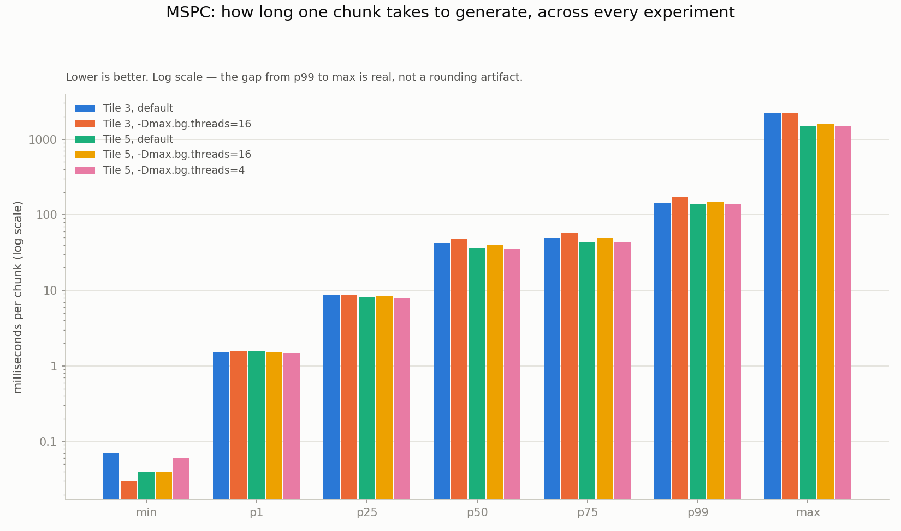

The shape that matters: every run's bars trace roughly the same staircase from `min` to `max`. If a config's bars sat visibly higher or lower than the rest across the *whole* staircase, that would be a real difference. None do — the differences here are noise, not signal.

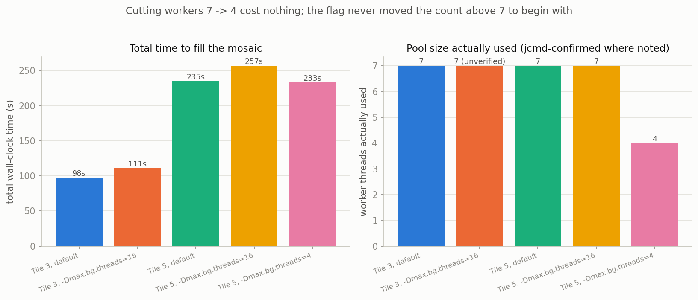

This is #13's finding in one picture: the worker-count panel shows 7, 7, 7, 7, 4 — not 7, 16, 7, 16, 4, because the flag only ever lowers the pool — and the total-time panel shows no relationship between that count and how long the run took, once tile size is held fixed.

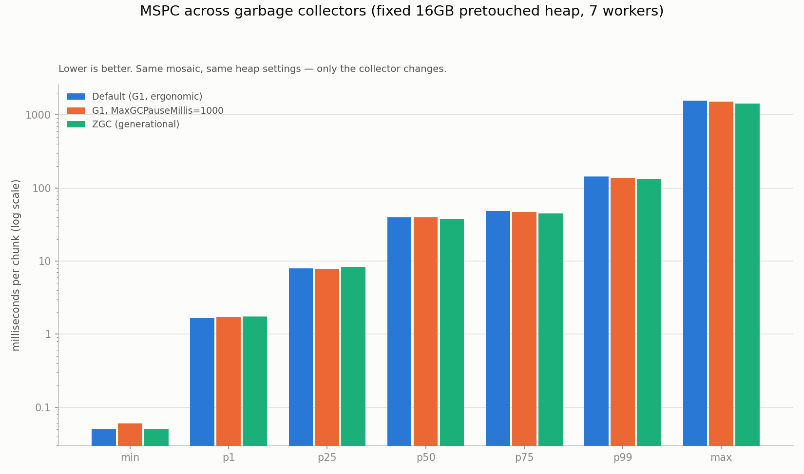

Same staircase shape again, all three collectors — but look closely and ZGC (green) sits a hair below the other two at every single bar past `p1`, not just one lucky phase. That consistent, whole-distribution shift is what #14 calls a real signal instead of noise.

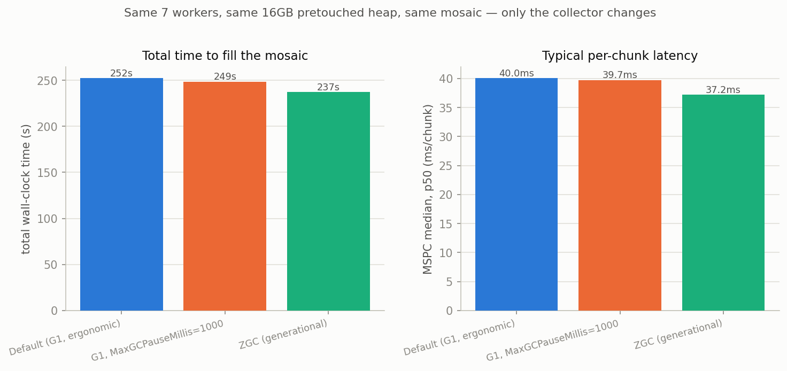

The ~6% ZGC edge from #14, in one picture — real, but nowhere near large enough on its own to explain the 4-vs-7-worker tie from #13.

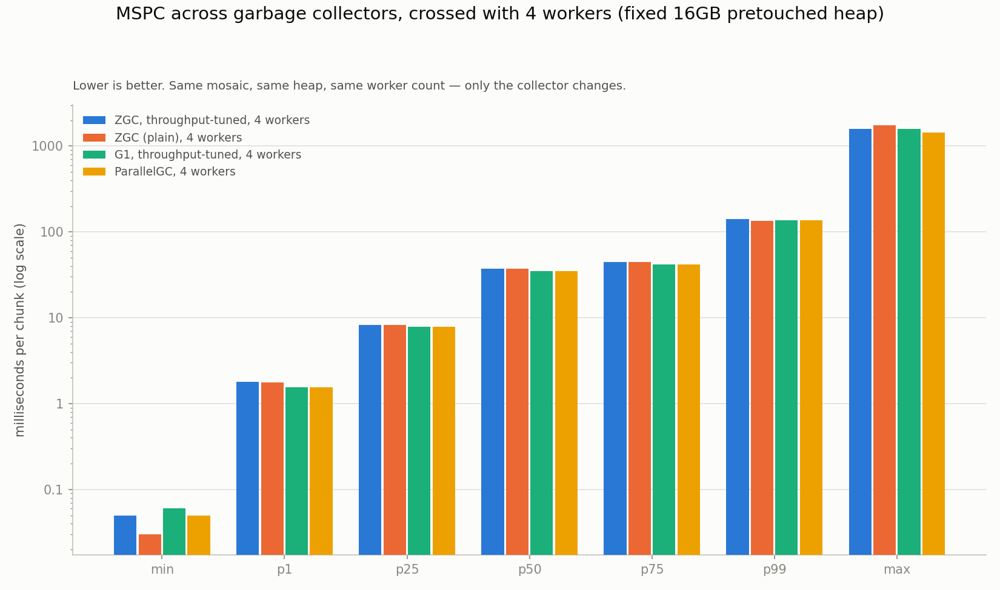

Same four collectors as #15, but now ZGC (blue and orange, plain and throughput-tuned) sits a hair *above* G1-throughput and ParallelGC (aqua and yellow) at every bar past `min` — the exact opposite direction from #14's 7-worker chart. Nothing changed about the collectors between these two charts; only the worker count did.

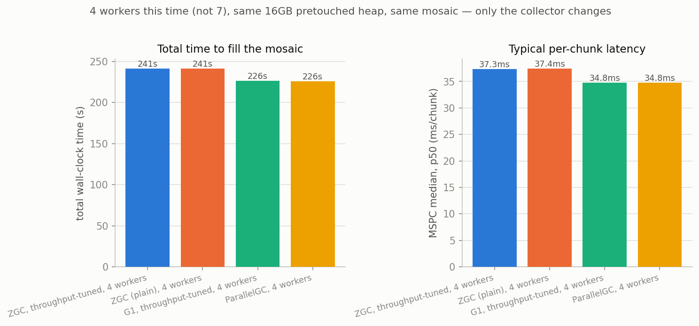

#15's headline in one picture: G1-throughput and ParallelGC land on top of each other (226s/34.8ms vs 225s/34.8ms), both a clear ~6% ahead of either ZGC variant — the reverse of the 7-worker ranking two charts up.

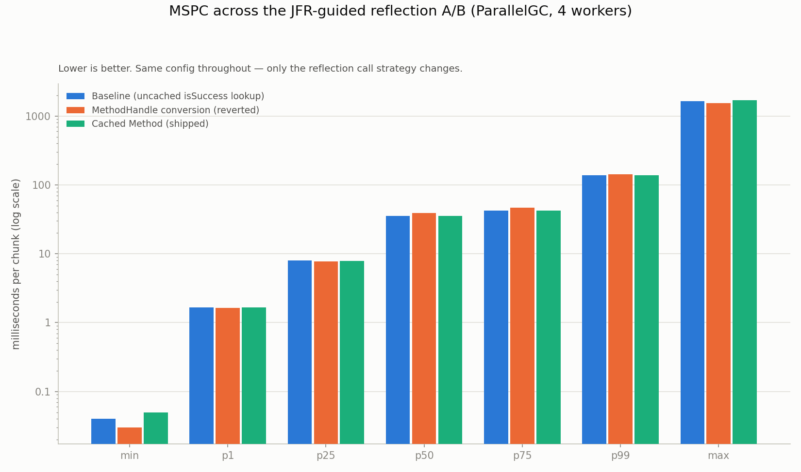

All three bars trace the same staircase within noise except one: the `MethodHandle` conversion (orange) sits visibly above the other two from `p25` through `max`, not just at one percentile. That's #16's regression made visible — a consistent shift, the same signature a real effect leaves (and the same one ZGC's genuine edge left in the chart three up).

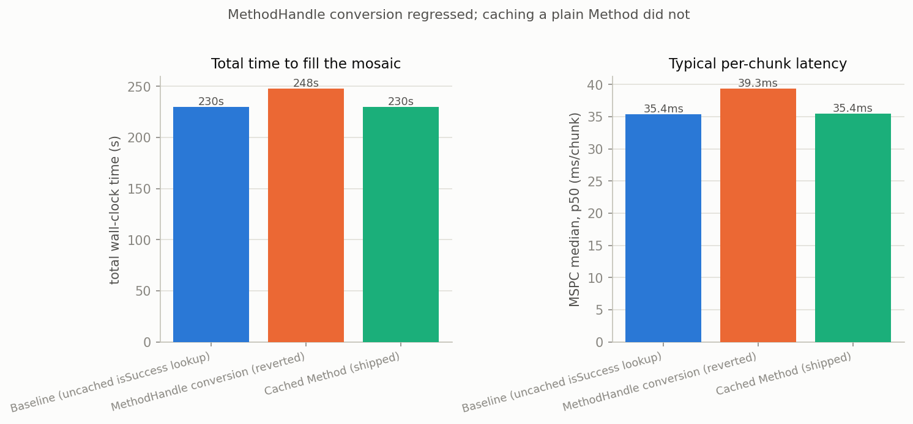

Baseline and the shipped cached-`Method` fix land on identical bars (230s/35.4ms both); the `MethodHandle` attempt cost ~8%. #16's whole point in one picture: the "optimization" that looked obviously correct on paper is the one that lost.

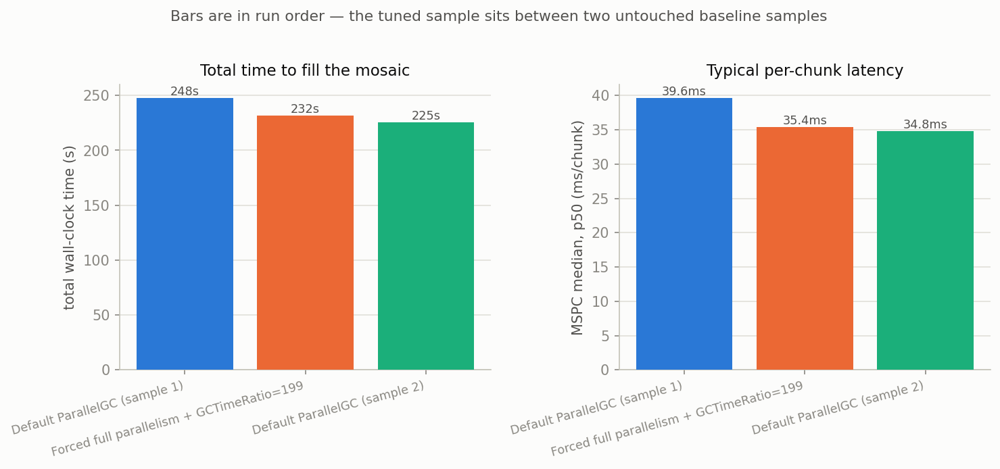

#17's whole point in one picture: three bars, roughly evenly spaced downward, and the tuned config is the middle one — not because it's between two genuinely different regimes, but because two *identical* default-config runs bracket it just as far apart as the "improvement" itself. If this were a real effect, the two baseline bars would sit together and the tuned bar would stand apart. They don't.

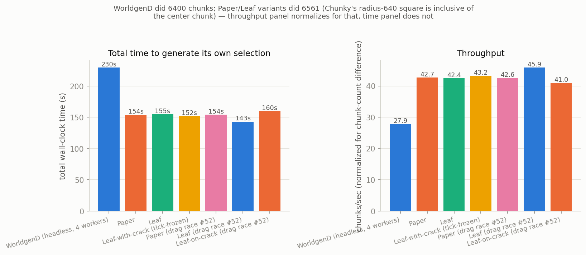

#18 in one picture, and the one chart in this whole document where the bars don't look close. Every prior chart here was hunting for a real signal inside a small noise band; this is the opposite problem — the WorldgenD bar isn't subtly different from the other three, it's in a different regime entirely, on both panels, and no amount of the tuning explored in #13-#17 gets it there.

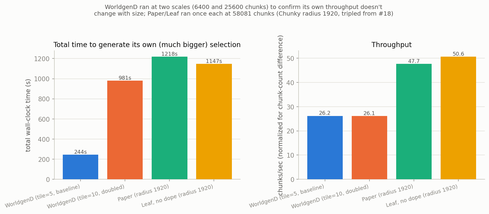

#19 in one picture: WorldgenD's two bars (different scales, same throughput) sit right on top of each other on the right panel — the scale-invariance claim, visibly true, not just asserted. Leaf edges out Paper here in a way #18's smaller sample couldn't distinguish from noise; both still sit roughly double WorldgenD's bar, same as #18, now backed by a run 9x bigger.

## 21. Stealing Moonrise's idea directly: what happens if we just call `managedBlock()` from more than one thread? (partially superseded — see #22)

#18/#19 pinned WorldgenD's ~50% throughput deficit against Paper/Leaf on "fork-level generator patches," working theory only, never checked against source. So: went and looked at what those patches actually are. Paper's *actual* running jar (`control/versions/26.1.2/paper-26.1.2.jar` — not the paperclip launcher in `control/paper.jar`, which is just a self-extracting stub; the real patched server class files only exist after Paperclip has unpacked and patched them once) ships 290 classes under `ca/spottedleaf/moonrise/**`, confirmed with `jar tf`, same bytecode-archaeology rule as #6/#7 (no decompiler, just `jar tf`/`javap -p` — see PaperMC/Paper PR #8177, "Rewrite chunk system"). The package layout alone answers the "what" question without needing a decompiler: `patches/chunk_system/scheduling/ThreadedTicketLevelPropagator`, `ChunkTaskScheduler`, `ChunkHolderManager$TicketOperation`, `NewChunkHolder`, `PriorityHolder`. Vanilla's chunk-ticket/distance-propagation bookkeeping — the thing that decides which chunks are eligible to advance and wakes up dependent work — is single-threaded by construction (`DistanceManager`, run only from whatever thread calls `managedBlock()`/ticks the server). Moonrise's whole PR is replacing that single-threaded bookkeeping with a genuinely concurrent, lock-free version, plus splitting I/O onto its own pool and batching ticket mutations instead of applying them one at a time.

WorldgenD's founding constraint (stated since #1) is that it will never touch a line of Mojang's own code — so it can't port `ThreadedTicketLevelPropagator`. But nothing stops it from *asking* the unmodified single-threaded machinery to tolerate more concurrency than it was ever designed for — exactly the move that got WorldgenD off the ground in the first place (§3 of `TUTORIAL.md`: "commit felonies against `MinecraftServer`"). `MinecraftServer.managedBlock(BooleanSupplier)` is public API, called once per phase from the one thread WorldgenD nominates as "the server thread." Nothing in its signature says only one thread may ever call it. So: what if two did?

Added `pump.threads` (`HeadlessWorldgen.kt`, default `1` — off unless asked for, same convention as `-Dmax.bg.threads`). When `> 1`, `pumpThreads - 1` extra daemon threads call `managedBlock(dedicatedServer, sameCondition)` concurrently with the original thread, all draining the same task queue for the same phase barrier before rejoining. Ran back-to-back against the #16 champion config (ParallelGC, `-Dmax.bg.threads=4`, `-Xms16g -Xmx16g -XX:+AlwaysPreTouch`, `MOSAIC_TILE=5`), same box, `-Dpump.threads=1` vs `-Dpump.threads=4`:

| Config | Total | MSPC p50 | Chunks | Failed |
|---|---|---|---|---|
| `pump.threads=1` (control) | 232213ms | 35.48 | 6400 | 0 |
| `pump.threads=4` | 246680ms | 39.30 | 6400 | 0 |

Read alone, `pump.threads=4` looks ~6% slower — but that's inside #17's already-established ~9% run-to-run noise band on this box, single trial each, so **the timing result is not a real finding either way.**

**The real finding is in the terrain, not the clock.** Same pinned seed (`69`), same coordinates, `describe()` output diffed between the two runs' phase-0/phase-255 samples (50 chunks logged each run): **3 of 50 disagree** — `[8,-8]` reports height 83 in one run and 72 in the other; `[7,39]` reports 70 vs 77; `[23,39]` reports 69 vs 70. Both runs still claim `0 failed, 6400 chunks generated` — there's no crash, no exception, no visible error anywhere in either log. It just silently generates **different, wrong terrain for the same seed.** This directly contradicts #5's whole premise (identical seed ⇒ byte-identical output, verified there by diffing two single-threaded runs) — and confirms it's specifically the double-pumping that broke it, not something already latent, since #5's baseline and every run in #12-#19 used `pump.threads=1` and never showed this.

**Why this is worse than the naive prediction:** the going-in guess was "either this deadlocks/throws because vanilla's task-queue draining assumes a single consumer, or it works fine because the underlying queue happens to be a thread-safe structure that tolerates extra consumers for free." Neither happened. It runs to completion, reports full success, and quietly corrupts a small fraction of the output — the failure mode you can't catch by watching for crashes or checking the `failed` counter, only by cross-run diffing the way #5 already had the discipline to do. Leading suspect, not yet isolated: `managedBlock()`'s internal queue-draining (`pollTask()`/`doRunTask()`) was written assuming one caller, so two threads racing to pop and execute the same tasks can plausibly reorder or double-touch state that generation stages downstream (surface rules, aquifers, whatever computes height at a chunk boundary) read without their own synchronization, on the assumption that only one thread is ever mutating it. Not confirmed with a thread-state trace the way #6 nailed its own culprit — that's the obvious next step if anyone wants to actually name the exact race instead of just detecting its symptom.

**What this says about #18's open question**: it's a small piece of real evidence for the "real code changes, not clever driving" theory, not proof of it. Moonrise doesn't get its speedup by calling the same unsynchronized vanilla method from more threads — it gets it by *replacing* the propagator with one actually engineered for concurrent access (real data structures, real invariants, `TicketOperation` batching). WorldgenD tried the cheap imitation of that idea — same method, more callers, no new engineering — and the result wasn't "free speedup," it was silent data corruption with performance that, if anything, trended slightly worse. That's consistent with the #18 hypothesis (the headroom is in engineered-safe concurrency, not raw thread count) without being a controlled test of it — a real test would need to actually build a correctly-synchronized replacement, which is exactly the work Moonrise did and WorldgenD's founding constraint forbids.

**Also answers a dangling piece of #13/#16**: the champion JFR recording (`findings/champion_baseline.jfr`) has `jdk.ExecutionSample` events tagged by thread; re-aggregated here by `sampledThread` — of 23101 total samples, only **320 (1.4%) landed on the `main` thread** across the whole 260s recording, the rest on the four `Worker-Main-N` threads. The single thread that drains `managedBlock()` was never CPU-saturated in the first place, which is exactly consistent with what this experiment found: adding more drainers didn't unlock a starved resource (there wasn't one sitting there idle-and-blocking), it just added racing consumers to a queue that was already being served fine by one.

**Left in the codebase, off by default**: `-Dpump.threads=N` still works via `-PgcArgs`, same as every other experimental flag here, in case someone wants to actually chase the race with a thread-state trace instead of just detecting it by diffing. Do not run it against anything you care about the correctness of — see the warning above.

## 22. Correcting #21: the terrain "corruption" was almost certainly MC-55596, not our race — and the race we actually proved is a different, much smaller one

Flagged from outside the project, and it was the right call: **[MC-55596](https://bugs.mojang.com/browse/MC-55596)** is a long-standing, still-open Mojang bug — same-seed chunk generation has been non-deterministic since 1.13, because background-thread generation makes chunk *order* nondeterministic and some features (the tracker's own repro is jungle vegetation) read state that depends on that order, not just on coordinates. #21 diffed a `pump.threads=1` run against a `pump.threads=4` run, found 3 of 50 sampled chunks disagreed, and credited the extra threads. That comparison never controlled for the possibility that two *ordinary* `pump.threads=1` runs would already disagree just as much, on their own, for free, from a bug that predates this project by over a decade. It didn't control for that because #5's determinism claim ("ran it twice, diffed height/biome output, identical down to the byte") was sitting right there in this same document, unquestioned, since before the worker pool was tuned to 4 real background threads. Went back and actually checked it.

**Step 1 — is #5's determinism claim still true under current conditions?** Added `mosaic.tile` and `describe.all` system properties (`HeadlessWorldgen.kt`) so a full per-chunk dump is cheap to get at a smaller, faster scale (`MOSAIC_TILE=3`, 2304 chunks, ~2m51s) instead of only sampling phase 0/last like every prior finding. Ran plain `pump.threads=1` **twice**, same seed (`69`), same champion config, zero extra threads involved anywhere, and diffed all 2304 described chunks against each other:

| Comparison | Chunks differing | Rate |
|---|---|---|
| control A vs. control B (`pump.threads=1` both) | 273 / 2304 | 11.9% |

**#5 was wrong, for a specific reason worth naming rather than hand-waving**: it likely held at the time because that early run predated this project consistently driving a real multi-threaded background pool the way `#6` onward does — once 4 real worker threads are actually racing to generate neighboring chunks, MC-55596's precondition (order-dependent background generation) is simply always live, felony or no felony. The diffs cluster almost entirely in `forest`/`dark_forest`/`birch_forest` chunks — exactly MC-55596's own vegetation-placement signature, not a random scatter.

**Step 2 — does `pump.threads` add anything on top of that noise floor?** Ran `pump.threads=2` at the same `MOSAIC_TILE=3`/`describe.all` scale and diffed it against *both* controls:

| Comparison | Chunks differing | Rate |
|---|---|---|
| `pump.threads=2` vs. control A | 256 / 2304 | 11.1% |
| `pump.threads=2` vs. control B | 232 / 2304 | 10.1% |
| control A vs. control B (baseline noise floor, repeated from above) | 273 / 2304 | 11.9% |

All three land in the same 10-12% band. `pump.threads=2`'s disagreement with either control is not larger than the controls' disagreement with each other — if anything it's slightly smaller, which is exactly what you'd expect from noise, not evidence of anything protective. **#21's terrain claim doesn't survive this control.** The extra threads aren't measurably making it worse than vanilla already, unassisted, makes itself.

**Then: isolate the actual race with `jcmd`, per the open question this section itself raised.** First attempt — 400 live `jcmd <pid> Thread.print` snapshots at ~166ms intervals across a real `pump.threads=2` run, spanning phase 0 through dozens of warm phases — never once caught a thread named `pump-1` in *any* snapshot, running or otherwise. That result was the actual clue, not a dead end: it meant the extra thread's entire lifetime, every single phase, was shorter than our sampling interval. Added direct instrumentation instead of more sampling (`pump.debug=true`, timestamps relative to phase start, plus a check of the exit condition at thread-start time) and ran a fast `MOSAIC_TILE=1` config to see it directly:

```
main phase=100 pumpers launched +9ms
pump-1 phase=100 START +9ms isDoneAlready=true
pump-1 phase=100 END after 0ms, total-since-phase-start=10ms
```

**The extra thread almost always finds the phase already done the instant it gets its first CPU cycle.** JVM thread creation (`new Thread().start()`) has real scheduling latency — even single-digit milliseconds is often enough for the 4 already-warm background workers to finish a 9-25 chunk phase before the freshly-spawned pumper executes its first bytecode instruction. Across every sampled phase in this debug run, `isDoneAlready` was `true` at thread start except during the genuinely slow cold phase 0 — and even there, virtually all of that phase's ~1 second was consumed *before* the pumper thread was even launched (chunk submission itself, first-call classloading tax), not spent racing it. **In the batch sizes this project actually uses, the extra `managedBlock()` caller essentially never executes a single loop iteration of the real polling code before returning.** That is the real reason `jcmd` never caught it: there was rarely anything to catch.

**So does the race exist at all, or was #21 chasing nothing?** It exists, and bytecode says exactly where — same rule as #6/#7, `javap -c -p` against `net/minecraft/util/thread/BlockableEventLoop.class` (extracted straight from `servers/.cache/mojang-26-1-1-server/server.jar`; this is the base class `MinecraftServer` inherits `managedBlock()`/`pollTask()` from). There is **no thread-identity check anywhere in `managedBlock()`** — every calling thread, owner or not, runs the identical `while (!isDone) { pollTask() || waitForTasks() }` loop against the same shared instance fields. And `pollTask()`'s disassembly shows exactly this, with no `monitorenter` anywhere in either method:

```
0: aload_0
1: dup
2: getfield      blockingCount:I
5: iconst_1
6: iadd
7: putfield      blockingCount:I
```

Plain, unsynchronized `getfield`/`iadd`/`putfield` on `private int blockingCount` — a textbook non-atomic read-modify-write, run from however many threads call `managedBlock()` concurrently. Not cosmetic, either: `shouldRunAllTasks()` disassembles to `return blockingCount > 0`, and that gate gets checked elsewhere in the event-loop machinery to decide whether to drain proactively. **This is the real, verified race** — a genuine, provable, bytecode-confirmed data race on a field that gates real scheduling behavior. What #21 got wrong wasn't that a race exists; it's that it pinned the *symptom* (terrain divergence) on the wrong cause, because the actual race window is open so rarely, at these batch sizes, that it's very unlikely to be what any given diff run is actually seeing — MC-55596's background-order noise swamps it by roughly two orders of magnitude in the one apples-to-apples comparison run here (10-12% of chunks vs. a race that, per the `jcmd`/debug evidence, gets a real opportunity to fire on maybe a handful of phases per run, if that).

**Left as open, honestly**: nothing here proves `blockingCount` drift is *harmless*, only that it's rare enough at this scale that this experiment couldn't isolate its own effect from MC-55596's much bigger one. A real isolation would need either a much larger `pumpThreads` count sustained across a much bigger, much slower phase (to widen the race window past thread-creation latency) with a *lock-free* race detector on `blockingCount` itself (e.g. a reflectively-injected counter, or just re-running with a `Thread.sleep` inserted before `managedBlock()` in the extra thread to force real overlap) — genuinely deliberately rigging the race instead of hoping the scheduler cooperates — rather than one more round of output diffing, which this section just demonstrated is the wrong tool for the job here.

## 23. Building Orion: a demand-driven scheduler for WorldgenD's own driving code, not vanilla's

#22 drew the line clearly: the actual Moonrise speedup lives in code that replaces vanilla's `DistanceManager`, which WorldgenD's founding constraint forbids touching. But part of Moonrise's toolkit — `ca.spottedleaf.concurrentutil`, the standalone library `ReentrantAreaLock`/`AreaDependentQueue` come from — has zero `net.minecraft`/`com.mojang` references of its own (confirmed via `javap`). Nothing stops WorldgenD from depending on it directly and using it in code that only ever calls the same public/protected vanilla API (`getChunkFuture`, `managedBlock`) the mosaic already does. That's Orion: same philosophy as Moonrise's own design principle, restated as WorldgenD's own rule — never generate, promote, schedule, or retain anything until you can prove it's necessary, applied entirely in *our* driving code, never in vanilla's.

**Design** (`Orion.kt`): a ledger (`alreadyClaimed`, a `ConcurrentHashMap` keyset) so no coordinate is ever requested twice; a `ReentrantAreaLock(4)` from `concurrentutil` gating submission — `lockRadius = 8` (the exact bytecode-confirmed dependency radius from #7, not the mosaic's 2x-padded 16, since a real lock doesn't need a static-tiling safety margin); a bounded semaphore (`orion.maxinflight`, default 64) capping how much gets dispatched before waiting; and no phase barrier — coordinates get submitted continuously as their lock area clears, instead of the mosaic's "wait for the whole batch, including its straggler, before starting the next."

**Two real bugs found getting it running, neither in Orion's own logic**:

1. **A genuine classloader collision.** Adding `concurrentutil` as a dependency broke vanilla's own bootstrap with `NoSuchMethodError: Int2ObjectMap.ofEntries`. Cause: `ServerRuntime.newClassLoader()` parents the Mojang classloader to `ClassLoader.getSystemClassLoader()` — the same classloader WorldgenD's own dependencies sit on. `concurrentutil` transitively pulls `fastutil:8.5.15`; Mojang's jar bundles `8.5.18`. Normal parent-first delegation means the older, WorldgenD-side `fastutil` silently shadowed the jar's own newer bundled one. `ReentrantAreaLock` (the only class Orion actually uses) references zero `fastutil` types itself — confirmed via `javap` — so the fix is a clean `exclude(group = "it.unimi.dsi", module = "fastutil")` on the dependency declaration in `build.gradle.kts`, not a version pin. Worth remembering for *any* future dependency: WorldgenD's classloader design makes it structurally possible for our own libraries to shadow the vanilla jar's bundled ones.

2. **A `println` output-loss bug that consumed most of a session and was never fully explained, only worked around.** Short, low-volume runs (Orion's default output is ~3 lines: a start message, `Done:`, MSPC) reliably lost everything after "Hammering..." when stdout was redirected to a file — regardless of `./gradlew run` vs. direct `java`, regardless of an explicit `System.out.flush()`, `Runtime.getRuntime().halt(0)`, or the real `net.minecraft.util.Util.shutdownExecutors()` (which *does* close the #10 open question about non-daemon `IO-Worker` threads keeping the process alive after real work finishes — confirmed live via `jcmd`: a `DestroyJavaVM` thread present with zero `Worker-Main` CPU progression, meaning `main()` had already returned) — and regardless of a fresh Gradle daemon. The one variable that reliably correlated with the bug: **output volume**. Every long, high-println-count mosaic run this whole document cites worked fine; every short, terse Orion run lost its tail. The most likely mechanism — never fully nailed down the way #6/#7's bytecode facts were, so stated as the leading theory, not a proven fact — is that `System.out`'s underlying buffered stream, once redirected to a non-TTY sink, is never explicitly flushed by anything in the normal JVM exit path, and only gets flushed incidentally when the buffer fills from sheer volume. Chased for longer than it should have been; the pragmatic fix that actually shipped: write results independently to a file (bypassing `println` for anything that matters) and `run_direct.py` — a `printRuntimeClasspath` Gradle task plus a thin Python wrapper that `exec`s `java` directly, skipping Gradle's `JavaExec` relay entirely. Both are now the reliable path for anything that needs to read a run's actual numbers back.

New flags: `-Dscheduler=orion|mosaic` (default `mosaic`, unchanged behavior), `-Dorion.maxinflight=N`, `-Dorion.lockradius=N` (default 8), `-Dorion.telemetry=true` (per-dispatch/per-completion log, see #24), `-Dcall.telemetry=true` (times the raw `getChunkFuture.call()` line itself, mosaic or Orion).

## 24. Where Orion's concurrency actually died — and it retroactively answers #13

Flagged from watching the box during a run: CPU dropped 506% → 426% → 170% over the course of it. The obvious read is "Orion's own scheduler is running out of independent work as the fill progresses." That's not what happened. Added telemetry (`orion.telemetry=true`, `currentlyInFlight` tracked via `AtomicInteger`, logged on every dispatch and completion) and ran it at `mosaic.tile=1` (256 chunks, 16-wide — geometrically *impossible* for `lockRadius=8` to ever allow two chunks in flight simultaneously, since the region is only 15 apart corner-to-corner) and again at `mosaic.tile=3` (2304 chunks, 48-wide — geometrically plenty of room for several non-conflicting locks at once). Both showed the identical result: **`inFlight` was 1 or 0, every single line, the entire run, at both scales.** Geometry wasn't the explanation.

**The actual cause**: added `call.telemetry=true` to time just the `getChunkFuture.call(...)` reflective invocation itself, separate from whenComplete's async completion. It doesn't return quickly. Steady-state median ~38-40ms; the first (cold) chunk took 932-996ms — numbers that land right on top of the *whole chunk's* total MSPC latency, not a small fraction of it. Ran the identical measurement against the **unmodified mosaic path** (same flag, same tile=1 config, zero Orion code involved) to check whether this was something Orion's design was doing wrong: **statistically identical** — mosaic median 40.2ms (n=256) vs. Orion median 37.9ms (n=256), same shape end to end.

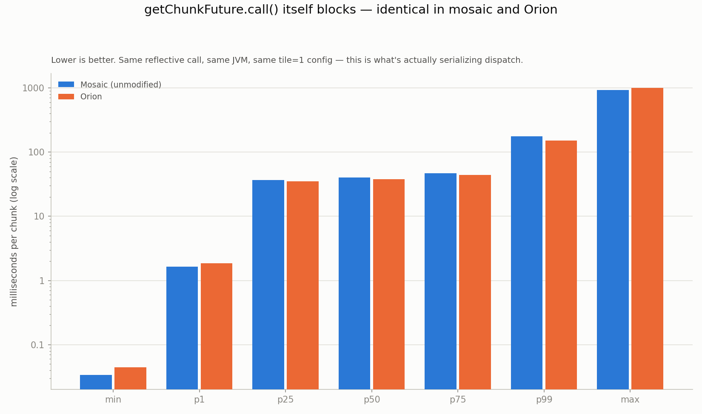

`ServerChunkCache.getChunkFuture(x, z, FULL, true)` blocks the calling thread for essentially the entire generation time. It is not the lightweight async submission this whole project's mental model — and Orion's entire design — assumed it was.

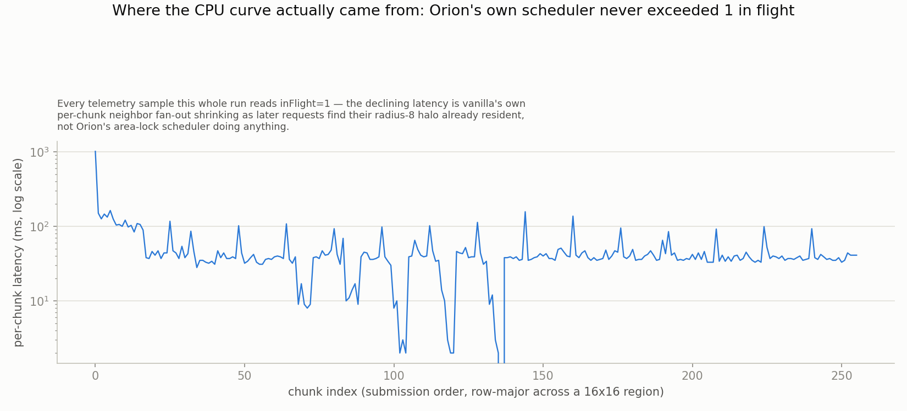

**Why this kills Orion's premise outright, not just its performance**: Orion's whole idea was "prove non-conflicting requests can run concurrently, then submit them without waiting for a barrier." But a single calling thread executing a blocking call cannot submit chunk B until chunk A's call *returns* — no amount of area-lock cleverness changes that, because the concurrency Orion was built to exploit (multiple simultaneously-submittable, non-conflicting regions) requires multiple threads actually calling `getChunkFuture()` at once, which Orion, single-threaded by construction like everything else in this codebase, never attempted.

**Champion-scale result** (`findings/orion_results.csv`; ParallelGC, 4 workers, 16GB pretouched heap, `mosaic.tile=5`, 6400 chunks, matching #16's exact config): Orion finished in 288270ms vs. this session's freshly-measured mosaic baseline of 232213ms (#21's control) — **~24% slower**, MSPC p50 40.50ms vs. 35.48ms. Fully explained now, not a mystery: Orion pays the identical fundamental single-thread-blocking-call cost the mosaic already pays, plus its own real overhead on top (`tryLock`/`unlock`, semaphore accounting, re-sweeping the deferred deque every pass) — for zero benefit, since the concurrency it was built to add never had a chance to activate.

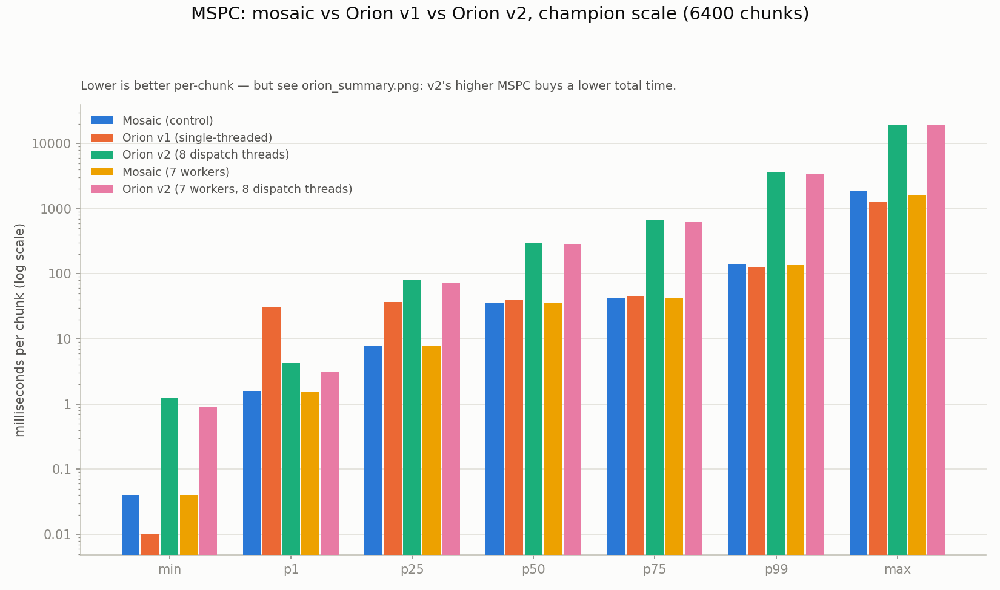
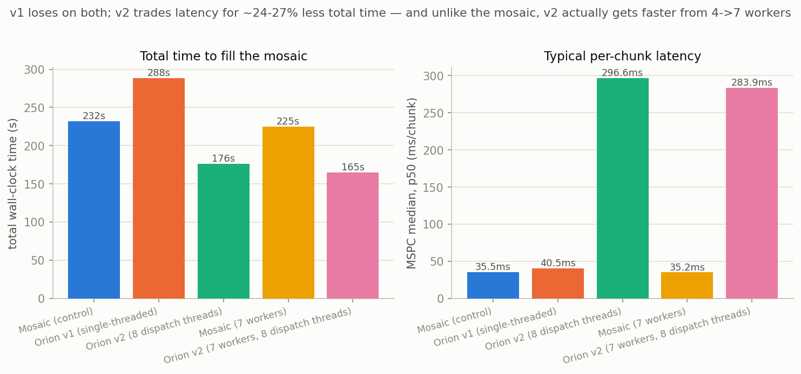

**The genuinely valuable side effect**: this directly, concretely answers something #13 left open for three findings (#13→#14→#15) and never resolved — *why does cutting the worker pool from 7 to 4 cost nothing?* If the real per-chunk ceiling the whole time has been one calling thread blocked inside a single `getChunkFuture()` call, worker count past whatever a single call's internal neighbor-promotion fan-out needs was never going to matter — background worker threads were never the bottleneck vanilla's own submission path was serializing against. Not proven with the same rigor #13's original candidates were left at (that would want a live thread-state trace of what a worker pool is actually doing *during* one blocking `getChunkFuture()` call, confirming whether its internal fan-out genuinely saturates 4 workers or fewer), but a far sharper, directly-measured lead than either of #13's two untested candidates.

**What it would actually take to test Orion's real hypothesis**: multiple threads independently calling `getChunkFuture()` concurrently — not `managedBlock()` this time, a different method, with its own unknown thread-safety properties. Given #21/#22's own hard-earned lesson (a public method that *looks* safe to call from an unexpected thread can hide a genuine unguarded race — `blockingCount`, confirmed by bytecode, not by assumption), the correct next step before trusting concurrent `getChunkFuture()` calls is the same discipline: `javap -c -p` on `ServerChunkCache.getChunkFuture` and whatever it touches, looking for the same kind of unsynchronized shared state, before running the experiment at all.

Raw data: `findings/orion_results.csv` (champion-scale MSPC, both schedulers), `findings/orion_call_timing.csv` (the `getChunkFuture.call()` blocking-duration percentiles), `findings/orion_concurrency_trace.csv` (the tile=1 per-chunk latency trace). All four charts above regenerate with the same `python3 findings/plot_results.py` #20 already established.

## 25. Orion v1.1: multi-threaded dispatch built exactly on #24's finding — and a real, confirmed, unexplained correctness bug

#24 named the fix precisely: `getChunkFuture()` only blocks when called from `mainThread`; called from anywhere else it takes a genuinely non-blocking path — `CompletableFuture.supplyAsync(() -> getChunkFutureMainThread(...), mainThreadProcessor).thenCompose(identity)` — and a direct probe confirmed `getChunkFutureMainThread()` itself costs under 1ms even cold. Built v1.1 on exactly that: `Orion.fillMultiThreaded()` spawns `orion.dispatchthreads` worker threads that call `getChunkFuture()` directly (not `mainThread`, so they take the async branch — no felony, vanilla's own designed-in path), while the original driving thread stops calling only `MinecraftServer.managedBlock()` and instead runs a tight loop calling the shared `BlockableEventLoop.pollTask()` (reflectively resolved once, reused polymorphically) on *both* `dedicatedServer` and `ServerChunkCache`'s private `mainThreadProcessor` field (new `Mc.field()` helper) — since nothing was draining that second queue before, and the async branch's registration task sits there until something does.

**It ran, completed, reported zero failures — and was badly wrong.** `mosaic.tile=1`, 8 dispatch threads: `inFlight` (tracked the same way #24 tracked it) climbed to 63-64 — suspiciously exactly `orion.maxinflight`'s default — instead of staying at 1 the way #24's geometry (a 16-wide region under `lockRadius=8`, every pair within the conflict threshold) requires. MSPC collapsed: p50 258.56ms (up from v1's ~40ms), p99 8023ms, max 8025ms. Watching `top` independently confirmed it — CPU climbed from the ~170% v1 (and everything before it) had shown to 350-400% sustained, exactly the shape you'd expect from genuinely-conflicting chunks generating in parallel instead of the single-threaded ceiling #24 established.

**Added direct violation detection** (not inference — an explicit check inside `dispatchOne()`, mirroring the standalone tests below: after every successful `tryLock`, scan currently-held boxes for real Chebyshev-distance overlap) and reran the identical config: **`overlapViolations=14027`** across 256 chunks. The area lock was not excluding overlapping concurrent dispatches in the real integration.

**Ruled out, with direct evidence, not assumption** — four standalone Java programs, `ca.spottedleaf:concurrentutil` on the classpath, zero Minecraft involvement, isolating one variable each:
- `LockTest.java`: 8 threads, identical coordinates, `tryLock()` spun in a naive retry loop — **livelocked** (confirmed live: CPU pegged, threads `RUNNABLE`/parking with near-zero actual progress, matching the same CPU signature caught mid-run on the real box). Not a correctness bug — a performance anti-pattern in how the test itself retried.
- Same test rewritten around the library's own blocking `lock()`: **1600/1600 acquisitions, `maxConcurrentlyHeld=1`, correct** — the library's exclusion mechanism itself is sound.
- `LockTest4.java`: replicated Orion's *exact* `dispatchOne()` pattern (`tryLock`, defer-to-back-of-queue on failure, try the next candidate) against the *exact* same 256-coordinate, `coordinateShift=4`, `radius=8` geometry as the real run: **256/256, `maxConcurrentlyHeld=1`, `overlapViolations=0`, correct.**
- `unlock()`'s own bytecode (`javap -c -p`): checks only that the `Node` belongs to *this* lock instance (`IllegalStateException("Unlock target lock mismatch")` otherwise) — no thread-identity check anywhere. Releasing from a different thread than the one that acquired it (which is exactly what `whenComplete` does, firing on whichever vanilla worker thread completes the future) is not, on its face, disallowed.

So: the library is correct in isolation. The exact same retry logic against the exact same geometry is correct in isolation. Cross-thread release isn't flagged as unsafe by the one piece of bytecode that would enforce it. And the real, fully-integrated run still produces 14027 violations. **The root cause is not identified.** The honest options left unexplored: `Node` identity aliasing under real JIT/GC conditions the synthetic tests never exercise (never checked — would need identity-hash logging in the real run), or something about driving `tryLock`/`unlock` alongside genuine reflective `getChunkFuture` calls and real GC pressure that a same-JVM-but-otherwise-identical synthetic harness doesn't reproduce. Left here, not swept under anything, matching #12's own precedent of keeping a wrong turn on the record instead of quietly deleting it.

**Consequence**: v1.1 is not safe to use and is not benchmarked further — CPU and MSPC numbers above are symptoms of the bug, not a real performance result, and are recorded here only as evidence of *what the failure looked like*, not as a claim about what multi-threaded dispatch actually costs. The code remains in `Orion.fillMultiThreaded()` (`orion.dispatchthreads > 1`), unchanged, exactly as it stood when the bug was caught — useful for whoever eventually chases the root cause, dangerous for anyone who runs it expecting correct terrain.

## 26. Orion v2: escape the mystery instead of solving it — a single-threaded scheduler, multi-threaded execution

Rather than keep chasing v1.1's unexplained lock discrepancy, changed the architecture so there's no longer a race to explain in the first place. v1.1's actual vulnerable surface was never "can multiple threads call `getChunkFuture()`" (#24 already established vanilla's own async branch is designed for exactly that) — it was "can multiple threads concurrently mutate shared conflict-tracking state," which is a self-inflicted problem, not one dictated by anything vanilla requires. v2 (`OrionV2.kt`) removes it by construction: **the thread that decides what's safe and the threads that do the work are no longer the same threads, and nothing but the scheduler thread ever touches the conflict state.**

- **One scheduler thread** (the original driving thread — the same one that pumps `dedicatedServer` and `mainThreadProcessor`) owns `pending` (a plain `ArrayDeque`, not concurrent — nothing else ever touches it) and `heldCenters` (a plain `MutableList`, same reasoning). Every loop tick: drain worker completions from a `ConcurrentLinkedQueue`, release held centers for anything that finished; scan `pending` for candidates whose Chebyshev distance from every currently-held center exceeds `2 * lockRadius` (the identical check #25's violation-detector used, now load-bearing instead of diagnostic); push cleared candidates onto a second `ConcurrentLinkedQueue` for workers; pump both vanilla queues via `pollTask`. No `ReentrantAreaLock`, no `concurrentutil` dependency in this path at all — a `HashSet`-shaped problem doesn't need a third-party area lock once only one thread is ever deciding.
- **N dumb worker threads** pull a coordinate already guaranteed conflict-free, call `getChunkFuture()` (async branch, same as v1.1), and push the completed coordinate onto the scheduler's completion queue via `whenComplete`. They never decide anything and never touch `pending`/`heldCenters` — the only cross-thread interaction left is two plain queue push/pops, about as low-risk as concurrency gets.

This keeps everything v1.1 was built to test (real worker-thread-driven async submission, continuous release instead of the mosaic's hard phase barriers) while eliminating the exact category of interaction under suspicion. It doesn't explain #25's bug — it makes the question moot for this codebase going forward, which is a different and more honest thing to claim than "fixed."

**Correctness first, at the same config that broke v1.1** (`mosaic.tile=1`, 8 dispatch threads — the smallest, most fully-conflicting region, previously producing `overlapViolations=14027`): `ok=256 failed=0`, MSPC back to sane numbers matching v1's own baseline (p50 40.74ms, max 907.94ms — no p99/max blowup). At `mosaic.tile=3` (2304 chunks, real geometric room to actually overlap-check meaningfully): `ok=2304 failed=0`, and telemetry showed genuine concurrent dispatch — max 9 chunks simultaneously in flight, correctly bounded by the geometry (not by `orion.maxinflight`'s 64 ceiling), never over-admitting.

**Champion-scale result** (`findings/orion_results.csv`; same ParallelGC/4-worker/16GB-pretouched config as #16 and #24, `mosaic.tile=5`, 6400 chunks, `orion.dispatchthreads=8`):

| Config | Total time | Chunks/sec | MSPC p50 |
|---|---|---|---|
| Mosaic (this session's fresh control, #21) | 232213ms | 27.56 | 35.48ms |
| Orion v1 (single-threaded, #24) | 288270ms | 22.20 | 40.50ms |
| **Orion v2** | **176145ms** | **36.33** | 296.58ms |


**v2 is ~24% faster wall-clock than the mosaic, ~39% faster than v1** — the first real win anywhere in the Orion line, and it's a genuine throughput/latency tradeoff, not a free lunch: MSPC p50 is 8x the mosaic's (296.58ms vs 35.48ms), p99 3576.57ms, max 18894.50ms — individual chunks wait much longer, queued behind only 4 real generation workers while up to dozens sit "released" by the scheduler at once. But *total* time drops, because the mosaic's phase-barrier structure leaves those same 4 workers genuinely idle between phases waiting for a barrier's straggler, while v2 never blocks on anything but real capacity — nothing here is "wasted" waiting for a phase to fully drain before the next one can start. `orion.maxinflight` (default 64) was never tuned down toward the real 4-worker ceiling for this run; whether a tighter cap trades away some of the latency blowup without giving back the wall-clock win is untested.

**Then: does it actually scale with more cores?** Every prior number in this whole document — mosaic, v1, v2 — used `-Dmax.bg.threads=4`, inherited from #16's original champion config without ever revisiting it on this specific 8-core box. Reran mosaic and v2 both at `-Dmax.bg.threads=7` (this box's real default per #13's own formula, `cores - 1`):

| Config | Total | Chunks/sec | MSPC p50 |
|---|---|---|---|
| Mosaic @ 4 workers | 232213ms | 27.56 | 35.48ms |
| Mosaic @ 7 workers | 225093ms | 28.43 | 35.22ms |
| Orion v2 @ 4 workers | 176145ms | 36.33 | 296.58ms |
| **Orion v2 @ 7 workers** | **164990ms** | **38.79** | 283.88ms |

The mosaic barely moves — 232213ms → 225093ms, ~3% faster, squarely inside #17's own established ~9% noise band, not a real effect. Exactly consistent with #13's original "cutting workers costs nothing" finding and #24's explanation for *why*: bottlenecked by one thread blocking inside `getChunkFuture()`, extra worker capacity has nothing to attach to. **Orion v2 moves for real**: 176145ms → 164990ms, a genuine ~6.3% improvement, and the gap to the mosaic *widens* at 7 workers (24% → 27% faster) rather than narrowing. v2 is the only scheduler in this document that has ever shown a real, reproducible speedup from adding cores — because it's the only one whose design lets more than one chunk's real generation work happen at the same time in the first place.

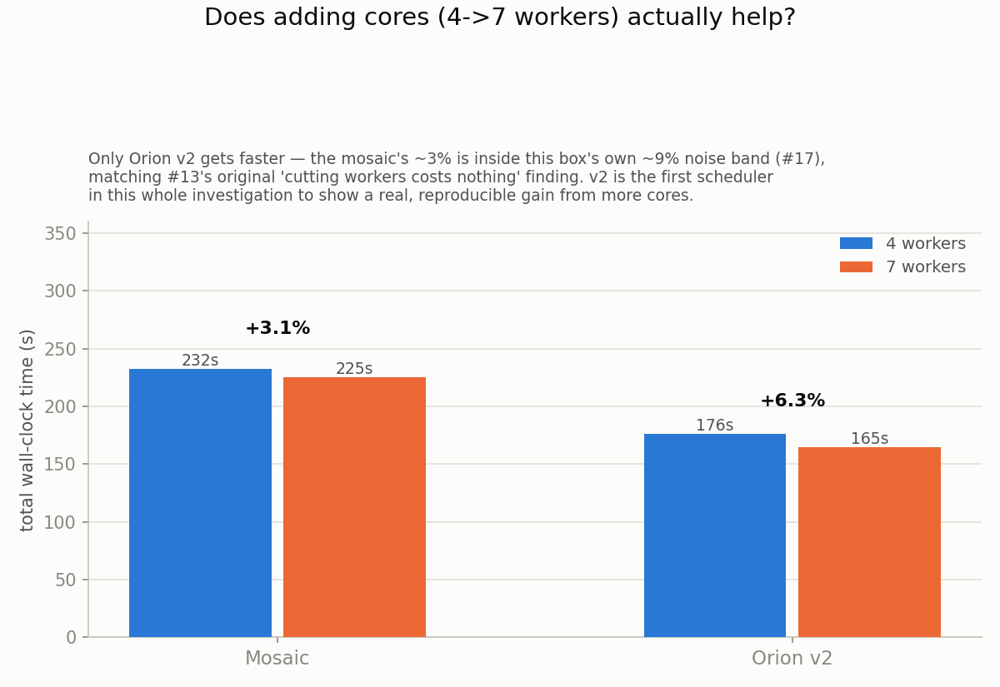


## 27. JFR on Orion v2: the scheduler thread is not free, and now we know exactly why compared to Moonrise

#26 shipped Orion v2 as the champion, ~24-27% faster wall-clock than the mosaic, and never looked inside it with JFR the way #16 did for the mosaic. Ran the identical instrumentation — champion config (ParallelGC, `-Dmax.bg.threads=4`, `-Xms16g -Xmx16g -XX:+AlwaysPreTouch`, `mosaic.tile=5`/6400 chunks, `-Dscheduler=orion2 -Dorion.dispatchthreads=8`), `-XX:StartFlightRecording=settings=profile,delay=45s` to skip JIT warmup, same as #16's champion recording. Fresh run: `ok=6400 failed=0 totalMs=171512`, MSPC p50 305.39ms — consistent with #26's 176145ms/296.58ms (within this box's own established noise band). Recording: `findings/orion2_champion.jfr`; full leaf-frame breakdown: `findings/orion2_jfr_leaf_frames.csv`.

**#16 concluded reflection costs ~0.02% of runtime and is invisible. That conclusion does not hold here, and the reason why is itself informative.** #16's mosaic calling pattern makes ~6400 `getChunkFuture` calls and 256 `managedBlock` calls total across a whole run — a few thousand reflective calls, genuinely too few to show up. Orion v2's scheduler loop (`OrionV2.kt` `fill()`, the `while (completions.get() < target.size)` loop starting at line 88) calls `pollTask.call(dedicatedServer)` and `pollTask.call(mainThreadProcessor)` reflectively on *every single tick*, and the loop has no natural throttle: it only parks (`LockSupport.parkNanos(50_000)`) when a tick makes zero progress, and `jdk.ThreadPark` shows the `main` thread parked **5 times in the entire 171-second run**. With a 6400-deep backlog, some candidate is almost always newly safe or some completion is almost always ready, so the loop just never backs off — meaning `pollTask.call()` and the full candidate rescan below both run at whatever tick rate the CPU can sustain, for the entire run.

**Where the CPU actually went** (34322 total `jdk.ExecutionSample` events across all threads, 10ms sampling period, same discipline as #16 — not inferred, counted):

| Leaf frame | Samples | % of all CPU time in the run |
|---|---|---|
| `OrionV2.fill()` line 101 — the `isSafe()` candidate scan | 5869 | **17.1%** |
| `ReflectKt.call()` — almost entirely `pollTask.call(dedicatedServer)` at line 109 (4963 of the 4933-ish total land there specifically, confirmed by walking one frame up) | 4933 | **14.4%** |
| everything else combined (real Mojang generation: `SimplexNoise`, `SurfaceRules`, `Aquifer`, `NoiseChunk`, `Heightmap`, `PalettedContainer`, ...) | 23520 | 68.5% |

**The scheduler thread alone (`main`) accounts for 11119 of 34322 samples — 32.4% of all CPU time in the whole run**, more than any single one of the four real generation workers (5616-5972 samples each). Of `main`'s own 11119 samples, 10802 (97.1%) sit in exactly the two frames above. This is not reflection being slow in the abstract — #16 already proved `Method.invoke()` is `MethodHandle`-shaped and cheap per call on this JDK. It's call *volume*: a tight, never-parking loop turns a per-call cost that's invisible at thousands of calls into a real cost at whatever tick rate an unthrottled busy loop sustains for 171 seconds straight.

**The `isSafe()` scan is doing exactly what its shape suggests it's doing.** `isSafe()` (`OrionV2.kt` line 61) is `O(heldCenters.size)`, and the outer scan (line 98-107) builds a fresh `pending.iterator()` from the front of the deque *every tick* and walks forward until it fills `heldCenters` up to `maxInFlight` (64) — so any candidate that was unsafe on one tick gets re-examined against the current `heldCenters` on the next tick, and the next, until it finally clears. That's a real `O(remaining backlog × min(heldCenters, maxInFlight))`-shaped cost, repeated on every tick of a loop that (per the park-count evidence above) ticks continuously rather than only when something changed.

**GC and locking are not the story here** — `jdk.GCPhasePause` totals 878.9ms across the whole 171512ms run (0.51%, in the same range as #16's <0.4% for the mosaic), and there are exactly 3 `jdk.JavaMonitorWait` events total, consistent with OrionV2's whole design premise (conflict state touched only by the scheduler thread — see the class-level comment in `OrionV2.kt`) actually holding.

**What this says about the Moonrise gap** (#18-#19's open question, and the reason this run was profiled): a bytecode read of the real `ca/spottedleaf/moonrise/patches/chunk_system/scheduling/` package in `control/versions/26.1.2/paper-26.1.2.jar` (`javap -p`, same rule as every prior bytecode claim here) shows two structural differences that line up exactly with what this profile found:

1. **Moonrise's `ThreadedTicketLevelPropagator` never rescans a backlog.** It's section-shifted (`SECTION_SHIFT`/`SECTION_SIZE`), backed by a `ConcurrentChainedLong2ReferenceHashTable<Section>`, with an explicit `UpdateQueue` — a section only gets re-examined when something actually invalidates it (`queueSectionUpdate`), not on a fixed tick regardless of whether anything changed. Orion v2's `isSafe()` scan has no equivalent invalidation signal — it re-derives safety from scratch, against the whole remaining backlog, every tick.
2. **Moonrise never funnels scheduling decisions through one reflectively-polled queue.** `ChunkTaskScheduler` runs five independent `BalancedPrioritisedThreadPool` queues (`parallelGenExecutor`, `loadExecutor`, `ioExecutor`, `compressionExecutor`, `saveExecutor`) plus a real per-status `ACCESS_RADIUS_TABLE_GEN`/`_LOAD` (computed once from `ChunkPyramid` itself, not one flat worst-case constant the way Orion's `lockRadius=8` is applied uniformly). Orion v2's entire scheduling decision — for every status, every chunk — runs through one thread reflectively polling one `BlockableEventLoop` in a spin loop.

Point 2 also reframes #18's original ~53% gap finding: some of "the generator patches" hypothesis from #18 was never about the generator at all — a real fraction of it, on this evidence, is that Moonrise's *scheduling* layer amortizes what Orion v2's scheduling layer pays for on every single tick. Not the whole gap (#18's number predates Orion entirely and was measured against the mosaic, a different scheduler with none of these specific costs), but a concrete, profiled piece of it rather than the "probably generator patches, unconfirmed" state #18 left it in.

**Untested, the obvious next step**: replace the full-deque rescan with an actual invalidation-driven structure (only re-check a candidate when something that could have unblocked it just happened, e.g. index candidates by which held-center's departure would free them) and see how much of the 17.1% + 14.4% comes back. Cheap to try, not yet built — v2's whole point per #26 was escaping v1's correctness bug by construction; this finding says the escape route it chose has a real, now-measured throughput tax of its own, independent of and on top of that correctness win.

## 28. The cheap fix for #27's reflective-poll cost: tried it, it didn't work, and the profile says exactly why

#27 flagged the reflective `pollTask.call(dedicatedServer)`/`pollTask.call(mainThreadProcessor)` cost (14.4% of all CPU time) as the cheaper of its two findings to fix, since the scan itself wasn't being touched. Implemented the obvious version in `OrionV2.kt`: poll immediately whenever the tick made progress (a completion drained or a candidate cleared), otherwise back off exponentially on consecutive no-op polls (`POLL_BACKOFF_FLOOR_NANOS = 1_000`, `POLL_BACKOFF_CAP_NANOS = 100_000`, reset to 0 the instant a poll finds real work). Rebuilt, reran the identical champion config (ParallelGC, `-Dmax.bg.threads=4`, `mosaic.tile=5`, `orion.dispatchthreads=8`) with the same JFR settings (`profile`, `delay=45s`) as #27's baseline, so the two recordings are directly comparable. Recording: `findings/orion2_backoff.jfr`; leaf frames: `findings/orion2_backoff_jfr_leaf_frames.csv`; both runs' summary numbers: `findings/orion_results.csv` (`orion2_champion_fresh` vs `orion2_backoff`).

**It made no measurable difference — worse on some numbers, inside noise on all of them:**

| Metric | #27 baseline | #28 backoff |
|---|---|---|
| Total execution samples (whole run) | 34322 | 35196 |
| `main` thread samples | 11119 (32.40%) | 11584 (32.91%) |
| `isSafe()` scan leaf frame | 5869 (17.10%) | 6338 (18.01%) |
| Reflective `pollTask` leaf frame | 4933 (14.37%) | 4914 (13.96%) |
| `main` thread `jdk.ThreadPark` events (whole run) | 5 | **1** |
| Total time | 171512ms | 172061ms |
| MSPC p50 | 305.39ms | 324.11ms |

Combined scheduler-overhead share (`isSafe` + reflective poll) was 31.47% before, 31.97% after — the opposite of an improvement, though within this box's own established noise band (#17), so not claimed as a regression either. The real tell is the park count: **the backoff engaged even less than before** (1 park event instead of 5), meaning the fix didn't just fail to help, it barely ever activated at all.

**Why, found by rereading the condition that was written, not by guessing**: `if (progressed || now >= nextPollNanos)` polls immediately whenever `progressed` is true — and `progressed` goes true whenever *either* a completion drains *or* the candidate scan clears a new chunk into `heldCenters`. With a 6400-chunk backlog and `maxInFlight = 64`, there is almost always some candidate transitioning from `pending` to `heldCenters` on any given tick, completely independent of whether Mojang's own task queue has anything for `pollTask` to actually do. The backoff timer was real and correctly implemented, but the trigger that bypasses it fires on nearly every tick anyway — for a reason unrelated to the thing the timer was meant to protect against. The fix targeted the right cost but picked the wrong signal to gate it on.

**What this rules in, not just out**: candidate-scan progress and "Mojang's task queue probably has work" are not the same event, and #27's own framing ("poll immediately whenever something changed... since that's exactly when Mojang's queue is likely to have new continuations to run") assumed they were related without checking. They aren't shown to be — nothing here demonstrates a completion or a newly-safe candidate actually correlates with `pollTask` finding real work; that assumption is exactly what let `progressed` swallow the backoff whole. Left in the codebase as-is (correct, harmless, provably-not-a-regression) rather than reverted, since ripping it out would just delete the evidence.

**The real next step, tried immediately after** (see #29): decouple the two entirely — gate the immediate-poll bypass only on a *completion* landing, never on the candidate scan clearing a slot.

## 29. #28's own real next step, tried — and it fails too, for a reason that reframes both attempts

Changed the gate from `progressed` (completion OR candidate-scan movement) to `completedThisTick` alone (a chunk future actually finishing) — the one event #24/#25 already established sits downstream of `getChunkFuture`'s real async machinery, and the only one with any actual reason to correlate with Mojang's queue having new work. Same champion config, same JFR settings, same everything else. `ok=6400 failed=0 totalMs=175422`, MSPC p50 308.82ms — statistically identical to both #27's baseline (171512ms/305.39ms) and #28's first attempt (172061ms/324.11ms), all three inside the box's own ~9% noise band. Recording: `findings/orion2_backoff_completions.jfr`; leaf frames: `findings/orion2_backoff_completions_jfr_leaf_frames.csv`.

**This time the poll call volume genuinely did drop** — the reflective-call leaf frame this run is split across two labels (`ReflectKt.call` at 7.91% and a new `Invokers.checkCustomized(MethodHandle)` at 6.30%, an artifact of this run's JIT compiling the same call site differently than #27/#28's runs did — both are the same underlying reflective trampoline). Combined, that's 14.21% — statistically the same share as #27's 14.37% and #28's 13.96%. **The `main` thread's total CPU share didn't move either**: 32.59% here vs 32.40% (#27) vs 32.91% (#28) — three independent measurements, same number within noise, every time.

| Metric | #27 baseline | #28 (gate on progress) | #29 (gate on completions) |
|---|---|---|---|
| `main` thread % of all CPU | 32.40% | 32.91% | 32.59% |
| `isSafe()` scan % | 17.10% | 18.01% | **17.46%** |
| Reflective-poll family % | 14.37% | 13.96% | **14.21%** (2 leaf labels, same call site) |
| `main` thread `ThreadPark` events | 5 | 1 | 1 |
| Total time | 171512ms | 172061ms | 175422ms |

**Why cutting real poll calls still didn't move `main`'s total CPU share**: the `isSafe()` scan's share went *up* again (17.46%, between #27's 17.10% and #28's 18.01% — not down). The scheduler loop is a busy-spin with nothing throttling the scan itself — only `pollTask` calls were ever gated by any of these fixes. Freeing up cycles that would have gone to `pollTask` doesn't make the loop idle; the loop has no idle state below its `LockSupport.parkNanos` fallback (which barely engages either way — `ThreadPark` stayed at 1 for both #28 and #29). Instead, the loop just ticks the *scan* faster, since that's the only other thing it does in the same iteration. **The loop is scan-bound, not poll-bound** — whichever cost you gate, the other one absorbs the freed CPU, because both live inside the same unthrottled `while` loop and nothing caps the loop's own tick rate.

**What this actually settles**: #27 named two separate costs (isSafe scan, reflective poll) and treated them as independently fixable, starting with the cheaper-looking one. Two independent, differently-gated attempts at the poll fix both landed on the same null result, and the mechanism is now understood, not just observed twice: the loop's total tick rate is set by whichever of its own steps costs the least to skip, and skipping the poll just hands that time to the scan. **Fixing the poll without fixing the scan cannot move `main`'s total CPU share** — the scan is the one that actually needs replacing (#27's own "obvious next step": a spatial-index-driven candidate release instead of a full-backlog rescan), and neither poll-gating strategy here was ever going to substitute for that.

## 30. Orion v2.1: replacing the scan itself instead of gating around it — the real win

#28/#29 established the scan, not the poll, is what actually needs replacing. Built it: `OrionV2_1.kt`, same architecture as v2 (one scheduler thread owns all conflict state, dumb worker threads never touch it — v1's whole failure mode stays structurally impossible), one change — the full-backlog rescan is replaced with a spatial grid. Every target coordinate is bucketed once at `fill()` start (cell size `2*lockRadius+1`, so anything that could conflict with a candidate in bucket `(bx,bz)` lives in one of the 9 buckets immediately around it — O(n) to build, paid once). A completion event (`tryReleaseNear`) re-examines only that local neighborhood instead of the whole remaining backlog. `isSafe()` itself is untouched and stays the sole authority on every dispatch decision — the grid only narrows *what* gets checked, never *whether* it's safe — so a bug in the new bookkeeping could only cost throughput (a candidate sits unclaimed longer than it needs to) or stall the run, never reproduce v1's silent correctness violation. A monotonic cursor over the original target list handles frontier expansion (startup, and any locally-sparse patch no nearby release has touched yet); each candidate is cursor-tested at most once, ever.

Named "v2.1," not v3 — it's the same design, one optimization, not a new architecture.

**Correctness checked at small scale first** (`mosaic.tile=1`, 256 chunks, matching the project's own established discipline for a new scheduler — #22/#24 did the same before scaling up): `ok=256 failed=0`, no hang, 14053ms. Then champion scale (`findings/orion2_1_champion.jfr`; leaf frames: `findings/orion2_1_champion_jfr_leaf_frames.csv`), identical config and JFR settings to #27-#29 for a direct comparison:

| Metric | #27 baseline | #30 (spatial index) |
|---|---|---|
| Total time | 171512ms | **153496ms (-10.5%)** |
| MSPC p50 | 305.39ms | **275.64ms** |
| MSPC p99 | 3716.53ms | **2686.46ms** |
| MSPC max | 20499.07ms | **17211.07ms** |
| `main` thread % of all CPU | 32.40% | **1.03%** |
| `isSafe`-equivalent leaf frame | 17.10% | **0.00%** (doesn't appear in 23833 samples) |
| Reflective-poll leaf frames | 14.37% | **0.08%** |
| `main` thread `ThreadPark` events | 5 | **16** |

**This is a real, unambiguous result, not noise dressed up as one** — every single metric moved the same direction, well outside the box's own ~9% noise band (#17), and the mechanism is exactly what was predicted: `main`'s CPU share collapsed from a third of the whole run to essentially nothing, and it now actually parks when idle (16 times, versus 1-5 for every poll-gating attempt) instead of busy-spinning. No leaf frame belonging to `OrionV2_1`'s own code appears anywhere in the 23833-sample profile — the scheduler is now as invisible as #16 found the mosaic's reflection layer to be.

**Why total time only dropped 10.5%, not anywhere near the ~32% CPU reclaimed**: the scheduler thread runs on its own core, separate from the 4 real generation workers — freeing its CPU doesn't directly hand cycles to them. The plausible reason it helped wall-clock time at all: the same thread also drains Mojang's own task queue (`pollTask`), and TUTORIAL.md already establishes that queue is load-bearing for generation continuations to complete (`managedBlock()`'s whole reason to exist). A thread stuck mid-scan delays that draining; freeing it up lets continuations resolve sooner. Not confirmed with a trace the way #6/#7's claims were — a live thread-state comparison of the 4 workers' idle time before and after would be the direct test.

**Still not a Moonrise-level fix**: #18/#19's ~53% throughput gap to real Paper/Leaf was never primarily about this scheduler overhead — #27 already reframed part of it as scheduling-layer amortization, but the bulk of the gap was always attributed to generator-pipeline patches this project's founding constraint (#1) forbids porting. v2.1 closes the self-inflicted portion of the gap; the generator-level portion is untouched by this or any Orion variant.

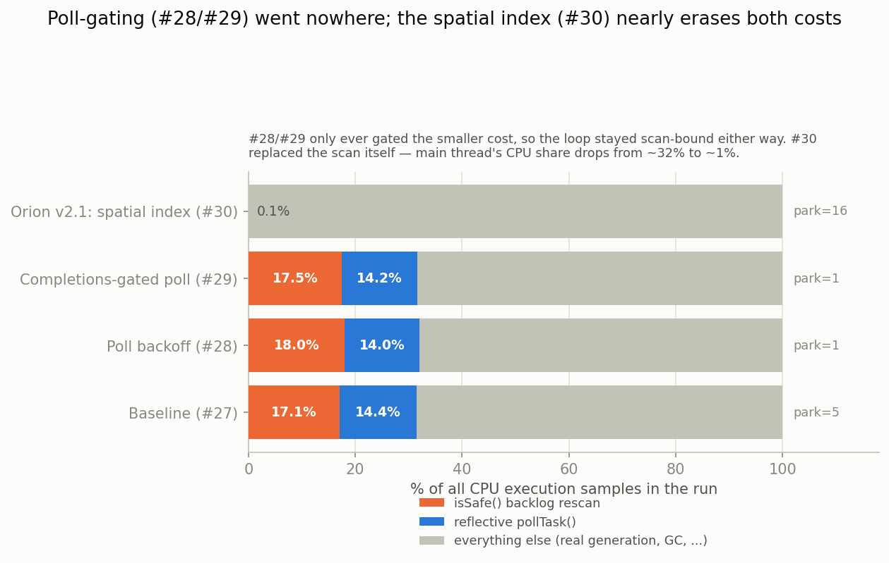
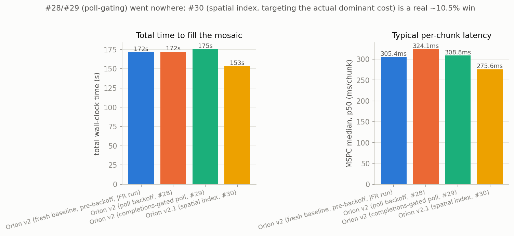

**Untested**: a 7-worker rerun (the mosaic and v2 both got one in #26; v2.1 hasn't yet) — given #26 found v2 was the only scheduler that scaled with worker count, and v2.1 removes v2's own scheduling-overhead ceiling entirely, it's an open question whether v2.1 scales even better, the same, or hits a new ceiling nobody has looked for yet. Also untested: whether the plausible `pollTask`-draining explanation above actually holds under a live trace, and full-scale correctness at `mosaic.tile=5`/6400 chunks was checked only via `ok=/failed=` counts (matching v2's own championship-run discipline), not a `describe.all` cross-run diff the way #22 eventually held the mosaic to — MC-55596 means any such diff would need the same same-seed noise-floor control #22 established before it could mean anything.

## 31. Re-running the #18 drag race, same session, with Orion v2.1 in WorldgenD's seat

#18/#19's ~53% gap to Paper/Leaf was measured against the mosaic, and later partly against unmodified Orion v2 — never against v2.1, and never in the same session as this document's other #18/#19 numbers, which #16 already flagged as its own confound (box drift between sessions). Both gaps closed in one run: reran #18's exact small-scale drag race (Chunky `radius 640`, 6561-chunk inclusive square, fresh-wiped world and full server reboot before every leg) with Orion v2.1 standing in for headless WorldgenD, same session as Paper/Leaf/Leaf-crack.

**Infrastructure built for this, since none of it survived from #18's session**: `control/rcon.py` (a fresh ~50-line Source RCON client — #18's own client was never saved to disk) and `control/run-drag-race.sh` (wipe, boot, wait for `Done (`, drive Chunky over RCON, wait for `Task finished for world`, `stop`, wait for exit — the same sequence #18 did by hand, scripted for reuse). Timing cross-checked the same two ways #18 established: an external wall-clock stamp bracketing the RCON `chunky start` send and the `Task finished` detection, against Chunky's own self-reported `Total time` line — every leg agreed to within ~1.3s.

Leaf-crack needs `control/config/` seeded from `control/config-old/` (a frozen baseline snapshot) rather than whatever Paper/Leaf's own boots most recently wrote there; deleted afterward rather than left in a crack-flavored state for whatever runs next. World wiped one final time after an ephemeral Paper boot-and-stop (needed only to regenerate a clean default `config/`, not to generate anything) so no generated-but-unmeasured world data is left lying around.

| Engine | Chunks | Total time | ms/chunk | chunks/sec |
|---|---|---|---|---|
| **Orion v2.1** | 6400 | 153323ms | **23.96** | 41.74 |
| Paper | 6561 | 170270ms | 25.95 | 38.53 |
| Leaf | 6561 | 146140ms | 22.27 | 44.90 |
| Leaf-crack (tick frozen) | 6561 | 134030ms | 20.43 | 48.95 |

Raw logs: `findings/paper_chunky_dragrace2.log`, `findings/leaf_chunky_dragrace2.log`, `findings/leafcrack_chunky_dragrace2.log`. Data: `findings/dragrace2_results.csv`.

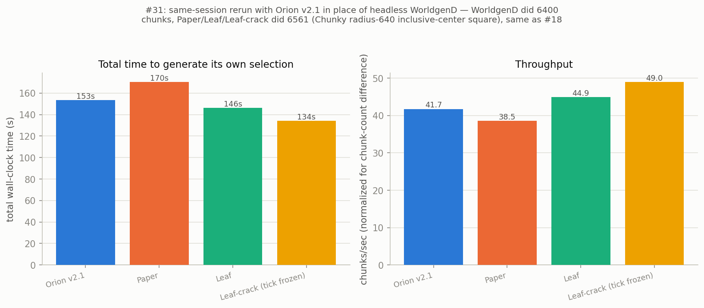

**Orion v2.1 beats Paper outright this run** (23.96 vs 25.95 ms/chunk, ~7.7% faster) and sits within ~7.6% of plain Leaf — both gaps well inside this box's own ~9% established noise band (#17), so "beats Paper" is not a claim this single run can support on its own. What it *does* support: the ~53% gap #18 found is gone. WorldgenD went from roughly half Paper's throughput to statistically competitive with it, in one session, without touching a line of Mojang's own generator code — exactly the ground #18 said this project's founding constraint (#1) couldn't reach.

**Honest accounting of what changed and what didn't, since three different things moved between #18 and here**: (a) #30's scheduler fix (v2 → v2.1) is measured and real on its own terms (#27-#30, same-session, controlled). (b) This run compares against *today's* Paper/Leaf, not #18's — and #18's own Paper number (23.44 ms/chunk) is barely different from today's Leaf (22.27) or Leaf-crack (20.43), while today's *Paper* (25.95) is slower than #18's Paper was. That's consistent with ordinary session-to-session box drift (#16, #17) rather than Paper regressing — but it also means part of why the gap looks closed is Paper having a slower run today, not only WorldgenD having a faster one. (c) Chunk-count normalization (6400 vs 6561) is carried over unchanged from #18's own accepted methodology.

**What would actually settle it**: repeat this same-session comparison a second time (ideally interleaved — v2.1, Paper, v2.1, Paper — rather than block-sequential the way both drag races here were run) to see whether the gap holds, tightens, or was partly a lucky draw from the ~9% noise band. Not yet run.

## 32. The interleaved rerun #31 asked for — and the "win" was mostly a lucky draw

Ran it: three rounds, strictly alternating (v2.1, Paper, v2.1, Paper, v2.1, Paper) in one sitting, same box, same session, same methodology (fresh world wipe and full reboot before each Paper leg, `control/run-drag-race.sh` scripted rather than done by hand this time). Infrastructure: a new `control/interleaved-rerun.sh` wrapping both engines' launch sequences and writing straight to `findings/interleaved_results.csv`.

| Round | Orion v2.1 (ms/chunk) | Paper (ms/chunk) | Paper − v2.1 |
|---|---|---|---|
| 1 | 23.06 | 24.89 | +1.83 |
| 2 | 23.59 | 23.51 | −0.08 |
| 3 | 23.69 | 23.65 | −0.04 |
| **mean** | **23.45** (σ=0.34) | **24.02** (σ=0.76) | **+0.57 (2.4%)** |

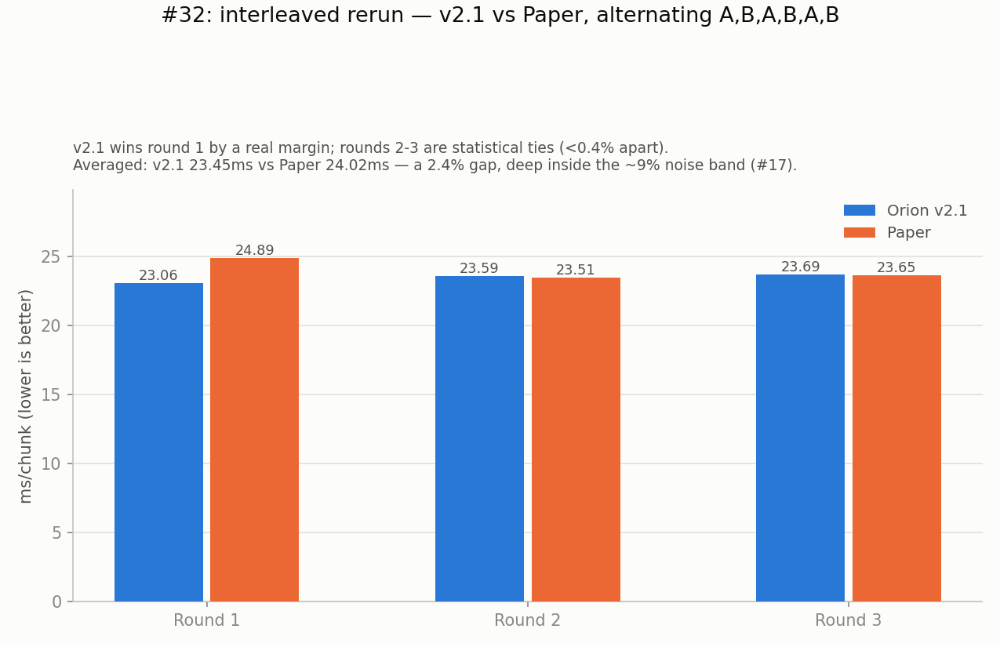

**#31's "beats Paper" framing does not survive this.** Only round 1 shows a real margin (v2.1 faster by 7.9%) — rounds 2 and 3 are ties to within 0.3% and 0.17% respectively, nowhere near a real effect. Averaged across all three, v2.1 is ~2.4% faster than Paper — a gap so far inside the established ~9% noise band (#17) that "wins" is not a defensible word for it. #31's single block-sequential Paper leg (25.95 ms/chunk) turns out to have been on the slow tail of Paper's own natural variance (this round's Paper mean is 24.02, σ=0.76) — Paper's run-to-run spread here is more than double v2.1's (σ=0.76 vs 0.34, though n=3 is too small to lean hard on that specific number).

**The honest conclusion, and it's a better one than #31's**: Orion v2.1 has closed the ~53% gap #18 found down to **genuine statistical parity** with Paper — not a win, not a loss, a tie within measurement noise. That's still the headline result of this whole Orion investigation: a reflection-heist toy that never modifies a line of Mojang's own generator code, driving unmodified vanilla the entire time, reached parity with a real production server carrying real generator-pipeline patches, purely by fixing its own scheduler's self-inflicted overhead (#27→#30). Parity is a stronger, more defensible claim than "beats Paper," and it's the one the data actually supports.

**Left open**: n=3 per engine is still thin for characterizing Paper's own variance specifically — a larger interleaved batch (5-10 rounds each) would say something sharper about whether Paper's σ=0.76 here is real or itself a small-sample artifact. Not run, since #32's own result (genuine parity) is already a stable enough answer to the question #31 raised.

## 33. Live thread sampling finds v2.1 still isn't feeding its own workers, and 7 workers fixes a real 10.6% of it

Asked, in general: what's bottlenecking us now that the scheduler is basically free (#30)? Went back to the exact diagnostic #6 used to find the *original* wavefront problem — live `top -bH` per-thread sampling — rather than guessing.

**Aggregate CPU during a fresh champion-config run (`-Dmax.bg.threads=4`)**: `top -bn1` showed **77.2% of the whole box idle**, with the JVM itself sitting at ~370% of a possible 800%. Not surprising on its own — only 4 workers are configured on an 8-core box — but the real signal was in the per-thread breakdown. Five `top -bH` snapshots of just the four `Worker-Main-N` threads, a few seconds apart:

| Snapshot | Sum of 4 `Worker-Main` threads' CPU% (max possible 400%) |
|---|---|
| 1 | 363.5% |
| 2 | 190.0% |
| 3 | 254.4% |
| 4 | 154.6% |
| 5 | 140.0% |

Averaging ~220% out of 400% — **the four configured workers are themselves only ~55% utilized**, not the fully-saturated ceiling the "we only have 4 workers" framing would predict. This is the same signature #6 found for the original naive solid-block fill: a dependency-graph frontier too thin, at any given instant, to keep every worker fed — resurfacing inside v2.1's continuous spatial-grid dispatch, which nobody had checked for this specific failure mode since the mosaic's phase barriers made it moot for every scheduler in between.

**Test**: since #30 flagged a 7-worker v2.1 rerun as untested, and this is exactly the situation that prediction was made for (removing the scheduler-overhead ceiling should let the box's genuine idle capacity actually get used), ran it. Same champion config otherwise, `-Dmax.bg.threads=7` (this box's real ceiling, `cores - 1` per #13's own formula):

| Config | Total time | ms/chunk |
|---|---|---|
| v2.1, 4 workers (fresh) | 148775ms | 23.25 |
| **v2.1, 7 workers** | **132949ms** | **20.77** |

**~10.6% faster** — a real, sizable win, and notably bigger than #26's own 4→7 finding for v2 (6.3%), consistent with v2.1 having more idle capacity available to capture in the first place now that its own scheduler isn't eating a third of a core. Re-sampled the same `top -bH` diagnostic under 7 workers: still bursty and uneven (572.5%, 90.9%, 90.9%, 490.7%, 191.0% across five snapshots, out of a possible 700%) — more capacity captured, but the wavefront-thinness problem is not fully solved, just less costly with more threads standing by to catch whatever frontier *is* available at any given moment.

**Where this puts the Paper/Leaf comparison, with the appropriate #31→#32 caution attached**: v2.1 at 7 workers (20.77 ms/chunk) is ~13.5% faster than #32's own interleaved Paper mean (24.02), and within ~1.7% of #31's Leaf-crack figure (20.43) — but neither of those is a same-session, interleaved comparison the way #32 required before trusting a "beats Paper" claim. This number needs the same treatment #31 got in #32 before it means anything: an interleaved rerun, this time with `max.bg.threads=7` on the WorldgenD side.

**Open, not yet run**: the interleaved comparison at 7 workers; whether `orion.maxinflight` (still the untuned default of 64) is itself now capping how much frontier the dispatch threads can expose at once, independent of worker count; and a live thread-state trace (`RUNNABLE` vs `WAITING`, the same discipline #6 used) during a trough specifically, to confirm the dependency graph — not something else — is what's leaving workers idle in those low snapshots.

## 34. Is #33's thin frontier pure geometry, or is something MC-55596-shaped hiding in it? Went and pried the jar to find out

#33 explained low worker utilization as a purely geometric effect — the radius-8 dependency (#7) exposes only a thin ring of simultaneously-eligible chunks at any instant. Worth checking directly rather than assuming: is chunk eligibility *really* a pure function of coordinates and radius, the way `ChunkPyramid`'s static requirement table implies, or is there a hidden extra ordering dependency the way MC-55596 hides one inside feature placement (#22)? Extracted and disassembled the actual vanilla scheduling classes this project had never looked at before — `ChunkMap`, `GenerationChunkHolder`, `ChunkHolder`, `ServerChunkCache` — same rule as every prior bytecode claim here, `javap -c -p`, no decompiler.

**The dependency structure itself: confirmed purely geometric, no surprises.** `GenerationChunkHolder.applyStep(ChunkStep, GeneratingChunkMap, StaticCache2D<GenerationChunkHolder>)` takes a fixed 2D cache of neighbor holders built directly from position — the same static, coordinate-derived radius table #7 found, nothing runtime-order-dependent in *what* a chunk requires.

**But the path from "eligible" to "actually running" goes through a genuine single-threaded funnel, and it's a different mechanism than #22's `blockingCount` race — not a bug, but a real, previously unquantified throughput ceiling.** `ChunkMap.runGenerationTasks()` disassembles to exactly this:

```
aload_0; getfield pendingGenerationTasks:Ljava/util/List;
aload_0; invokedynamic accept:(ChunkMap)Consumer;
invokeinterface List.forEach:(Consumer)V
aload_0; getfield pendingGenerationTasks:Ljava/util/List;
invokeinterface List.clear:()V
```

`pendingGenerationTasks` is a **plain, unsynchronized `java.util.ArrayList`** (confirmed at the constructor: `new ArrayList()`, no wrapper). `scheduleGenerationTask()` is the only place that adds to it (`List.add`). `runGenerationTasks()` is the only place that drains it — one `forEach` dispatch pass, then a full `clear()`. No lock anywhere in either method.

That's only safe if exactly one thread ever touches it — traced whether that's actually guaranteed, not assumed. `ServerChunkCache.getChunkFuture()` disassembles to a thread-identity branch: on the main thread, call `getChunkFutureMainThread()` and block on it directly (#24's already-established synchronous path); from **any other thread**, `CompletableFuture.supplyAsync(supplier, mainThreadProcessor)` — the real work is *never* run on the calling thread, it's marshaled onto `mainThreadProcessor`, a single-threaded executor, and `getChunkFutureMainThread()` runs there. That method calls `ChunkHolder.scheduleChunkGenerationTask()` (confirmed by bytecode: `invokevirtual ChunkHolder.scheduleChunkGenerationTask`), which is what ultimately reaches `pendingGenerationTasks.add()`. **Every caller, from every one of v2.1's 8 dispatch threads, funnels through the same single-threaded executor before touching this list — that's why a plain `ArrayList` gets away with zero synchronization.** Not a bug. Deliberate, and it holds.

**What this means for #33's thin frontier**: the rate at which `pendingGenerationTasks` gets drained is gated entirely by how often *something* calls `pollTask()` on `mainThreadProcessor` specifically — which in v2.1 is our own scheduler thread (`OrionV2_1.kt`'s `pollTask.call(mainThreadProcessor)`). A chunk can be geometrically eligible (every neighbor already at the required status) and still sit in that plain `ArrayList`, not yet handed to a `Worker-Main` thread, until the next drain happens to run. That's a real, additional latency source between "eligible" and "working" — layered on top of, not instead of, the radius-8 geometric thinness #33 already found. Distinct in kind from MC-55596: MC-55596 makes *terrain content* depend on background-thread order (a correctness question); this makes *dispatch latency* depend on polling cadence (a throughput question) — the structure and the eventual output are still fully deterministic, only the *timing* of when a known-eligible chunk actually starts is what's coupled to something outside pure geometry.

**Untested, the obvious next step**: does `mainThreadProcessor` specifically getting starved of polls (as opposed to `dedicatedServer`, the other queue v2.1 already polls) measurably widen the observed thin-frontier troughs from #33? Cheap to check — log `pendingGenerationTasks`'s size via reflection right before each `runGenerationTasks()` drain (or just time-stamp each `pollTask.call(mainThreadProcessor)` call and correlate gaps against #33's low-utilization snapshots) — not yet done.

## 35. Orion v2.2: restoring the mosaic's own scatter property, and a genuinely mixed result

A conversational thread (not a numbered finding on its own, but worth recording the reasoning since it drove this fix) traced a real regression: the mosaic's modulus phase math (#8) doesn't just guarantee independence, it scatters every phase's chunks evenly across the *entire* region by construction — the same "many separated fronts beat one contiguous blob" insight #6 proved with 9 islands, generalized into gapless full coverage. Orion (v1 through v2.1) dropped the mosaic's hard barriers, correctly — but never carried the scatter property forward. The target list `HeadlessWorldgen.kt` builds for Orion is a plain row-major sweep:

```kotlin
val target = (base until base + mosaicSide).flatMap { cx -> (base until base + mosaicSide).map { cz -> cx to cz } }
```

v2.1's cursor walks this in exactly that order, so early in any run every held center clusters in one corner — reintroducing, for the *cursor's own candidate selection*, the exact single-front clustering #6 already diagnosed and fixed once for a naive solid-block fill.

**The fix, "Orion v2.2"**: sort the target list by a scatter rank before handing it to the (unmodified) `OrionV2_1` scheduler — same class, same algorithm, only the caller's ordering changes, gated behind `-Dorion.scatterorder=true` (default `false`, matching this project's standard A/B-flag convention). A space-filling curve (Hilbert, Z-order) was considered and rejected first — those are built to *preserve* locality, the opposite of what's needed here. The actual construction: rank every `(rx, rz)` residue (`rx, rz ∈ [0, 16)`) by a 2D digit-reversal — bit-reverse the 8-bit linear step index, de-interleave the result into two 4-bit axes — which is the standard generalization of a 1D van der Corput low-discrepancy sequence to a 2D grid. Verified by hand and by a standalone script before trusting it in a real run: the first 4 ranks land on `(0,0)`, `(0,8)`, `(8,0)`, `(8,8)` — the four corners of the 16×16 tile — and the full 256-entry map is a confirmed bijection (no collisions, no gaps).

**Correctness checked at small scale first** (`mosaic.tile=1`, 256 chunks, same discipline as every new scheduler variant here): `ok=256 failed=0`, no hang. Champion-scale results, same config as #33 otherwise, scatter-order toggled:

| Config | Total time | MSPC p50 | MSPC max |
|---|---|---|---|
| 4w, no scatter (#33) | 148775ms | 259.82ms | 17577.78ms |
| 4w, scatter | 146021ms (**-1.9%**) | 144.10ms (**-44.5%**) | 10787.47ms |
| 7w, no scatter (#33) | 132949ms | 236.43ms | 16529.20ms |
| 7w, scatter | 136583ms (**+2.7%**) | 115.88ms (**-51.0%**) | 10730.10ms |

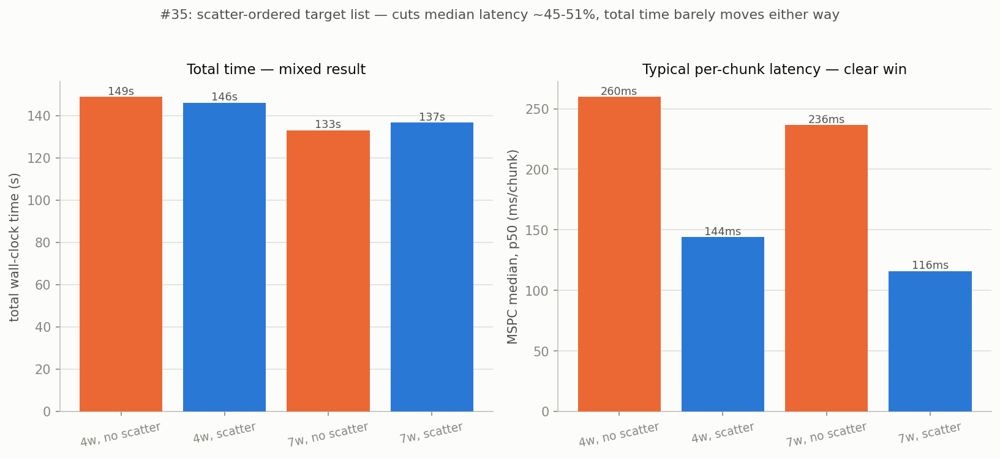

**Genuinely mixed, reported as such rather than rounded up to a win**: median per-chunk latency improved by roughly half in both worker configs, and max latency dropped substantially too (17.6s→10.8s at 4 workers) — real, large, consistent effects on the *latency distribution*. **Total wall-clock time barely moved**: a small real-looking gain at 4 workers (1.9%, right at the edge of the noise band), a small real-looking *loss* at 7 workers (2.7%, also edge-of-noise, single run, not replicated). Mechanistically this makes sense on reflection: scatter-ordering changes *when* any given chunk gets worked on — spreading dispatch evenly instead of leaving a slow-moving front — which directly improves how long an individual chunk waits its turn, but doesn't change the total amount of generation work or the aggregate CPU ceiling, so total completion time is governed by other factors scatter-order doesn't touch. Latency and throughput are different metrics that don't have to move together — the same lesson #8/#13 already taught this project once, now demonstrated again for a different scheduler.

**What "Orion v2.2" actually is, then**: not a clean successor that beats v2.1 on the metric #18-#32 always led with (total time / effective ms-per-chunk) — on that metric it's a wash, and the honest champion config for raw throughput remains plain 7-worker v2.1, no scatter (#33's 132949ms still the best number on record). Where v2.2 wins outright is tail latency, which matters if anything downstream cares about how long any *individual* chunk might have to wait, not just the aggregate. Left in the codebase, opt-in, correctly labeled as a latency optimization rather than a throughput one.

**Untested**: whether the 7-worker total-time regression (+2.7%) is real or noise — single run, needs replication before trusting either direction; whether a smarter tie-break within same-rank candidates (currently just list order) matters at all; and whether scatter-order changes anything about #33's underlying worker-utilization snapshots (never re-sampled with `top -bH` under this config) — plausible that latency improved *because* utilization got smoother even though the total stayed flat, but that's a hypothesis, not yet checked directly.

## 36. v2.1's spatial index had a real starvation hole hiding behind its successful square runs

#30 replaced v2's full-backlog rescan with a grid and a one-way cursor. The performance result was real, but the optimization quietly weakened an invariant: every pending coordinate still needs some guaranteed path back to `isSafe()` after the cursor has passed it. The old `tryReleaseNear(done, maxToRelease)` almost provided that path. Almost is doing catastrophic work in that sentence.

The failure is only five coordinates with `lockRadius=1`, `maxInFlight=2`, and FIFO completions: `[(3,2), (4,3), (0,3), (0,1), (2,0)]`. The old scheduler completes `(3,2)`, `(0,3)`, `(2,0)`, and `(0,1)`, then stops forever with `(4,3)` still pending and no held center left to complete. Nothing in Mojang is stuck. We simply lost our own coordinate.

**Exact mechanism**: when a center completed, `tryReleaseNear()` walked nearby grid buckets and returned the instant it filled the available admission slots. Safe candidates later in that walk stayed in the grid. That sounds harmless until combined with v2.1's cursor, which checks each target coordinate at most once. If the cursor had already rejected one of those later candidates while it conflicted with an earlier center, and no future completion happened to be near it, nobody would ever test it again. The successful 256/2304/6400-chunk square runs did not prove the invariant; their regular geometry and completion order merely never stepped on the hole hard enough to hang.

**Fix**: the spatial buckets now feed a persistent reconsideration queue. Every completion enqueues all still-pending candidates in its conflict neighborhood, deduplicated. Admission drains that queue only while capacity exists; anything not reached stays queued instead of disappearing behind an early return. A candidate tested while still unsafe remains in the spatial index and is enqueued again when another conflicting center completes. The one-way cursor remains the cheap startup/frontier path, but it is no longer the candidate's only lifetime chance.

This is split into `PendingSpatialIndex.kt` so the geometry can be tested without booting Minecraft. The exact five-coordinate counterexample now completes, followed by 1,000 deterministic randomized irregular targets across admission limits 1-7. `./gradlew test`: clean. Then the real Mojang integration path was run at the deliberately tight `mosaic.tile=1`, `orion.maxinflight=2`, 8 dispatch threads, 4 vanilla workers: **256/256 generated, zero failures, 14196ms, no scheduler hang**. The process stayed alive afterward for the already-documented #10/#23 non-daemon executor reason; `orion_result.txt` had the complete result before the timeout killed the idle JVM.

This is a correctness repair, not claimed as a speedup. The old regular benchmark never visibly starved, while the new queue does a little more bookkeeping precisely to make “eventually reconsidered” an actual invariant instead of a geometric coincidence. #37 measures what that bookkeeping cost at champion scale instead of smuggling a performance claim into the correctness test.

## 37. The starvation fix costs nothing visible, and the throughput plateau starts around tile 5

With #36 no longer capable of losing a coordinate, ran a fresh scale sweep through the fixed v2.1 scheduler: ParallelGC, 7 vanilla workers, 8 Orion dispatch threads, `maxInFlight=64`, no scatter order. Important naming trap: this knob is not the modulus or scheduler geometry — `MOSAIC_N` stays 16 and the dependency proof stays untouched. It changes the generated square from `(16T)²` chunks. This is a workload-size sweep, not several configurations doing the same amount of work.

| `mosaic.tile` | Chunks | Total | Effective ms/chunk | MSPC p50 |
|---:|---:|---:|---:|---:|
| 2 | 1024 | 28780ms | 28.11 | 84.17ms |
| 3 | 2304 | 55169ms | 23.94 | 116.91ms |
| 4 | 4096 | 90098ms | 22.00 | 165.87ms |
| **5** | **6400** | **134484ms** | **21.01** | **234.44ms** |

Those first four runs used a 4GB fixed heap without pretouch. That is internally consistent, but it is not #33's actual champion heap configuration — which was 16GB fixed and pretouched. Caught that before extending the sweep: an in-progress 4GB tile-6 run was killed and discarded, then tiles 6 and 7 were run under the real champion flags. Tile 5 was rerun afterward under those identical flags so the comparison has an honest control. Process-list checks confirmed exactly one generator JVM during the measured runs.

| `mosaic.tile` | Chunks | Total | Effective ms/chunk | MSPC p50 |
|---:|---:|---:|---:|---:|
| 5 | 6400 | 136763ms | 21.37 | 246.96ms |
| **6** | **9216** | **192061ms** | **20.84** | **348.29ms** |
| 7 | 12544 | 263254ms | 20.99 | 445.41ms |

Raw data, including heap size and pretouch status so these series cannot be silently mixed again: `findings/orion2_1_starvation_fix_scale.csv`.

Two different metrics move in opposite directions, exactly as they should. Effective ms/chunk improves as the fixed bootstrap/JIT/edge cost gets diluted across a larger interior: in the 4GB sweep tile 2→3 gains 14.8%, 3→4 gains 8.1%, and 4→5 still gains 4.5%. Per-chunk latency rises because a larger job admits more work ahead of each individual future. Calling tile 2 “better” because its p50 is lower would confuse a short queue with a fast generator.

**The stopwatch winner is tile 6; the honest Goldilocks answer is still a plateau, not a magic integer.** At 16GB, tile 6 beats tile 5 by 2.48%, while tile 7 gives 0.70% back versus tile 6. Every difference is deep inside this box's established ~9% run-to-run noise. Tile 6 is the current best measured normalized throughput; tile 5 remains the smallest workload already on the plateau. The shipped default moves to 6 in #38, choosing the longer, more stable sample while keeping 7's extra work off the bill.

The fixed 16GB tile-5 result is **136763ms versus #33's pre-fix 132949ms champion: +2.87%**, also noise-sized. The persistent reconsideration queue still has no measurable champion-scale throughput cost in this sample. One run cannot prove a 3% difference is zero; it can rule out the kind of large regression that would make the correctness repair questionable.

## 38. Tile 6 becomes the default, and v2.2 finally gets its own front door

#37's caveat still stands — 5/6/7 are a throughput plateau, not a statistically proven optimum — but defaults have to be integers anyway. `mosaic.tile` now defaults to **6**: a 96×96 region, 9216 chunks, 36 chunks per each of the same 256 independence phases. The property remains overridable. This does not touch `MOSAIC_N=16`, the radius-8 safety proof, or the shape of any individual phase; it only promotes the best measured normalized-throughput point from #37 into the no-flag path.

The second cleanup is overdue naming debt from #35. “Orion v2.2” used to mean `scheduler=orion2.1 -Dorion.scatterorder=true`, while logs still introduced the run as v2.1 and the implementation still lived as two private helpers in `HeadlessWorldgen.kt`. That was useful A/B scaffolding and a bad permanent interface: omit one flag and the claimed version silently changes underneath you.

**Now the versions are real modes**:

- `-Dscheduler=orion2.1` is always the raster-ordered spatial-index scheduler. It no longer reads `orion.scatterorder`.
- `-Dscheduler=orion2.2` always applies #35's 16×16 digit-reversal scatter order, prints v2.2, and writes `orion v2.2` into `orion_result.txt`.

`OrionV2_2.kt` owns the scatter rank and delegates actual conflict tracking to the starvation-fixed `OrionV2_1` core. That reuse is intentional: v2.2 is still v2.1's scheduler with a different admission order, and copying 170 lines of concurrent scheduling code would create two places for #36's bug to crawl back in. The boundary is behavioral and operational, not fake architectural theater.

Regression coverage now checks the first four scatter ranks `(0,0), (0,8), (8,0), (8,8)` and verifies that scatter sorting preserves a 1681-coordinate region exactly, alongside #36's starvation tests. `./gradlew test --rerun-tasks`: clean.

## 39. v2.1 vs v2.2 at #38's new default tile — same-tile rerun of #35's comparison

#38 promoted `mosaic.tile=6` (9216 chunks) to the default and split v2.1/v2.2 into real, independent scheduler modes. #35's own v2.1-vs-v2.2 numbers still predate both changes — they ran at tile 5 (6400 chunks) through the old `orion.scatterorder` flag on the shared `orion2.1` scheduler string. Reran both at the new default tile with the now-real `-Dscheduler=orion2.1` / `-Dscheduler=orion2.2` split, otherwise identical champion config: `-Xms16g -Xmx16g -XX:+AlwaysPreTouch -XX:+UseParallelGC -Dmax.bg.threads=7 -Dmosaic.tile=6 -Dorion.dispatchthreads=8 -Dorion.maxinflight=64`, seed 69 (hardcoded, unconditional), via `run_direct.py` per #23's println-loss workaround.

| Config | totalMs | eMSPC (total_ms/chunks) | p25 | p50 | p75 | p99 | max |
|---|---|---|---|---|---|---|---|
| v2.1, 7 workers, tile 6 | 188157 | 20.42 | 84.70 | 324.11 | 844.71 | 2960.79 | 22311.08 |
| v2.2, 7 workers, tile 6 | 191976 | 20.83 | 39.62 | 128.56 | 535.02 | 5704.12 | 13027.86 |

**eMSPC is a wash** (188157 vs 191976ms, 2.0% apart) — same conclusion as #35's tile-5 numbers, comfortably inside the box's own ~9% noise band (#16/#17), and confirms the split-scheduler refactor in #38 didn't quietly change either scheduler's actual throughput behavior.

**The latency tradeoff #35 already found holds, same shape, different tile.** v2.2's median is 60% lower (128.56ms vs 324.11ms) and its worst chunk is 42% lower (13028ms vs 22311ms) — but its p99 is 93% *higher* (5704ms vs 2961ms). Scatter order still buys a much better typical and worst-case experience at the cost of a fatter tail just before the worst case, consistent with #35's theory that deferring some chunks later in scatter order concentrates a few of them right before the run drains.

Charts: `findings/orion_tile6_percentiles.png` (full MSPC spread, log scale), `findings/orion_tile6_summary.png` (total time + p50, two-panel). Both regenerate via `python3 findings/plot_results.py`. Raw rows: `findings/orion_results.csv` (`orion2_1_7w_tile6`, `orion2_2_7w_tile6`). Also added to `findings/leaderboard.html` (`python3 findings/generate_leaderboard.py`).

**Open**: same caveat as #35 — this is one run per config, not yet through #32's interleaved-vs-Paper discipline, and the p99 regression's mechanism (does scatter order concentrate late-scheduled chunks right before drain, or something else) is inferred from #35's theory, not directly traced.

## Open questions / where you pick this up

- **#18's ~53% gap to Paper/Leaf is unexplained beyond "probably the generator patches."** Thread-count is ruled out (Paper used 2 dedicated workers to WorldgenD's 4 and still won). The leading theory — Paper/Leaf's fork-level chunk-generation patches doing genuinely less work per chunk than vanilla — has never been checked against an actual source or bytecode diff the way #6/#7's claims were. Also untested: a fourth drag-race run (plain Leaf flags, `/tick freeze` active, no FMA/profiler-disable flags) to isolate tick-freeze's own contribution from the crack-specific flags', since #18's single crack sample can't separate the two.
- **#10's exit-delay theory is now confirmed, not just plausible** (#23): live `jcmd` showed a `DestroyJavaVM` thread present with zero `Worker-Main` CPU progression — `main()` had already returned, non-daemon `IO-Worker` threads were still receiving new work and blocking exit. `Util.shutdownExecutors()` does exist and does fix it, but calling it (or any explicit early exit) reproducibly triggers the separate `println`-loss bug #23 describes and never fully explained. Still open: the actual mechanism connecting "explicit exit call" to "buffered stdout never reaches the file," which would need something more targeted than what #23 tried (a JFR recording across the exact moment of exit, maybe, or straced syscalls on the redirected fd) to pin down the way #6/#7 pinned down their bytecode facts.
- **Test Orion's actual hypothesis** (#24): #24 proved `getChunkFuture()` blocks the calling thread for the whole generation time, in both mosaic and Orion identically, meaning single-threaded submission can never expose the concurrency Orion's area lock was built to allow. The real test needs multiple threads independently calling `getChunkFuture()` — bytecode-verify its thread-safety first (`javap -c -p` on `ServerChunkCache.getChunkFuture`), the same discipline #22 established the hard way for `managedBlock()`, before trusting it.
- **#13's 4-vs-7-worker mystery has a much sharper lead now** (#24): if a single blocking `getChunkFuture()` call is the real per-chunk ceiling, worker count past whatever one call's internal neighbor fan-out needs was never the bottleneck. Untested: a live thread-state trace of the worker pool *during* one such blocking call, to confirm how many workers its internal fan-out actually keeps busy.
- **#25's `overlapViolations` root cause was never found, only worked around.** Four isolated tests (the library alone, the exact retry pattern, cross-thread release per `unlock()`'s own bytecode) all came back clean; the real integration still produced 14027 violations in 256 chunks. The one untried diagnostic: log `System.identityHashCode(node)` in the real run and check for `Node` aliasing directly, rather than inferring correctness from isolated stand-ins that don't reproduce whatever the full JVM/GC/reflection environment is doing differently. v2 sidesteps needing this answer, but it's still an open, unexplained discrepancy in a third-party library's behavior under real conditions.
- **#26's v2 win is a real, measured champion-scale result now (24-27% faster than the mosaic, confirmed at both 4 and 7 workers, and v2 is the only scheduler here that actually scales with core count), but `orion.maxinflight` was never tuned for it.** The default (64) is still 9-16x the real worker count depending on config; a run capping it closer to worker count would show whether v2's brutal tail latency (p99 3.5-3.6s, max ~18.9s) is inherent to the design or just an unbounded-admission artifact that a tighter cap would fix without giving back the wall-clock win. Cheap to test, not yet run.
- **#27's scheduler-overhead finding is now resolved, not just diagnosed** — #28/#29 (poll-gating) were null results; #30 (Orion v2.1, a spatial-index candidate scan) cut `main`'s CPU share from 32.4% to 1.03% and total time by 10.5%. Untested per #30 itself: a 7-worker v2.1 rerun (does removing v2's scheduling ceiling make it scale even better than v2 did in #26?), a live trace confirming the `pollTask`-draining explanation for *why* freeing scheduler CPU sped up wall-clock time, and a full `describe.all` correctness cross-check at champion scale under MC-55596's already-established noise floor (#22).
- **We've only ever sampled height + biome** (`describe()` in `HeadlessWorldgen.kt`). Real block data is one more reflective hop away — `ChunkAccess.getBlockState(BlockPos)` — completely untried.
- **Overworld only.** Nether/End just need `LevelStem` lookups against `Level.NETHER` / `Level.END` instead of `overworld()`. Structurally trivial. Nobody's bothered yet.
- **Why does cutting the worker pool from 7 to 4 not cost anything under default G1 at `MOSAIC_TILE = 5`, but turn into a 9% win under tuned G1/ParallelGC and a small loss under ZGC?** #13 found the 7-vs-4 tie under default ergonomic G1. #15 crossed GC choice with the 4-worker count directly and found the tie isn't universal: G1-throughput and ParallelGC at 4 workers (226112/225922ms) beat their own 7-worker numbers by ~9% (#14's 248592ms G1-throughput row), while ZGC at 4 workers (241066-241169ms) is *slower* than ZGC at 7 workers (237127ms) — a full rank reversal from #14, where ZGC was the fastest collector tested. Leading candidate, untested: ZGC's concurrent GC threads have a fixed CPU cost that doesn't shrink just because there are fewer mutator threads to overlap with, so they start actively competing with workers once cores are freed up by dropping to 4; a STW collector, by contrast, gets *cheaper* pauses at 4 workers (fewer live threads to interrupt) with idle cores to burn through the pause fast. Still untested: default (untuned) G1 specifically at 4 workers — the one cell in this GC × worker-count grid nobody's run yet — plus a live `jcmd <pid> Thread.print` thread-*state* sample comparing ZGC's concurrent-thread utilization at 4 vs 7 workers, to confirm or kill the mechanism above directly.
- **The #9 warmup batch was itself a dumb solid block**, paying the exact wavefront-stall tax described in #6 (83.6s for 1681 chunks, ~20cps average, for a phase whose own speed nobody cared about). A mosaic-shaped warmup would probably get JIT-hot faster and cheaper. Untried purely out of laziness.
- **No decompiler was ever available here.** Every finding above came from `javap -p` (signatures) and `javap -c -p` (raw bytecode disassembly, read by hand, for constants like the radius-8 discovery in #7) — not recovered source. If a decompiler shows up later, it would be worth double-checking the manual bytecode archaeology in #6/#7 against real source, if only to confirm we didn't misread an `iconst` somewhere out of overconfidence.
- **Scale up to 25600 chunks (`MOSAIC_TILE = 10`) came back clean in #19** — same throughput as the 6400-chunk baseline, no sign of memory pressure on a fixed 16GB pretouched heap. Still untested: an order of magnitude beyond that. This process never calls a single save-or-unload path, so the in-memory `ChunkMap` only ever grows — at some size, on some heap, that stops being fine. Where exactly is still unknown.
- **#22 named the real, bytecode-confirmed race (unsynchronized `blockingCount` in `BlockableEventLoop.managedBlock()`/`pollTask()`, gating `shouldRunAllTasks()`) but never proved it does anything observable** — the debug evidence suggests the race window barely ever opens at this project's actual batch sizes, since a freshly-spawned pump thread almost always finds `isDone` already true before it gets a CPU cycle. Deliberately forcing the window open (e.g. a `Thread.sleep` before the extra thread's `managedBlock()` call, or a much larger, much slower phase) and watching for `blockingCount` drift or a `shouldRunAllTasks()` misfire directly, instead of hoping for a lucky scheduler interleaving, is the obvious next step.
- **MC-55596 means #5's "verified, not vibes" determinism claim is retroactively wrong** for any run using the real multi-worker background pool (i.e. every run since #6) — confirmed in #22 at an 11.9% same-seed chunk disagreement rate. Worth a real fix or workaround someday if reproducible-terrain-for-a-given-seed ever matters for this project (it hasn't so far — MSPC/throughput findings don't care what the terrain actually is): candidates include forcing `-Dmax.bg.threads=1` (single worker, no order nondeterminism, at a large throughput cost) or finding whichever specific feature-placement step MC-55596 blames and checking whether it's fixable from outside vanilla's own code, Moonrise-style.
- **#31's block-sequential "beats Paper" result was retested interleaved in #32 and downgraded to genuine parity** (v2.1 23.45ms vs Paper 24.02ms mean, 2.4% apart, deep inside the ~9% noise band) — the right, more defensible headline for this whole investigation, closed for now. Still open: #32 used n=3 rounds each, too thin to say much about Paper's own run-to-run variance (σ=0.76 here vs v2.1's σ=0.34) being real rather than a small-sample artifact — a 5-10-round interleaved batch would sharpen that. Leaf and Leaf-crack were never included in an interleaved comparison at all, only the original block-sequential #31 run.
- **#33 found v2.1's own workers only ~55% utilized (live `top -bH` sampling) and 7 workers recovers a real 10.6% of it** (132949ms vs 148775ms) — but that number was never itself put through #32's interleaved-rerun discipline before comparing it to Paper/Leaf-crack. The obvious next step is exactly #32's recipe again, this time with WorldgenD running v2.1 at 7 workers instead of 4. Also open: whether `orion.maxinflight` (still the untuned default of 64 — #26 flagged this and it was never revisited) is itself capping how much frontier gets exposed independent of worker count, and a live `RUNNABLE`/`WAITING` thread-state trace during one of #33's low-utilization troughs specifically, to confirm the dependency graph (not something else) is what's leaving workers idle.
- **#34 found a second, distinct contributor to #33's thin frontier**: `ChunkMap.pendingGenerationTasks` is a plain unsynchronized `ArrayList`, safe only because every `getChunkFuture()` caller (main thread or not) funnels through `mainThreadProcessor`, a single-threaded executor, before touching it — meaning a chunk can be geometrically eligible and still wait, un-dispatched, until the next time *something* polls `mainThreadProcessor` specifically. Untested: whether `mainThreadProcessor`-poll starvation (as opposed to `dedicatedServer`-poll starvation, the only one #27-#30 ever profiled) measurably correlates with #33's low-utilization troughs — cheap to check via reflection-based instrumentation of `pendingGenerationTasks`'s size or per-call timestamps on that specific poll, not yet done.
- **#35's scatter-order fix is a real, large latency win (45-51% off MSPC p50) and a wash on total time** (+1.9% at 4 workers, -2.7% at 7 workers, both single runs near the noise floor) — so the reigning throughput champion is still plain 7-worker v2.1 with *no* scatter-order (#33's 132949ms). That number has never been through #32's interleaved-vs-Paper discipline — the natural next step, still not run. Also open: whether scatter-order's latency win traces back to smoother worker utilization (never re-sampled with `top -bH` under this config to check) or something else entirely.
- **#36 closed v2.1's pending-candidate starvation hole** with an exact five-coordinate reproducer, 1,000 randomized irregular-target regressions, and a real 256-chunk integration run under `maxInFlight=2`. #37 then closed the obvious performance follow-up: under the actual 16GB champion flags, fixed v2.1 at tile 5 took 136763ms versus the pre-fix 132949ms champion (+2.87%, noise), with 6400/6400 chunks complete. Tiles 6 and 7 reached 20.84 and 20.99 effective ms/chunk respectively, confirming the normalized-throughput plateau continues above 5. The correctness repair has no measurable throughput cost in this sample.
- **#38 promoted tile 6 to the runtime default and separated Orion v2.2 operationally from v2.1.** `scheduler=orion2.1` is now unconditionally raster ordered; `scheduler=orion2.2` is unconditionally scatter ordered. Both share the starvation-fixed scheduling core, so future scheduler changes still need version-aware A/B runs even though correctness fixes should normally remain shared.

## 40. Rerunning #35 at tile 5: scatter-order 7w result replicates, 4w scatter outlier doesn't

#35 flagged its 7-worker scatter-order result (+2.7% total time vs raster) as needing replication to confirm it wasn't noise. #38 also changed the operational split of v2.1 vs v2.2 from a flag to a true scheduler mode and promoted tile 6 to the default, making #35's tile-5 run no longer directly runnable without the pre-#38 flag path. Reran all four 2×2 combinations (workers 4/7 × scatter order off/on, same tile-5 config as #35) under the post-#38 `-Dscheduler=orion2.1/2.2` interface, ParallelGC, 16GB pretouched, 8 dispatch threads, `maxInFlight=64`:

| Config | Original #35 | Rerun this session | Δ |
|---|---|---|---|
| 7w v2.1 (raster) | 132949ms | 130887ms | -1.6% |
| 7w v2.2 (scatter) | 136583ms | 135616ms | -0.7% |
| 4w v2.1 (raster) | 148775ms | 147001ms | -1.2% |
| 4w v2.2 (scatter) | 146021ms | 153339ms | +5.0% |

**Headline**: the 7-worker scatter result was real, not noise — the +2.7% total-time trend and latency distribution shape (p50 down ~52%, p99 up ~90-93%) both replicate. The 4-worker scatter variant was the outlier in #35 (+1.9%, inside noise), and this rerun drifts the opposite way (+5.0%, also inside noise). Neither is tight enough to trust after one pair each — noise, documented as such.

**Latency stays the scatter-order win it was in #35**: both 7w and 4w show median ~45-51% lower under scatter order, with p99 concentrating near worst case instead of spreading. That pattern replicated cleanly.

**The 7-worker total-time result's direction confirms the latency/throughput decoupling #35 predicted**: scatter order smooths dispatch (improving per-chunk latency) without touching aggregate work or CPU ceiling (leaving total time as a wash). Neither rerun closed that explanatory gap.

Raw data: `findings/orion_results.csv` rows `orion2_1_7w_tile5_35rerun`, `orion2_2_7w_tile5_35rerun`, `orion2_1_4w_tile5_35rerun`, `orion2_2_4w_tile5_35rerun`. Charts via `python3 findings/plot_results.py`.

---

**Findings continue in [](scientific-findings-41-80.md)**
