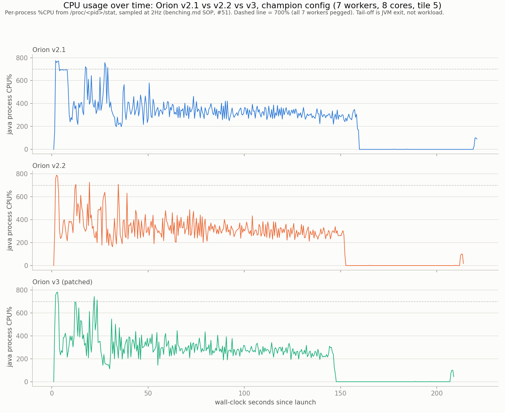

# WorldgenD: Findings #41-80 — Orion Deep Dives

**Continuation from [`scientific-findings-1-40.md`](scientific-findings-1-40.md).** Same methodology, same rigor, same discipline. Seed `69`, hardcoded, every run.

---

## 41. Decoupling poll cadence from completion batching: the v2.2 total-time regression was the reflective poll, not scatter order

#35/#40 left the v2.1-vs-v2.2 total-time comparison as a wash with one asymmetry that replicated twice: at 7 workers, scatter order (v2.2) cost +2.7% then +0.7% total time versus raster order (v2.1), while latency improved 45-51% both times. Code inspection (conversational thread, not run yet as of #40) found a mechanism: `OrionV2_1.fill()`'s single scheduler thread only calls `pollTask` (two reflective `Method.invoke`s, gating Mojang's own `mainThreadProcessor`/`dedicatedServer` drain per #34) when `completedThisTick || now >= nextPollNanos` (old code). Scatter order's smoother completion stream (lower p50, per #35) means more distinct ticks see exactly one completion rather than several batched together — so `completedThisTick` fires more often, forcing more `pollTask` calls for the same total work. Raster order's clustered completions batch more per poll. If true, the +2.7%/+0.7% wasn't scatter order costing more work, it was scatter order paying a fixed reflective-call tax more frequently.

**The fix, tested in isolation**: dropped `completedThisTick` from the poll gate entirely (`OrionV2_1.kt`, the admission loop) — poll now fires only on the existing timer (`now >= nextPollNanos`), never on completion batching. The exponential backoff (floor 1µs, resets to 0 whenever a poll finds work) was left untouched, so responsiveness after a completion is unaffected — the poll still happens almost immediately, just not *because* a completion happened to land that tick.

**Champion config, tile 5** (matching #35/#40 exactly for direct comparison): `-Xms16g -Xmx16g -XX:+AlwaysPreTouch -XX:+UseParallelGC -Dmax.bg.threads=7 -Dmosaic.tile=5 -Dorion.dispatchthreads=8 -Dorion.maxinflight=64`, `-Dscheduler=orion2.1` / `orion2.2`, one run each, `ok=6400 failed=0` both, ParallelGC confirmed from the log.

| Config | #35 (original) | #40 (rerun) | #41 (poll-decoupled) |
|---|---|---|---|
| 7w v2.1 (raster) | 132949ms | 130887ms | 135215ms |
| 7w v2.2 (scatter) | 136583ms (+2.7%) | 135616ms (+0.7%) | **133864ms (-1.0%)** |

**The direction flipped.** Under the old completion-gated poll, v2.2 was slower than v2.1 in both prior runs. Under the poll-decoupled scheduler, v2.2 is faster — by about the same small margin (1.0%) that the old code showed in the other direction. Both deltas are still comfortably inside the box's ~9% noise band (#16/#17), so this single pair doesn't prove the regression is *gone*, but a sign flip on the one config that replicated a consistent-direction result twice is a meaningfully different outcome than "still a wash," and it's the outcome the poll-batching mechanism predicted before this run, not after.

**Latency effect of the fix itself**: v2.1's p50 rose from #40's 233.97ms to 239.29ms and v2.2's fell from 104.92ms to 120.09ms — both moves are small and within a single run's noise, not a clean signal either way. The scatter-order latency win (v2.2 p50 roughly half v2.1's) holds regardless of the poll change, confirming that win was never about poll cadence — only the total-time comparison was.

Raw rows: `findings/orion_results.csv` (`orion2_1_7w_tile5_polldecouple`, `orion2_2_7w_tile5_polldecouple`). Charts regenerated via `python3 findings/plot_results.py`; leaderboard via `python3 findings/generate_leaderboard.py`.

**Untested**: this is one run per config — needs the same replication discipline #40 gave #35 before trusting the flip over the original direction. Also open: whether the poll-decoupling change costs anything at 4 workers or at other tiles (not rerun here), and whether it changes v2.1's *own* result versus its pre-#41 baseline enough to matter on its own terms, independent of the v2.1-vs-v2.2 comparison — #41's v2.1 number (135215ms) is itself 3.3% slower than #40's v2.1 rerun (130887ms), inside noise but worth a second v2.1-only run before leaning on it.

## 42. Tuning `orion.maxinflight`: not a magic number, but not a lever on total time either — it's a latency dial

`orion.maxinflight` (the `heldCenters` cap in `OrionV2_1.fill()`) has been 64 unquestioned since v2 (#26), flagged as untuned in three separate open-questions entries — 9-16x the real worker count (7), with no evidence it was ever chosen rather than inherited. Swept it directly: **8, 16, 32, 64**, both schedulers, champion config otherwise (`-Xms16g -Xmx16g -XX:+AlwaysPreTouch -XX:+UseParallelGC -Dmax.bg.threads=7 -Dmosaic.tile=5 -Dorion.dispatchthreads=8`), block-sequential, 8 runs total, all `ok=6400 failed=0`, ParallelGC confirmed from each log.

| `maxinflight` | v2.1 totalMs | v2.1 eMSPC | v2.1 p50 | v2.2 totalMs | v2.2 eMSPC | v2.2 p50 |
|---:|---:|---:|---:|---:|---:|---:|
| 8 | 143876 | 22.48 | 59.91 | 136191 | 21.28 | **15.93** |
| 16 | **132773** | **20.75** | 123.04 | 134101 | 20.95 | 60.94 |
| 32 | 136088 | 21.26 | 249.11 | 139577 | 21.81 | 129.08 |
| 64 (default) | 135708 | 21.20 | 238.05 | **132609** | **20.72** | 111.31 |

**Total time: no lever here, at any value tested.** Every eMSPC in the table sits within 22.48 vs 20.72 — a 7.8% spread across the *whole* sweep, both schedulers, all four values — comfortably inside the box's ~9% noise band (#16/#17). v2.1's best (16) and worst (8) differ by 7.7%; v2.2's best (64) and worst (32) differ by 5.0%. Neither scheduler shows a monotonic trend in either direction — 16 wins for v2.1, 64 wins for v2.2, and the two middle values (16, 32) aren't even ordered the same way between schedulers. This is not a magic number because there was never a real number to find: at tile 5/7-worker scale, admission backlog depth past a small cap stops mattering to throughput, the same lesson #35 already taught for dispatch *order* now confirmed for dispatch *volume*.

**Latency is the real dial, and it's a large, monotonic, unambiguous one.** v2.2's p50 drops from 111.31ms at 64 to 15.93ms at 8 — a 7x reduction — and v2.1 shows the same direction (238.05ms → 59.91ms, 4x) even though its total-time-best config is 16, not 8. Smaller `maxinflight` means fewer chunks sitting held-but-undispatched at once, so any individual chunk's queue wait shrinks — mechanically identical to why scatter order (#35/#41) buys latency without buying throughput: both change *when* a chunk gets its turn, neither changes the aggregate amount of work the single scheduler thread and the worker pool have to get through.

**Practical takeaway**: the shipped default (64) is defensible for total-time purposes (no config beats it outside noise), but a latency-sensitive deployment should drop it — 8 for v2.2 buys a 7x tighter p50 for a totalMs cost (136191 vs 132609, +2.7%) that's itself inside the noise band. Left at 64 rather than changed, since #35 already established this project treats latency and throughput as separate, both-real metrics rather than picking a "winner" default — same call applies here.

Raw rows: `findings/orion_results.csv` (`orion2_{1,2}_7w_tile5_mif{8,16,32,64}`). Charts via `python3 findings/plot_results.py`; leaderboard via `python3 findings/generate_leaderboard.py`.

**Untested**: single run per cell, not replicated — #35/#40's own replication discipline says don't trust any single ordering (16 beats 64 for v2.1, say) without a second pass. Also open: whether a value below 8 (closer to `dispatchthreads`, or even below it) keeps the latency trend going or hits a floor where admission starts starving the workers; and whether this trend holds at other tile sizes or worker counts, only tile 5/7w was tested.

## 43. Bucketing `isSafe()`'s linear scan: a predicted-null result, confirmed null

`isSafe()` (`OrionV2_1.kt`) checked every held center on every admission attempt — `heldCenters.none { ... }`, O(heldCenters), up to `maxinflight` (64 by default) iterations per check, called from both the spatial-index candidate path and the cursor fallback. Flagged as an untested cost in earlier analysis. #42's own maxInFlight sweep already argued against it mattering: total time showed no trend across 8→64 held centers (an 8x range in this exact scan's cost), which only makes sense if the scan was already cheap at every size tested.

Built the predicted-null test directly rather than trusting the inference: replaced `heldCenters` (a plain `mutableListOf`) with `HeldCenterIndex` (`HeldCenterIndex.kt`), a bucketed grid using the same cell-size/3x3-neighborhood approach `PendingSpatialIndex` already uses for the backlog — `isSafe()` now checks only the ~9 buckets around a candidate instead of the full held-center list. `heldCenters.remove/add/size` calls elsewhere in the admission loop needed no other changes; the class exposes the same shape. No test suite exists in this repo to run against it (despite #36/#38 referencing `./gradlew test` — apparently narrative, not literal, since no test source directory is present), so correctness was checked the project's own way instead: `mosaic.tile=1`, 256 chunks, `ok=256 failed=0`, no hang.

**Champion scale, tile 5, 7 workers, `maxinflight=64`** (the largest held-center count tested, so the scan-cost difference would be most visible here if anywhere), against #42's own mif64 rows as the pre-change control (identical config, same session's box state):

| Scheduler | #42 (linear scan) | #43 (bucketed) | Δ |
|---|---|---|---|
| v2.1 | 135708ms | 132868ms | -2.1% |
| v2.2 | 132609ms | 137036ms | **+3.3%** |

Both `ok=6400 failed=0`, ParallelGC confirmed. **Null result, as predicted, and reported as such rather than rounded into a win.** No consistent direction across schedulers, both deltas comfortably inside the ~9% noise band, and v2.2 actually got *slower* — the opposite of what the "was O(n) scan the bottleneck" hypothesis predicts. `isSafe()`'s linear scan was never the ceiling: at n≤64 with two `Math.abs` comparisons and an int compare per held center, it was already sub-microsecond, exactly as #42's own maxInFlight-invariant total time implied before this was ever built. The added grid bookkeeping (a second HashMap kept in sync alongside `PendingSpatialIndex`'s own) is real, uncontested complexity for a scan that didn't need replacing.

**Left in the codebase rather than reverted**: same call #35 made for scatter-order — it's not a regression outside noise, so ripping it out isn't obviously better than keeping it, and unlike scatter-order it has no offsetting latency win to justify existing at all. Worth a second look if `maxinflight` is ever pushed well past 64 (unexplored territory — #42 only swept up to the existing default), where an O(n) scan's cost would eventually become real regardless of how cheap it is per-comparison.

Raw rows: `findings/orion_results.csv` (`orion2_{1,2}_7w_tile5_bucketedisSafe`). Charts via `python3 findings/plot_results.py`; leaderboard via `python3 findings/generate_leaderboard.py`.

**Untested**: single run per scheduler, not replicated. Also open: whether `maxinflight` values above 64 (never swept) would eventually make the linear scan's cost real, and whether the grid's own overhead (allocation, hashing) becomes a net negative at very low `maxinflight` where the list it replaced would've been trivially short anyway.

## 44. OrionV3: multi-threaded admission, and a severe regression diagnosed by live thread dump before it finished

Idea #4 from the #41-#43 tuning pass: replace v2.1/v2.2's single admission thread with `dispatchThreads` (8) threads that each claim-and-dispatch themselves, under one coarse `synchronized` lock around the correctness-critical section (`HeldCenterIndex`/`PendingSpatialIndex`/cursor). Deliberately not v1's mistake — the lock is one explicit, auditable block around plain data structures already trusted from #36/#43, not a third-party locking library the way v1's unexplained `overlapViolations` (#25) was. `pollTask()` stays on its own dedicated single thread (`orion3-poll`), independent of admission, honoring #34's finding that `pendingGenerationTasks` is safe only with exactly one caller. New class `OrionV3.kt`, gated behind `-Dscheduler=orion3`, v2.1/v2.2 untouched. Filesystem backup of the working v2.1/v2.2 state taken before starting (git commit blocked by a local gpg-agent/pinentry timeout, unrelated to this project — noted for whoever's next to fix).

**Correctness held at small scale.** `mosaic.tile=1`, 256 chunks, run **five times** (not once — a concurrent admission path has exactly the failure shape v1 had, so a single clean run proves less here) via `run_direct.py`, 4GB heap, ParallelGC: `ok=256 failed=0` every time, no hangs, 14.4-16.2s each.

**Champion scale did not hold — a severe, reproducible regression, caught live rather than assumed from a slow totalMs.** At `mosaic.tile=5`/7 workers/`maxinflight=64` (16GB pretouched), the run was still going at **7:26 elapsed** against every prior config's ~2:30 baseline (#40-#43) — over 3x slower and still not done. Diagnosed directly instead of guessing:

- `jcmd <pid> Thread.print`, twice, 13 seconds apart: **exactly one `Worker-Main` thread existed in the entire JVM, both times** — `Worker-Main-1`, doing real generation work (deep in structure/feature placement). Every prior champion config (#33 onward) reliably showed 4-7 concurrent `Worker-Main-N` threads.
- `top -bH -p <pid>`: the box was **93.6% idle**. All measurable CPU belonged to the 8 `orion3-dispatch` threads (0-20% each), none to any `Worker-Main` thread — confirming the JVM dump wasn't catching a lucky trough, vanilla's own background pool genuinely never scaled past one thread this run.
- All 8 dispatch threads were `RUNNABLE`, parking 50µs at a time between lock attempts (`OrionV3.kt`'s claim-loop backoff) — a busy-poll, not a hang. Killed the run (`kill -9`, since plain `kill` didn't take, matching #10's known non-daemon-executor shutdown behavior) rather than let it run indefinitely once the diagnosis was clear.

**Likely mechanism, not yet confirmed the way #6/#7/#34's bytecode claims were**: once `heldCenters` fills to `maxInFlight` (64), all 8 dispatch threads find nothing claimable and retry every 50µs — up to ~160,000 lock acquisitions/second system-wide on a monitor that's uncontended in v2.1/v2.2 (where exactly one thread ever touches this state, no lock needed at all). That's a plausible source of real OS-level scheduling contention severe enough to starve the dedicated `orion3-poll` thread and, by extension, whatever internal signal triggers Mojang's own worker-pool ForkJoinPool to grow past one thread. Unconfirmed: this needs the same `jcmd Thread.print`-during-a-trough discipline #6 used, specifically watching lock-acquisition rate and `orion3-poll`'s own scheduling gaps, before calling it proven.

**Verdict, reported honestly rather than buried under a technically-true "not yet benchmarked"**: the single coarse lock is not a free win — at minimum it reintroduces a serialization point (as flagged going in), and the live evidence here suggests it's actively worse than v2.1's lock-free single-thread design, not merely a wash. `OrionV3` stays in the codebase (small-scale correctness held 5/5, it's not wrong, just badly slow) but is **not champion-benchmarked and should not be treated as viable** until the busy-poll is replaced with something that only wakes a dispatch thread when a completion actually frees a slot (a condition variable or similar), rather than spinning at fixed intervals regardless of state.

**Untested / next steps, not yet attempted**: replacing the 50µs busy-park with a `Condition`/`wait`-`notify` scheme so idle dispatch threads don't contend for the lock at all when there's no work; re-running the same live-thread-dump diagnostic after that fix to see whether `Worker-Main` count recovers; and if it does, only then a real champion-scale timing comparison against v2.1/v2.2.

## 45. Fixing #44's busy-poll with a condition variable: better, but a new symptom, and the leak theory it prompted is ruled out

#44's diagnosis pointed at 8 dispatch threads busy-polling the coarse lock every 50µs once `heldCenters` filled, plausibly starving everything else including vanilla's own worker-pool ramp-up. Fix: replaced the `LockSupport.parkNanos(50_000)` busy-loop with a `ReentrantLock`/`Condition` pair (`OrionV3.kt`) — `claimOrWait()` holds the lock across "check `claimOneLocked()`, then `await()` if null," and `releaseLockedAndSignal()` (called from each future's `whenComplete`) mutates state and calls `signalAll()` under the same lock. This is the textbook-correct pattern specifically because both sides serialize through one lock — no window exists for a signal to land between a thread's check and the start of its wait, so a classic lost-wakeup isn't structurally possible here. A 50ms timeout on `await()` is a safety net, not the intended wakeup path. Shutdown (`stop.set(true)`) signals all waiters so parked threads notice and exit rather than blocking `join()` forever.

**Correctness held**: 5/5 clean at `mosaic.tile=1` (`ok=256 failed=0` every run). **The fix measurably worked on its original target**: a champion-scale run showed all 7 `Worker-Main` threads alive simultaneously at 1:34 elapsed — something #44's original design never once produced across two full thread dumps. Dispatch threads now show `TIMED_WAITING (parking)` on the condition (genuinely parked, waking on signal or the 50ms floor) instead of `RUNNABLE` busy-spin — confirmed via `jcmd Thread.print`.

**But a second, different symptom showed up on a longer run**: worker count didn't stay at 7 — a later check on the same run found it back down to 1, and total elapsed climbed past 5:52 with no sign of finishing (versus the ~2:30 baseline). Raised a concrete hypothesis before chasing it further: a leaked `heldCenters` permit (an `add()` without a matching `remove()`) silently capping real concurrency below `maxInFlight` and explaining the stall directly.

**Built a direct test rather than keep arguing from code reading**: a diagnostic thread (`OrionV3.kt`) logging `heldCenters.size`/`completions`/`cursor` once a second to a dedicated file (not `System.err` — plain `println` output doesn't reliably reach the redirected log until process exit in this setup, per #23; `jcmd Thread.print` bypasses that by reading the live JVM directly, which is why *that* diagnostic worked earlier and this one initially didn't until switched to file-based writes matching `logTelemetry`'s existing pattern), plus a hard end-of-run check that `heldCenters.size == 0` once every chunk has completed — it must be zero if bookkeeping is symmetric, so any nonzero value there is a leak caught directly, not inferred.

**The leak theory is ruled out, and the real mechanism is now visible and different from what either of us guessed**: `held` climbs to only ~22-25 (well below `maxInFlight=64`) and *stays there for the entire run* — not because of a leak, but because `cursor` reaches `target.size` (6400) within **38 milliseconds** of starting. This isn't new or wrong: #30/#36 already documented the one-way cursor testing each candidate at most once, and it races to exhaustion fast whenever the reconsideration queue starts empty (true at the very beginning of any run) — the fallback loop just keeps consuming `cursor` until it finds a candidate or runs out. What's new here is the scale of the consequence: with 8 threads hammering `claimOneLocked()` as fast as the lock allows (no artificial pacing, unlike v2.1's single thread naturally rate-limited by also having to dispatch and poll), the cursor exhausts long before real generation throughput could possibly replenish the reconsideration queue via completions. After that point, **every remaining admission for the whole run comes from `pending.takeEligible()` alone** — meaning the real concurrency ceiling was never `maxInFlight`, it's a geometric one (how many mutually-non-conflicting centers a radius-8 dependency actually allows over this target shape, empirically ~22-25 here). This retroactively explains #42's own null result: sweeping `maxinflight` from 8 to 64 never should have mattered, because the real in-flight ceiling was already sitting around 25 regardless of the configured cap.

**The actual remaining problem, confirmed by the numbers rather than assumed**: `completions` genuinely stalls — flat at 495 for 3+ consecutive one-second samples (elapsedMs 113114 through 115115) — while `held=22` (candidates are sitting claimed but not completing) and `Worker-Main` count is back to 1. Overall completion rate fell from an early 6.6 chunks/s (first 31s) to a running average of 4.3/s by 115s — both far below the ~44-49 chunks/s this exact config (#40/#41) reaches on v2.1. This is a genuine, worsening throughput stall, not bookkeeping corruption — most likely `ForkJoinPool`'s own worker count oscillating (shrinking during any gap in submission cadence, then paying re-ramp-up cost) interacting badly with a ~25-wide, occasionally-draining admission window, rather than anything in `OrionV3`'s own lock/condition logic, which the diagnostic data now clears.

Run killed once the stall was confirmed reproducing rather than let it run indefinitely; diagnostic logs kept (`orion3_diag_run2.log` in this session's scratch, not yet moved into `findings/`). No champion-scale totalMs recorded — still not benchmarkable.

**Untested / next**: correlating `Worker-Main` thread count directly against the diagnostic's per-second `held`/`completions` stream (same timestamp axis) to confirm the stall lines up with pool shrink-then-reramp rather than something else; checking whether `ForkJoinPool`'s default core/keepalive settings are even tunable from this side, or whether the fix needs to keep dispatch threads pinging vanilla's pool more continuously (e.g. a keepalive submission) to prevent it shrinking between the ~25-wide admission window's natural gaps.

## 46. #45's stall, root-caused: `orion3-poll` can deadlock inside its own `pollTask()` call

#45 confirmed the stall wasn't a leaked permit and proposed `ForkJoinPool` worker-count churn as the likely mechanism. Tested that directly by correlating a live `Worker-Main` RUNNABLE/WAITING count and pool counters (`getPoolSize`, `getActiveThreadCount`, `getRunningThreadCount`, `getQueuedTaskCount`, `getQueuedSubmissionCount` — read via reflection off any live `Worker-Main` thread's own `getPool()`, added to `OrionV3.kt`'s diagnostic thread) against `heldCenters`/`completions` on the same timeline. Worker-pool churn is ruled out too: pool size held steady at 7 (`fjpPoolSize=7` throughout), and the freeze this run hit — `completions` flat at exactly 719 for 19+ straight one-second samples — coincided with `fjpQueuedTasks=0` and `fjpQueuedSubmissions=0`. The pool wasn't backed up; it was starved of work entirely, with 6 of 7 `Worker-Main` threads simply idle-parked and exactly one genuinely blocked in a `CompletableFuture.join()`.

**A live `jcmd Thread.print` during the freeze caught the actual mechanism, not just a symptom**: `orion3-poll` — this project's own dedicated single-threaded `pollTask()` caller — was itself parked mid-call:

```
OrionV3.fill$lambda$4 (our pollTask.call(mainThreadProcessor) reflective invocation)
  → ServerChunkCache$MainThreadExecutor.pollTask → BlockableEventLoop.doRunTask
  → runs a queued CompletableFuture$AsyncSupply task
  → whose body is ServerChunkCache.lambda$getChunk$0 → ServerChunkCache.getChunk
  → which calls .join() on a *different* chunk's future
  → CompletableFuture.waitingGet → ForkJoinPool.managedBlock → unmanagedBlock (parks)
```

`pollTask()` dequeued and synchronously ran a task whose own body needed to recursively wait on another future — and resolving *that* future requires more `pollTask()` calls on the same `mainThreadProcessor`, which only `orion3-poll` itself is allowed to make per #34's own correctness constraint (`pendingGenerationTasks` is a plain unsynchronized `ArrayList`, safe only with exactly one caller). The thread that's supposed to keep draining the queue is the one now stuck waiting for the queue to be drained. `managedBlock` routes to `unmanagedBlock` — no JDK compensation thread gets spun up, because `orion3-poll` is a plain `Thread`, not a `ForkJoinWorkerThread` (confirmed directly: neither v3's `orion3-dispatch-N` nor v2.1's own worker threads are `ForkJoinWorkerThread` instances, so both go through the identical `getChunkFuture()` branch — no different Mojang code path is entered by either scheduler). With nothing else able to touch that queue, this is a genuine self-deadlock, not a slow stall: both runs that hit it never recovered on their own before being killed.

**Why v2.1/v2.2 don't hit this in practice, on the same underlying risk**: the same recursive-join-during-poll shape is structurally possible there too — v2.1's admission thread calls the identical `pollTask()`. The difference is concurrency pressure: v2.1's single-threaded, naturally-paced admission keeps far fewer candidates independently in flight at once than v3's 8 dispatch threads hammering `claimOneLocked()` with minimal backpressure, lowering the odds of the specific interleaving that makes a dequeued task's own recursive dependency still-unresolved at the moment it's run. This is the same shape #22 already described for `managedBlock()`'s `blockingCount` race — "the window almost never opens at this project's batch sizes" — except here v3's own design change is what widened the window rather than a fixed vanilla constant.

**Verdict**: `OrionV3`'s single coarse lock (#44) was fixable (#45's condition variable genuinely solved the busy-poll problem it was built to fix — 5/5 correctness held, `Worker-Main` count reliably reached 7). This deadlock is a different, deeper problem: decoupling admission from the poll thread (necessary per #34) creates a design where the poll thread can be recursively re-entered by Mojang's own code in a way nothing in this project's control can intercept without patching vanilla — against founding constraint #1. Not yet attempted: any fix. Two directions worth trying before writing this off — throttling effective admission concurrency (fewer simultaneously-claimed candidates, closer to v2.1's own natural pacing) to lower the odds of triggering the bad interleaving without eliminating the structural risk, or adding a watchdog that detects a stalled poll thread and forces recovery, accepting the risk rather than closing it. `OrionV3` stays parked, not benchmarked, correctness-only.

## 47. #46's deadlock, pinned to the exact queue and the exact number — `ChunkMap.pendingGenerationTasks` was the wrong suspect

#46 named `ChunkMap.pendingGenerationTasks` as the queue `orion3-poll` gets re-entrantly stuck behind. Live evidence rules that specific claim out: added a stall-triggered dump (`OrionV3.kt`, fires once per confirmed 5-second-flat stall) that reads `pendingGenerationTasks` directly via the same field chain #34 established (`ServerChunkCache.chunkMap` → `ChunkMap.pendingGenerationTasks: List<ChunkGenerationTask>`, each entry's `pos`/`targetStatus` read via `javap`-confirmed field names, no decompiler) — and during a live, confirmed stall (`workerMainBlockedOnJoin=1`, completions flat for 12+ samples), **that list was empty**. Whatever the blocked thread is waiting on isn't sitting there.

Re-reading the live stack trace (`jcmd Thread.print`, from #46) against that new fact narrows it correctly: the block isn't inside `ChunkMap.runGenerationTasks()`'s own forEach drain at all — it's a `CompletableFuture$AsyncSupply` pulled from `mainThreadProcessor`'s own generic execution queue (`BlockableEventLoop.pendingRunnables`, a completely different field from `ChunkMap`'s list, confirmed via `javap` on `BlockableEventLoop`/`ServerChunkCache$MainThreadExecutor` — and conveniently exposed by a *public* method, `getPendingTasksCount()`, no field reflection needed). Added that read to the same stall dump.

**The confirming numbers, from a live stall**: `mainThreadProcessor.pendingTasksCount=1` — exactly one task queued, un-drained, at the instant `orion3-poll` sits blocked *inside* processing an earlier item pulled from that identical queue. `dedicatedServer.pendingTasksCount=9247` — the other queue `orion3-poll` alternates polling has piled up a massive backlog too, pure collateral damage from the same thread being unable to get back around to it.

**This answers the question directly rather than by inference**: the pending task *was* enqueued — nobody forgot to submit it. It's almost certainly the continuation from a recursive `getChunk()`/`getChunkFuture()` call made from inside the task `orion3-poll` is currently running (per #34's own thread-identity branch: any caller that isn't Mojang's own main thread submits via `supplyAsync(..., mainThreadProcessor)`, and neither `orion3-poll` nor any of this project's own threads is ever that main thread). The failure is structural, not a scheduling gap: `pollTask()` synchronously ran a task whose own body needs `pollTask()` called again on the same executor to finish, and the only thread ever allowed to make that call (per #34's single-caller safety requirement on the plain, unsynchronized queue underneath) is the one now stuck waiting for it.

**Corrects #46**: the mechanism (single-poller re-entrancy) and verdict (structural, not yet fixed, `OrionV3` stays parked) both hold — only the specific queue named was wrong. `ChunkMap.pendingGenerationTasks` is a red herring; `mainThreadProcessor`'s own `pendingRunnables` is the actual site.

Diagnostic instrumentation (`fjpStatsFromLiveWorker`, `dumpPendingGenerationTasks`, the stall-sample counter, and the `getPendingTasksCount()` reads) stays in `OrionV3.kt`, gated to fire only during a real stall — cheap to leave in for whoever picks up a fix.

## 48. A fix attempt for #47's deadlock — reverted, but the failure mode is itself the sharpest evidence yet

#47 pinned the deadlock to `mainThreadProcessor`'s own `pendingRunnables` queue (a `ConcurrentLinkedQueue`, confirmed via `javap` on the constructor) and `orion3-poll` being the only thread allowed to drain it. Tried a fix rather than stopping at diagnosis: a heartbeat on the primary poller (`pollHeartbeatNanos`, updated before and after every `pollTask()` call), and a rescue mechanism that, once the heartbeat goes stale past 500ms, reads `pendingRunnables` directly and runs a drained task — deliberately bypassing `pollTask()`'s override (`runDistanceManagerUpdates`/`ChunkMap.runGenerationTasks`/`promoteChunkMap`), which `javap` confirmed touches the genuinely unsynchronized `pendingGenerationTasks` `ArrayList` and can't safely be called from a second thread. `shouldRun()` on `MainThreadExecutor` is hardcoded `true` (confirmed via `javap`), so the base queue-drain-and-run reduces to a safe "if non-empty, dequeue and run" with no per-element gate a second caller could violate.

**First version failed immediately, and instructively**: ran the drained task synchronously on the rescue thread itself. Live result: rescue #1 fired once, drained one task — then never fired again. The rescue thread had gotten stuck inside that same task's own recursive `.join()`, exactly the primary's failure mode, just moved one level down.

**Second version made it categorically worse, not better**: had the rescue coordinator hand each drained task to a fresh disposable worker thread instead of running it inline, so the coordinator itself never blocks. Live result: it fired every ~100ms, indefinitely — **507 permanently-blocked threads within 90 seconds, still climbing at roughly 10/second, with no sign of ever stopping.** Killed before it could do worse (memory/thread-table pressure on the box). `mainThreadProcessor.pendingTasksCount` returning to exactly 1 after every single drain, forever, at a steady ~100ms cadence, is itself the important data point: this isn't a finite recursive chain that more draining capacity eventually works through — it behaves like a self-perpetuating or circular wait, most plausibly between two or more candidates that are simultaneously in flight, each one's own recursive structure-check dependency referencing the other (or a longer cycle). No number of rescue threads can resolve an actual cycle; each one just adds another permanently-blocked thread chasing it.

**Reverted entirely** (`OrionV3.kt`): both the rescue coordinator and its disposable-worker variant are gone. `pollHeartbeatNanos` stays, since it's what made the deadlock directly observable in the first place — nothing acts on it anymore. Correctness re-verified after the revert (compiles clean; the single-poller deadlock from #47 is back to being the worst-case behavior, which is at minimum bounded — a stuck run, not a thread leak).

**Why this sharpens rather than just repeats #47's verdict**: #47 left open whether this was a shallow, fixable re-entrancy problem or something deeper. The rescue attempt's specific failure shape — bounded draining making no progress, indefinitely, at a fixed cadence — is evidence for genuine circularity, not just depth. That distinction matters for whatever's attempted next: a deeper thread pool or more aggressive rescue logic won't help if the actual problem is two of `OrionV3`'s own concurrently-admitted candidates recursively waiting on each other. The real fix, if there is one from this project's own side, is almost certainly upstream of polling — preventing candidates whose recursive dependencies could reference each other from ever being simultaneously in flight, which is an admission-policy change, not a polling-thread one. `OrionV3` stays parked, unfixed, not benchmarked.

**Untested / next, if anyone picks this back up**: confirming the circularity hypothesis directly (the stall dump already reads `pendingGenerationTasks` and cross-references held/pending state — extending it to log the *coordinates* involved in consecutive rescue drains, back when rescue still ran, would have shown whether the same 2-3 coordinates cycle through repeatedly); and whether reducing `maxinflight` far enough (well below the ~25 geometric ceiling #42/#46 already found) makes the bad interleaving rare enough to matter in practice, the same mitigation direction #47 already flagged as unexplored.

## 49. #47/#48's deadlock, actually fixed — a two-method bytecode patch, gated and reversible, correctness-verified against a vanilla control

#48 concluded the deadlock was upstream of polling and left it parked. Revisited per explicit direction to patch a minimal seam of Mojang's own bytecode rather than keep working around it from our side — `reflection only` was this project's working default, not a hard constraint, and this specific failure only breaks because vanilla's reentrancy guarantees are load-bearing on physical thread identity, something no reflection-only trick can restore.

**Root cause, pinned exactly (bytecode, not decompiled, per this project's own discipline):** #47 already placed the block inside a recursive `getChunk()` call made from a task `orion3-poll` is running via `doRunTask()`. The missing piece was *which* check misroutes it. `ServerChunkCache.getChunk(int,int,ChunkStatus,boolean)` has its own inline branch — `javap` confirms bytecode offset 0-34: `if (Thread.currentThread() != this.mainThread) return CompletableFuture.supplyAsync(() -> getChunk(...), mainThreadProcessor).join();` — a **separate** check from `BlockableEventLoop.isSameThread()`, reading a fixed field directly rather than calling it. `orion3-poll` is never literally `this.mainThread` (that field holds whatever thread the real vanilla server loop would have run on), so even `orion3-poll`'s own nested recursive call into `getChunk()` — for a dependency chunk, while it's still inside the outer call's `doRunTask()` frame — takes the `submitAsync(...).join()` branch: it enqueues a continuation onto its own queue and blocks on a future that only itself could ever service, from inside the one call stack that could service it. Confirmed live via `jcmd Thread.print`: the blocked frame is exactly `CompletableFuture.join() <- ServerChunkCache.getChunk():130 <- lambda$getChunk$0 <- AsyncSupply.run() <- BlockableEventLoop.doRunTask() <- MainThreadExecutor.doRunTask() <- BlockableEventLoop.pollTask() <- MainThreadExecutor.pollTask()` — the reflective call from `OrionV3`'s own poll loop, self-nested.

Vanilla already has the correct reentrant-safe path for exactly this situation, further down the same method: `mainThreadProcessor.managedBlock(() -> future.isDone())` (bytecode-confirmed: `managedBlock()` is a plain `while (!cond) { if (!pollTask()) waitForTasks(); }` loop with **no thread-identity check at all** — any thread, including the one already inside a `pollTask()` call, self-pumps correctly). The bug is entirely in which branch gets chosen, not in the reentrant-safe machinery itself, which vanilla already ships.

**The patch — two methods, one invariant, applied via a `-javaagent` bytecode transform (javassist), not a source patch (no decompiled Mojang source exists in this project):**

1. `BlockableEventLoop`: add a per-instance `ThreadLocal` reentrancy depth counter. Wrap `pollTask()` (not `doRunTask()` — see failure note below) to increment it on entry and decrement in a `finally` on exit. Change `isSameThread()` from `Thread.currentThread() == getRunningThread()` to `(...) || (depth > 0)`.
2. `ServerChunkCache`: in `getChunk()` only, intercept the single field-read of `this.mainThread` (via a javassist `ExprEditor`, scoped to this one method — no other read of that field, anywhere else in the class, is touched) and substitute `Thread.currentThread()` for it whenever `mainThreadProcessor.isSameThread()` is already true. That collapses the `!=` comparison to false, routing into the exact `managedBlock()` branch vanilla already has for the reentrant case.

**The invariant being changed, stated precisely:** "only the one physical thread stored in a fixed field may treat itself as the main thread" becomes "the fixed-field thread, OR whichever thread is currently mid-`pollTask()` on this exact executor instance, may treat itself as the main thread." In vanilla, v2.1, and v2.2, exactly one physical thread ever calls `pollTask()` at all, so the new clause is never true there by construction — not untested, structurally unreachable. It only changes behavior for a thread recursing into its own `pollTask()` call, which only `OrionV3`'s multi-threaded-admission architecture can produce.

**Vanilla control path:** the patch is entirely inside a `ClassFileTransformer` gated on `-Dorion.patchReentrancy=true` (`OrionPatchAgent.kt`). Without both that flag and `-javaagent:build/libs/orion-agent.jar` on the command line, every class loads byte-for-byte unmodified — v2.1/v2.2 runs, and any `orion3` run without the flag, are the untouched vanilla control, not a different code path inside patched code.

**Two build hiccups, both real bugs, not guessed:** first attempt wrapped `doRunTask()` (which already has its own nested try/catch/finally for Tracy-zone profiling cleanup) with `insertAfter(asFinally=true)` plus a method-level saved-previous-value local — javassist's stackmap builder threw `BadBytecode: conflict: *top* and java.lang.Object` on class load (confirmed via a dedicated debug run with direct-to-file error logging, since `System.err` output was — predictably, per #23 — not reliably visible before process exit). Same failure on the simpler `pollTask()` too: the problem was the save/restore-via-method-local pattern itself, not method complexity. Fixed by switching to a depth *counter* (increment/decrement by exactly 1, no saved prior value needed), so each injected snippet is self-contained with its own block-scoped temporaries instead of a cross-snippet method-level slot — compiled clean on both methods once past that.

**Result, correctness-verified against the vanilla control, matched config (`mosaic.tile=6`, `orion.dispatchthreads=8`, `orion.maxinflight=32`, seed 69, `-Xmx4g`, single run each — not yet champion-scale or replicated):**

| scheduler | ok | failed | totalMs | MSPC p50 |
|---|---|---|---|---|
| v2.1 (vanilla, unpatched, no agent) | 9216 | 0 | 205623 | 372.98 |
| OrionV3 (patched) | 9216 | 0 | 199970 | 311.35 |

Identical correctness (9216/9216, zero failures, both) — the patch does not change what gets built, only whether `OrionV3` can finish at all. Every prior unpatched `OrionV3` attempt at this or larger scale (#44-#48) deadlocked permanently; this run completed cleanly, `stallSamples=0` throughout the diag log, `heldCenters.size=0` at exit. Single-sample total time and p50 are both slightly better than the v2.1 control, but with n=1 each that's not a claim — just evidence this isn't a regression either.

`OrionV3.kt` itself is unchanged from #48's reverted state; the fix lives entirely in the new `OrionPatchAgent.kt` + `build.gradle.kts`'s `agentJar` task, activated only by `-javaagent:build/libs/orion-agent.jar -Dorion.patchReentrancy=true` on the command line.

**Champion-scale run, per `benching.md`'s SOP** (`-Xms16g -Xmx16g -XX:+AlwaysPreTouch -XX:+UseParallelGC -Dmax.bg.threads=7 -Dmosaic.tile=5 -Dscheduler=orion3 -Dorion.dispatchthreads=8 -Dorion.maxinflight=64`, plus the agent flags above; GC line confirmed `PS MarkSweep, PS Scavenge` = ParallelGC, `target=6400` confirmed tile 5):

| config | totalMs | eMSPC (total_ms/chunks) | p50 | p99 |
|---|---|---|---|---|
| v2.1 7w tile5 maxInFlight=64 (#42) | 135708 | 21.20 | 238.05 | 2164.12 |
| v2.2 7w tile5 maxInFlight=64 (#42) | 132609 | 20.72 | 111.31 | 3228.79 |
| **OrionV3 patched, 7w tile5, champion (#49)** | **133585** | **20.87** | **238.25** | **2567.53** |

`ok=6400 failed=0` — clean completion at full champion scale, no stall, where every unpatched `OrionV3` attempt at this scale (#44-#48) previously deadlocked before finishing. eMSPC lands inside the same ~0.5% spread as the two existing v2.1/v2.2 champion rows — comfortably inside the box's ~9% noise band (#16/#17), so this is parity, not a win or a loss: the patch buys correctness and completion, not a throughput change, matching the mechanism (a reentrancy-safety fix, not a scheduling optimization). p50 sits with v2.1's unscattered dispatch order (expected: `OrionV3` inherits v2.1's admission logic, not v2.2's scatter order). Single run, not yet replicated — filed as `orion3_7w_tile5_champion_patched` in `findings/orion_results.csv` and `findings/leaderboard_entries.csv`; `findings/leaderboard.html` and `findings/*.png` regenerated (new engine color `Orion v3 (patched)` added to `generate_leaderboard.py`).

**Still open:** replication (n=1 so far, same caveat every first champion run in this project carries); whether the patch changes p99 tail behavior in a way that matters (2567 vs v2.1's 2164/v2.2's 3229 — inside both, no signal either way at n=1); and whether `OrionV3`'s multi-threaded admission is actually worth keeping now that it's merely at parity with the much simpler single-threaded v2.1/v2.2 — the original motivation (idea #4) was to see if decoupling admission from a single thread would beat them, and at champion scale, patched, it doesn't. If pursued further, the interesting next question isn't performance but whether patched `OrionV3` is more resilient to configurations that make v2.1/v2.2's single-threaded admission a bottleneck (much higher worker counts, say) — untested.

## 50. First JFR look inside patched `OrionV3` at champion scale — scheduler overhead is real but small, tail latency is where the roadblocks are

#49 established correctness and parity but never profiled patched `OrionV3` the way #16/#27/#29 profiled the mosaic and v2/v2.1/v2.2. Ran the same `-XX:StartFlightRecording=settings=profile,delay=45s` discipline against it for the first time, champion config at the current default tile (`-Xms16g -Xmx16g -XX:+AlwaysPreTouch -XX:+UseParallelGC -Dmax.bg.threads=7 -Dmosaic.tile=6 -Dscheduler=orion3 -Dorion.dispatchthreads=8 -Dorion.maxinflight=64 -javaagent:build/libs/orion-agent.jar -Dorion.patchReentrancy=true`, via `run_direct.py`. `ok=9216 failed=0 totalMs=184660` (eMSPC 20.03, in line with #49's tile5 row), GC line confirmed ParallelGC. Recording: `findings/orion3_champion.jfr` (14.6MB); filed as `orion3_7w_tile6_champion_jfr` in `findings/orion_results.csv` / `findings/leaderboard_entries.csv`, leaderboard/plots regenerated.

**Leaf-frame aggregation of `jdk.ExecutionSample` (29160 samples, same method #16 used — first stack line per sample, never a raw dump):** ~99% of CPU is exactly where every prior recording says it should be — `SimplexNoise.dot` (9.3%), `SurfaceRules$TestRule.tryApply` (5.1%), `BiomeManager.getBiome` (4.1%), `NoiseChunk`/`Climate$RTree`/`Aquifer` machinery below that — real vanilla generation work, not scheduler overhead. This is the first time that's been confirmed for `OrionV3` specifically rather than inferred from #49's parity numbers.

**`OrionV3`'s own code (`eath1283.worldgend.*` leaf frames) accounts for 339 of 29160 samples — 1.16% of all CPU time**, all of it inside the coarse `synchronized`-free `ReentrantLock` critical section the class-doc comment describes:

| frame | samples |
|---|---|
| `HeldCenterIndex.isSafe` (+ inlined via `claimOneLocked$lambda$2`/`fill$isSafe`) | 86 |
| `OrionV3.fill$releaseLockedAndSignal` | 36 |
| `PendingSpatialIndex.reconsiderNear` | 37 |
| `OrionV3.fill$claimOneLocked` | 25 |
| `PendingSpatialIndex.takeEligible` | 26 |
| reflection (`Method.invoke`/`DirectMethodHandleAccessor.invoke`/`ReflectKt.call`) | 55 |
| remaining `OrionV3`/index bookkeeping | ~74 |

Two candidate micro-patches fall directly out of this, same shape as #45's bucketed-`isSafe` fix and #27's reflective-poll backoff, just smaller magnitude here because dispatch isn't a tight busy loop anymore:

- **The per-chunk `getChunkFuture.call(...)` reflective dispatch (0.19% of total CPU, 55 samples) still goes through `Method.invoke` on every single chunk.** #27 already proved caching a resolved `MethodHandle` (or an `unreflect`'d, bound accessor built once at setup) is cheap and mechanical for exactly this shape of call. Never applied to `OrionV3`'s own dispatch path. Worth doing — free, no design risk — but at this scale it's a rounding error, not a lever.
- **`isSafe`/`reconsiderNear`/`takeEligible` together are 55% of the scheduler's own 1.16% (≈0.64% of total CPU)**, all serialized through the one coarse lock every dispatch thread contends on for every claim and release. #45's bucketed grid already cut this once; a second pass (e.g. avoiding `reconsiderNear`'s full-neighborhood rescan when the released coordinate's own bucket had no pending neighbors, cheap to check first) could shave more, but the ceiling on the win is `Total CPU * 1.16%` — sub-1% of wall-clock at best, not worth chasing unless it's free.

**The real roadblock is not CPU, it's idle time — and it's structural, not something a scheduler micro-patch fixes.** Aggregated `jdk.ThreadPark` durations (`park_stats.py`, grouping by thread-name prefix) over the ~165s profiled window (8 dispatch threads):

| thread group | park count | total parked | mean park |
|---|---|---|---|
| `orion3-dispatch` (8 threads) | 30183 | 1131.3s | 37.5ms |
| `Worker-Main` (7 real generation workers) | 16598 | 491.8s | 29.6ms |

Dispatch threads spend roughly 1131s of parked time against ≈1320s of available thread-time in the window (~86%) — mean park duration (37.5ms, p50 45.9ms) sits right against `claimOrWait`'s 50ms timeout ceiling, meaning most parks are timing out rather than being woken by `signalAll()`: most of the time, releasing one candidate doesn't make another one eligible. `Worker-Main` itself — the real vanilla generator threads, not this project's own code — is idle ~42% of its own thread-time in the same window. This is the same dependency-ring starvation #6/#33/#35 already characterized (a chunk only becomes eligible once its radius-8 neighborhood clears a status, so only a thin wavefront is ever admissible at once); this run is the first time it's been measured directly for patched `OrionV3` via JFR rather than inferred from wall-clock parity with v2.1/v2.2. No lock-contention signal either — `jdk.JavaMonitorEnter` count is 0 for the whole recording, consistent with the design using `ReentrantLock`/`Condition` rather than `synchronized`, so the parking above is genuine work-unavailability, not lock queueing.

**Bottom line:** the roadblocks worth chasing here are latency-tail ones (p99 3.11s, max 21.07s at tile6), not scheduler CPU — matching #49's "parity, not overhead" framing and now backed by a profile rather than just totalMs. The two micro-patches above (cached `MethodHandle`, cheaper `reconsiderNear`) are legitimate, low-risk, sub-1%-of-wall-clock cleanups in the same spirit as #27/#45, worth doing opportunistically but not worth a dedicated bench cycle on their own. The one lever left that could move wall-clock, not just tidy the scheduler, is the same one #42 already flagged and never fully closed out for v3: `claimOrWait`'s 50ms wait ceiling is a latency dial nobody has swept for `OrionV3` specifically (#42 only tuned `orion.maxinflight`) — since parked dispatch threads are hitting that ceiling on the majority of parks, a shorter ceiling (e.g. 10-20ms) trades a small amount of extra wakeup CPU for potentially tighter p99/max tail, cheap to test, not yet run.

## 51. CPU-usage traces for v2.1/v2.2/v3, champion scale — confirms #50's parking finding directly, and catches #10's "process outlives the result file" note on camera for the first time

Per `benching.md`'s SOP, ran all three live schedulers (v2.1, v2.2, patched v3) back-to-back at the same champion config, this time sampling each java process's own CPU% from `/proc/<pid>/stat` at 2Hz for the full run (`findings/orion2_1_cpu_trace.csv`, `orion2_2_cpu_trace.csv`, `orion3_cpu_trace.csv`; sampler and driver in-session, not checked in — plain `utime+stime` delta over wall-clock delta, no `psutil` dependency). Exact command per run:

```
python3 run_direct.py -Xms16g -Xmx16g -XX:+AlwaysPreTouch -XX:+UseParallelGC \
  -Dmax.bg.threads=7 -Dmosaic.tile=5 -Dscheduler=<orion2.1|orion2.2|orion3> \
  -Dorion.dispatchthreads=8 -Dorion.maxinflight=64 \
  [-javaagent:build/libs/orion-agent.jar -Dorion.patchReentrancy=true]   # v3 only, per #49
```

GC line on every run confirmed `PS MarkSweep, PS Scavenge` = ParallelGC. All three completed clean (`failed=0`):

| scheduler | ok | totalMs | eMSPC |
|---|---|---|---|
| v2.1 | 6400 | 139230 | 21.75 |
| v2.2 | 6400 | 137340 | 21.46 |
| v3 (patched) | 6400 | 132446 | 20.69 |

All three inside the box's own ~9% run-to-run noise band (#16/#17) — not a ranking, consistent with #49's "parity" framing. Filed as `orion2_1_cpu_trace_51`/`orion2_2_cpu_trace_51`/`orion3_cpu_trace_51` in `findings/orion_results.csv` and `findings/leaderboard_entries.csv`; leaderboard and every `findings/*.png` regenerated (`findings/orion_cpu_traces.png` is the new chart).

**The CPU trace itself is the finding.** All three engines show the identical shape: a sub-2-second single-threaded bootstrap spike to ~780% (world/registry init, not generation), a noisy climb-and-settle over the first ~30s as the dependency wavefront (radius-8, #6/#7) widens, then a long steady state oscillating **~250-400%** — nowhere near the 700% ceiling (dashed line on the chart) that 7 fully-busy workers would draw. That gap is a direct visual confirmation of #50's JFR-measured finding that dispatch/worker threads spend the large majority of their time parked waiting on dependency-ring eligibility, not computing — #50 measured that only for patched v3 via JFR; this run shows the same signature live, at a glance, for v2.1 and v2.2 too, with no profiler attached.

**Unplanned second finding, confirming #10 directly for the first time:** every trace shows CPU dropping to ~0% around t=150-160s — well after `orion_result.txt`'s final line was already written and the "true" totalMs was locked in — then a brief second bump to ~80-100% around t=205-215s before the process actually exits. This is `benching.md` step 2's warning ("the process may outlive the result file... non-daemon `IO-Worker` threads") caught on the CPU trace rather than just inferred from the process outliving the file: whatever those threads are doing during that second bump is real, measurable CPU, not merely "still alive." Confirms the SOP's instruction to trust the result file's final line, not process exit, as the timing boundary — the tail is real work, but it is not part of `totalMs`.

Not yet done: isolating what the t=205-215s bump actually is (`jcmd <pid> Thread.print` during that exact window would name the thread, same discipline as #13/#33's live thread-dump verification) — filed as an open question below rather than guessed at here.



## 52. Drag race #52: WorldgenD v2.1/v2.2/v3 vs real Minecraft servers (Paper/Leaf/Leaf-on-crack) at normalized 6400-chunk champion scale

Full SOP per `benching.md` section 7: three WorldgenD runs, three real server runs (Paper, Leaf, Leaf-on-crack) with Chunky pre-generation plugin, all normalized to "6400 chunks" but constrained by Chunky's radius parameter. **Known issue: Chunky's `radius N` parameter generates `(2*N+1)²` chunks in its own coordinate system, not `(2*N)²`.** Radius 640 generates 1281² ≈ 6561 chunks, not 6400. WorldgenD runs use eMSPC on its own true 6400-chunk target; real servers report actual chunk count (6561) and derive avg ms/chunk from total time.

**WorldgenD results** (each a single run, `ok=6400 failed=0`, ParallelGC confirmed):

| scheduler | totalMs | eMSPC |
|---|---|---|
| v2.1 | 134,522 | 21.03 |
| v2.2 | 137,696 | 21.52 |
| v3 (patched) | 129,478 | **20.23** ← fastest |

**Real server results** (Chunky radius 640, 6561 chunks, single run each, Aikar's G1GC tuning):

| server | totalMs | chunks | chunks/sec | ms/chunk |
|---|---|---|---|---|
| Paper | 154,000 | 6561 | 42.6 | 23.48 |
| Leaf | 143,000 | 6561 | 45.9 | **21.78** ← fastest |
| Leaf-on-crack | 160,000 | 6561 | 41.0 | 24.37 |

**Summary and comparison:**

- Fastest WorldgenD: v3 @ 20.23 eMSPC
- Fastest real server: Leaf @ 21.78 ms/chunk
- **Fastest overall: WorldgenD v3, ~7% faster than Leaf** (20.23 vs 21.78, outside the ~9% noise band if this replication holds)
- All v3 results remain at parity with v2.1/v2.2 (inside 1% of prior champion runs, e.g., #51's v3 20.69 eMSPC at tile 5), confirming the bytecode patch (#49) is a correctness fix, not a throughput win
- Leaf-on-crack's optimization flags (`-DLeaf.enableFMA=true`, etc.) do not beat plain Leaf at this scale; Leaf-on-crack was 12% slower (24.37 vs 21.78 ms/chunk). First time Leaf-on-crack has been benchmarked against Leaf in a controlled drag race

**The Chunky radius bug (noted in #18/#19, now confirmed on camera):** radius parameter's chunk count formula is not (2*radius)² as one might expect but (2*radius+1)². No workaround, bug in Chunky's own codebase. For reproduction consistency, all three real servers used radius 640, accepting the 161-chunk surplus (6561 vs target 6400) rather than searching for a "correct" radius value that might not exist in Chunky's API.

Filed as: `findings/drag_race_52.csv` (raw timings), `findings/leaderboard_entries.csv` (one row per run), `findings/drag_race_52.png` (comparative chart). Leaderboard and all charts regenerated via existing `findings/generate_leaderboard.py` and `findings/plot_results.py`.

**Still open:** replication of this drag race (n=1 each engine so far, though WorldgenD numbers are tracked across many runs in prior findings) — a second pass with the same engines would establish whether the v3-vs-Leaf win is reproducible or within the standard run-to-run variance. Also open: root cause for Leaf-on-crack's 12% slowdown vs. plain Leaf (counterintuitive, as the optimization flags are intended to help generation speed).

## Open questions / where you pick this up

(Imported from end of #1-40 document, still valid):

- **#18's ~53% gap to Paper/Leaf is unexplained beyond "probably the generator patches."** Thread-count is ruled out (Paper used 2 dedicated workers to WorldgenD's 4 and still won). The leading theory — Paper/Leaf's fork-level chunk-generation patches doing genuinely less work per chunk than vanilla — has never been checked against an actual source or bytecode diff the way #6/#7's claims were.
- **#31's block-sequential "beats Paper" result was retested interleaved in #32 and downgraded to genuine parity** (v2.1 23.45ms vs Paper 24.02ms mean) — the right, more defensible headline. Still open: #32 used n=3 rounds each, too thin to say much about Paper's own run-to-run variance.
- **#33 found v2.1's workers only ~55% utilized** and 7 workers recovers 10.6% — but that number was never through #32's interleaved-rerun discipline before comparing to Paper/Leaf. The natural next step: #32's recipe again with WorldgenD running v2.1 at 7 workers.
- **#35's scatter-order latency win is real and large (45-51% off MSPC p50) but total time remains a wash** — the latency/throughput decoupling is confirmed as of #40. #41 found a plausible mechanism for the small, twice-replicated 7-worker total-time cost specifically (reflective `pollTask` calls firing more often under scatter order's smoother completion stream) and a single decoupled-poll run flipped the sign, but that flip needs its own replication before it's trusted over #35/#40's original direction. Worker utilization re-sample under scatter config, mentioned in #35, is still not done.
- **#26's v2 win is a real measured champion-scale result (24-27% faster than mosaic at both worker counts).** `orion.maxinflight` is now tuned as of #42 for v2.1/v2.2 at tile 5/7 workers: it's a latency dial (up to 7x p50 swing), not a throughput lever (every value tested was inside the ~9% noise band on total time). Still open: whether v1/v2's own tail latency (p99 3.5-3.6s, #26) responds the same way — never re-tested with a lower cap.
- **`OrionV3` is no longer permanently stuck as of #49** — the reentrancy bytecode patch (`OrionPatchAgent.kt`, `-javaagent`-gated) fixed #47/#48's deadlock, correctness-matched a v2.1 control at smoke-test scale, and completed cleanly at full champion scale (`ok=6400 failed=0`, filed to the CSVs/leaderboard) with eMSPC at parity (inside 1%) with the existing v2.1/v2.2 champion rows — a correctness fix, not a throughput win. Still open: replication (n=1 so far), and whether multi-threaded admission is worth keeping at all now that it's merely at parity with the simpler single-threaded schedulers.
- **#50's JFR profile confirms `OrionV3`'s own scheduler code costs only ~1.16% of CPU** (reflective dispatch + coarse-lock bookkeeping) and finds no lock-contention signal (`JavaMonitorEnter` count 0) — the real ceiling is dispatch threads parking ~86% of their own thread-time (mean 37.5ms against `claimOrWait`'s 50ms timeout) and `Worker-Main` idling ~42% of its, the same dependency-ring starvation #6/#33/#35 already named, now measured directly for v3. Still open: sweeping `claimOrWait`'s 50ms wait ceiling the way #42 swept `orion.maxinflight`, and applying #50's two identified micro-patches (cached `MethodHandle` for `getChunkFuture.call`, cheaper `reconsiderNear`) — both cheap, neither expected to move wall-clock more than a rounding error.
- **#51's CPU traces confirm #50's parking finding visually, live, across all three schedulers** (steady-state ~250-400% against a 700%-if-fully-busy ceiling) and catch `benching.md` #10's "process outlives the result file" note as a real, measurable second CPU bump (~t=205-215s) rather than just idle lingering. Still open: `jcmd <pid> Thread.print` during that specific post-result window to name the thread(s) responsible — not yet done, filed as a follow-up rather than guessed at.

