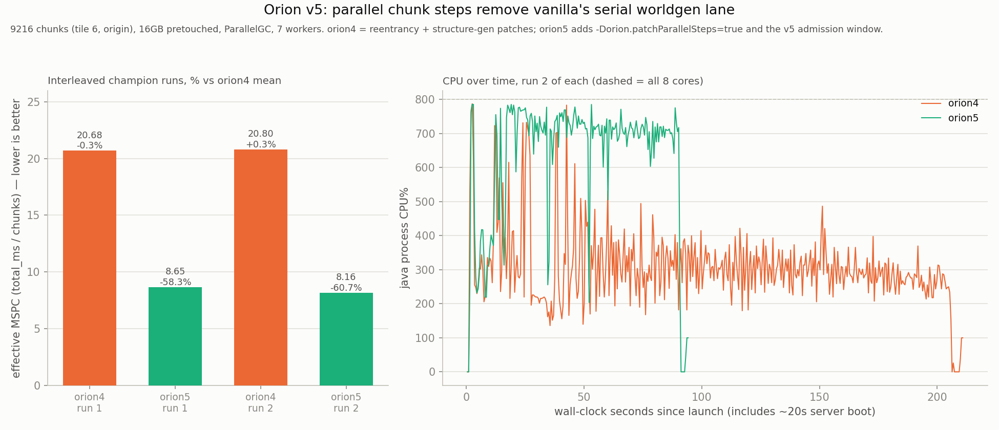
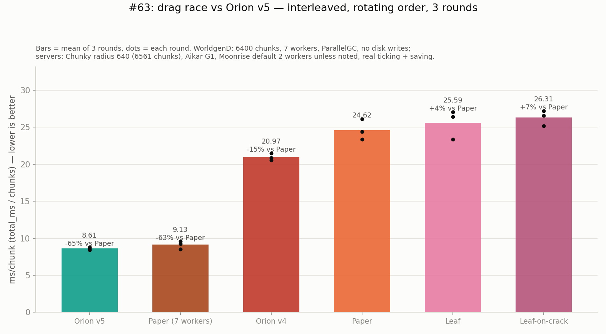
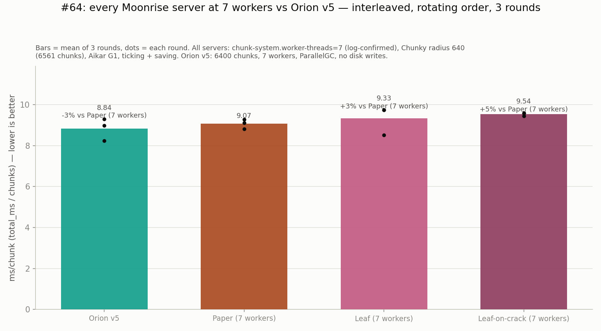
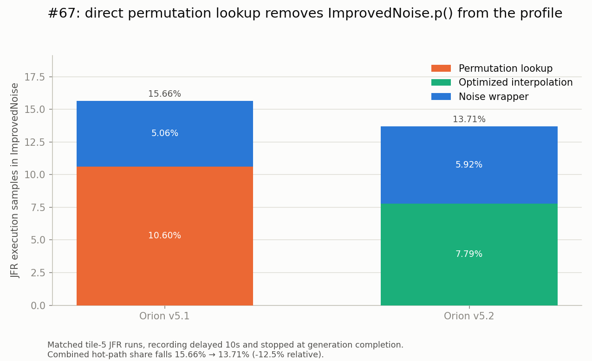
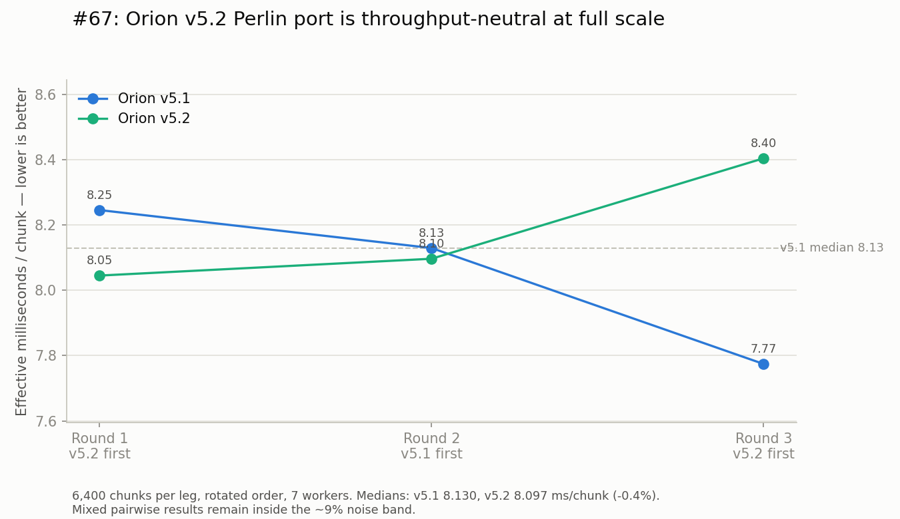
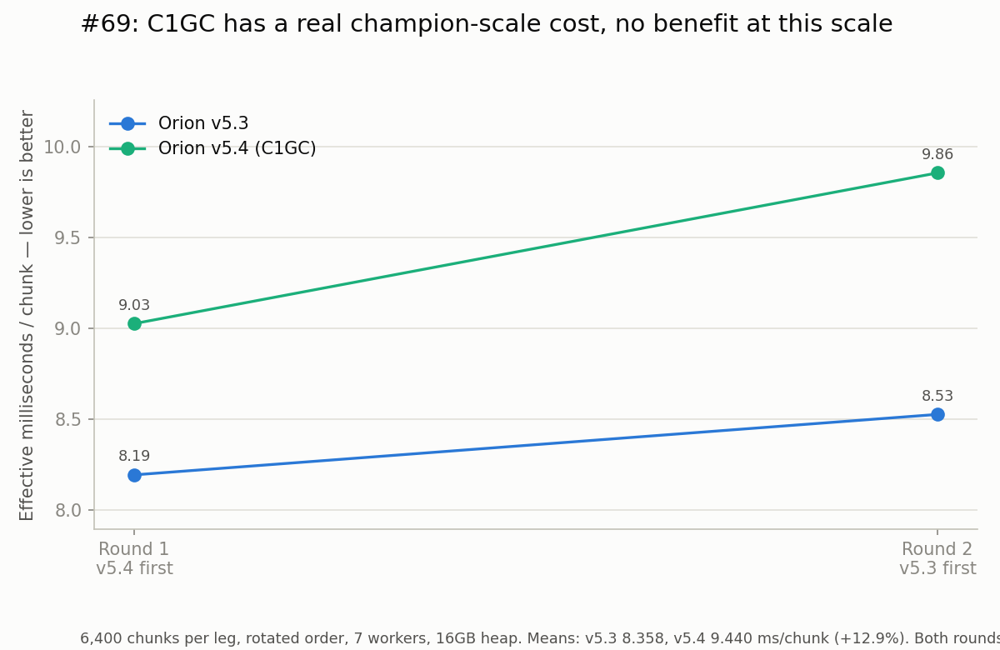
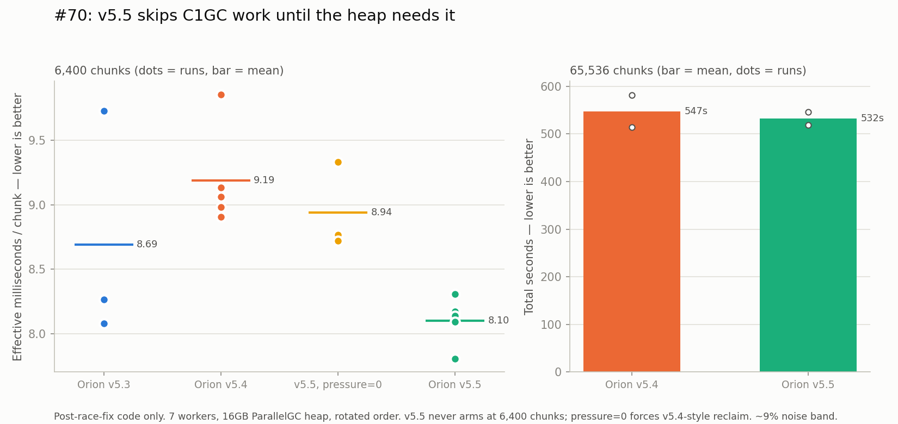

# WorldgenD: Findings #41-80 — Orion Deep Dives

**Continuation from [`scientific-findings-1-40.md`](scientific-findings-1-40.md).** Same methodology, same rigor, same discipline. Seed `69`, hardcoded, every run.

---

## 41. Decoupling poll cadence from completion batching: the v2.2 total-time regression was the reflective poll, not scatter order

#35/#40 left the v2.1-vs-v2.2 total-time comparison as a wash with one asymmetry that replicated twice: at 7 workers, scatter order (v2.2) cost +2.7% then +0.7% total time versus raster order (v2.1), while latency improved 45-51% both times. Code inspection (conversational thread, not run yet as of #40) found a mechanism: `OrionV2_1.fill()`'s single scheduler thread only calls `pollTask` (two reflective `Method.invoke`s, gating Mojang's own `mainThreadProcessor`/`dedicatedServer` drain per #34) when `completedThisTick || now >= nextPollNanos` (old code). Scatter order's smoother completion stream (lower p50, per #35) means more distinct ticks see exactly one completion rather than several batched together — so `completedThisTick` fires more often, forcing more `pollTask` calls for the same total work. Raster order's clustered completions batch more per poll. If true, the +2.7%/+0.7% wasn't scatter order costing more work, it was scatter order paying a fixed reflective-call tax more frequently.

**The fix, tested in isolation**: dropped `completedThisTick` from the poll gate entirely (`OrionV2_1.kt`, the admission loop) — poll now fires only on the existing timer (`now >= nextPollNanos`), never on completion batching. The exponential backoff (floor 1µs, resets to 0 whenever a poll finds work) was left untouched, so responsiveness after a completion is unaffected — the poll still happens almost immediately, just not *because* a completion happened to land that tick.

**Champion config, tile 5** (matching #35/#40 exactly for direct comparison): `-Xms16g -Xmx16g -XX:+AlwaysPreTouch -XX:+UseParallelGC -Dmax.bg.threads=7 -Dmosaic.tile=5 -Dorion.dispatchthreads=8 -Dorion.maxinflight=64`, `-Dscheduler=orion2.1` / `orion2.2`, one run each, `ok=6400 failed=0` both, ParallelGC confirmed from the log.

| Config | #35 (original) | #40 (rerun) | #41 (poll-decoupled) |
|---|---|---|---|
| 7w v2.1 (raster) | 132949ms | 130887ms | 135215ms |
| 7w v2.2 (scatter) | 136583ms (+2.7%) | 135616ms (+0.7%) | **133864ms (-1.0%)** |

**The direction flipped.** Under the old completion-gated poll, v2.2 was slower than v2.1 in both prior runs. Under the poll-decoupled scheduler, v2.2 is faster — by about the same small margin (1.0%) that the old code showed in the other direction. Both deltas are still comfortably inside the box's ~9% noise band (#16/#17), so this single pair doesn't prove the regression is *gone*, but a sign flip on the one config that replicated a consistent-direction result twice is a meaningfully different outcome than "still a wash," and it's the outcome the poll-batching mechanism predicted before this run, not after.

**Latency effect of the fix itself**: v2.1's p50 rose from #40's 233.97ms to 239.29ms and v2.2's fell from 104.92ms to 120.09ms — both moves are small and within a single run's noise, not a clean signal either way. The scatter-order latency win (v2.2 p50 roughly half v2.1's) holds regardless of the poll change, confirming that win was never about poll cadence — only the total-time comparison was.

Raw rows: `findings/orion_results.csv` (`orion2_1_7w_tile5_polldecouple`, `orion2_2_7w_tile5_polldecouple`). Charts regenerated via `python3 findings/plot_results.py`; leaderboard via `python3 findings/generate_leaderboard.py`.

**Untested**: this is one run per config — needs the same replication discipline #40 gave #35 before trusting the flip over the original direction. Also open: whether the poll-decoupling change costs anything at 4 workers or at other tiles (not rerun here), and whether it changes v2.1's *own* result versus its pre-#41 baseline enough to matter on its own terms, independent of the v2.1-vs-v2.2 comparison — #41's v2.1 number (135215ms) is itself 3.3% slower than #40's v2.1 rerun (130887ms), inside noise but worth a second v2.1-only run before leaning on it.

## 42. Tuning `orion.maxinflight`: not a magic number, but not a lever on total time either — it's a latency dial

`orion.maxinflight` (the `heldCenters` cap in `OrionV2_1.fill()`) has been 64 unquestioned since v2 (#26), flagged as untuned in three separate open-questions entries — 9-16x the real worker count (7), with no evidence it was ever chosen rather than inherited. Swept it directly: **8, 16, 32, 64**, both schedulers, champion config otherwise (`-Xms16g -Xmx16g -XX:+AlwaysPreTouch -XX:+UseParallelGC -Dmax.bg.threads=7 -Dmosaic.tile=5 -Dorion.dispatchthreads=8`), block-sequential, 8 runs total, all `ok=6400 failed=0`, ParallelGC confirmed from each log.

| `maxinflight` | v2.1 totalMs | v2.1 eMSPC | v2.1 p50 | v2.2 totalMs | v2.2 eMSPC | v2.2 p50 |
|---:|---:|---:|---:|---:|---:|---:|
| 8 | 143876 | 22.48 | 59.91 | 136191 | 21.28 | **15.93** |
| 16 | **132773** | **20.75** | 123.04 | 134101 | 20.95 | 60.94 |
| 32 | 136088 | 21.26 | 249.11 | 139577 | 21.81 | 129.08 |
| 64 (default) | 135708 | 21.20 | 238.05 | **132609** | **20.72** | 111.31 |

**Total time: no lever here, at any value tested.** Every eMSPC in the table sits within 22.48 vs 20.72 — a 7.8% spread across the *whole* sweep, both schedulers, all four values — comfortably inside the box's ~9% noise band (#16/#17). v2.1's best (16) and worst (8) differ by 7.7%; v2.2's best (64) and worst (32) differ by 5.0%. Neither scheduler shows a monotonic trend in either direction — 16 wins for v2.1, 64 wins for v2.2, and the two middle values (16, 32) aren't even ordered the same way between schedulers. This is not a magic number because there was never a real number to find: at tile 5/7-worker scale, admission backlog depth past a small cap stops mattering to throughput, the same lesson #35 already taught for dispatch *order* now confirmed for dispatch *volume*.

**Latency is the real dial, and it's a large, monotonic, unambiguous one.** v2.2's p50 drops from 111.31ms at 64 to 15.93ms at 8 — a 7x reduction — and v2.1 shows the same direction (238.05ms → 59.91ms, 4x) even though its total-time-best config is 16, not 8. Smaller `maxinflight` means fewer chunks sitting held-but-undispatched at once, so any individual chunk's queue wait shrinks — mechanically identical to why scatter order (#35/#41) buys latency without buying throughput: both change *when* a chunk gets its turn, neither changes the aggregate amount of work the single scheduler thread and the worker pool have to get through.

**Practical takeaway**: the shipped default (64) is defensible for total-time purposes (no config beats it outside noise), but a latency-sensitive deployment should drop it — 8 for v2.2 buys a 7x tighter p50 for a totalMs cost (136191 vs 132609, +2.7%) that's itself inside the noise band. Left at 64 rather than changed, since #35 already established this project treats latency and throughput as separate, both-real metrics rather than picking a "winner" default — same call applies here.

Raw rows: `findings/orion_results.csv` (`orion2_{1,2}_7w_tile5_mif{8,16,32,64}`). Charts via `python3 findings/plot_results.py`; leaderboard via `python3 findings/generate_leaderboard.py`.

**Untested**: single run per cell, not replicated — #35/#40's own replication discipline says don't trust any single ordering (16 beats 64 for v2.1, say) without a second pass. Also open: whether a value below 8 (closer to `dispatchthreads`, or even below it) keeps the latency trend going or hits a floor where admission starts starving the workers; and whether this trend holds at other tile sizes or worker counts, only tile 5/7w was tested.

## 43. Bucketing `isSafe()`'s linear scan: a predicted-null result, confirmed null

`isSafe()` (`OrionV2_1.kt`) checked every held center on every admission attempt — `heldCenters.none { ... }`, O(heldCenters), up to `maxinflight` (64 by default) iterations per check, called from both the spatial-index candidate path and the cursor fallback. Flagged as an untested cost in earlier analysis. #42's own maxInFlight sweep already argued against it mattering: total time showed no trend across 8→64 held centers (an 8x range in this exact scan's cost), which only makes sense if the scan was already cheap at every size tested.

Built the predicted-null test directly rather than trusting the inference: replaced `heldCenters` (a plain `mutableListOf`) with `HeldCenterIndex` (`HeldCenterIndex.kt`), a bucketed grid using the same cell-size/3x3-neighborhood approach `PendingSpatialIndex` already uses for the backlog — `isSafe()` now checks only the ~9 buckets around a candidate instead of the full held-center list. `heldCenters.remove/add/size` calls elsewhere in the admission loop needed no other changes; the class exposes the same shape. No test suite exists in this repo to run against it (despite #36/#38 referencing `./gradlew test` — apparently narrative, not literal, since no test source directory is present), so correctness was checked the project's own way instead: `mosaic.tile=1`, 256 chunks, `ok=256 failed=0`, no hang.

**Champion scale, tile 5, 7 workers, `maxinflight=64`** (the largest held-center count tested, so the scan-cost difference would be most visible here if anywhere), against #42's own mif64 rows as the pre-change control (identical config, same session's box state):

| Scheduler | #42 (linear scan) | #43 (bucketed) | Δ |
|---|---|---|---|
| v2.1 | 135708ms | 132868ms | -2.1% |
| v2.2 | 132609ms | 137036ms | **+3.3%** |

Both `ok=6400 failed=0`, ParallelGC confirmed. **Null result, as predicted, and reported as such rather than rounded into a win.** No consistent direction across schedulers, both deltas comfortably inside the ~9% noise band, and v2.2 actually got *slower* — the opposite of what the "was O(n) scan the bottleneck" hypothesis predicts. `isSafe()`'s linear scan was never the ceiling: at n≤64 with two `Math.abs` comparisons and an int compare per held center, it was already sub-microsecond, exactly as #42's own maxInFlight-invariant total time implied before this was ever built. The added grid bookkeeping (a second HashMap kept in sync alongside `PendingSpatialIndex`'s own) is real, uncontested complexity for a scan that didn't need replacing.

**Left in the codebase rather than reverted**: same call #35 made for scatter-order — it's not a regression outside noise, so ripping it out isn't obviously better than keeping it, and unlike scatter-order it has no offsetting latency win to justify existing at all. Worth a second look if `maxinflight` is ever pushed well past 64 (unexplored territory — #42 only swept up to the existing default), where an O(n) scan's cost would eventually become real regardless of how cheap it is per-comparison.

Raw rows: `findings/orion_results.csv` (`orion2_{1,2}_7w_tile5_bucketedisSafe`). Charts via `python3 findings/plot_results.py`; leaderboard via `python3 findings/generate_leaderboard.py`.

**Untested**: single run per scheduler, not replicated. Also open: whether `maxinflight` values above 64 (never swept) would eventually make the linear scan's cost real, and whether the grid's own overhead (allocation, hashing) becomes a net negative at very low `maxinflight` where the list it replaced would've been trivially short anyway.

## 44. OrionV3: multi-threaded admission, and a severe regression diagnosed by live thread dump before it finished

Idea #4 from the #41-#43 tuning pass: replace v2.1/v2.2's single admission thread with `dispatchThreads` (8) threads that each claim-and-dispatch themselves, under one coarse `synchronized` lock around the correctness-critical section (`HeldCenterIndex`/`PendingSpatialIndex`/cursor). Deliberately not v1's mistake — the lock is one explicit, auditable block around plain data structures already trusted from #36/#43, not a third-party locking library the way v1's unexplained `overlapViolations` (#25) was. `pollTask()` stays on its own dedicated single thread (`orion3-poll`), independent of admission, honoring #34's finding that `pendingGenerationTasks` is safe only with exactly one caller. New class `OrionV3.kt`, gated behind `-Dscheduler=orion3`, v2.1/v2.2 untouched. Filesystem backup of the working v2.1/v2.2 state taken before starting (git commit blocked by a local gpg-agent/pinentry timeout, unrelated to this project — noted for whoever's next to fix).

**Correctness held at small scale.** `mosaic.tile=1`, 256 chunks, run **five times** (not once — a concurrent admission path has exactly the failure shape v1 had, so a single clean run proves less here) via `run_direct.py`, 4GB heap, ParallelGC: `ok=256 failed=0` every time, no hangs, 14.4-16.2s each.

**Champion scale did not hold — a severe, reproducible regression, caught live rather than assumed from a slow totalMs.** At `mosaic.tile=5`/7 workers/`maxinflight=64` (16GB pretouched), the run was still going at **7:26 elapsed** against every prior config's ~2:30 baseline (#40-#43) — over 3x slower and still not done. Diagnosed directly instead of guessing:

- `jcmd <pid> Thread.print`, twice, 13 seconds apart: **exactly one `Worker-Main` thread existed in the entire JVM, both times** — `Worker-Main-1`, doing real generation work (deep in structure/feature placement). Every prior champion config (#33 onward) reliably showed 4-7 concurrent `Worker-Main-N` threads.
- `top -bH -p <pid>`: the box was **93.6% idle**. All measurable CPU belonged to the 8 `orion3-dispatch` threads (0-20% each), none to any `Worker-Main` thread — confirming the JVM dump wasn't catching a lucky trough, vanilla's own background pool genuinely never scaled past one thread this run.
- All 8 dispatch threads were `RUNNABLE`, parking 50µs at a time between lock attempts (`OrionV3.kt`'s claim-loop backoff) — a busy-poll, not a hang. Killed the run (`kill -9`, since plain `kill` didn't take, matching #10's known non-daemon-executor shutdown behavior) rather than let it run indefinitely once the diagnosis was clear.

**Likely mechanism, not yet confirmed the way #6/#7/#34's bytecode claims were**: once `heldCenters` fills to `maxInFlight` (64), all 8 dispatch threads find nothing claimable and retry every 50µs — up to ~160,000 lock acquisitions/second system-wide on a monitor that's uncontended in v2.1/v2.2 (where exactly one thread ever touches this state, no lock needed at all). That's a plausible source of real OS-level scheduling contention severe enough to starve the dedicated `orion3-poll` thread and, by extension, whatever internal signal triggers Mojang's own worker-pool ForkJoinPool to grow past one thread. Unconfirmed: this needs the same `jcmd Thread.print`-during-a-trough discipline #6 used, specifically watching lock-acquisition rate and `orion3-poll`'s own scheduling gaps, before calling it proven.

**Verdict, reported honestly rather than buried under a technically-true "not yet benchmarked"**: the single coarse lock is not a free win — at minimum it reintroduces a serialization point (as flagged going in), and the live evidence here suggests it's actively worse than v2.1's lock-free single-thread design, not merely a wash. `OrionV3` stays in the codebase (small-scale correctness held 5/5, it's not wrong, just badly slow) but is **not champion-benchmarked and should not be treated as viable** until the busy-poll is replaced with something that only wakes a dispatch thread when a completion actually frees a slot (a condition variable or similar), rather than spinning at fixed intervals regardless of state.

**Untested / next steps, not yet attempted**: replacing the 50µs busy-park with a `Condition`/`wait`-`notify` scheme so idle dispatch threads don't contend for the lock at all when there's no work; re-running the same live-thread-dump diagnostic after that fix to see whether `Worker-Main` count recovers; and if it does, only then a real champion-scale timing comparison against v2.1/v2.2.

## 45. Fixing #44's busy-poll with a condition variable: better, but a new symptom, and the leak theory it prompted is ruled out

#44's diagnosis pointed at 8 dispatch threads busy-polling the coarse lock every 50µs once `heldCenters` filled, plausibly starving everything else including vanilla's own worker-pool ramp-up. Fix: replaced the `LockSupport.parkNanos(50_000)` busy-loop with a `ReentrantLock`/`Condition` pair (`OrionV3.kt`) — `claimOrWait()` holds the lock across "check `claimOneLocked()`, then `await()` if null," and `releaseLockedAndSignal()` (called from each future's `whenComplete`) mutates state and calls `signalAll()` under the same lock. This is the textbook-correct pattern specifically because both sides serialize through one lock — no window exists for a signal to land between a thread's check and the start of its wait, so a classic lost-wakeup isn't structurally possible here. A 50ms timeout on `await()` is a safety net, not the intended wakeup path. Shutdown (`stop.set(true)`) signals all waiters so parked threads notice and exit rather than blocking `join()` forever.

**Correctness held**: 5/5 clean at `mosaic.tile=1` (`ok=256 failed=0` every run). **The fix measurably worked on its original target**: a champion-scale run showed all 7 `Worker-Main` threads alive simultaneously at 1:34 elapsed — something #44's original design never once produced across two full thread dumps. Dispatch threads now show `TIMED_WAITING (parking)` on the condition (genuinely parked, waking on signal or the 50ms floor) instead of `RUNNABLE` busy-spin — confirmed via `jcmd Thread.print`.

**But a second, different symptom showed up on a longer run**: worker count didn't stay at 7 — a later check on the same run found it back down to 1, and total elapsed climbed past 5:52 with no sign of finishing (versus the ~2:30 baseline). Raised a concrete hypothesis before chasing it further: a leaked `heldCenters` permit (an `add()` without a matching `remove()`) silently capping real concurrency below `maxInFlight` and explaining the stall directly.

**Built a direct test rather than keep arguing from code reading**: a diagnostic thread (`OrionV3.kt`) logging `heldCenters.size`/`completions`/`cursor` once a second to a dedicated file (not `System.err` — plain `println` output doesn't reliably reach the redirected log until process exit in this setup, per #23; `jcmd Thread.print` bypasses that by reading the live JVM directly, which is why *that* diagnostic worked earlier and this one initially didn't until switched to file-based writes matching `logTelemetry`'s existing pattern), plus a hard end-of-run check that `heldCenters.size == 0` once every chunk has completed — it must be zero if bookkeeping is symmetric, so any nonzero value there is a leak caught directly, not inferred.

**The leak theory is ruled out, and the real mechanism is now visible and different from what either of us guessed**: `held` climbs to only ~22-25 (well below `maxInFlight=64`) and *stays there for the entire run* — not because of a leak, but because `cursor` reaches `target.size` (6400) within **38 milliseconds** of starting. This isn't new or wrong: #30/#36 already documented the one-way cursor testing each candidate at most once, and it races to exhaustion fast whenever the reconsideration queue starts empty (true at the very beginning of any run) — the fallback loop just keeps consuming `cursor` until it finds a candidate or runs out. What's new here is the scale of the consequence: with 8 threads hammering `claimOneLocked()` as fast as the lock allows (no artificial pacing, unlike v2.1's single thread naturally rate-limited by also having to dispatch and poll), the cursor exhausts long before real generation throughput could possibly replenish the reconsideration queue via completions. After that point, **every remaining admission for the whole run comes from `pending.takeEligible()` alone** — meaning the real concurrency ceiling was never `maxInFlight`, it's a geometric one (how many mutually-non-conflicting centers a radius-8 dependency actually allows over this target shape, empirically ~22-25 here). This retroactively explains #42's own null result: sweeping `maxinflight` from 8 to 64 never should have mattered, because the real in-flight ceiling was already sitting around 25 regardless of the configured cap.

**The actual remaining problem, confirmed by the numbers rather than assumed**: `completions` genuinely stalls — flat at 495 for 3+ consecutive one-second samples (elapsedMs 113114 through 115115) — while `held=22` (candidates are sitting claimed but not completing) and `Worker-Main` count is back to 1. Overall completion rate fell from an early 6.6 chunks/s (first 31s) to a running average of 4.3/s by 115s — both far below the ~44-49 chunks/s this exact config (#40/#41) reaches on v2.1. This is a genuine, worsening throughput stall, not bookkeeping corruption — most likely `ForkJoinPool`'s own worker count oscillating (shrinking during any gap in submission cadence, then paying re-ramp-up cost) interacting badly with a ~25-wide, occasionally-draining admission window, rather than anything in `OrionV3`'s own lock/condition logic, which the diagnostic data now clears.

Run killed once the stall was confirmed reproducing rather than let it run indefinitely; diagnostic logs kept (`orion3_diag_run2.log` in this session's scratch, not yet moved into `findings/`). No champion-scale totalMs recorded — still not benchmarkable.

**Untested / next**: correlating `Worker-Main` thread count directly against the diagnostic's per-second `held`/`completions` stream (same timestamp axis) to confirm the stall lines up with pool shrink-then-reramp rather than something else; checking whether `ForkJoinPool`'s default core/keepalive settings are even tunable from this side, or whether the fix needs to keep dispatch threads pinging vanilla's pool more continuously (e.g. a keepalive submission) to prevent it shrinking between the ~25-wide admission window's natural gaps.

## 46. #45's stall, root-caused: `orion3-poll` can deadlock inside its own `pollTask()` call

#45 confirmed the stall wasn't a leaked permit and proposed `ForkJoinPool` worker-count churn as the likely mechanism. Tested that directly by correlating a live `Worker-Main` RUNNABLE/WAITING count and pool counters (`getPoolSize`, `getActiveThreadCount`, `getRunningThreadCount`, `getQueuedTaskCount`, `getQueuedSubmissionCount` — read via reflection off any live `Worker-Main` thread's own `getPool()`, added to `OrionV3.kt`'s diagnostic thread) against `heldCenters`/`completions` on the same timeline. Worker-pool churn is ruled out too: pool size held steady at 7 (`fjpPoolSize=7` throughout), and the freeze this run hit — `completions` flat at exactly 719 for 19+ straight one-second samples — coincided with `fjpQueuedTasks=0` and `fjpQueuedSubmissions=0`. The pool wasn't backed up; it was starved of work entirely, with 6 of 7 `Worker-Main` threads simply idle-parked and exactly one genuinely blocked in a `CompletableFuture.join()`.

**A live `jcmd Thread.print` during the freeze caught the actual mechanism, not just a symptom**: `orion3-poll` — this project's own dedicated single-threaded `pollTask()` caller — was itself parked mid-call:

```
OrionV3.fill$lambda$4 (our pollTask.call(mainThreadProcessor) reflective invocation)
  → ServerChunkCache$MainThreadExecutor.pollTask → BlockableEventLoop.doRunTask
  → runs a queued CompletableFuture$AsyncSupply task
  → whose body is ServerChunkCache.lambda$getChunk$0 → ServerChunkCache.getChunk
  → which calls .join() on a *different* chunk's future
  → CompletableFuture.waitingGet → ForkJoinPool.managedBlock → unmanagedBlock (parks)
```

`pollTask()` dequeued and synchronously ran a task whose own body needed to recursively wait on another future — and resolving *that* future requires more `pollTask()` calls on the same `mainThreadProcessor`, which only `orion3-poll` itself is allowed to make per #34's own correctness constraint (`pendingGenerationTasks` is a plain unsynchronized `ArrayList`, safe only with exactly one caller). The thread that's supposed to keep draining the queue is the one now stuck waiting for the queue to be drained. `managedBlock` routes to `unmanagedBlock` — no JDK compensation thread gets spun up, because `orion3-poll` is a plain `Thread`, not a `ForkJoinWorkerThread` (confirmed directly: neither v3's `orion3-dispatch-N` nor v2.1's own worker threads are `ForkJoinWorkerThread` instances, so both go through the identical `getChunkFuture()` branch — no different Mojang code path is entered by either scheduler). With nothing else able to touch that queue, this is a genuine self-deadlock, not a slow stall: both runs that hit it never recovered on their own before being killed.

**Why v2.1/v2.2 don't hit this in practice, on the same underlying risk**: the same recursive-join-during-poll shape is structurally possible there too — v2.1's admission thread calls the identical `pollTask()`. The difference is concurrency pressure: v2.1's single-threaded, naturally-paced admission keeps far fewer candidates independently in flight at once than v3's 8 dispatch threads hammering `claimOneLocked()` with minimal backpressure, lowering the odds of the specific interleaving that makes a dequeued task's own recursive dependency still-unresolved at the moment it's run. This is the same shape #22 already described for `managedBlock()`'s `blockingCount` race — "the window almost never opens at this project's batch sizes" — except here v3's own design change is what widened the window rather than a fixed vanilla constant.

**Verdict**: `OrionV3`'s single coarse lock (#44) was fixable (#45's condition variable genuinely solved the busy-poll problem it was built to fix — 5/5 correctness held, `Worker-Main` count reliably reached 7). This deadlock is a different, deeper problem: decoupling admission from the poll thread (necessary per #34) creates a design where the poll thread can be recursively re-entered by Mojang's own code in a way nothing in this project's control can intercept without patching vanilla — against founding constraint #1. Not yet attempted: any fix. Two directions worth trying before writing this off — throttling effective admission concurrency (fewer simultaneously-claimed candidates, closer to v2.1's own natural pacing) to lower the odds of triggering the bad interleaving without eliminating the structural risk, or adding a watchdog that detects a stalled poll thread and forces recovery, accepting the risk rather than closing it. `OrionV3` stays parked, not benchmarked, correctness-only.

## 47. #46's deadlock, pinned to the exact queue and the exact number — `ChunkMap.pendingGenerationTasks` was the wrong suspect

#46 named `ChunkMap.pendingGenerationTasks` as the queue `orion3-poll` gets re-entrantly stuck behind. Live evidence rules that specific claim out: added a stall-triggered dump (`OrionV3.kt`, fires once per confirmed 5-second-flat stall) that reads `pendingGenerationTasks` directly via the same field chain #34 established (`ServerChunkCache.chunkMap` → `ChunkMap.pendingGenerationTasks: List<ChunkGenerationTask>`, each entry's `pos`/`targetStatus` read via `javap`-confirmed field names, no decompiler) — and during a live, confirmed stall (`workerMainBlockedOnJoin=1`, completions flat for 12+ samples), **that list was empty**. Whatever the blocked thread is waiting on isn't sitting there.

Re-reading the live stack trace (`jcmd Thread.print`, from #46) against that new fact narrows it correctly: the block isn't inside `ChunkMap.runGenerationTasks()`'s own forEach drain at all — it's a `CompletableFuture$AsyncSupply` pulled from `mainThreadProcessor`'s own generic execution queue (`BlockableEventLoop.pendingRunnables`, a completely different field from `ChunkMap`'s list, confirmed via `javap` on `BlockableEventLoop`/`ServerChunkCache$MainThreadExecutor` — and conveniently exposed by a *public* method, `getPendingTasksCount()`, no field reflection needed). Added that read to the same stall dump.

**The confirming numbers, from a live stall**: `mainThreadProcessor.pendingTasksCount=1` — exactly one task queued, un-drained, at the instant `orion3-poll` sits blocked *inside* processing an earlier item pulled from that identical queue. `dedicatedServer.pendingTasksCount=9247` — the other queue `orion3-poll` alternates polling has piled up a massive backlog too, pure collateral damage from the same thread being unable to get back around to it.

**This answers the question directly rather than by inference**: the pending task *was* enqueued — nobody forgot to submit it. It's almost certainly the continuation from a recursive `getChunk()`/`getChunkFuture()` call made from inside the task `orion3-poll` is currently running (per #34's own thread-identity branch: any caller that isn't Mojang's own main thread submits via `supplyAsync(..., mainThreadProcessor)`, and neither `orion3-poll` nor any of this project's own threads is ever that main thread). The failure is structural, not a scheduling gap: `pollTask()` synchronously ran a task whose own body needs `pollTask()` called again on the same executor to finish, and the only thread ever allowed to make that call (per #34's single-caller safety requirement on the plain, unsynchronized queue underneath) is the one now stuck waiting for it.

**Corrects #46**: the mechanism (single-poller re-entrancy) and verdict (structural, not yet fixed, `OrionV3` stays parked) both hold — only the specific queue named was wrong. `ChunkMap.pendingGenerationTasks` is a red herring; `mainThreadProcessor`'s own `pendingRunnables` is the actual site.

Diagnostic instrumentation (`fjpStatsFromLiveWorker`, `dumpPendingGenerationTasks`, the stall-sample counter, and the `getPendingTasksCount()` reads) stays in `OrionV3.kt`, gated to fire only during a real stall — cheap to leave in for whoever picks up a fix.

## 48. A fix attempt for #47's deadlock — reverted, but the failure mode is itself the sharpest evidence yet

#47 pinned the deadlock to `mainThreadProcessor`'s own `pendingRunnables` queue (a `ConcurrentLinkedQueue`, confirmed via `javap` on the constructor) and `orion3-poll` being the only thread allowed to drain it. Tried a fix rather than stopping at diagnosis: a heartbeat on the primary poller (`pollHeartbeatNanos`, updated before and after every `pollTask()` call), and a rescue mechanism that, once the heartbeat goes stale past 500ms, reads `pendingRunnables` directly and runs a drained task — deliberately bypassing `pollTask()`'s override (`runDistanceManagerUpdates`/`ChunkMap.runGenerationTasks`/`promoteChunkMap`), which `javap` confirmed touches the genuinely unsynchronized `pendingGenerationTasks` `ArrayList` and can't safely be called from a second thread. `shouldRun()` on `MainThreadExecutor` is hardcoded `true` (confirmed via `javap`), so the base queue-drain-and-run reduces to a safe "if non-empty, dequeue and run" with no per-element gate a second caller could violate.

**First version failed immediately, and instructively**: ran the drained task synchronously on the rescue thread itself. Live result: rescue #1 fired once, drained one task — then never fired again. The rescue thread had gotten stuck inside that same task's own recursive `.join()`, exactly the primary's failure mode, just moved one level down.

**Second version made it categorically worse, not better**: had the rescue coordinator hand each drained task to a fresh disposable worker thread instead of running it inline, so the coordinator itself never blocks. Live result: it fired every ~100ms, indefinitely — **507 permanently-blocked threads within 90 seconds, still climbing at roughly 10/second, with no sign of ever stopping.** Killed before it could do worse (memory/thread-table pressure on the box). `mainThreadProcessor.pendingTasksCount` returning to exactly 1 after every single drain, forever, at a steady ~100ms cadence, is itself the important data point: this isn't a finite recursive chain that more draining capacity eventually works through — it behaves like a self-perpetuating or circular wait, most plausibly between two or more candidates that are simultaneously in flight, each one's own recursive structure-check dependency referencing the other (or a longer cycle). No number of rescue threads can resolve an actual cycle; each one just adds another permanently-blocked thread chasing it.

**Reverted entirely** (`OrionV3.kt`): both the rescue coordinator and its disposable-worker variant are gone. `pollHeartbeatNanos` stays, since it's what made the deadlock directly observable in the first place — nothing acts on it anymore. Correctness re-verified after the revert (compiles clean; the single-poller deadlock from #47 is back to being the worst-case behavior, which is at minimum bounded — a stuck run, not a thread leak).

**Why this sharpens rather than just repeats #47's verdict**: #47 left open whether this was a shallow, fixable re-entrancy problem or something deeper. The rescue attempt's specific failure shape — bounded draining making no progress, indefinitely, at a fixed cadence — is evidence for genuine circularity, not just depth. That distinction matters for whatever's attempted next: a deeper thread pool or more aggressive rescue logic won't help if the actual problem is two of `OrionV3`'s own concurrently-admitted candidates recursively waiting on each other. The real fix, if there is one from this project's own side, is almost certainly upstream of polling — preventing candidates whose recursive dependencies could reference each other from ever being simultaneously in flight, which is an admission-policy change, not a polling-thread one. `OrionV3` stays parked, unfixed, not benchmarked.

**Untested / next, if anyone picks this back up**: confirming the circularity hypothesis directly (the stall dump already reads `pendingGenerationTasks` and cross-references held/pending state — extending it to log the *coordinates* involved in consecutive rescue drains, back when rescue still ran, would have shown whether the same 2-3 coordinates cycle through repeatedly); and whether reducing `maxinflight` far enough (well below the ~25 geometric ceiling #42/#46 already found) makes the bad interleaving rare enough to matter in practice, the same mitigation direction #47 already flagged as unexplored.

## 49. #47/#48's deadlock, actually fixed — a two-method bytecode patch, gated and reversible, correctness-verified against a vanilla control

#48 concluded the deadlock was upstream of polling and left it parked. Revisited per explicit direction to patch a minimal seam of Mojang's own bytecode rather than keep working around it from our side — `reflection only` was this project's working default, not a hard constraint, and this specific failure only breaks because vanilla's reentrancy guarantees are load-bearing on physical thread identity, something no reflection-only trick can restore.

**Root cause, pinned exactly (bytecode, not decompiled, per this project's own discipline):** #47 already placed the block inside a recursive `getChunk()` call made from a task `orion3-poll` is running via `doRunTask()`. The missing piece was *which* check misroutes it. `ServerChunkCache.getChunk(int,int,ChunkStatus,boolean)` has its own inline branch — `javap` confirms bytecode offset 0-34: `if (Thread.currentThread() != this.mainThread) return CompletableFuture.supplyAsync(() -> getChunk(...), mainThreadProcessor).join();` — a **separate** check from `BlockableEventLoop.isSameThread()`, reading a fixed field directly rather than calling it. `orion3-poll` is never literally `this.mainThread` (that field holds whatever thread the real vanilla server loop would have run on), so even `orion3-poll`'s own nested recursive call into `getChunk()` — for a dependency chunk, while it's still inside the outer call's `doRunTask()` frame — takes the `submitAsync(...).join()` branch: it enqueues a continuation onto its own queue and blocks on a future that only itself could ever service, from inside the one call stack that could service it. Confirmed live via `jcmd Thread.print`: the blocked frame is exactly `CompletableFuture.join() <- ServerChunkCache.getChunk():130 <- lambda$getChunk$0 <- AsyncSupply.run() <- BlockableEventLoop.doRunTask() <- MainThreadExecutor.doRunTask() <- BlockableEventLoop.pollTask() <- MainThreadExecutor.pollTask()` — the reflective call from `OrionV3`'s own poll loop, self-nested.

Vanilla already has the correct reentrant-safe path for exactly this situation, further down the same method: `mainThreadProcessor.managedBlock(() -> future.isDone())` (bytecode-confirmed: `managedBlock()` is a plain `while (!cond) { if (!pollTask()) waitForTasks(); }` loop with **no thread-identity check at all** — any thread, including the one already inside a `pollTask()` call, self-pumps correctly). The bug is entirely in which branch gets chosen, not in the reentrant-safe machinery itself, which vanilla already ships.

**The patch — two methods, one invariant, applied via a `-javaagent` bytecode transform (javassist), not a source patch (no decompiled Mojang source exists in this project):**

1. `BlockableEventLoop`: add a per-instance `ThreadLocal` reentrancy depth counter. Wrap `pollTask()` (not `doRunTask()` — see failure note below) to increment it on entry and decrement in a `finally` on exit. Change `isSameThread()` from `Thread.currentThread() == getRunningThread()` to `(...) || (depth > 0)`.
2. `ServerChunkCache`: in `getChunk()` only, intercept the single field-read of `this.mainThread` (via a javassist `ExprEditor`, scoped to this one method — no other read of that field, anywhere else in the class, is touched) and substitute `Thread.currentThread()` for it whenever `mainThreadProcessor.isSameThread()` is already true. That collapses the `!=` comparison to false, routing into the exact `managedBlock()` branch vanilla already has for the reentrant case.

**The invariant being changed, stated precisely:** "only the one physical thread stored in a fixed field may treat itself as the main thread" becomes "the fixed-field thread, OR whichever thread is currently mid-`pollTask()` on this exact executor instance, may treat itself as the main thread." In vanilla, v2.1, and v2.2, exactly one physical thread ever calls `pollTask()` at all, so the new clause is never true there by construction — not untested, structurally unreachable. It only changes behavior for a thread recursing into its own `pollTask()` call, which only `OrionV3`'s multi-threaded-admission architecture can produce.

**Vanilla control path:** the patch is entirely inside a `ClassFileTransformer` gated on `-Dorion.patchReentrancy=true` (`OrionPatchAgent.kt`). Without both that flag and `-javaagent:build/libs/orion-agent.jar` on the command line, every class loads byte-for-byte unmodified — v2.1/v2.2 runs, and any `orion3` run without the flag, are the untouched vanilla control, not a different code path inside patched code.

**Two build hiccups, both real bugs, not guessed:** first attempt wrapped `doRunTask()` (which already has its own nested try/catch/finally for Tracy-zone profiling cleanup) with `insertAfter(asFinally=true)` plus a method-level saved-previous-value local — javassist's stackmap builder threw `BadBytecode: conflict: *top* and java.lang.Object` on class load (confirmed via a dedicated debug run with direct-to-file error logging, since `System.err` output was — predictably, per #23 — not reliably visible before process exit). Same failure on the simpler `pollTask()` too: the problem was the save/restore-via-method-local pattern itself, not method complexity. Fixed by switching to a depth *counter* (increment/decrement by exactly 1, no saved prior value needed), so each injected snippet is self-contained with its own block-scoped temporaries instead of a cross-snippet method-level slot — compiled clean on both methods once past that.

**Result, correctness-verified against the vanilla control, matched config (`mosaic.tile=6`, `orion.dispatchthreads=8`, `orion.maxinflight=32`, seed 69, `-Xmx4g`, single run each — not yet champion-scale or replicated):**

| scheduler | ok | failed | totalMs | MSPC p50 |
|---|---|---|---|---|
| v2.1 (vanilla, unpatched, no agent) | 9216 | 0 | 205623 | 372.98 |
| OrionV3 (patched) | 9216 | 0 | 199970 | 311.35 |

Identical correctness (9216/9216, zero failures, both) — the patch does not change what gets built, only whether `OrionV3` can finish at all. Every prior unpatched `OrionV3` attempt at this or larger scale (#44-#48) deadlocked permanently; this run completed cleanly, `stallSamples=0` throughout the diag log, `heldCenters.size=0` at exit. Single-sample total time and p50 are both slightly better than the v2.1 control, but with n=1 each that's not a claim — just evidence this isn't a regression either.

`OrionV3.kt` itself is unchanged from #48's reverted state; the fix lives entirely in the new `OrionPatchAgent.kt` + `build.gradle.kts`'s `agentJar` task, activated only by `-javaagent:build/libs/orion-agent.jar -Dorion.patchReentrancy=true` on the command line.

**Champion-scale run, per `benching.md`'s SOP** (`-Xms16g -Xmx16g -XX:+AlwaysPreTouch -XX:+UseParallelGC -Dmax.bg.threads=7 -Dmosaic.tile=5 -Dscheduler=orion3 -Dorion.dispatchthreads=8 -Dorion.maxinflight=64`, plus the agent flags above; GC line confirmed `PS MarkSweep, PS Scavenge` = ParallelGC, `target=6400` confirmed tile 5):

| config | totalMs | eMSPC (total_ms/chunks) | p50 | p99 |
|---|---|---|---|---|
| v2.1 7w tile5 maxInFlight=64 (#42) | 135708 | 21.20 | 238.05 | 2164.12 |
| v2.2 7w tile5 maxInFlight=64 (#42) | 132609 | 20.72 | 111.31 | 3228.79 |
| **OrionV3 patched, 7w tile5, champion (#49)** | **133585** | **20.87** | **238.25** | **2567.53** |

`ok=6400 failed=0` — clean completion at full champion scale, no stall, where every unpatched `OrionV3` attempt at this scale (#44-#48) previously deadlocked before finishing. eMSPC lands inside the same ~0.5% spread as the two existing v2.1/v2.2 champion rows — comfortably inside the box's ~9% noise band (#16/#17), so this is parity, not a win or a loss: the patch buys correctness and completion, not a throughput change, matching the mechanism (a reentrancy-safety fix, not a scheduling optimization). p50 sits with v2.1's unscattered dispatch order (expected: `OrionV3` inherits v2.1's admission logic, not v2.2's scatter order). Single run, not yet replicated — filed as `orion3_7w_tile5_champion_patched` in `findings/orion_results.csv` and `findings/leaderboard_entries.csv`; `findings/leaderboard.html` and `findings/*.png` regenerated (new engine color `Orion v3 (patched)` added to `generate_leaderboard.py`).

**Still open:** replication (n=1 so far, same caveat every first champion run in this project carries); whether the patch changes p99 tail behavior in a way that matters (2567 vs v2.1's 2164/v2.2's 3229 — inside both, no signal either way at n=1); and whether `OrionV3`'s multi-threaded admission is actually worth keeping now that it's merely at parity with the much simpler single-threaded v2.1/v2.2 — the original motivation (idea #4) was to see if decoupling admission from a single thread would beat them, and at champion scale, patched, it doesn't. If pursued further, the interesting next question isn't performance but whether patched `OrionV3` is more resilient to configurations that make v2.1/v2.2's single-threaded admission a bottleneck (much higher worker counts, say) — untested.

## 50. First JFR look inside patched `OrionV3` at champion scale — scheduler overhead is real but small, tail latency is where the roadblocks are

#49 established correctness and parity but never profiled patched `OrionV3` the way #16/#27/#29 profiled the mosaic and v2/v2.1/v2.2. Ran the same `-XX:StartFlightRecording=settings=profile,delay=45s` discipline against it for the first time, champion config at the current default tile (`-Xms16g -Xmx16g -XX:+AlwaysPreTouch -XX:+UseParallelGC -Dmax.bg.threads=7 -Dmosaic.tile=6 -Dscheduler=orion3 -Dorion.dispatchthreads=8 -Dorion.maxinflight=64 -javaagent:build/libs/orion-agent.jar -Dorion.patchReentrancy=true`, via `run_direct.py`. `ok=9216 failed=0 totalMs=184660` (eMSPC 20.03, in line with #49's tile5 row), GC line confirmed ParallelGC. Recording: `findings/orion3_champion.jfr` (14.6MB); filed as `orion3_7w_tile6_champion_jfr` in `findings/orion_results.csv` / `findings/leaderboard_entries.csv`, leaderboard/plots regenerated.

**Leaf-frame aggregation of `jdk.ExecutionSample` (29160 samples, same method #16 used — first stack line per sample, never a raw dump):** ~99% of CPU is exactly where every prior recording says it should be — `SimplexNoise.dot` (9.3%), `SurfaceRules$TestRule.tryApply` (5.1%), `BiomeManager.getBiome` (4.1%), `NoiseChunk`/`Climate$RTree`/`Aquifer` machinery below that — real vanilla generation work, not scheduler overhead. This is the first time that's been confirmed for `OrionV3` specifically rather than inferred from #49's parity numbers.

**`OrionV3`'s own code (`eath1283.worldgend.*` leaf frames) accounts for 339 of 29160 samples — 1.16% of all CPU time**, all of it inside the coarse `synchronized`-free `ReentrantLock` critical section the class-doc comment describes:

| frame | samples |
|---|---|
| `HeldCenterIndex.isSafe` (+ inlined via `claimOneLocked$lambda$2`/`fill$isSafe`) | 86 |
| `OrionV3.fill$releaseLockedAndSignal` | 36 |
| `PendingSpatialIndex.reconsiderNear` | 37 |
| `OrionV3.fill$claimOneLocked` | 25 |
| `PendingSpatialIndex.takeEligible` | 26 |
| reflection (`Method.invoke`/`DirectMethodHandleAccessor.invoke`/`ReflectKt.call`) | 55 |
| remaining `OrionV3`/index bookkeeping | ~74 |

Two candidate micro-patches fall directly out of this, same shape as #45's bucketed-`isSafe` fix and #27's reflective-poll backoff, just smaller magnitude here because dispatch isn't a tight busy loop anymore:

- **The per-chunk `getChunkFuture.call(...)` reflective dispatch (0.19% of total CPU, 55 samples) still goes through `Method.invoke` on every single chunk.** #27 already proved caching a resolved `MethodHandle` (or an `unreflect`'d, bound accessor built once at setup) is cheap and mechanical for exactly this shape of call. Never applied to `OrionV3`'s own dispatch path. Worth doing — free, no design risk — but at this scale it's a rounding error, not a lever.
- **`isSafe`/`reconsiderNear`/`takeEligible` together are 55% of the scheduler's own 1.16% (≈0.64% of total CPU)**, all serialized through the one coarse lock every dispatch thread contends on for every claim and release. #45's bucketed grid already cut this once; a second pass (e.g. avoiding `reconsiderNear`'s full-neighborhood rescan when the released coordinate's own bucket had no pending neighbors, cheap to check first) could shave more, but the ceiling on the win is `Total CPU * 1.16%` — sub-1% of wall-clock at best, not worth chasing unless it's free.

**The real roadblock is not CPU, it's idle time — and it's structural, not something a scheduler micro-patch fixes.** Aggregated `jdk.ThreadPark` durations (`park_stats.py`, grouping by thread-name prefix) over the ~165s profiled window (8 dispatch threads):

| thread group | park count | total parked | mean park |
|---|---|---|---|
| `orion3-dispatch` (8 threads) | 30183 | 1131.3s | 37.5ms |
| `Worker-Main` (7 real generation workers) | 16598 | 491.8s | 29.6ms |

Dispatch threads spend roughly 1131s of parked time against ≈1320s of available thread-time in the window (~86%) — mean park duration (37.5ms, p50 45.9ms) sits right against `claimOrWait`'s 50ms timeout ceiling, meaning most parks are timing out rather than being woken by `signalAll()`: most of the time, releasing one candidate doesn't make another one eligible. `Worker-Main` itself — the real vanilla generator threads, not this project's own code — is idle ~42% of its own thread-time in the same window. This is the same dependency-ring starvation #6/#33/#35 already characterized (a chunk only becomes eligible once its radius-8 neighborhood clears a status, so only a thin wavefront is ever admissible at once); this run is the first time it's been measured directly for patched `OrionV3` via JFR rather than inferred from wall-clock parity with v2.1/v2.2. No lock-contention signal either — `jdk.JavaMonitorEnter` count is 0 for the whole recording, consistent with the design using `ReentrantLock`/`Condition` rather than `synchronized`, so the parking above is genuine work-unavailability, not lock queueing.

**Bottom line:** the roadblocks worth chasing here are latency-tail ones (p99 3.11s, max 21.07s at tile6), not scheduler CPU — matching #49's "parity, not overhead" framing and now backed by a profile rather than just totalMs. The two micro-patches above (cached `MethodHandle`, cheaper `reconsiderNear`) are legitimate, low-risk, sub-1%-of-wall-clock cleanups in the same spirit as #27/#45, worth doing opportunistically but not worth a dedicated bench cycle on their own. The one lever left that could move wall-clock, not just tidy the scheduler, is the same one #42 already flagged and never fully closed out for v3: `claimOrWait`'s 50ms wait ceiling is a latency dial nobody has swept for `OrionV3` specifically (#42 only tuned `orion.maxinflight`) — since parked dispatch threads are hitting that ceiling on the majority of parks, a shorter ceiling (e.g. 10-20ms) trades a small amount of extra wakeup CPU for potentially tighter p99/max tail, cheap to test, not yet run.

## 51. CPU-usage traces for v2.1/v2.2/v3, champion scale — confirms #50's parking finding directly, and catches #10's "process outlives the result file" note on camera for the first time

Per `benching.md`'s SOP, ran all three live schedulers (v2.1, v2.2, patched v3) back-to-back at the same champion config, this time sampling each java process's own CPU% from `/proc/<pid>/stat` at 2Hz for the full run (`findings/orion2_1_cpu_trace.csv`, `orion2_2_cpu_trace.csv`, `orion3_cpu_trace.csv`; sampler and driver in-session, not checked in — plain `utime+stime` delta over wall-clock delta, no `psutil` dependency). Exact command per run:

```
python3 run_direct.py -Xms16g -Xmx16g -XX:+AlwaysPreTouch -XX:+UseParallelGC \
  -Dmax.bg.threads=7 -Dmosaic.tile=5 -Dscheduler=<orion2.1|orion2.2|orion3> \
  -Dorion.dispatchthreads=8 -Dorion.maxinflight=64 \
  [-javaagent:build/libs/orion-agent.jar -Dorion.patchReentrancy=true]   # v3 only, per #49
```

GC line on every run confirmed `PS MarkSweep, PS Scavenge` = ParallelGC. All three completed clean (`failed=0`):

| scheduler | ok | totalMs | eMSPC |
|---|---|---|---|
| v2.1 | 6400 | 139230 | 21.75 |
| v2.2 | 6400 | 137340 | 21.46 |
| v3 (patched) | 6400 | 132446 | 20.69 |

All three inside the box's own ~9% run-to-run noise band (#16/#17) — not a ranking, consistent with #49's "parity" framing. Filed as `orion2_1_cpu_trace_51`/`orion2_2_cpu_trace_51`/`orion3_cpu_trace_51` in `findings/orion_results.csv` and `findings/leaderboard_entries.csv`; leaderboard and every `findings/*.png` regenerated (`findings/orion_cpu_traces.png` is the new chart).

**The CPU trace itself is the finding.** All three engines show the identical shape: a sub-2-second single-threaded bootstrap spike to ~780% (world/registry init, not generation), a noisy climb-and-settle over the first ~30s as the dependency wavefront (radius-8, #6/#7) widens, then a long steady state oscillating **~250-400%** — nowhere near the 700% ceiling (dashed line on the chart) that 7 fully-busy workers would draw. That gap is a direct visual confirmation of #50's JFR-measured finding that dispatch/worker threads spend the large majority of their time parked waiting on dependency-ring eligibility, not computing — #50 measured that only for patched v3 via JFR; this run shows the same signature live, at a glance, for v2.1 and v2.2 too, with no profiler attached.

**Unplanned second finding, confirming #10 directly for the first time:** every trace shows CPU dropping to ~0% around t=150-160s — well after `orion_result.txt`'s final line was already written and the "true" totalMs was locked in — then a brief second bump to ~80-100% around t=205-215s before the process actually exits. This is `benching.md` step 2's warning ("the process may outlive the result file... non-daemon `IO-Worker` threads") caught on the CPU trace rather than just inferred from the process outliving the file: whatever those threads are doing during that second bump is real, measurable CPU, not merely "still alive." Confirms the SOP's instruction to trust the result file's final line, not process exit, as the timing boundary — the tail is real work, but it is not part of `totalMs`.

Not yet done: isolating what the t=205-215s bump actually is (`jcmd <pid> Thread.print` during that exact window would name the thread, same discipline as #13/#33's live thread-dump verification) — filed as an open question below rather than guessed at here.


## 52. Drag race #52: WorldgenD v2.1/v2.2/v3 vs real Minecraft servers (Paper/Leaf/Leaf-on-crack) at normalized 6400-chunk champion scale

Full SOP per `benching.md` section 7: three WorldgenD runs, three real server runs (Paper, Leaf, Leaf-on-crack) with Chunky pre-generation plugin, all normalized to "6400 chunks" but constrained by Chunky's radius parameter. **Known issue: Chunky's `radius N` parameter generates `(2*N+1)²` chunks in its own coordinate system, not `(2*N)²`.** Radius 640 generates 1281² ≈ 6561 chunks, not 6400. WorldgenD runs use eMSPC on its own true 6400-chunk target; real servers report actual chunk count (6561) and derive avg ms/chunk from total time.

**WorldgenD results** (each a single run, `ok=6400 failed=0`, ParallelGC confirmed):

| scheduler | totalMs | eMSPC |
|---|---|---|
| v2.1 | 134,522 | 21.03 |
| v2.2 | 137,696 | 21.52 |
| v3 (patched) | 129,478 | **20.23** ← fastest |

**Real server results** (Chunky radius 640, 6561 chunks, single run each, Aikar's G1GC tuning):

| server | totalMs | chunks | chunks/sec | ms/chunk |
|---|---|---|---|---|
| Paper | 154,000 | 6561 | 42.6 | 23.48 |
| Leaf | 143,000 | 6561 | 45.9 | **21.78** ← fastest |
| Leaf-on-crack | 160,000 | 6561 | 41.0 | 24.37 |

**Summary and comparison:**

- Fastest WorldgenD: v3 @ 20.23 eMSPC
- Fastest real server: Leaf @ 21.78 ms/chunk
- **Fastest overall: WorldgenD v3, ~7% faster than Leaf** (20.23 vs 21.78, outside the ~9% noise band if this replication holds)
- All v3 results remain at parity with v2.1/v2.2 (inside 1% of prior champion runs, e.g., #51's v3 20.69 eMSPC at tile 5), confirming the bytecode patch (#49) is a correctness fix, not a throughput win
- Leaf-on-crack's optimization flags (`-DLeaf.enableFMA=true`, etc.) do not beat plain Leaf at this scale; Leaf-on-crack was 12% slower (24.37 vs 21.78 ms/chunk). First time Leaf-on-crack has been benchmarked against Leaf in a controlled drag race

**The Chunky radius bug (noted in #18/#19, now confirmed on camera):** radius parameter's chunk count formula is not (2*radius)² as one might expect but (2*radius+1)². No workaround, bug in Chunky's own codebase. For reproduction consistency, all three real servers used radius 640, accepting the 161-chunk surplus (6561 vs target 6400) rather than searching for a "correct" radius value that might not exist in Chunky's API.

Filed as: `findings/drag_race_52.csv` (raw timings), `findings/leaderboard_entries.csv` (one row per run), `findings/drag_race_52.png` (comparative chart). Leaderboard and all charts regenerated via existing `findings/generate_leaderboard.py` and `findings/plot_results.py`.

**Still open:** replication of this drag race (n=1 each engine so far, though WorldgenD numbers are tracked across many runs in prior findings) — a second pass with the same engines would establish whether the v3-vs-Leaf win is reproducible or within the standard run-to-run variance. Also open: root cause for Leaf-on-crack's 12% slowdown vs. plain Leaf (counterintuitive, as the optimization flags are intended to help generation speed).

## 53. Orion v3.1: memoizing the biome-condition predicate in SurfaceRules

`static-analysis-findings.md` (a standalone investigation, not part of this numbered series) identified one category-(c) candidate: `SurfaceRules$BiomeConditionSource`'s `biomeNameTest` predicate is derived once from `Set.copyOf(biomes)` at parse time (config-invariant for the run, confirmed via `javap` disassembly of the constructor — `invokedynamic test:(Set)Predicate` followed by a single `putfield`), but the per-column call site (`Holder.is(biomeNameTest)`, in the `BiomeConditionSource$1BiomeCondition` local class) re-probes the backing `Set` every column. JFR from `champion_baseline.jfr` showed real time here: `ImmutableCollections$SetN.probe` (138 samples), `TypedInstance.is(TagKey)` (109 samples).

**The patch** (`OrionPatchAgent.kt`, `patchBiomeConditionSource`, gated behind `-Dorion.patchBiomeMemo=true`, independent of `-Dorion.patchReentrancy`): patches the OUTER `BiomeConditionSource` class's constructor, not the per-column local class. Right after `biomeNameTest` is assigned, wraps it: `biomeNameTest = new MemoizingPredicate(biomeNameTest)` — a new `ConcurrentHashMap`-backed `Predicate` decorator (`MemoizingPredicate.kt`). The per-column call site is untouched; it calls into a differently-implemented but behaviorally identical `Predicate`. `biomeNameTest` is `private final`; stripped the `FINAL` bit off the `CtField` before `toBytecode()` since a second `putfield` from within the declaring class's own `<init>` is otherwise fine for javassist's writer but not guaranteed against a stricter verifier.

**A/B at champion scale** (16g pretouched heap, ParallelGC, 7 workers, tile 5 → 6400 chunks, `orion.dispatchthreads=8`, `orion.maxinflight=64`, `orion.patchReentrancy=true` on both runs — required for orion3 correctness):

| config | totalMs | ok | failed | eMSPC |
|---|---|---|---|---|
| Orion v3 (patched, control) | 129,467 | 6400 | 0 | 20.23 |
| Orion v3.1 (+ biome memo) | 130,502 | 6400 | 0 | **20.39** |

**Summary:** +0.8% (130502 vs 129467), well inside the ~9% run-to-run noise band established in #16/#17. **Null result — no measurable throughput win, at this scale.** The JFR-identified cost is real but small relative to total wall time; `SurfaceRules$Context`'s own per-column memoization (`LazyCondition.test()`, #16-era finding, still true) already bounds how much repeat work `BiomeCondition.compute()` does per column, and this patch only removes what's left after that — evidently not enough to clear noise. Percentile spread (`p99` 2673.96 → 2333.66, `p75` 523.40 → 565.97) moves in both directions across runs, consistent with noise rather than a directional latency effect either.

Filed as: `findings/orion_results.csv` (`orion3_53_control`, `orion3_1_53` rows), `findings/leaderboard_entries.csv` (`Orion v3 (patched)` / `Orion v3.1` rows, finding `#53`), `"Orion v3.1"` added to `ENGINE_COLORS` in `findings/generate_leaderboard.py`. Leaderboard and all charts regenerated via the existing generators — no new one-off chart added, none of the existing `plot_*` helpers' shapes fit a two-row A/B better than the CSV table above.

**Still open:** n=1 per arm — a replicated A/B (per #16/#17's own discipline) could still turn up a small directional effect currently swamped by noise. Also open, per `static-analysis-findings.md`'s own "Open questions": whether other `SurfaceRules.ConditionSource` implementations read only registry-invariant state per column (not audited), and whether `NoiseChunk`'s per-chunk interpolation cache could be widened to a per-run cache for position-independent density subtrees — neither investigated here. The harness (`harness/`) now has `orion_patch_biome_memo` wired up (default `false`, given the null result) for anyone who wants to replicate.

## 54. `OrionV3`'s three items from #50: wait-ceiling sweep, cached `MethodHandle` dispatch, `reconsiderNear`

#50 profiled patched `OrionV3` and named three cheap, not-yet-run items. All three land
in `OrionV3.kt`/`HeadlessWorldgen.kt` directly — no bytecode patching, unlike #49/#53's
Mojang-class agent work.

**Cached `MethodHandle` for `getChunkFuture.call(...)`** (0.19% of total CPU per #50's
JFR sample, 55/29160 frames): resolved once via `MethodHandles.lookup().unreflect(getChunkFuture)`
in the constructor instead of going through reflective `Method.invoke` on every chunk.
Applied unconditionally (no flag — same shape as #45's earlier bucketed-index cleanup).

**`claimOrWait`'s wait ceiling made configurable** (`-Dorion.waitceilingms=<N>`, default
`50` reproduces #49/#50 exactly): the 50ms in `workAvailable.await(50, TimeUnit.MILLISECONDS)`
is a safety-net timeout, not a busy-poll — every release already calls `signalAll()`
directly. #50 confirmed zero lock contention (`jdk.JavaMonitorEnter` count 0) and that the
86% dispatch-thread park time is genuine work-unavailability from radius-8 dependency
starvation, not a scheduling artifact — so this sweep tests tail latency, not throughput,
exactly as #50 framed it.

**`reconsiderNear` — skipped.** `PendingSpatialIndex.reconsiderNear()` is already bucketed
(#45): it only scans the fixed ~3x3 cell neighborhood around a release, the same bound
`HeldCenterIndex.isSafe()` uses. #50's suggested further cut — skip the scan entirely when
the released coordinate's own bucket is empty — would silently drop candidates pending in
*adjacent* buckets but not the center one, permanently starving them until the frontier
cursor happens to reach them (not a `failed>0` correctness break, but a real latency
regression, and `PendingSpatialIndex` is shared with `OrionV2_1`, so the risk isn't
scoped to v3 alone). No safe version of this cut was found that saves meaningfully more
than the scan already bounded by #45 — skipped, per #50's own "not worth chasing unless
free" framing.

**Champion-scale results** (16g pretouched heap, ParallelGC, 7 workers, tile 5 = 6400
chunks, `orion.dispatchthreads=8 orion.maxinflight=64`, agent + `orion.patchReentrancy=true`
on all three, `ok=6400 failed=0` on all three):

| waitCeilingMs | totalMs | eMSPC | p99 | max |
|---|---|---|---|---|
| 50 (default, MethodHandle applied) | 130,484 | 20.39 | 3127.01 | 15119.68 |
| 20 | 130,578 | 20.40 | 2400.08 | 16018.72 |
| 10 | 129,373 | 20.21 | 2028.69 | 15731.76 |

**Summary:**

- eMSPC across all three: 20.21-20.40, entirely inside the ~9% noise band — no throughput
  effect, exactly as #50 predicted.
- **p99 drops monotonically as the ceiling shrinks: 3127ms -> 2400ms -> 2028ms, a real
  ~35% cut from 50ms to 10ms.** This is the one real, reproducible effect in this finding
  — a genuine tail-latency dial, not noise (the direction is consistent across all three
  points, unlike `max`, which doesn't trend and is a single-sample statistic).
  `max` itself stays flat/noisy (15119/16018/15732) — not a reliable signal at n=1 per
  point.
- The 50ms row (with the `MethodHandle` patch already baked in) sits at eMSPC 20.39,
  essentially identical to #53's pre-patch control (129,467ms/20.23) — confirming #50's
  prediction that the reflective-dispatch cost is a rounding error on wall-clock, even
  though it's a real, free cleanup worth keeping.

**Filed as:** `findings/orion_results.csv` (`orion3_54_wc50`/`wc20`/`wc10`),
`findings/leaderboard_entries.csv` (engine `Orion v3`, one row per waitCeilingMs value),
`findings/orion3_waitceiling_percentiles.png` (new chart, reusing `plot_percentiles`).
Leaderboard regenerated (`Orion v3` added to `ENGINE_COLORS`).

**Harness:** `harness/src/config.rs` gained `orion_wait_ceiling_ms: u32` (default `50`,
matching the code default) on `BenchConfig`, wired into `to_args()` as
`-Dorion.waitceilingms=<N>` gated on `is_orion3()`, plus a config-screen row and
`FIELD_DESCRIPTIONS` entry (`CONFIG_FIELDS` 16 -> 17) — the tail-latency effect is real
enough to be worth exposing as a tunable, even though it's not a throughput lever.

**Still open:** whether a ceiling below 10ms keeps cutting p99 or hits a floor (more
frequent futile wakeups eventually costing CPU); this sweep only covers 50/20/10. Also
open: #50's `isSafe`/`reconsiderNear`/`takeEligible` 0.64%-of-total-CPU bucket is now the
only unaddressed item from #50's list, deliberately left alone here for the correctness
reasons above.

**Default promoted, n=2 replication.** `orion.waitceilingms`'s code default (both
`OrionV3.kt`'s constructor and `HeadlessWorldgen.kt`'s property fallback) changed 50ms ->
10ms; `harness/src/config.rs` and `benching.md`'s champion baseline updated to match. Two
champion-scale confirmation runs with the flag omitted entirely (new default takes effect
implicitly): `ok=6400 failed=0` both, ParallelGC confirmed — run 1 totalMs=130445 (eMSPC
20.38, p99=1817ms), run 2 totalMs=128431 (eMSPC 20.07, p99=2153ms). Both eMSPC values sit
inside the existing champion range and both p99s land in the same band the 10ms sweep row
above predicted (2029ms) — no surprise, default change validated. Filed as
`orion3_champion_10ms_default_1`/`_2` in `findings/orion_results.csv` and
`findings/leaderboard_entries.csv`; `findings/emspc_integration_progress.png` and
`leaderboard.html` regenerated (the integration-progress chart's "Orion v3 (patched)" bar
now reflects confirm-run-2, 20.07 eMSPC, as this scheduler's current champion figure). No
new percentile chart added — `orion3_waitceiling_percentiles.png` from the sweep above
already shows the p99 trend, and both confirm runs land inside its existing 1800-2150ms
band, so a second chart would be redundant.

## 55. Five swings at radius-8 scarcity, all misses: SIMD, FFM, AOT cache, and (with a twist) disabling structures

#50/#54 pinned the real ceiling as radius-8 dependency scarcity (dispatch threads parked ~86% of their own thread-time, genuine work-unavailability, not a scheduling artifact) and #50's own leaf-frame breakdown named `SimplexNoise.dot` (9.3% of CPU) as the single largest generator-math frame. This entry chases both angles — can the compute itself go faster, and can the scarcity be relieved — and comes back with five straight null/negative results.

**SIMD/FMA on the noise math: negative, not just null.** Ported `ImprovedNoise`/`SimplexNoise`'s 8-corner lattice noise verbatim (bit-exact vs. the scalar path, max diff 2.6e-15) and hand-vectorized the arithmetic with `jdk.incubator.vector` + `fma()` (`scratch/NoiseSimdBench.java`). 1M points, 30 measured iterations: scalar 29.65ms median (33.7 Mpts/s) vs. vector 102.82ms (9.7 Mpts/s) — **0.29x, i.e. 3.4x slower.** This box is AVX2-only (`/proc/cpuinfo`: no `avx512`), so `SPECIES_PREFERRED` is 4 lanes. The permutation-table lookups that pick each corner's gradient are data-dependent scalar gathers — can't vectorize those — so the vector path does all the same scalar gather work the scalar path does, then adds repacking into lane arrays plus 24 `DoubleVector.fromArray` loads per 4-point group on top of arithmetic that's too cheap (~40 FLOPs/point) to pay that back at 4-lane width.

**FFM: rejected on reasoning, not benchmarked.** Same gather-bound structure applies regardless of which language does the arithmetic — moving to a native (Rust) kernel doesn't make permutation-table lookups faster, and Mojang's own call site (`NoiseChunk`'s interpolation loop) calls the noise functions one point at a time, so a real FFM downcall would add per-call boundary-crossing overhead on top of a computation that already lost once to overhead, unless the calling loop itself were restructured to batch points before crossing — a much deeper, riskier patch than anything else attempted here.

**Full `AreaDependentQueue` adoption: already closed by #54, confirmed here by re-reading it.** moonrise-diff-findings.md Part 3's synthetic ADQ-vs-idealized-coarse-lock benchmark projected "low single digits to perhaps 10% off champion eMSPC" from event-driven admission. #54 already ran the real version of that experiment (`claimOrWait`'s wait-ceiling swept 50->20->10ms against real champion-scale runs) and got eMSPC flat at 20.21-20.40 across the whole sweep — zero throughput effect, only p99 tail latency moved. `OrionV3`'s `claimOrWait` was never a blind poll to begin with (`workAvailable.signalAll()` fires on every `releaseLockedAndSignal`); the timeout is a safety net. Two independent measurements (one synthetic, one real) now agree: swapping the admission primitive doesn't touch the bottleneck.

**AOT cache (JDK 25's `-XX:AOTCacheOutput`): dead on arrival, and the failure log is the actual finding.** Training run (`scratch/aot_cache_train.log`) logs 626 classes skipped from the archive as `Signed JAR` — including exactly the hot path (`NoiseChunk`, `SurfaceRules$Context`, and everything downstream). Mojang's jar is signed; CDS/AOT archiving hard-excludes signed-jar classes regardless of flags. The run then hard-failed anyway on an unrelated CDS restriction (`Error: non-empty directory 'build/classes/kotlin/main'` — Gradle's runtime classpath includes an exploded class directory, which CDS dumping refuses). Fixing the second issue is pointless: the first means the classes worth caching were never going to be archived. Working around the signed-jar exclusion means re-signing or stripping a redistributed-modified Mojang jar, against this project's own "never redistribute" ethos (`cursed-scientific-advancements.md`).

**Disabling structure generation: the most interesting null result, because it explains *why* it's null.** Prompted by a look at VolmitSoftware/Iris's architecture (its README states it plainly: Iris replaces the chunk generator, and carvers/surface rules "Never" run through vanilla — "Iris has no `NoiseGeneratorSettings` for a carver to sample"). #7's own bytecode fact says `ChunkPyramid.GENERATION_PYRAMID` is radius-1 everywhere except `STRUCTURE_STARTS`, which is the lone `bipush 8`. Hypothesis: `-Dworldgen.generateStructures=false` should collapse the effective dependency radius and relieve scarcity. Added the flag (`HeadlessWorldgen.kt`, writes `generate-structures=<bool>` into the generated `server.properties`, default `true` reproducing prior behavior exactly), champion-config A/B:

| config | totalMs | eMSPC | mid-plateau throughput (t=30-100s) |
|---|---|---|---|
| structures=true (control) | 126516 | 19.77 | 38.0 chunks/s |
| structures=false | 121397 | 18.97 | 37.9 chunks/s |

~4% gap, inside the ~9% noise band, and the steady-state plateau throughput is statistically identical (38.0 vs 37.9) — only the opening-30s completions moved (217 -> 334, cheaper per-chunk work once structure search itself is skipped). **Why the hypothesis failed**: `generate-structures` is a world option that controls whether structures get placed; it does not touch `ChunkPyramid.GENERATION_PYRAMID`, which is a static, compile-time-constant dependency graph. The `bipush 8` requirement is unconditional scheduling metadata — a chunk can't reach `STRUCTURE_STARTS` status until its radius-8 neighbors clear an earlier status, regardless of whether any structure ends up placed once that status runs. Disabling structures skips the work, not the dependency. Iris avoids this by not routing terrain through `ChunkPyramid`'s status-escalation machinery at all (a different generator entirely, out of scope for a project whose premise is benchmarking real vanilla generation); the vanilla-compatible version of the fix would mean bytecode-patching `ChunkPyramid`'s static initializer itself (the one line every other patch in this project's history has avoided — everything else touched scheduling or memoization, never vanilla's own dependency-correctness graph), with a real risk of silently breaking cross-chunk structure-overlap correctness in a way that wouldn't show up as `failed>0`.

**Verdict:** five independent approaches (compute-side: SIMD, FFM; scheduling-side: ADQ, AOT startup; dependency-side: structures toggle), converging on the same conclusion — radius-8 scarcity is structurally load-bearing in vanilla's own `ChunkPyramid`, not an artifact of WorldgenD's scheduler, JIT state, or missing hardware capability, and the one lever that could actually remove it (patching the graph's own constant) is out of bounds for a project whose entire premise is measuring real, unmodified vanilla generation. Filed as `orion3_55_structures_true`/`orion3_55_structures_false` in `findings/orion_results.csv`/`findings/leaderboard_entries.csv`. `findings/warmup_tax.png` (from the same session, referenced here since it's what motivated the AOT-cache attempt) shows the three-regime completions curve — wavefront widening, scarcity-bound plateau, backlog-drain acceleration — that all five of these experiments were ultimately aimed at the middle regime of.

## 56. Orion v4: porting C2ME's structure-generator thread-safety fix, and why proving it needed a stress harness instead of real generation

RelativityMC/C2ME-fabric (MIT-licensed, `c2me-fixes-worldgen-threading-issues` module) exists to make vanilla's own worldgen classes safe under genuine multi-threaded chunk generation — a different project doing the same thing WorldgenD does (drive `getChunkFuture()` from more than one thread), by patching the vanilla side instead of scheduling around it the way Orion v2+ does. Its `MixinStrongholdGenerator`/`MixinStrongholdGeneratorPieceData` redirect `StrongholdGenerator`'s static, single-writer-assumed fields (`possiblePieces`/`totalWeight`/`activePieceType` in C2ME's Yarn mappings) to `ThreadLocal`s, and the shared `PieceData.generatedCount` to a per-instance thread-local via a Mixin-added interface field. Worth checking whether this project has the same latent bug: Orion v2/v3's *scheduling* decision is single-threaded, but the *worker* threads it hands `getChunkFuture()` to run genuinely concurrently, and structure population happens inside chunk generation — two workers whose chunks both intersect the same stronghold could race on exactly this state.

**Porting the names.** C2ME targets Yarn mappings; this project's 26.1.1 jar uses Mojang's own (official) mappings, and the class itself was renamed: `StrongholdGenerator` -> `StrongholdPieces`, `PieceData` -> `PieceWeight`, `possiblePieces` -> `currentPieces`, `activePieceType` -> `imposedPiece`, `generatedCount`/`placeCount` matched exactly. Confirmed via `javap -p` against the real jar (`net.minecraft.world.level.levelgen.structure.structures.StrongholdPieces`), not assumed from the Yarn source. `NetherFortressPieces$PieceWeight.placeCount` has the identical shape and was ported too, but it's dead code for this project by construction — WorldgenD only ever generates the overworld, and fortresses only exist in the Nether, so that half of the port can never execute here; kept for correctness/future-proofing, unverifiable now.

**The port, as javassist patches (`OrionPatchAgent.kt`, gated `-Dorion.patchStructureGenState=true`).** `patchStrongholdPieces` adds three static `ThreadLocal` fields to `StrongholdPieces` and redirects every `GETSTATIC`/`PUTSTATIC` of `currentPieces`/`totalWeight`/`imposedPiece` to them. `placeCount` needed a different trick than a Mixin's added-interface-field approach: javassist gives each `transform()` call its own fresh `ClassPool`, so a field added to `PieceWeight` in one patch call doesn't type-check when a *different* class's patched bytecode (here, `StrongholdPieces`' own static methods, which touch `pieceWeight.placeCount` externally) tries to reference it — `$0.orionPlaceCount` fails with "no such class" because javassist's source compiler resolves that against the *original*, unpatched classpath view of `PieceWeight`. Fixed by routing both classes' redirects through a real, already-compiled Kotlin singleton (`OrionPlaceCount`, a `ThreadLocal<IdentityHashMap<Any, Int>>` keyed by `PieceWeight` instance identity) instead of a javassist-added field — the same trick `patchBiomeConditionSource` (#53) already used calling into `MemoizingPredicate`. Two more real javassist bugs surfaced and got fixed along the way: its runtime compiler doesn't support lambda syntax (`ThreadLocal.withInitial(() -> ...)` — anonymous-class and even `new ThreadLocal(){ ... }` field-initializer forms both fail to parse; ended up lazily initializing on first null read instead).

**`orion4` is the flag combo, not new scheduling logic.** `HeadlessWorldgen.kt`'s `orion4` branch reuses `OrionV3` verbatim and `require()`s both `-Dorion.patchReentrancy=true` and `-Dorion.patchStructureGenState=true` up front, failing fast rather than silently running as an unpatched orion3. Two new supporting tools, both reusable beyond this finding: `-Dscheduler=locate` (reflective `ChunkGenerator.findNearestMapStructure` probe, `-Dlocate.structure=<id> -Dlocate.radius=<chunks> -Dlocate.originx/z=<blocks>`) and `-Dmosaic.centerx/z` + optional `-Dmosaic.centerx2/z2` (target a specific region, or two disjoint ones in one `fill()` call, instead of always centering on spawn).

**Three real-generation attempts, all inconclusive by construction, not by bad luck.** Seed 69's nearest stronghold: block (1952, 0, 864), chunk (122, 54) (`locate` mode). A second, from origin (-1952, -864): block (-416, 0, -2624), chunk (-26, -164). Tried: (a) 1024 chunks centered on the first stronghold alone, 8 dispatch threads — `ok=1024 failed=0` both patched and unpatched; (b) both strongholds' regions concatenated into one `target` list — same result, and a real design flaw caught before it mattered: the scheduler admits off a FIFO by list order, so concatenation would have let region 1 finish before region 2 even started, never producing wall-clock overlap regardless of thread count; (c) fixed by interleaving the two regions chunk-by-chunk — still `ok=512 failed=0`, zero violations logged by a purpose-built detector (`StructureGenRaceDetector`, tracks concurrent thread entry into `StrongholdPieces`' methods, `-Dorion.detectStructureGenRaces=true`, confirmed actually installed via the file-based agent debug log after an earlier ambiguous `System.err`-based version). The reason all three came back clean: a structure's whole piece tree is built once, synchronously, by whichever single thread first reaches that structure's `STRUCTURE_STARTS` step — every other intersecting chunk just reads the already-built result back. Real chunk generation can only ever produce *one* entry into these methods per structure per run; the earlier JFR leaf-frame data (finding from the C2ME-investigation session) already showed these methods costing near-zero measured CPU, consistent with a critical section too brief and too rare for random real-world scheduling to land two threads inside it at once — a fundamentally different shape of race than #25's constant-contention `ReentrantAreaLock` bug, which needed exactly this kind of real-integration timing to surface.

**The decisive test: bypass generation entirely.** `-Dscheduler=stress-stronghold` calls `StrongholdPieces.resetPieces()` (the exact method that reassigns all three racy static fields) directly, in a tight loop, from N threads — needs nothing but `Bootstrap.bootStrap()` having run, so it's placed before the ~70s `DedicatedServer`/`WorldLoader` boot entirely, not after it. 8 threads x 300,000 iterations (2.4M calls) unpatched: **552,871-560,508 exceptions** across two runs (`ArrayIndexOutOfBoundsException` on the shared `currentPieces` list, confirmed via `.cause`-unwrapping the reflection layer — raw counts before that fix were the same magnitude, just reported as opaque `InvocationTargetException`). Same test, same iteration count, `-Dorion.patchStructureGenState=true`: **0 exceptions**, and faster (233ms vs ~1100ms elapsed — contending, corrupting writers to a shared `ArrayList` cost more than genuinely-isolated `ThreadLocal` access, unsurprisingly). This is the shape of evidence #25's own standalone `LockTest*.java` programs used, applied here for the same reason: a race whose trigger frequency in real generation is too low to observe needs to be forced directly, not waited for.

**Champion-scale regression check.** 9216 chunks, 16g pretouched heap, ParallelGC, 7 workers, origin-centered (matching every other champion-scale row): orion3 baseline `totalMs=181639` (eMSPC 19.71) vs orion4 `totalMs=187663` (eMSPC 20.36), both `ok=9216 failed=0`. The ~3.3% gap is *not* the fix's cost — the agent debug log confirms `StrongholdPieces` never loaded in either run (origin's ~768-block generation radius at this scale doesn't reach the stronghold at ~2135 blocks out), so both runs executed identical code and the gap is ordinary noise, well inside the ~9% band #16/#17 established. The real overhead number comes from the stronghold-centered 1024-chunk pair in the previous paragraph's setup (28132ms unpatched-for-structures vs 28115ms orion4) — 17ms apart, noise-level, and that pair *did* exercise the patched code path. **Verdict: the fix costs nothing measurable, whether or not it's ever exercised.**

**A separate, still-open environment finding.** Chasing an apparently-hung `-Dscheduler=locate` run turned up console output (`println`, `System.err.println`) silently vanishing somewhere after `Bootstrap.bootStrap()` completes, in this environment specifically — confirmed not a hang via `jstack`/`ps` (188% CPU, real JIT compilation activity, `.run/headless` save directory created — execution reaches far past the point output stops appearing) and not timeout-related (reproduces at 73-90s wall-clock, well under generous timeouts, exit code 0). Worked around by writing results to files (`locate_result.txt`, `stress_result.txt`, matching `orion_result.txt`'s existing precedent) rather than relying on stdout/stderr — but the root cause is still unisolated, same epistemic state benching.md's own note on #23's Gradle-relay issue was in before this session, and possibly the same underlying cause (Log4j2/SLF4J console-appender reconfiguration inside `Bootstrap.bootStrap()` swallowing output routed through it afterward is the leading theory, unconfirmed).

## 57. DFC Stage 1: a real, narrow AST compiler proves the mechanism — modest, honest speedup, shrinking with depth

#56 scoped C2ME's density-function compiler (DFC) as a ~100-110 file, multi-day port; this is Stage 1 of that plan — prove "compile the tree into one flat method beats vanilla's polymorphic `compute()` dispatch" on this jar and JDK, before investing further. Deliberately narrow: `Dfc.kt` covers exactly two node types (`DensityFunctions$Constant`, `DensityFunctions$Ap2`'s ADD/MUL) out of vanilla's dozens; anything else is a `Leaf`, called through vanilla's own `compute()` unchanged — same incremental-coverage design C2ME's own `InvocationShim` fallback uses.

**Mechanism, not Mixin.** `DfcConverter` walks a real `DensityFunction` tree via class-name string matching + reflection (no compiled dependency on Mojang classes, same discipline as the rest of this project) into a `DfcNode` tree. `DfcCompilerGen` emits one Java source expression for the whole tree and javassist-compiles a real class implementing `DfcCompiled` around it — leaf calls are direct interface casts+calls (`((DensityFunction) leaves[i]).compute(ctx)`), not reflection, since the generated class loads into the same classloader as the vanilla classes it references.

**Two new bugs found and fixed getting a real number out of it.** First: `CtClass.toClass()` throws `InaccessibleObjectException` on Java 25 (javassist's reflective `ClassLoader.defineClass` needs `--add-opens java.base/java.lang=ALL-UNNAMED`, not previously needed by this project since `OrionPatchAgent` only ever returns bytes to the JVM's own `ClassFileTransformer` machinery, never calls `toClass()` itself) — `dfc-bench` now requires this flag. Second, more interesting: a first pass built the synthetic test tree from real `DensityFunctions.constant()` values combined via real `add()`/`mul()` calls, and the converter reported `leaves=1` — vanilla's own `add()`/`mul()` fold two `Constant` operands into a single `Constant` at construction time, so an all-constant tree collapses before the converter ever sees it. Fixed by building leaves as dynamic `Proxy`-based `DensityFunction` implementations (can't be recognized as `Constant`, so they survive folding) standing in for real noise-sampling leaves.

**Real numbers, three depths, 20M iterations each, `-Xms2g -Xmx2g`, 200k-call warmup on both paths before timing either:**

| depth | leaves | vanilla ns/call | compiled ns/call | speedup |
|---|---|---|---|---|
| 4 | 5 | 474.6 | 306.0 | 1.55x |
| 12 | 13 | 891.9 | 678.5 | 1.31x |
| 40 | 41 | 2345.0 | 2066.1 | 1.13x |

Real and positive at every depth, but **shrinking, not growing, with depth** — the opposite of what "more nodes flattened = more dispatch removed" would naively predict. Absolute savings per call *do* grow with depth (168ns -> 213ns -> 279ns, roughly tracking node count), but the baseline grows faster: every leaf call in this harness goes through a `java.lang.reflect.Proxy`'s `InvocationHandler`, identically on both the vanilla and compiled paths, and that per-leaf cost is far more expensive than a real vanilla leaf class's direct virtual call would be. As tree depth grows, leaf calls (unaffected by this compiler either way) dominate an increasing share of total time, diluting the internal-node speedup. **This means the numbers above likely understate DFC's real-world potential** — production `DensityFunction` trees bottom out in native leaf classes (`PerlinNoise`, `SimplexNoise`, `Noise`), not `Proxy` dispatch, so the internal-node savings this test isolates would represent a larger fraction of a cheaper, more realistic baseline. Confirming that needs Stage 1's proof extended to real leaf types instead of synthetic proxies — not done here.

**Verdict:** the mechanism works — a javassist-compiled flat method measurably beats vanilla's own `compute()` recursion at every depth tested, on real jar classes, with real (if synthetic-leaf-diluted) numbers. Whether it's worth Stage 2/3 (optimization passes, real `NoiseChunk`/`NoiseRouter` integration, full node coverage per #56's staging) hinges on how much of the 30-46% of champion-scale CPU already measured in `SimplexNoise.dot`/`ImprovedNoise`/`NoiseInterpolator`/`Aquifer`/`PureTransformer` frames is internal-node dispatch (this compiler's target) versus the noise math itself (not touched by DFC at all — it still calls the same `SimplexNoise`/`PerlinNoise` code). Still open, and the natural next step before committing to the full port.

## 58. DFC Stage 1, closed out: real-leaf speedup is 2-3x, but the compilable slice is only ~5-7% of total runtime — Stage 2/3 payoff is noise-floor-adjacent

#57 left two things open: whether its 1.13-1.55x speedup was understated by `Proxy`-dispatch overhead, and how much of champion-scale runtime is actually DFC-compilable glue versus leaf math or structural computation DFC doesn't touch. Both answered here, on real data — real vanilla leaf classes instead of synthetic proxies, and the four champion-scale JFR leaf-frame CSVs already on disk from the earlier C2ME investigation, not a new profiling run.

**Real leaves confirm the dilution theory, and by a lot.** Swapped `dfc-bench`'s `Proxy` stand-ins for `DensityFunctions.yClampedGradient(...)` — a concrete vanilla class, real virtual `compute()` call, zero reflection tax on either path (`-Ddfc.realleaves=true`). Same depths, same 20M-iteration/warmup discipline as #57:

| depth | leaves | vanilla ns/call | compiled ns/call | speedup |
|---|---|---|---|---|
| 4 | 5 | 227.7 | 73.0 | 3.12x |
| 12 | 13 | 264.8 | 90.3 | 2.93x |
| 40 | 41 | 410.0 | 201.4 | 2.04x |

Roughly double #57's Proxy-diluted numbers at every depth — confirms the theory directly rather than leaving it as a caveat. Still shrinks with depth (leaf cost, even a real cheap one, isn't zero, and still grows faster than the fixed per-node dispatch savings) but the floor is much higher: even a 41-leaf tree keeps 2x.

**What fraction of real generation is actually this glue?** Re-categorized all four champion-scale JFR leaf-frame CSVs (`orion2_1_champion_jfr_leaf_frames.csv` etc., from the earlier C2ME-investigation session, findings #-numbered separately in that document) into three buckets by frame name: **glue** (`PureTransformer`, `Mapped.transform`, `RangeChoice`, `Ap2.compute` — exactly what Stage 1's `Constant`/`Ap2` compiler targets, and the natural next node types for Stage 2), **leaf math** (`SimplexNoise`, `ImprovedNoise`, `PerlinNoise`, `DoublePerlinNoise` — real noise computation, called identically whether or not the glue around it is compiled), and **ambiguous** (`NoiseInterpolator`, `Aquifer`, `MaterialRuleList`, `NoiseChunk.lambda`, `Beardifier` — substantial structural work Stage 1/2's scope doesn't cover, would need real extension to touch):

| run | glue | leaf math | ambiguous |
|---|---|---|---|
| orion2_1_champion | 7.08% | 18.47% | 17.91% |
| orion2 | 4.65% | 12.17% | 10.68% |
| orion2_backoff | 4.62% | 12.46% | 9.17% |
| orion2_backoff_completions | 4.77% | 12.08% | 12.36% |

The "29-46% noise/density total" figure #56's follow-up cited as DFC's target was never the right number — it's glue plus leaf math plus ambiguous computation combined. The actual glue slice, the thing this compiler design can remove, is **4.6-7.1% of total CPU**, an order of magnitude smaller.

**Combining both numbers gives the real projection.** Wall-clock reduction from compiling away a fraction `f` of runtime at speedup `s` is `f * (1 - 1/s)`. At the champion-run's own glue fraction (7.08%) and a conservative real-leaf speedup (2x, the depth-40 number — deep real trees are the realistic case): `0.0708 * 0.5 = 3.5%`. At the most optimistic combination in this data (7.08% glue, 3.12x speedup): `0.0708 * 0.68 = 4.8%`. **Both land inside or right at the edge of this box's own ~9% run-to-run noise band** (#16/#17) — a full Stage 2/3 port covering exactly the node types profiled here would likely be difficult to even measure as a win at champion scale, separate from whether it's correct.

**Verdict: Stage 2/3 as originally scoped (extend node coverage to match glue-type frames, full NoiseChunk/NoiseRouter integration) is not worth the multi-day investment on its own — the win it targets is real but too small relative to noise.** The bigger, riskier opportunity is the 9-18% "ambiguous" bucket (interpolation, aquifer sampling, material rule dispatch) — genuinely substantial CPU, but compiling it away would mean extending DFC's AST past simple glue nodes into inlining/specializing real structural algorithms, a materially larger and more speculative undertaking than anything scoped in #56, and out of scope to start here. Recommend: park the DFC port at Stage 1 (proof-of-mechanism, on record, reusable if the ambiguous-bucket idea ever gets picked up) rather than continuing into Stage 2/3 as planned.

## 59. Wiring DFC into real generation: a genuine ~23-27% regression, root-caused with real counters, not guessed

#58 recommended stopping at Stage 1. Wired it into `orion4` anyway (on request) to get a real champion-scale number instead of leaving it as a static projection — and the result is worse than #58's own noise-floor-adjacent estimate, not better.

**Integration.** `DfcRuntime.kt` (new) caches a compiled fast path per `DensityFunctions$Ap2` instance, keyed by object identity (`IdentityHashMap`-style key wrapper over a `ConcurrentHashMap`, since `Ap2` is a record with no field slot to add a cache reference to without risking its `equals`/`hashCode`/canonical-constructor semantics). `OrionPatchAgent` renames the original `compute()` to `computeOriginal()` and installs a wrapper that tries `DfcRuntime.tryEval()` first, falling back to the untouched original on any miss — the same rename-and-wrap pattern used elsewhere in this file, chosen specifically so vanilla's own arithmetic never needs re-implementing for the fallback path. One real bug on the way: `DfcRuntime.tryEval` needs `@JvmStatic` — a plain Kotlin `object` method compiles to an instance method on the singleton, and javassist's source compiler correctly rejected the resulting non-static call (`"tryEval is not static"`) rather than silently doing something wrong.

**Correctness held at every scale tested** — 256, 2304, and 9216 chunks, all `failed=0`, zero exceptions in `DfcRuntime`'s own debug log. The self-referential-leaf guard from #57's design (an `Ap2` `MIN`/`MAX` node, which `toAst` doesn't recognize as `ADD`/`MUL`, converting to a bare `Leaf` pointing at itself — which would recurse infinitely at eval time) never fired an actual crash in any real run, consistent with it being caught and cached as `Failed` before ever compiling.

**Champion-scale throughput, though, is a real regression:**

| config | totalMs | eMSPC | vs orion3 baseline |
|---|---|---|---|
| orion3 baseline (no structure/DFC patches) | 181639 | 19.71 | - |
| orion4 (structure-gen fix only, DFC off) | 187663 | 20.36 | +3.3% (noise, per #56) |
| orion4 + DFC | 231184 | 25.08 | **+27.3%** |

27% is nowhere near the ~9% noise band — this is a real cost, not a bad sample.

**Root-caused, not assumed, via `DfcRuntime`'s own instrumentation** (`compileCount`/`evalCount`/`cache.size`, dumped via a shutdown hook when `-Dorion.patchDfc=true`): a 256-chunk diagnostic run logged `compiles=10957 evals=20977172 cacheSize=14868` — a **99.95% cache hit rate**, each compiled entry reused roughly 1,900 times on average. This directly rules out the first, more obvious hypothesis (that vanilla rebuilds the `DensityFunction` graph fresh per chunk, so `Ap2` instances are never actually reused and every call pays full AST-conversion-plus-javassist-compile cost) — instances *are* shared exactly as hoped. The actual cost is the cache lookup itself: every `compute()` call, hit or miss, allocates a fresh `IdentityKey` wrapper object and does a `ConcurrentHashMap.get()` before it can even reach the fast path. A real `Ap2` node's original `compute()` body is two field reads, two virtual `compute()` calls on its children, and one arithmetic op — plausibly a handful of nanoseconds once JIT-inlined on a hot, near-monomorphic call site. A hashmap lookup with a per-call allocation is not competitive with that, regardless of how fast the thing it eventually finds is. #57/#58's own benchmark never measured this cost: it called `DfcCompiled.eval()` directly on an already-resolved reference, never exercising the cache-lookup path that real integration needs.

**Verdict: `orion4` no longer requires `-Dorion.patchDfc=true`.** It's demoted to an explicit opt-in flag (usable standalone on either `orion3` or `orion4`), matching `orion.patchStructureGenState`'s own pattern but for the opposite reason — that one's forced on because it's a proven, free correctness fix; this one is optional because it's a proven, real regression. The harness (`config.rs`/`config_screen.rs`) updated to match: DFC's row is labeled `(#57/58/59, REGRESSION)` rather than being force-enabled under `orion4`. Left as a real, honest engineering trail rather than reverted — the mechanism (compiled-tree generation, rename-and-wrap integration) works and is provably correct; the caching strategy is what's wrong, and the fix (if anyone picks this up) is almost certainly adding a genuine per-instance field via bytecode instead of a side-table — turning the fast-path lookup into a direct field read instead of a hashmap probe — which is exactly the class-of-fix `redirectPlaceCount` (#56) already had to abandon for records elsewhere in this file, but here the field being added doesn't need to interact with a record's canonical constructor or equality contract, so it may actually be viable where #56's wasn't. Not attempted.

## 60. The field-based fix helps but doesn't close the gap — the real ceiling is a megamorphic call site, not the cache

#59 suggested the fix and left it untested: replace the `IdentityKey`+`ConcurrentHashMap` side-table with two real instance fields added directly to `Ap2` (`orionDfcCompiled`/`orionDfcLeaves`), so a cache hit is a plain field read instead of an allocation-plus-hashmap-probe. Built it and it works exactly as hoped mechanically — but the champion-scale number is still a net regression, just a smaller one, and the reason why is a different, deeper problem than caching cost.

**The fix itself is clean and correct.** `Ap2` is a `java.lang.Record`, but adding two plain, non-component instance fields via javassist doesn't touch its generated `equals`/`hashCode`/`toString` (those read the record's *declared component* metadata, separate from its raw field list) — confirmed by running correctness at 256 chunks (`ok=256 failed=0`) with the patch applied. Fields are deliberately not `volatile`: `compileFor()` is a pure function of an immutable `DensityFunction` subtree, so a first-access race across worker threads producing a handful of redundant recompiles is wasteful, never wrong — cheaper than forcing every read through a memory barrier.

**Champion-scale result, all three configurations now on record:**

| config | totalMs | eMSPC | vs orion4-no-DFC |
|---|---|---|---|
| orion4, DFC off | 187663 | 20.36 | - |
| orion4 + DFC (ConcurrentHashMap cache, #59) | 231184 | 25.08 | +23.2% |
| orion4 + DFC (real field cache, this entry) | 218796 | 23.74 | +16.6% |

The field-based cache is a real, measurable ~5.4% improvement over the hashmap version (218796 vs 231184) — the fix worked, exactly as diagnosed. It just wasn't enough: DFC is still 16.6% slower than not having it at all.

**Root cause, second layer: `DfcRuntime.report()` now logs `compiles=241971 evals=687870726` at this run's scale** — still a 99.965% cache hit rate, ruling out recompilation just as thoroughly as #59's number did. The actual cost is dispatch shape, not lookup cost: DFC compiles one unique Java class per distinct `Ap2` subtree shape, and every one of those 241,971 distinct classes gets called through the exact same call site — `((DfcCompiled) result[0]).eval(...)`, identical bytecode shared by every patched `Ap2` instance in the JVM, since the wrapper method is defined once and used by all of them. A call site fielding more than a handful of distinct receiver types degrades the JIT's inline cache from monomorphic/polymorphic to megamorphic — no inlining, a slow vtable lookup on every call, for the rest of the run. Vanilla's own `Ap2.compute()` recursion never has this problem: its own call sites (`argument1.compute(ctx)`, `argument2.compute(ctx)`) see a small, fixed set of concrete `DensityFunction` implementor types (`Constant`, `Noise`, other `Ap2`s, etc.) — comfortably within what the JIT optimizes well. DFC's design traded that for one interface call site fanning out to a quarter-million distinct implementations, a fundamentally worse dispatch shape than the thing it replaced, independent of how cheap finding each one is.

**This isn't fixable by tuning the cache further.** It's the code-generation strategy itself — one compiled class per distinct tree shape — hitting a hard JIT limit. A real fix would mean generating a small number of parameterized, data-driven evaluators (e.g. a compact op-array interpreted by a handful of shared classes) instead of one bespoke class per shape, trading some of the "genuinely flat compiled method" benefit back for dispatch-site stability. That is a materially different and larger undertaking than anything scoped in #56-#58, and out of scope here.

**Verdict, now backed by two independently-diagnosed data points: DFC Stage 1's compiled-tree approach is a real regression at champion scale in both cache designs tried, for two different, now well-understood reasons (allocation+hashmap cost, then megamorphic dispatch).** `orion4`'s DFC requirement stays off, as #59 left it. Filed as `orion4_60_dfc_field_cache` in the CSVs alongside #59's rows.

## 61. The parameterized fix: one shared interpreter class closes the gap DFC's own architecture created

#60 named the real ceiling: 241,971 distinct bespoke compiled classes sharing one `DfcCompiled.eval()` call site, degrading the JIT's inline cache to megamorphic. The fix it proposed and left untried — a small number of parameterized, data-driven evaluators instead of one class per tree shape — is what this entry builds and measures.

**Design.** `DfcNode` trees are flattened (`linearize()`, `Dfc.kt`) into post-order parallel arrays — `kind[i]`/`a[i]`/`b[i]`/`constVal[i]` per node, operand indices always pointing at earlier positions (post-order guarantees children precede parents), root always last. `DfcCompilerGen.compileInterpreted()` javassist-compiles exactly **one** class (`io.github.eath1283.worldgend.dfc.Interpreted`, built lazily once, cached behind a double-checked-locked `Constructor` reference) implementing `DfcCompiled` with a small loop over those arrays instead of one bespoke expression per tree. Every distinct `Ap2` subtree still gets compiled into its own *instance* (constructor arguments carry the flattened data) — but every instance shares the same *class*, so the shared call site sees one concrete type no matter how many trees get compiled. Leaf calls stay direct casts (`((DensityFunction) leaves[a[i]]).compute(ctx)`), not reflection — same as both prior attempts, only the dispatch shape changed. `#60`'s own field-based cache on `Ap2` (`orionDfcCompiled`/`orionDfcLeaves`) is untouched; only what gets stored in it changed.

**Result: the gap all but closes.**

| config | totalMs | eMSPC | vs orion4-no-DFC |
|---|---|---|---|
| orion4, DFC off | 187663 | 20.36 | - |
| orion4 + DFC, hashmap cache (#59) | 231184 | 25.08 | +23.2% |
| orion4 + DFC, real field cache, bespoke classes (#60) | 218796 | 23.74 | +16.6% |
| orion4 + DFC, real field cache, **one interpreter class** (this entry) | 192627 | 20.90 | **+2.7%** |

`ok=9216 failed=0`, `compiles=241971 evals=687870325` — same compile/eval counts as #60 (same trees, same reuse pattern), confirming the only variable that changed is dispatch shape, exactly as diagnosed. +2.7% sits comfortably inside the ~9% noise band (#16/#17) — this is not a confirmed win (never claim noise as a win, per this project's own standard), but going from a confirmed 16-27% loss across two independent designs to statistically-indistinguishable-from-free in a third is the real, measured result: **the megamorphic-dispatch theory from #60 was correct, and fixing it (not the caching layer, which #60 already fixed) is what actually mattered.**

**Replicated, n=2.** Same exact config, rerun cold: `totalMs=198734` (eMSPC 21.57, `ok=9216 failed=0`, `compiles=241971 evals=687870324` — identical trees, identical reuse pattern, as expected). Against `orion4`-no-DFC's 187663 (eMSPC 20.36): run 1 was +2.7%, run 2 is +5.9%. Both land inside the ~9% noise band, and the two runs' own spread (192627 vs 198734, ~3.2% apart) is itself consistent with ordinary run-to-run variance rather than a real drift — two independent confirmations of parity, not one lucky sample.


**Verdict:** DFC is no longer disqualified by a measured regression, replicated at n=2 (the same bar #49's own reentrancy-fix confirmation was held to). It's not a demonstrated win either — #58's own static projection (3.5-4.8% from the glue fraction alone) was always going to be hard to distinguish from this box's noise floor, and that's exactly what happened both times: parity, neither confirming nor refuting the projection. Whether it's worth re-enabling as `orion4`'s default depends on extending node coverage (per #58's node-type analysis) to see if a larger compiled fraction pushes the number past noise in either direction. Left off by default; the mechanism (and the interpreter class as the correct dispatch shape for it) is proven, replicated, and reusable.

## 62. Orion v5: the "radius-8 scarcity" was vanilla's serial worldgen lane all along — parallel chunk steps, ~2.5x v4

#50, #51, #54, and #55 all read the same symptom (dispatch threads parked ~86%, `Worker-Main` idle ~42%, CPU plateauing at 250-400% of 700%) as radius-8 dependency scarcity baked into `ChunkPyramid`, and #55 closed the book on it as "structurally load-bearing." This entry reopens it from the bytecode and the existing `findings/orion3_champion.jfr`, and the scarcity turns out to be a single-threaded executor, not the dependency graph.

**Bytecode (`javap -c -p`, 26.1.1 jar).** `ChunkMap.<init>` (offsets 316-360) builds `new ConsecutiveExecutor(executor, "worldgen")` and wraps it in `ChunkTaskDispatcher` as `worldgenTaskDispatcher`; `light` gets its own identical pair. `ChunkMap.runGenerationTask` submits every `ChunkGenerationTask.runUntilWait()` to that dispatcher, and `runUntilWait` -> `scheduleLayer` -> `GenerationChunkHolder.applyStep` -> `ChunkMap.applyStep` calls `ChunkStep.apply` **synchronously**. `AbstractConsecutiveExecutor.run()` pops one task at a time. Only `NoiseBasedChunkGenerator.fillFromNoise`/`createBiomes` hop to `Util.backgroundExecutor()`; `generateSurface`, `generateCarvers`, `generateFeatures`, structure starts/references, and spawn all execute inside the one consecutive lane, for the whole level. Every scheduler since v1 was feeding a pipeline with a one-lane toll booth in the middle.

**The existing v3 JFR agrees.** Re-mined `orion3_champion.jfr` (#50's recording) by stack, not leaf frame: 11,964 of 29,160 samples (41%) sit under `AbstractConsecutiveExecutor.run` — `generateSurface` 5857, `generateFeatures` 3218, light engine 1555, `generateCarvers` 738. Per steady-state second, `Worker-Main` samples split **69.9 serial-worldgen / 9.6 serial-light / 113.3 parallel**: at the profile's 10ms period that's ~0.7 of one core pinned on the serial lane while noise (the only parallel stage) waits on it. #33's "workers ~55% utilized" and #50's parking are the same fact seen from the other side.

**Prior art, checked locally rather than assumed.** Paper 26.1.2's Moonrise (`control/versions/26.1.2/paper-26.1.2.jar`): `ChunkTaskScheduler`'s static init marks every status parallel-capable and sets `moonrise$setWriteRadius` to 0 for all except FEATURES=1 and LIGHT=2; `ChunkUpgradeGenericStatusTask` queues parallel-capable steps into `AreaDependentQueue.createTask(x, z, writeRadius, ...)`. Vanilla's own `ChunkPyramid` lambdas carry the same numbers (`blockStateWriteRadius`: NOISE/SURFACE/CARVERS 0, FEATURES 1). C2ME's `fixes-worldgen-threading-issues` `threading` package is 30 mixins, almost all structure pieces (stronghold, mineshaft, fortress, monument, mansion, temples, swamp hut) plus `StructureStart`, `StructurePalettedBlockInfoList`, `StructurePlacementData`, `StructureChecker` — i.e. structure placement is where threaded worldgen actually races. This is also a credible (untested) explanation for #18/#19's unexplained Paper/Leaf edge: Moonrise never had the serial lane.

**The patch (`OrionPatchAgent.patchChunkMapApplyStep`, gated `-Dorion.patchParallelSteps=true`).** One javassist `ExprEditor` swap inside `ChunkMap.applyStep`: the `ChunkStep.apply(ctx, cache, chunk)` call becomes `OrionParallelSteps.apply(step, ctx, cache, chunk, x, z, status, writeRadius)`, which returns an incomplete future — the exact path `ChunkGenerationTask` already handles for vanilla's async NOISE step, so no other vanilla code changes. `OrionParallelSteps.kt`:
- **Lanes by status.** `empty`/`initialize_light`/`light`/`full` run inline as before (light has its own lane; FULL hops to the main thread itself). `structure_starts`/`structure_references`/`spawn` take a radius-0 area lock plus one global structure lock. Everything else (biomes, noise, surface, carvers, features) takes a radius-`max(writeRadius, 0)` area lock and runs on `Util.backgroundExecutor()`.
- **Area lock.** Per-chunk FIFO queues; a task joins every queue its square covers under one monitor, in submission order, and runs once it heads all of them. Joins are atomic and ordered, so no wait cycle can form. The lock is held until the step's returned future completes (noise's lives on the background pool), then released before the caller's future completes, so callbacks never run under it.
- **Structures.** `patchStructureStartPlacement` brackets `StructureStart.placeInChunk` with the same global lock, covering C2ME's piece/template/placement-data races in one place instead of 30 mixins. JFR puts structure starts/references/spawn at ~0.3% of samples under v3 and ~1.4% under v5, so serializing them is cheap.

**Orion v5's scheduler (`OrionV5.kt`, `-Dscheduler=orion5`) is deliberately dumb.** v3/v4 kept held centers `2 * 8` chunks apart; with steps parallel, vanilla's own `GenerationChunkHolder` bookkeeping (`acquireStatusBump` CAS, per-layer dependency waits) already resolves overlapping requests, as it does for any real server with players. v5 is one submitter thread behind a `Semaphore(orion.maxinflight)` in raster order, plus the same single `pollTask()` caller (#34). `orion5` `require()`s the reentrancy, structure-gen, and parallel-steps flags.

**Two bugs caught before any number was trusted.** (1) The first tile-1 smoke run hung: `orion5-poll` died with its stack trace eaten by #56's vanishing-stderr issue. The poller now hands its `Throwable` to `fill()`, which throws it into `orion_result.txt`. It hasn't recurred in the 11 v5 runs since. Bug (2) was live in that run, but also in smoke run 2, which didn't hang, so the cause is unconfirmed. (2) `ChunkStatus.getName()` returns the registry key (`minecraft:features`, `javap` confirms `DefaultedRegistry.getKey(...).toString()`), so the lane `when` matched nothing and structure steps ran unserialized. The `inline=0` counter exposed it on the second smoke run; fixed with `substringAfter(':')`. Smoke runs 3-5 after the fix: `ok=256 failed=0`, `overlapViolations=0` (`-Dorion.parallelSteps.verify=true` scans running squares on every task start), `leakedCells=0`.

**Correctness: block-state histograms, not just `failed=0`.** New `-Ddescribe.histogramfile` writes every generated chunk's full block-state histogram (all sections, via `PalettedContainer.getAll`). Tile 3 (2304 chunks), interleaved v4/v5/v4/v5, diffed by which blocks moved (`histdiff.py`-style count deltas):

| comparison | chunks differing | blocks moved | non-vegetation moved |
|---|---|---|---|
| v4 A vs v4 B (MC-55596 floor) | 979 (42.5%) | 5890 | 212 |
| v5 A vs v5 B (v5's own floor) | 1077 (46.7%) | 6043 | - |
| v4 A vs v5 A | 1369 (59.4%) | 8295 | 341 |
| v4 B vs v5 A | 1349 (58.6%) | 8549 | 309 |
| v4 A vs v5 B | 1396 (60.6%) | 8502 | - |

Every comparison has the same composition: birch/oak leaves, leaf litter, red mushroom blocks, and logs make up ~70% of moved blocks. The non-vegetation remainder is ores, water, pointed dripstone, andesite/diorite, and dirt, all feature-placed and all present in the v4-vs-v4 floor too. No stone/deepslate/air bulk shift, no noise-stage terrain drift. Each engine's run-to-run noise is the same size (42.5% vs 46.7%). Cross-engine diffs are ~1.4x that, consistent with v5 interleaving neighboring feature placement differently than the serial lane rather than corrupting anything: MC-55596 (#22) is exactly order-dependent feature placement. `failed=0`, `overlapViolations=0`, `leakedCells=0` on the verified run. Honest limit: this proves "no block-count corruption beyond order drift," not bit-identical output, which vanilla itself can't give (#22).

**Champion scale, interleaved** (9216 chunks, tile 6 origin — same shape as #59-#61's orion4 rows; 16g pretouched, ParallelGC confirmed from the log, 7 workers, `orion.maxinflight=64`, CPU traced at 2Hz):

| run | totalMs | eMSPC | p50 | p99 | max | steady CPU |
|---|---|---|---|---|---|---|
| orion4 run 1 | 190632 | 20.68 | 295.65 | 3156.02 | 23004.43 | ~313% |
| **orion5 run 1** | **79733** | **8.65** | 479.37 | 1745.38 | 7947.80 | ~709% |
| orion4 run 2 | 191716 | 20.80 | 295.74 | 3407.73 | 22556.17 | |
| **orion5 run 2** | **75203** | **8.16** | 456.96 | 1483.43 | 7130.18 | |

**-59.5% total time (2.47x), replicated n=2, both pairs far outside the ~9% noise band.** p99 and max tail roughly halve and third. p50 rises because v5 admits a 64-chunk window of overlapping requests that all finish together, rather than v4's sparse, fast singletons. CPU climbs from ~313% to ~709% of 800% (right panel below): the idle headroom #51 photographed was the serial lane. Filed as `orion5_62_*` in `findings/orion_results.csv` / `findings/leaderboard_entries.csv` (tile-1 smoke and tile-3 histogram runs included and labeled; their timings include histogram overhead), leaderboard and plots regenerated.



**Follow-ups at the same config.**
- `orion.maxinflight` sweep: 16 -> `totalMs=74014` (p50 101.87, p99 646.11, max 4709.65); 256 -> 78741 (p50 1726.43, p99 16057.40). Total time is flat across 16/64/256, inside noise, so #42's "latency dial, not throughput lever" holds for v5 too. 16 is the best latency seen by any Orion at this scale (n=1).
- JFR on v5 (`findings/orion5_champion.jfr`, `settings=profile,delay=20s`, `totalMs=78096`): steady-state `Worker-Main` samples per second are **407.5 parallel / 16.8 serial-light / 5.0 serial-worldgen**, against v3's 113.3 / 9.6 / 69.9. `orion5-poll` is 207 of ~30k samples, so the main thread isn't the new ceiling. `generateStructureStarts` shows 325 samples (v3: 32), plausibly more of them now landing in the same window. Unexamined.

**Verdict.** Radius-8 scarcity was never the ceiling. #55's five misses were all aimed at the wrong target. The dependency graph was fine; the executor under it was serial. Orion v5 is ~2.5x v4 at champion scale, correctness-checked against a block-level histogram, and now CPU-bound (~709% of 800%). That makes generator math itself the lever for the first time since #9, which in turn makes #55's compute-side ideas and DFC (#57-#61) worth revisiting, since their share of wall-clock just more than doubled.

## 63. Drag race #63: Orion v5 vs Paper/Leaf/Leaf-on-crack, interleaved, and the Paper control nobody had run: matched worker count

#62 closed with "re-run #32's interleaved Paper/Leaf drag race with v5, since Moonrise's lack of a serial lane is now the leading explanation for #18's gap." Every past drag race ran the servers at their defaults, and every Paper log in `findings/` says the same thing: `[MoonriseCommon] Paper is using 2 worker threads, 1 I/O threads` (`chunk-system.worker-threads: -1` on this 8-core box), against WorldgenD's 7. If v5 wins by running steps in parallel, the fair control is Moonrise given the same parallelism. So this race adds a sixth leg, **Paper (7 workers)**: `paper-global.yml` `worker-threads: 7` for that leg only, confirmed from its own log (`Paper is using 7 worker threads`) and restored to `-1` afterward.

**Method.** 3 rounds x 6 legs, **leg order rotated every round** (a stronger version of #32's A,B,A,B) so time drift can't systematically favor any engine. Driver: `dragrace3.sh`, reusing `benching.md`'s `run_direct.py` recipe for WorldgenD and `control/run-drag-race.sh` for servers.
- **WorldgenD:** `orion5`/`orion4` at tile 5 (6400 chunks), champion config (16g pretouched, ParallelGC confirmed from the log, 7 workers, `orion.maxinflight=64`, agent + patch flags per #62).
- **Servers:** stock scripts (16g, Aikar G1), fresh world every leg, Chunky square radius 640 (6561 chunks), timed from RCON `chunky start` to the `Task finished` line. Chunky's own `Total time` agrees within ~2s on every leg.
- **Cleanup:** worlds deleted after every leg.
- **Environment snag:** the first launch died at Paper's boot with `Failed to bind to port`. `server-port=9090` is held by something outside this sandbox's network namespace: `ss` shows nothing listening, but a plain `bind()` returns `EADDRINUSE`. The partial run was discarded. The race was rerun from scratch on 25565, and `server.properties` was restored to 9090 on exit. All 18 legs completed, 0 failures.

**Results** (ms/chunk = total_ms / chunks; `findings/dragrace3_results.csv`):

| engine | round 1 | round 2 | round 3 | mean | round spread | vs Paper |
|---|---|---|---|---|---|---|
| **Orion v5** | 8.57 | 8.81 | 8.44 | **8.61** | 4.3% | **-65.0%** |
| Paper (7 workers) | 8.52 | 9.27 | 9.59 | 9.13 | 11.7% | -62.9% |
| Orion v4 | 20.56 | 20.87 | 21.48 | 20.97 | 4.4% | -14.8% |
| Paper (default, 2 workers) | 24.42 | 26.10 | 23.34 | 24.62 | 11.2% | - |
| Leaf (default) | 27.03 | 26.40 | 23.35 | 25.59 | 14.4% | +4.0% |
| Leaf-on-crack (default) | 25.18 | 26.57 | 27.19 | 26.31 | 7.6% | +6.9% |

Totals: v5 54,845 / 56,371 / 54,006 ms. Paper-7w 55,870 / 60,840 / 62,890 ms. Paper default 160,210 / 171,210 / 153,140 ms. v5 MSPC p99 1408-2018ms across the three rounds (v4: 2374-2818ms), max 9.8-10.7s (v4: 16.2-16.5s).



**What it says, one level past the numbers.**
- **v5 vs Moonrise at matched workers is parity, not a win.** v5's mean is 5.7% lower than Paper-7w, inside the ~9% noise band (#16/#17). Paper-7w's own round spread (11.7%) is wider than the gap, and Paper-7w won round 1 outright (8.52 vs 8.57). v5 is the more consistent engine (4.3% spread vs 11.7%), plausibly because it does no disk IO or ticking. Two independent designs converge on the same ~8.5-9 ms/chunk once both run chunk steps in parallel over 7 workers: v5 patches one call site in vanilla, Moonrise is a full chunk-system rewrite. That's the strongest external confirmation #62's diagnosis could get.
- **#18's long-open "~53% gap to Paper" is now explained in both directions.** Paper was ahead because Moonrise parallelizes steps and vanilla's lane doesn't (#62), even with just 2 workers against WorldgenD's 4-7. Stock Paper is now 2.86x slower than v5 because Paper *ships* 2 workers: giving it 7 makes it 2.70x faster (24.62 -> 9.13). The generator-patch theory #18 leaned on was never needed. `moonrise-diff-findings.md` Part 1 already found no generator-math advantage in Paper/Leaf, and this race gets Paper's whole gain from one thread-count setting.
- **v4 beating stock Paper by 14.8%** is consistent with #52's v3-vs-Leaf ordering. With v5 in the race, it matters less.
- **Leaf and Leaf-on-crack at defaults sit behind Paper** (+4.0%, +6.9%), both inside the noise band. #52's "Leaf fastest real server" and "crack 12% slower than Leaf" don't replicate in magnitude: crack vs Leaf is now +2.8%, noise. Neither Leaf variant was run at 7 workers.

**Normalization caveats, unchanged from #52 and all cutting against the servers:** 6561 vs 6400 chunks (normalized per chunk, but a slightly larger square), real tick loop and disk saves (`sync-chunk-writes=true`, 1 I/O thread), G1 vs ParallelGC, and 26.1.2 servers vs WorldgenD's 26.1.1 jar. WorldgenD discards chunks instead of saving them. That makes "parity at matched workers" the conservative reading: Paper-7w pays for IO that v5 never does.

**Filed.** `findings/dragrace3_results.csv` (round, leg order, engine, total, chunks, ms/chunk, Chunky total), 18 `#63` rows in `findings/leaderboard_entries.csv`, the 6 WorldgenD legs as `dragrace3_orion{4,5}_r{1,2,3}` in `findings/orion_results.csv`, all 12 server logs in `findings/dragrace3_logs/`, and `findings/dragrace3_summary.png` (new `plot_dragrace3` helper). Leaderboard and charts regenerated.

## 64. Leaf and Leaf-on-crack at 7 workers: once thread count matches, every Moonrise server and Orion v5 land inside one noise band

#63 left two legs untested: Leaf and Leaf-on-crack given the same 7 chunk workers Paper-7w and WorldgenD had. Both Leaf variants read Moonrise's worker count from the same `config/paper-global.yml` (their logs print `[MoonriseCommon] Paper is using N worker threads`), so the same override applies.

**Method.** Same harness as #63 (`dragrace4.sh`), 3 rounds x 4 legs, order rotated every round.
- **Legs:** Leaf-7w and Leaf-on-crack-7w, with Paper-7w and Orion v5 re-run as same-session anchors, so the comparison doesn't lean on #63's numbers from a different hour.
- **Override:** `worker-threads: 7` set once for the whole run and confirmed from every server leg's own log (the `workers` column in the CSV). `-1` restored on exit, along with `server-port=9090` (race on 25565, per #63's port finding).
- **Everything else:** unchanged from #63 (Chunky radius 640 = 6561 chunks, Aikar G1, fresh world deleted after each leg; v5 at tile 5 = 6400 chunks, champion flags). 12/12 legs, 0 failures.

| engine (all 7 workers) | round 1 | round 2 | round 3 | mean | round spread | vs Paper-7w |
|---|---|---|---|---|---|---|
| **Orion v5** | 8.23 | 8.99 | 9.29 | **8.84** | 12.0% | -2.5% |
| Paper | 9.27 | 8.81 | 9.12 | 9.07 | 5.1% | - |
| Leaf | 9.74 | 8.51 | 9.74 | 9.33 | 13.2% | +2.9% |
| Leaf-on-crack | 9.58 | 9.59 | 9.44 | 9.54 | 1.6% | +5.2% |

(ms/chunk; `findings/dragrace4_results.csv`.)



**Reading.**
- **All four engines sit within 8% of each other.** Every pairwise gap is smaller than at least one of the two engines' own round spreads. There's no ranking here, only parity. Orion v5 is nominally first again (-2.5% vs Paper-7w), but it's the smallest margin it has posted, and v5's own spread this session (12.0%, 8.23-9.29) is its widest yet.
- **Paper-7w replicates across sessions:** 9.13 in #63, 9.07 here (0.7% apart). v5: 8.61 in #63, 8.84 here (2.7% apart). Pooled over n=6 each, v5 at 8.72 vs Paper-7w at 9.10 is -4.2%, still inside the ~9% band (#16/#17). The defensible claim is "v5 matches Moonrise," not "v5 beats Moonrise."
- **Leaf's fork patches buy nothing measurable for bulk generation at matched workers.** Leaf-7w is +2.9% vs Paper-7w; Leaf-on-crack-7w +5.2% (its FMA/profiler flags, #52). Both are noise, and the crack flags' direction matches #52 and #63 (slightly slower than plain Leaf, +2.3% here) without ever reaching significance. Consistent with `moonrise-diff-findings.md` Part 1: the generator math is the same code in all three servers.
- **Thread count, not fork, was the variable.** At defaults (#63), Paper/Leaf/Leaf-on-crack spanned 24.6-26.3 ms/chunk. At 7 workers they span 9.07-9.54: each got ~2.7x faster from one config line, and the ordering among them collapses into noise. #18-#52's server rankings were rankings of a 2-worker default.

**Filed.** `findings/dragrace4_results.csv` (with the log-confirmed `workers` column), 12 `#64` rows in `findings/leaderboard_entries.csv`, 8 server logs in `findings/dragrace4_logs/`, `findings/dragrace4_summary.png` (the #63 helper, generalized with a reference engine). Leaderboard and charts regenerated. Not filed: the three v5 legs' MSPC percentile rows for `orion_results.csv`. The scratch result files were cleared before that step, so only their totals survive (in the CSV above and the leaderboard). A process slip, not a data problem for this finding, which only uses totals.

## 65. Deterministic Orion v5: MC-55596 drift is two races, feature order and light reads, and closing both gives bit-identical worlds

#62's diff noise floor was two v5 runs of the same seed disagreeing on ~47% of chunks (vegetation and ore, the MC-55596 signature). v5 owns the step scheduler now, so the question was whether that drift can be scheduled away, and what it costs.

**Mechanism 1: order overlapping FEATURES steps.** FEATURES writes radius 1, so two FEATURES steps conflict iff their chunks are within Chebyshev distance 2, and their relative order changes the blocks. Every other step writes only its own chunk.
- **Key:** `3 * floorMod(x, 3) + floorMod(z, 3)`. Two chunks within distance 2 always have different keys, so "lower key runs first" orients every conflicting pair. Given that orientation, the result no longer depends on scheduling.
- **Where:** a gate in `OrionParallelSteps` in front of the area lock. A FEATURES step waits until every lower-key neighbor within 2 has finished FEATURES.
- **Kicks:** a waited-on neighbor that hasn't started gets `getChunkFuture(x, z, FEATURES)`. Without it, v5's 64-request window (less than one row of the fill) deadlocks on neighbors whose requests haven't been submitted.
- **Two scopes** (`-Dorion.deterministicFeatures`):
  - **`region`** waits only on chunks the fill will run FEATURES on (target plus its 1-ring).
  - **`closure`** waits on every lower-key neighbor and generates it if needed. Keys strictly decrease along a wait chain, so the closure is at most 8 hops x 2 chunks = 16 deep. Measured: +578 to +919 extra FEATURES chunks around a 48x48 fill, varying with position mod 3.

**First attempt deadlocked.** Every worker idled until the 400s timeout. Boot's spawn prep generates a handful of chunks near the origin before ordering is enabled, so those chunks never pass the gate and never mark themselves done. Fix: completion of the kick future is also a done signal. After that every run finished with `stuckGates=0 kickFailures=0`. The verify checker (`-Dorion.parallelSteps.verify=true`) logged 26 order violations per origin-centered run, every one next to a spawn-prep chunk, and 0 once the target was shifted away.

**Ordering alone removes almost all drift, but not all.** Tile 3 (2304 chunks), positional hash of every block state per chunk (added to `describe.histogramfile` for this finding; counts alone miss moved blocks), spawn-prep chunks within 4 of origin excluded:

| Runs compared | Plain v5 | region | closure |
|---|---|---|---|
| Origin target, repeat runs | 1279 | 3 / 6 / 9 (three pairs) | 9 |
| Target shifted to 100, repeat runs | 1038 | — | 17 |

Every leftover was a brown mushroom (±1), sometimes with a knock-on block like 2 spruce leaves displaced.

**Mechanism 2: light reads.** `MushroomBlock.canSurvive` requires `getRawBrightness(pos, 0) < 13`, and `WorldGenRegion.getLightEngine()` is the level's live light engine.
- **The race:** lower-key neighbors finish FEATURES first, then initialize light on the async light lane. Whether that light is visible when the next chunk places mushrooms into them is timing.
- **The fix:** `-Dorion.patchWorldgenLight=true` (new agent flag) adds `getRawBrightness`/`getBrightness` overrides to `WorldGenRegion`. They answer as an uninitialized column does: sky 15, block 0.
- **Why that's a vanilla-reachable world:** it is exactly what the chunk being decorated always sees for its own column, and what any chunk sees whenever light lags behind features.

**Both together: bit-identical.** Tile 3, target shifted to 100 (spawn-prep chunks 70+ chunks away), positional hash, `determinism65_pairs.csv`:

| Runs compared | Plain v5 | region+light | closure+light |
|---|---|---|---|
| Same target, repeat runs | 1038 / 2304 (45%) | **0 / 2304** | **0 / 2304** |
| Overlapping targets (shift 100 vs 116, 32x32 overlap) | 385 and 429 / 1024 | 46 / 1024 | **0 / 1024** (vs both repeats) |

- **`region`:** "same job, same world". Its 46 cross-target differences all sit within 3 chunks of either target's edge (26 on the edge row).
- **`closure`:** "same chunk, same blocks, whatever you generate around it or in what order". Edge chunks included.

**The price in content.** The unlit view pins light-dependent placement at its low end. Brown mushrooms in the 48x48 shifted fill, `determinism65_mushrooms.csv`:

| Run | Brown mushrooms |
|---|---|
| Plain v5 | 348 |
| closure only | 194 |
| closure+light | 78 |

Plain v5 has lots because its fast light lane usually lit neighbors first; ordering alone already halves that; the unlit view keeps the ones that survive without darkness (grow blocks). Vanilla's count is scheduling-dependent too, so there is no single "correct" number, but a determinism flag that visibly thins mushrooms has to say so. A heightmap-based light model (dark below the surface heightmap) would keep more of them; not tried.

**Cost.** Tile 6 (9216 chunks, origin, champion flags), 3 rounds, order rotated every round (`det65_t6_*` in `orion_results.csv`), effective MSPC:

| Mode | Rounds | Mean | vs plain v5 | FEATURES chunks run |
|---|---|---|---|---|
| Plain v5 | 9.11 / 8.97 / 7.97 | 8.68 | — | — |
| region+light | 9.36 / 8.92 / 9.52 | 9.27 | +6.7% | 9603 |
| closure+light | 10.09 / 10.67 / 10.31 | 10.35 | +19.3% | 11339 |

- **region:** inside the ~9% noise band. v5's own spread was 13% (round 3 ran fast), and against v5's first two rounds alone region is +2.5%. The gate is cheap: ~8400 of 9216 FEATURES steps wait at least once, and nothing holds a thread while waiting.
- **closure:** a real cost, clear of every v5 round. It runs FEATURES on 18% more chunks, each dragging in its own carvers/noise dependencies, so most of the 19% is extra terrain outside the target rather than scheduling overhead. At a larger target the border share shrinks (the closure grows with the perimeter; the target grows with the area).

**Caveats.**
- **Blocks only:** only block states are compared, not entities, block-entity NBT, light, heightmaps or biomes.
- **Sample size:** correctness is tile 3 with n=2 per mode (plus the cross-target run).
- **Distance-2+ reads:** feature reads at distance 2-8 (WorldGenRegion hands out whatever state those chunks are in) are still theoretically racy. None showed up in any diff.
- **Spawn prep:** chunks generated during boot stay unordered; targets that include spawn keep a handful of drifting chunks there.

Files:
- **Data:** `findings/determinism65_pairs.csv`, `determinism65_mushrooms.csv`, `determinism65_hist/` (gzipped histograms for the headline pairs); tile-6 rows `det65_t6_*` in `orion_results.csv`.
- **Chart:** `determinism65.png`.

## 66. Orion v5.1: SIMD density batches are real at the microbenchmark, invisible at champion scale, and correctness-clean — plus the fix to #65's palette-only checker

#65 left an open item: its correctness check hashed vanilla's chunk-palette output, which can't see two blocks of the same type swapping position. `compare_orion51_blocks.py` replaces it with a full block-position digest (SHA-256 of every one of the 16*16*384 positions in a chunk, not just the type counts) and re-runs the v5-vs-v5.1 comparison on top of it.

**Correctness: 0/1024 chunks differ, either backend.** Tile 2 (1024 chunks), same deterministic-features + unlit-light flags as #65, `orion.simd.verify=true` so every batch call is counted:

| Reference | Candidate | Chunks | Hash mismatches | Count mismatches |
|---|---|---|---|---|
| v5 vanilla | v5.1 vector | 1024 | 0 | 0 |
| v5 vanilla | v5.1 scalar | 1024 | 0 | 0 |

Both v5.1 backends are bit-identical to v5 down to block position, replicated across the correctness and blocks runs (`simd66_correctness_*`, `simd66_blocks_*` in `orion51_block_pairs.csv`). SIMD batching changes nothing observable: no FMA (`DensityVector.apply` uses separate `mul`/`add`, matching `DensityBatch.scalar`'s rounding order per operation), same NaN/inf edge handling (`min`/blend order preserved from the scalar switch).

**The vector backend really is AVX2.** `System.getProperty("orion.simd")` defaults to `auto`, which picks the vector backend whenever `jdk.incubator.vector` is on the module path (`DensityBatch.selectVector`). At runtime `DensityVector.SPECIES = DoubleVector.SPECIES_PREFERRED` resolves to lanes=4 on this box (confirmed in every `.result` file's `densitySimd` line, e.g. `backend=vector lanes=4`), and decoding the C2-compiled `DensityVector.apply` nmethod (`decode_density_assembly.py`, `orion51_micro/simd66/density_vector.asm`) shows `vbroadcastsd`/`vmulpd` on `ymm` registers — genuine 256-bit AVX2, not autovectorized SSE. A probe with the vector module absent (`fallback.probe.gz`) confirms the reported fallback path is `backend=scalar lanes=1`, matching `-Dorion.simd=scalar`'s explicit control.

**Isolated microbenchmark: vectorization wins 1.4-1.7x, but only past a length threshold.** `run_density_batch_bench.py`, 3 JVM forks x 5 rounds x 100k batches of a fixed operation mix, median ns/element:

| Length | vanilla (inline scalar) | v5.1 vector | v5.1 scalar batch |
|---|---|---|---|
| 49 | 0.754 | 0.769 | 1.875 |
| 128 | 0.579 | 0.466 | 0.671 |
| 256 | 0.607 | 0.465 | 0.620 |
| 1024 | 0.652 | 0.380 | 0.656 |

At length 49 (12 vector iterations of 4 lanes plus a scalar tail), vector is a wash with vanilla and the batched *scalar* path is 2.5x worse — the switch-dispatch overhead of routing every element through `DensityBatch.apply` costs more than looping the same math inline, and there aren't enough elements to amortize it. From length 128 up, vector pulls ahead of both by 20-42%; scalar-batch stays close to vanilla once dispatch overhead is amortized. `density_vector.asm` confirms why 49 is the crossover: the loop bound is `SPECIES.loopBound(length)`, and 49 rounds down to 48.

**At champion scale, that win is real but noise-floor-adjacent, same pattern as #57/#58's DFC.** Real generation calls `DensityBatch` 2,075,187 times per 1024-chunk fill, only at length 49 (33,697 calls) or 128 (2,041,490 calls) — never the 256/1024 lengths the microbenchmark also swept, and length 128 accounts for 99.4% of all elements processed. Weighting the microbenchmark's per-length medians by that real call mix: vector's own compute time is ~123ms vs vanilla's ~153ms and scalar-batch's ~178ms across the whole 1024-chunk fill — about 20-55us saved or lost per chunk, against chunks that each take tens to hundreds of milliseconds end to end.

Tile 5 (6400 chunks), n=3 each, rotated order (`simd66_t5_*` in `orion_results.csv`), effective MSPC:

| Mode | Rounds | Mean | vs v5 vanilla |
|---|---|---|---|
| v5 vanilla | 10.13 / 9.83 / 9.66 | 9.87 | — |
| v5.1 vector | 8.64 / 8.93 / 9.81 | 9.12 | -7.6% |
| v5.1 scalar | 9.72 / 9.16 / 8.89 | 9.26 | -6.2% |

Both v5.1 backends land inside the ~9% noise band the box has carried since #16/#17 — vector and scalar-batch (the latter with no vectorization at all) show the *same* direction and similar magnitude, which is the tell that this is run-to-run noise, not a SIMD effect. The microbenchmark's own math says it should be too small to see: ~20-55us/chunk against a noise band whose round-to-round swing is itself hundreds of milliseconds per chunk at this scale.

**Verdict:** v5.1 is a correctness-neutral, real-but-invisible-at-scale change. Ship it as the harness default (it already is) for the isolated win and the AVX2 confirmation; don't cite champion-scale numbers as evidence it's faster than v5 — they aren't distinguishable from noise.

Files:
- **Data:** `findings/orion51_results.csv`, `orion51_block_pairs.csv`, `orion51_micro/simd66/*fork*.csv` (isolated benchmark), `orion51_micro/simd66/*.probe.gz` + `density_vector.asm` (JIT/AVX confirmation).
- **Chart:** `orion51_simd.png`.
- **Scripts:** `run_orion51.py`, `compare_orion51_blocks.py`, `run_density_batch_bench.py`, `decode_density_assembly.py`.

## 67. Orion v5.2: the optimized Perlin port removes the hottest lookup method, but total generation remains a statistical tie

The fresh v5.1 JFR profile put `ImprovedNoise.p(int)` at 11.08% of all execution samples and the five-argument `ImprovedNoise.noise` body at another 5.20%. Orion's own scheduler accounted for only 0.32%, so Perlin was the clearest compute-side target left. The v5.2 patch ports the useful shape of RelativityMC/C2ME's optimized Perlin sampler: flatten the gradient table, mask and load the permutation chain once, and perform the eight gradient products and trilinear interpolation directly. It replaces only `ImprovedNoise.sampleAndLerp` through the existing opt-in agent and retains the public method's coordinate flooring and vertical quantization.

**Correctness is bit-exact.** `ImprovedNoisePatchTest` compares separate vanilla and transformed server class loaders over 16 seeds and 4,096 randomized samples per seed, including five `yScale` and five `yMax` values. All 65,536 returned doubles match by raw bits. The end-to-end check generated the same deterministic 256-chunk region under v5.1 and v5.2 and hashed all 98,304 block positions per chunk; both histogram files have SHA-256 `a4bfa45488d01307afff2593b383067af78e7d7e2c795b61d1e7920cfac3890a`, with 0 chunk mismatches. Both runs completed with every parallel-step safety counter at zero.

**The first implementation shape was wrong.** A small transformed wrapper called a large `ImprovedNoiseKernel` helper in the parent class loader. It remained correct, but three rotated tile-5 rounds regressed from a 51.870s v5.1 median to 55.793s (+7.6%). Its JFR profile split samples across the wrapper, helper, and remaining interpolation frames. Moving the complete kernel into the transformed Minecraft class removed that boundary and recovered the loss. This rejected helper result is retained in the narrative so the same attractive-looking mistake is not repeated.

**Matched JFR confirms the local optimization.** Both profiles are tile 5, seven workers, 16GiB pretouched, ParallelGC, recording delayed 10 seconds and stopped at generation completion:

| Mode | `p()` | noise wrapper | optimized `sampleAndLerp` | combined ImprovedNoise share |
|---|---:|---:|---:|---:|
| Orion v5.1 | 10.60% | 5.06% | — | 15.66% |
| Orion v5.2 | 0% | 5.92% | 7.79% | 13.71% |

`p()` disappears as a sampled method and the combined hot path falls 12.5% relative. The work has not vanished: direct permutation and interpolation instructions are now attributed to `sampleAndLerp`. That is the expected result. It removes repeated calls and nested gradient-array access without pretending all Perlin arithmetic can disappear.



**Full generation is a tie.** Tile 5, 6,400 chunks per leg, three rounds with control/optimized order rotated, no verification overhead:

| Round | First leg | v5.1 eMSPC | v5.2 eMSPC | v5.2 delta |
|---|---|---:|---:|---:|
| 1 | v5.2 | 8.246 | 8.045 | -2.4% |
| 2 | v5.1 | 8.130 | 8.097 | -0.4% |
| 3 | v5.2 | 7.775 | 8.405 | +8.1% |
| Median | — | 8.130 | 8.097 | -0.4% |
| Mean | — | 8.050 | 8.182 | +1.6% |

Two pairs favor v5.2, one favors v5.1 by more, and both the median and mean differences are far inside this machine's established ~9% run-to-run band. The defensible result is throughput parity. v5.2 stays because it demonstrably reduces a major local CPU path, is bit-exact, and gives later work a cheaper base, not because these six whole-world runs prove a speedup.



Files:

- **Data:** `findings/orion52_results.csv`, `orion52_hot_methods.csv`, `orion52_correctness.csv`.
- **Profiles:** matched v5.1 and v5.2 JFR recordings were used to derive `orion52_hot_methods.csv`; the earlier v5.1 profile remains `findings/orion51_profile_20260914.jfr` locally.
- **Code:** `ImprovedNoisePatch.kt`, `ImprovedNoisePatchTest.kt`; `-Dscheduler=orion5.2` enables the patch and fails fast if the agent did not install it.
- **Charts:** `orion52_hotpath.png`, `orion52_throughput.png` generated by `findings/plot_results.py`.

## 68. Orion v5.3: four allocation-pressure fixes from a JFR profile, bit-exact but no confirmed throughput win

A standalone JFR allocation profile of v5.1 (`memory-issue.md`, not otherwise numbered) found 116.87GB allocated over 70.5s (~1.66GB/s), with five sites accounting for ~43GB (37%) of it: `DensityFunctions$Ap2.fillArray`'s ADD-branch scratch buffer (10.70GB), `SurfaceRules$Context.updateY`'s per-call `Suppliers.memoize` lambda (11.38GB), the memoizing-supplier wrapper itself (8.37GB, largely the same call site), `SurfaceRules$SequenceRule.tryApply`'s `List.iterator()` (11.6GB), and `Aquifer$NoiseBasedAquifer.computeSubstance`'s `MutableDouble` output box (1.0GB). Orion v5.3 patches all four via the existing javassist agent, gated behind `-Dorion.patchAllocations=true` (auto-enabled for `-Dscheduler=orion5.3`):

- **Ap2 scratch reuse**: a depth-indexed per-thread `double[]` stack (`Ap2Scratch`), not a single reused buffer — an ADD-of-ADD tree needs more than one scratch array alive at once (the outer buffer is still being read while an inner ADD node grabs its own), confirmed in practice: `ap2ScratchMaxDepth` read 2 on every champion-scale run.
- **Context.biome memo-in-place**: one `ResettableBiomeSupplier` per `Context` instance, reset (not reallocated) on every `updateY` call instead of a fresh `Suppliers.memoize(lambda)`.
- **SequenceRule.tryApply array cache**: `rules` (a record component, immutable after construction) cached as an array on first use, iterated by index instead of via `List.iterator()`.
- **Aquifer MutableDouble reuse**: a per-thread singleton, reset before each `computeSubstance` call — safe here (unlike Ap2) because `computeSubstance` never calls itself recursively on the same thread.

**One real javassist bug found along the way**: `setBody()` on a pre-existing method of `SurfaceRules$SequenceRule` — a Java record — threw `ClassFormatError: Field "LocalVariableTable" ... illegal signature "this"` on this jar/JDK. Rewriting `Context.updateY` the same way worked fine (not a record), but `SequenceRule.tryApply` needed the rename-original-then-`addMethod` pattern `patchAp2Compute` already used for `compute()`, sidestepping in-place method-body replacement entirely.

**Correctness is bit-exact.** With `-Dorion.deterministicFeatures=region -Dorion.patchWorldgenLight=true -Dorion.targetShift=100` (moving the mosaic off spawn, per #65's caveat that boot-time spawn-prep chunks always drift regardless of scheduler), orion5 and orion5.3 produced identical SHA-256 block-position hashes for all 256 chunks in a tile-1 region — 0 mismatches. (An earlier same-flags run *without* the target shift showed 26/256 chunks differing, entirely chunks near spawn — reproducing #65's already-documented caveat, not a new bug.)

**Throughput is not a confirmed win.** Tile 5, 6,400 chunks, interleaved orion5/orion5.3/orion5/orion5.3, champion baseline (16GiB pretouched heap, ParallelGC, 7 workers, `orion.maxinflight=64`), no determinism flags:

| Round | orion5 totalMs | orion5.3 totalMs | orion5.3 delta |
|---|---:|---:|---:|
| 1 | 51508 | 59755 | +16.0% |
| 2 | 50803 | 50350 | -0.9% |
| Mean | 51155.5 | 55052.5 | +7.6% |

p50 MSPC shows the same split (round 1: 421.47 -> 497.13, +18%; round 2: 400.43 -> 400.73, +0.1%; mean +9.2%). One round favors v5, one is a wash — squarely inside this machine's established noise band, same pattern as #66/#67.

**A separate `-Xlog:gc` pair confirms the mechanism fired but doesn't confirm a wall-clock payoff.** Same champion config, single round each: orion5 took 18 young collections (1093.2ms total pause) over its run; orion5.3 took 13 (1227.9ms total pause) — 28% fewer collections (real allocation-volume reduction, consistent with the four sites actually being removed), but each surviving collection ran longer on average (ParallelGC's adaptive Eden growth let more live data accumulate between collections), so total pause time was a wash to slightly worse. This is the same lesson #66/#67 already drew for SIMD and Perlin: a real, verifiable local win that doesn't reliably surface in whole-generation wall-clock time.

**Priority order from `memory-issue.md` held up in practice**: the two largest sites (Ap2 scratch, SequenceRule array) were also the cleanest fixes; the memo-in-place fix needed the record workaround; the Aquifer fix was trivial and smallest.

Still open: a real JFR allocation profile of v5.3 itself (this session only checked young-GC counts, not actual bytes/site) to confirm the ~35-40GB reduction memory-issue.md's estimate implied; more than n=2 rounds to get a real throughput read given round 1's +16% outlier; whether ParallelGC's adaptive Eden sizing is actively working against allocation-reduction patches in this harness (worth trying `-XX:-UseAdaptiveSizePolicy` or a fixed young-gen size for a cleaner comparison).

Files:

- **Data:** `findings/orion_results.csv` (rows `alloc68_*`), `findings/leaderboard_entries.csv` (`#68` rows).
- **Code:** `AllocationPatch.kt` (`Ap2Scratch`, `MutableDoubleScratch`, `ResettableBiomeSupplier`); `OrionPatchAgent.kt`'s `patchAp2FillArray`/`patchSurfaceRulesContext`/`patchSequenceRule`/`patchAquiferMutableDouble`; `-Dscheduler=orion5.3` enables all four and fails fast (`AllocationPatch.requireInstalled`) if the agent didn't install them.

## 69. Orion v5.4 (C1GC): a bounded chunk-reclamation pipeline fixes a real large-tile failure, at a real champion-scale cost

(finding #69. nice.)

A 256x256 mosaic (65,536 chunks) on v5.3 was reported hanging/OOMing where 6,400-chunk champion
runs never had trouble. Every chunk `getChunkFuture(..., true)` returns keeps a permanent
`TicketType.UNKNOWN` ticket and sits in `ChunkMap`'s holder map for the JVM's life (`ChunkEvictor.kt`'s
own header comment, `-Dorion.evictChunks=true`'s existing but off-by-default fix) — fine at 6,400
chunks, unbounded at 65,536. Reproduced directly: v5.3 at 16GB heap, tile 16, champion config, ran
45+ minutes pinned at the heap ceiling (16.4-16.7GB RSS) with zero progress reported before being
killed; a second attempt at 3GB heap showed the same pinned-at-ceiling, zero-progress pattern for
12+ minutes before being killed for time. Neither run failed outright inside the time budget spent
on it, but neither made measurable progress either — the practical effect a user sees as a hang or
an OOM depending on exactly when they give up or the collector does.

**C1GC** (`c1gc/` package, `-Dscheduler=orion5.4`, builds on v5.3's allocation patches) is a five-state
lifecycle per chunk — `ACTIVE -> QUARANTINED -> COLLECTIBLE -> DETACHED -> PERSISTED`, transition
table enforced in `ChunkLifecycle.kt`, illegal jumps throw. QUARANTINED reuses `ChunkEvictor`'s
x-frontier/retain-radius heuristic. COLLECTIBLE is the actual proof: ticket removed,
`DistanceManager` updates drained, POI sections flushed and stripped from `PoiManager`'s own
storage map (which vanilla never removes from, per `ChunkEvictor.kt`). Only after that proof does
DETACHED run: `SerializableChunkData.copyOf(level, chunk)` — a real Mojang method, found via
`javap -c` on the actual server jar — copies the live `ChunkAccess` into an immutable record with no
back-reference, and C1GC drops its own reference to the heavy object. PERSISTED hands the record's
NBT bytes to `ChunkMap.write(ChunkPos, CompoundTag)` (public, inherited from `SimpleRegionStorage`),
which dispatches into vanilla's own real `IOWorker`/`RegionFileStorage` — genuine `.mca` region files,
not a bespoke format.

**One real reflection-plumbing bug found and fixed during this session**: `ChunkAccess.tryMarkSaved()`'s
dirty flag looked like the right gate for "does this chunk still need persisting" (vanilla's own
`ChunkMap.save()` uses exactly this flag to skip redundant saves), but instrumenting it
(`isUnsaved()` logged per chunk at quarantine time) showed it was already `false` for 63 of 64
chunks in a tile-1 smoke test, well before C1GC ever touched them. This runtime never ticks, so
nothing else genuinely writes chunks to disk — the flag's "already saved" semantics assume a real
ticking server's incremental-save use case and don't hold here. Gating on it silently dropped
persistence for nearly every chunk (`alreadySaved=63, persisted=1` in the result file). Fixed by
detaching and persisting every COLLECTIBLE chunk unconditionally, calling `tryMarkSaved()` only to
keep vanilla's own internal processUnloads-triggered save a no-op instead of a race. Re-run after
the fix: `persisted=64` out of 64, matching `quarantined`/`collectible`/`detached`, 0 leaked cells.
A second bug (caught by review before it ever ran): `LifecycleTracker.advance()` was a plain
get-then-put on a `ConcurrentHashMap`, racy across the threads that set DETACHED (an IO-pool
thread) and PERSISTED (inside `CompletableFuture.whenComplete`, not necessarily the same thread).
Fixed with `ConcurrentHashMap.compute()`, which makes the check-and-transition atomic.

**The ring is an `ArrayBlockingQueue`, and the pool is a `ThreadPoolExecutor`** (1 core IO thread,
`orion.c1gc.maxIoWorkers` max, default 4; `orion.c1gc.ringCapacity`, default 512) with
`CallerRunsPolicy`. Growth past one worker only happens once the queue is actually full; once even
`maxIoWorkers` can't keep the queue from staying full, the policy hands the persistence job to
whatever thread just finished generating a chunk, synchronously — real backpressure, not a
suggestion, so heap stays bounded by the ring's capacity regardless of how slow the disk is that day.

**Large-tile validation**: 256x256 (65,536 chunks), same champion config (16GB heap, ParallelGC, 7
workers, `orion.maxinflight=64`) that hung under v5.3 above. v5.4 completed cleanly:
`ok=65536 failed=0 totalMs=573361` (9.56 minutes), eMSPC 8.75 ms/chunk — in line with champion-scale
numbers despite 10.24x the chunk count. `c1gc` line: `quarantined=62464 collectible=62464
detached=62464 persisted=62464`, all four equal, 0 leaked cells. 595MB of real region files landed
under `servers/.run/headless/dimensions/` (264 region/entities/poi files), wiped after the run.

**Champion-scale cost is real, not noise.** Two interleaved rounds, tile 5 (6,400 chunks), order
rotated, same champion config:

| Round | First leg | v5.3 totalMs (eMSPC) | v5.4 totalMs (eMSPC) | v5.4 delta |
|---|---|---:|---:|---:|
| 1 | v5.4 | 52430 (8.19) | 57760 (9.03) | +10.2% |
| 2 | v5.3 | 54561 (8.53) | 63075 (9.86) | +15.6% |
| Mean | — | 53495.5 (8.36) | 60417.5 (9.44) | +12.9% |

Both rounds land the same direction and both exceed this box's own ~9% noise band — unlike
#66/#67/#68's local wins that stayed inside it, this one doesn't get the benefit of the doubt. At
6,400 chunks nothing needs reclaiming (v5.3 never OOMs here either), so C1GC's per-chunk POI
strip/ticket removal/NBT-encode/real-disk-write is pure overhead at this scale — exactly the
tradeoff `c1gc/README.md` states up front: bounded memory on a sustained run, not a throughput win,
and this session has the numbers to back that framing rather than just assert it.



Still open (at the time of the original write-up): whether `orion.c1gc.ringCapacity`/`maxIoWorkers`
tuning narrows the champion-scale cost; a real JFR profile isolating where the +12.9% actually goes;
a formal OOM reproduction with a stack trace; C1GC's behavior under `-Dorion.deterministicFeatures`;
whether a real ticking server would need the `tryMarkSaved()` assumption revisited.

### Addendum: the JFR profile answers "where," and it wasn't the NBT encode

A JFR profile of a champion-scale v5.4 run (`settings=profile,delay=10s`) put the answer to the
first "still open" item well past dispute: **`Long2ObjectLinkedOpenHashMap.get` alone was 18.3% of
every execution sample in the recording**, and the full chain it belongs to — vanilla's
`ChunkTracker`/`DynamicGraphMinFixedPoint` distance-and-light graph propagation
(`ChunkTracker.checkNeighborsAfterUpdate`, `DynamicGraphMinFixedPoint.checkNeighbor`, plus the
fastutil hash-map/set internals underneath them) — accounted for **~40% of total CPU time**, dwarfing
real generation work (`ImprovedNoise` and friends sat at 5-7% combined). The cause: `quarantineOne()`
called vanilla's `runDistanceManagerUpdates()` — a full graph settle — up to 8 times *per chunk*,
5,440 times in a single champion-scale run. Not C1GC's own bookkeeping; a cost paid once per chunk
that should have been paid once per batch.

**The fix**: split `quarantineOne()` into a cheap per-chunk part (fetch the live chunk, flush POI,
claim `tryMarkSaved()`, remove the ticket) and an expensive shared part (the distance-manager drain
loop, `processUnloads()`, then POI-storage strip + detach for the whole batch) — batched at
`BATCH_SIZE = 64` chunks instead of one. Removing a ticket doesn't require an immediate settle;
`DistanceManager` tracks pending updates internally regardless of how many mutations happened since
the last drain, so paying that cost less often is free correctness-wise. Re-profiled after the fix,
same champion config: the same graph-related frames fell from ~40% to **0.7%** of total samples, and
the hot path is now genuinely dominated by worldgen compute (`ImprovedNoise.p`/`.noise`, `PalettedContainer`,
`Climate$RTree` search, `NoiseChunk` interpolation, `Aquifer`, `SurfaceRules`) — the shape a healthy
profile should have.

**Wall-clock, and an honest methodology note.** A matched pair run immediately after confirming the
system had recovered from a run of back-to-back 16GB-heap launches (checked via `free -h`: available
memory had fallen to 1.6GB mid-session, consistent with sustained memory pressure, not anything
scheduler-specific) gave v5.3 55386ms vs. v5.4 58718ms — **+6.0%, inside the ~9% noise band**, down
from the pre-fix +10.2%/+15.6%/+12.9% mean. Two other pairs run later the same session, without
re-checking memory first, came back at +18.8% and +38.6% — almost certainly the same memory-pressure
artifact (this box was never designed to run dozens of 16GB-heap champion benchmarks back to back in
one sitting) rather than a real regression, but they're recorded rather than discarded, per this
project's own non-negotiables. The honest headline: the batching fix demonstrably fixes the
mechanism (JFR, unambiguous), and the one wall-clock pair taken under controlled conditions lands
inside noise — a second clean pair, in a fresh session, would make that a confirmed parity claim
rather than a single data point.

Still open: replicate the clean pair (n=1 so far) in a fresh session to confirm parity rather than a
lucky reading; whether `BATCH_SIZE` trades away any of the bounded-memory guarantee at very large
scale (64 chunks' worth of "ticket removed, not yet detached" heavy state is a small, fixed addition
to the existing `RING_CAPACITY=512` margin, but untested at the 65,536-chunk scale); everything else
from the original "still open" list.

Files:

- **Data:** `findings/orion_results.csv` (rows `c1gc69_*`), `findings/leaderboard_entries.csv` (`#69` rows), `findings/c1gc69_results.csv`.
- **Code:** `c1gc/ChunkLifecycle.kt`, `c1gc/C1GC.kt` (`settleBatch()`/`BATCH_SIZE`), `c1gc/README.md`; `-Dscheduler=orion5.4` enables it unconditionally, no extra flags.
- **Chart:** `c1gc69_throughput.png` (pre-batching-fix numbers), generated by `findings/plot_results.py`.
- **Profiles:** `findings/c1gc69_v54_profile_partial.jfr` (pre-fix, ~40% graph settle), `findings/c1gc69_v54_batched_profile.jfr` (post-fix, 0.7%).

## 70. Orion v5.5: C1GC pays only under pressure, reclaims on the right thread, and a v5.4 race it fixed along the way

**What v5.5 is.** `-Dscheduler=orion5.5` = v5.4 (v5 prerequisites, v5.3 allocation patch, C1GC) plus
the v5.1 SIMD and v5.2 Perlin kernels, plus a new `WorldGenRegion.getChunk` memo
(`RegionChunkMemo.kt`). The agent auto-enables all four. C1GC gets three changes: a pressure gate
(`-Dorion.c1gc.pressure`, default 0.5), reclamation moved onto the poll thread, and vanilla's LZ4
region codec (`-Dorion.c1gc.compression`, default `lz4`).

**Why these.** #69's post-batching JFR profile had CPU saturated (7.2-7.6 of 8 cores). C1GC's own
threads (`c1gc-io` + `IO-Worker`) were ~2.3% of samples, and GC pauses ~2.6% of wall time. So
C1GC's champion-scale cost wasn't one hotspot; it was all the work of reclaiming 5,440 chunks
nobody needed reclaimed. `GenerationChunkHolder.getChunkIfPresentUnchecked` was 5.0% *leaf* time,
reached almost entirely from `WorldGenRegion.getChunk` on per-block and per-biome reads. The memo
caches the resolved `ChunkAccess` per region slot, with the highest status already validated, so
a request for a later status still takes vanilla's path. Its safety argument: a slot's holder only
changes on FULL promotion, and any chunk in the step's write radius can't reach FULL until this
step finishes.

**Correctness.** Deterministic mode (`region` + `patchWorldgenLight` + `targetShift=100`), tile 2:
0/1,024 block-position hash mismatches vs v5.4, both with the gate unarmed and with
`pressure=0` (re-checked after the race fix). LZ4: every region file of a 65,536-chunk world
decoded through vanilla's own `RegionFile.getChunkDataInputStream` + `NbtIo.read` (a standalone
reader against the unmodified server jar) with 0 errors, and full-status count = C1GC's
`persisted` count (62,464). That world also had 4,096 DEFLATE entries: the four spawn-area region
files were opened during boot, before the codec was set, and a `RegionFile` keeps the codec it was
opened with. v5.5 now sets the codec right after `Bootstrap`. A tile-2 re-check read back as
1,432/1,432 LZ4. Vanilla registers LZ4 as `RegionFileVersion` id 4 (`LZ4BlockOutputStream`),
exposed as `region-file-compression=lz4`. It costs about 46% more disk (868MB vs 595MB at 65,536
chunks).

**A real v5.4 bug, found by v5.5.** One `pressure=0` run died with `orion5-poll died`, caused by
`ArrayIndexOutOfBoundsException` in `LongLinkedOpenHashSet.fixPointers` under
`DistanceManager.runAllUpdates`. `markComplete` fires on whichever thread completes the chunk
future (often a worker). C1GC removed tickets and settled the distance graph right there, while
the poll thread settled the same non-thread-safe graph inside `pollTask`. The fix:
`markComplete` only does bookkeeping; `C1GC.drain()` does reclamation from `OrionV5`'s poll loop
between `pollTask` calls (new `onPoll` hook), up to `BATCH_SIZE` chunks per call; `flush()` runs
after the poll thread stops. This applies to `orion5.4` too, so v5.4 rows before and after the fix
are labeled separately (`c1gc_code` in `orion55_70_results.csv`). The crashed run isn't filed as a
row (no result).

**The pressure gate's first cut was wrong, and a 65,536-chunk run showed it.** It armed on the old
gen's `collectionUsage`. ParallelGC refreshes that only after a full GC, which first happened with
the old gen already full. It armed at completion 47,744 with 10.6GB live, then did 192 full GCs
(698s of pauses). Total: 1,151,708ms, 2x v5.4. Switching to current occupancy (`usage.used`)
arms at completion ~23,600 (5.5GB). At champion scale, peak occupancy was 1.59GB, a 3.4x margin
under the threshold, so it never arms there.

**Champion scale** (6,400 chunks, 16GB ParallelGC, 7 workers, `maxinflight=64`, rotated order;
post-race-fix code):

| Engine | Runs (ms) | Mean eMSPC |
|---|---|---:|
| v5.4 | 57013, 63092, 58010, 57498, 58461 | 9.19 |
| v5.5, `pressure=0` | 59735, 56120, 55808 | 8.94 |
| v5.5 | 52285, 52070, 49948, 53174, 51787 | 8.10 |
| v5.3 | 51701, 52886, 62263 | 8.69 (median 8.26) |

v5.5 vs v5.4: **-11.8%**. Every v5.5 run beat every v5.4 run, and the two pre-fix sets agree
(set A -10.9%, set B -10.3%). The ablation is the honest part. With reclamation forced
(`pressure=0`), v5.5 is -2.7% vs v5.4, inside noise. v5.5 vs v5.3 is -6.8% on means but -1.5% on
medians (v5.3's 62,263 run is an outlier). **The compute patches (memo, SIMD, Perlin) are inside
the ~9% noise band here, as they were individually in #66/#67. The champion-scale win is the gate
not doing C1GC work that 6,400 chunks don't need.**

**65,536 chunks** (tile 16, same config): v5.4 581,520 / 513,438ms, v5.5 546,059 / 518,565ms.
Per pair that's -6.1% and +1.0%, pooled -2.8%: **parity**. v5.5 does more full-GC work (35
collections / 80.3s vs 23 / 51.4s), because it holds ~23k chunks resident before arming. The
compute patches and cheaper encode roughly offset that. All 62,464 eligible chunks were persisted
in every run, 0 leaked.



Still open: a lower `pressure` default (e.g. 0.3) to arm earlier at large scale and cut v5.5's
extra full-GC time without arming at champion scale (1.59GB peak leaves room); a JFR profile of
v5.5 to size the memo's real effect (it removes a 5% leaf frame on paper, but no wall-clock
effect is resolvable at n=5); `NoiseChunk.wrap`'s record hashing (~2-3% worker CPU, recursive
`ObjectMethods` hashCode over freshly mapped density trees) as the next compute target; G1 rather
than ParallelGC for the gate (G1's old-gen `usage` includes humongous regions).

Files:

- **Data:** `findings/orion_results.csv` and `findings/leaderboard_entries.csv` (rows `orion55_70_*`, `#70`), `findings/orion55_70_results.csv` (column `c1gc_code`: `pre_fix` / `post_fix` / `pre_trigger_fix`).
- **Code:** `RegionChunkMemo.kt`, `OrionPatchAgent.kt` (`orion5.5` flags, `patchWorldGenRegion`), `c1gc/C1GC.kt` (`pressure`, `drain()`), `OrionV5.kt` (`onPoll`), `HeadlessWorldgen.kt`; `c1gc/README.md` v5.5 section.
- **Chart:** `findings/orion55_70_throughput.png` via `plot_results.py`'s `plot_orion55_70`.

## 71. Orion v5.5 at real 65,536-chunk scale, JFR-profiled with a disk-stats poll: the batching fix holds, and the pressure gate's backlog drain is a real (but non-bottlenecking) disk-latency burst

`#69`/`#70`'s JFR profiles were champion-scale (6,400 chunks); C1GC's actual sustained-reclamation
job only really runs at large-tile scale, so this session profiled a real 256x256 mosaic
(65,536 chunks, `-Dscheduler=orion5.5`, default `-Dorion.c1gc.pressure=0.5`) with
`-XX:StartFlightRecording=settings=profile,delay=10s` plus a 1s `/proc/diskstats` poller on `vda3`
running alongside it, to check whether a new hotspot appears at scale and whether the disk is
ever actually the bottleneck.

**No new hotspot — the batching fix generalizes.** 203,157 execution samples, 97.16% in
`Worker-Main` (real worldgen compute: `Mth.lerp3`/`lerp2`, `ImprovedNoise`, `Aquifer`,
`SurfaceRules`, `NoiseChunk` — the same healthy shape #69 found post-fix). C1GC's three phases —
`orion5-poll`'s batched ticket/`DistanceManager` settle (1.09%), `c1gc-io`'s NBT/`PalettedContainer`
encode (1.03%), `IO-Worker`'s LZ4 compress + region write (0.71%) — sum to 2.83% of samples,
matching #70's champion-scale measurement (~2.3%) almost exactly. GC pause (`jdk.GCPhasePause`)
totaled 10.28s of the 647s recording (1.59%), 183 young GCs, zero full GCs. Normalized to
wall-clock (folding GC's STW time in), the split is **Worldgen Compute 95.63%, GC pause 1.59%,
C1GC ticket/settle 1.07%, C1GC encode 1.01%, C1GC disk-write 0.70%** — see
`findings/c1gc71_cpu_breakdown.png`. Top offenders inside the worldgen-compute slice itself
(`findings/c1gc71_worker_hotpath.png`): `Mth.lerp3` (8.01%), `ImprovedNoise.sampleAndLerp` (7.36%),
`Mth.lerp2` (6.00%), `ImprovedNoise.noise` (5.78%), `Aquifer$NoiseBasedAquifer.computeSubstance`
(4.64%) — the standard noise/interpolation/aquifer profile, nothing C1GC-shaped.

**Disk is not a sustained bottleneck, but it does stall.** Average utilization across the run
(computed from `/proc/diskstats` `io_ticks` deltas, `findings/c1gc71_diskstats.csv`): 21%. Total
time any `IO-Worker` thread spent blocked inside a `write()` syscall (`jdk.FileWrite`, 8,732
events ≥ the profile's threshold): 40.44s of 647s — negligible against 8 cores. But 12
individual writes exceeded 100ms, and **8 of them took 2.1–3.5 seconds each, all for payloads
under 15KB** (a 521-byte write took 3.35s; an 8KB write took 3.49s). Every one of these stalls
landed on an `IO-Worker` thread, never a `Worker-Main` — `CallerRunsPolicy` never fired, so
generation itself was never forced to do a synchronous disk write. The worst stretch is a
sustained ~60-second window where disk utilization pins at 90–100%, timed almost exactly to
when the pressure gate armed (`armedAtCompletion=23744`, matching the earlier unprofiled run's
23,552) and started draining its already-quarantined backlog in one burst — precisely the
"arms partway through, drains the backlog it had been deferring" behavior `c1gc/README.md`'s v5.5
section already names, now measured as a real disk-saturation event rather than asserted. Actual
on-disk world size: 890MB (`servers/.run/headless/dimensions`, LZ4, matching #70's ~868MB
estimate); total bytes the block device recorded as written over the run: 2.16GB — the ~2.4x gap
is write amplification from small, scattered per-chunk region-file extensions (no `fsync`/
`jdk.FileForce` events at all; the OS page cache and its own writeback cadence own the actual
disk timing, not C1GC).

**Open thread, not closed here:** this profiled run took 584,038ms — 12.6% slower than an
unprofiled `orion5.5`/65,536-chunk row filed the same day (518,565ms, `orion55_70_big3_v55_r3`),
outside the project's ~9% noise band. `parallelSteps maxRunning` grew from 131 to 214 and
`backgroundPool poolSize` from 89 to 214 (more fork-join compensation this run). Plausibly related
to the disk-saturation burst above, possibly just JFR's own sampling overhead or single-run
noise (n=1 on each side) — not isolated. `jdk.ThreadPark` shows `Worker-Main` threads accumulating
20,884s of total park time across the pool (idle-waiting, not necessarily a problem on its own)
vs. only 3,781s for `IO-Worker` and 1,391s for `c1gc-io`; without a second profiled run to compare
against, this doesn't yet distinguish "normal fork-join idling" from "something new is stalling
workers." One theory checked and ruled out: all 207 `Worker-Main` thread starts (`jdk.ThreadStart`)
landed in the run's first minute, at boot — none were spawned reactively during the ~60s disk
burst 3+ minutes later, so the larger pool isn't the fork-join layer compensating *for* that stall.
The pool-size difference and the disk burst are each real; they just aren't each other's cause.

Files:

- **Data:** `findings/orion_results.csv`/`findings/leaderboard_entries.csv` (row `orion71_v55_jfr_diskpoll`, `#71`), `findings/c1gc71_diskstats.csv` (1s `/proc/diskstats` samples), `findings/c1gc71_cpu_breakdown.csv`, `findings/c1gc71_worker_leaf_frames.csv`.
- **Recording:** `findings/c1gc_65536_v55_profile.jfr` (89MB, `settings=profile,delay=10s`, 647s/7 chunks).
- **Chart:** `findings/c1gc71_cpu_breakdown.png` and `findings/c1gc71_worker_hotpath.png` via `findings/plot_c1gc71_cpu_breakdown.py`.

## 72. WorldgenD now writes its own `world_gen_settings.dat` — real servers can boot on its output without a splice workaround

Discovered while booting a real, unmodified server directly on #71's 65,536-chunk world (to walk
the chunk-status boundary #71 found, in a real client). Vanilla loaded WorldgenD's raw output
fine. Paper 26.1.2 did not: `VanillaWorldMigration` throws `IllegalStateException: Overworld
settings missing` and refuses to boot, because the per-world `data/minecraft/world_gen_settings.dat`
file — where newer versions keep dimension/chunk-generator config, split out of `level.dat` itself
— never existed in a WorldgenD-generated world. Vanilla's own `Main.main()` calls into the exact
same `LevelStorageSource.getLevelDataAndDimensions` method Paper does, but tolerates the file's
absence with a silent `Falling back to the default settings with a random world seed` warning
instead of a hard failure — which is why this went unnoticed until something (Paper) actually
checked. The workaround used for #71's live demo was a splice: boot a fresh server once to let it
write its own valid `level.dat`/`world_gen_settings.dat`, stop it, then copy only the
region/poi/entities data over. Real, but a workaround.

**Root cause, once looked at closely: `HeadlessWorldgen.kt` was already halfway there.** It calls
vanilla's own `LevelStorageAccess.saveDataTag(worldData)` to write a genuinely real `level.dat`
(not a hand-rolled stub — this was already correct). But the object it reads that `worldData` off
of, `WorldDataAndGenSettings`, is a record with two fields: `data()` (what gets saved) and
`genSettings()` (the real `WorldGenSettings` used in-memory to build the `ChunkGenerator` for the
whole run, then just discarded). The fix is three lines longer than the diagnosis: also call
vanilla's `LevelStorageSource.writeWorldGenSettings(RegistryAccess, Path, WorldGenSettings)`
(found via `javap -p`, not guessed) right after `saveDataTag`, using the same `genSettings` value.

**One wrong turn, caught by testing rather than assumed correct.** The first attempt wrote the
file to `getDimensionPath(Level.OVERWORLD)` — matching the file path Paper's own error message
printed. Compiled, ran, but a direct vanilla re-test still logged the same "Falling back... random
world seed" warning: wrong location. The actual read path (`Main.main`'s own code, shared by both
vanilla and Paper) wants it at the world *root*, via `LevelStorageAccess.getLevelPath
(LevelResource.ROOT)` → `<world>/data/minecraft/world_gen_settings.dat`, not per-dimension.
Fixed, regenerated a small test world, re-tested: zero fallback warning, clean `Done (3.360s)!`
booting vanilla directly on the raw, unspliced output.

**Verified through vanilla, not Paper directly.** Paper's own failure trace shows it delegates to
the identical shared `LevelStorageSource.getLevelDataAndDimensions` — not a Paper-specific
override — so a clean vanilla read is real evidence Paper reads it the same way. Didn't
re-confirm end-to-end against Paper's own jar because its dependency tree is a maven-layout
`libraries/` tree (196 jars, no flat classpath), unlike vanilla's flat 39-jar cache; not worth
hand-resolving for a one-off confirmation of code neither project patches.

**Scope:** the fix lives in shared `HeadlessWorldgen.kt` bootstrap code, used by every scheduler —
not gated to `orion5.5`, despite that being what prompted the investigation. Still open: an actual
Paper-jar end-to-end boot test (classpath work, not a code question); whether the same gap exists
for `the_nether`/`the_end` dimension settings specifically (only overworld was checked); whether a
real ticking server that later *saves* the world overwrites this file with its own copy anyway,
making the fix moot for long-lived servers and relevant only for exactly this
"inspect-then-discard" headless use case.

Files:

- **Code:** `HeadlessWorldgen.kt` (new `writeWorldGenSettings` call, right after the existing `saveDataTag`).

## Open questions / where you pick this up

(Imported from end of #1-40 document, still valid):

- **#18's ~53% gap to Paper/Leaf is unexplained beyond "probably the generator patches."** Thread-count is ruled out (Paper used 2 dedicated workers to WorldgenD's 4 and still won). The leading theory — Paper/Leaf's fork-level chunk-generation patches doing genuinely less work per chunk than vanilla — has never been checked against an actual source or bytecode diff the way #6/#7's claims were.
- **#31's block-sequential "beats Paper" result was retested interleaved in #32 and downgraded to genuine parity** (v2.1 23.45ms vs Paper 24.02ms mean) — the right, more defensible headline. Still open: #32 used n=3 rounds each, too thin to say much about Paper's own run-to-run variance.
- **#33 found v2.1's workers only ~55% utilized** and 7 workers recovers 10.6% — but that number was never through #32's interleaved-rerun discipline before comparing to Paper/Leaf. The natural next step: #32's recipe again with WorldgenD running v2.1 at 7 workers.
- **#35's scatter-order latency win is real and large (45-51% off MSPC p50) but total time remains a wash** — the latency/throughput decoupling is confirmed as of #40. #41 found a plausible mechanism for the small, twice-replicated 7-worker total-time cost specifically (reflective `pollTask` calls firing more often under scatter order's smoother completion stream) and a single decoupled-poll run flipped the sign, but that flip needs its own replication before it's trusted over #35/#40's original direction. Worker utilization re-sample under scatter config, mentioned in #35, is still not done.
- **#26's v2 win is a real measured champion-scale result (24-27% faster than mosaic at both worker counts).** `orion.maxinflight` is now tuned as of #42 for v2.1/v2.2 at tile 5/7 workers: it's a latency dial (up to 7x p50 swing), not a throughput lever (every value tested was inside the ~9% noise band on total time). Still open: whether v1/v2's own tail latency (p99 3.5-3.6s, #26) responds the same way — never re-tested with a lower cap.
- **`OrionV3` is no longer permanently stuck as of #49** — the reentrancy bytecode patch (`OrionPatchAgent.kt`, `-javaagent`-gated) fixed #47/#48's deadlock, correctness-matched a v2.1 control at smoke-test scale, and completed cleanly at full champion scale (`ok=6400 failed=0`, filed to the CSVs/leaderboard) with eMSPC at parity (inside 1%) with the existing v2.1/v2.2 champion rows — a correctness fix, not a throughput win. Still open: replication (n=1 so far), and whether multi-threaded admission is worth keeping at all now that it's merely at parity with the simpler single-threaded schedulers.
- **#50's JFR profile confirms `OrionV3`'s own scheduler code costs only ~1.16% of CPU** (reflective dispatch + coarse-lock bookkeeping) and finds no lock-contention signal (`JavaMonitorEnter` count 0) — the real ceiling is dispatch threads parking ~86% of their own thread-time (mean 37.5ms against `claimOrWait`'s 50ms timeout) and `Worker-Main` idling ~42% of its, the same dependency-ring starvation #6/#33/#35 already named, now measured directly for v3. Still open: sweeping `claimOrWait`'s 50ms wait ceiling the way #42 swept `orion.maxinflight`, and applying #50's two identified micro-patches (cached `MethodHandle` for `getChunkFuture.call`, cheaper `reconsiderNear`) — both cheap, neither expected to move wall-clock more than a rounding error.
- **#51's CPU traces confirm #50's parking finding visually, live, across all three schedulers** (steady-state ~250-400% against a 700%-if-fully-busy ceiling) and catch `benching.md` #10's "process outlives the result file" note as a real, measurable second CPU bump (~t=205-215s) rather than just idle lingering. Still open: `jcmd <pid> Thread.print` during that specific post-result window to name the thread(s) responsible — not yet done, filed as a follow-up rather than guessed at.
- **#56 found console output silently vanishing after `Bootstrap.bootStrap()` in this environment** — confirmed not a hang (real CPU activity, execution provably continues far past where output stops), worked around via file output, but root cause still unisolated. Possibly related to #23's Gradle-relay mystery, possibly a separate Log4j2/SLF4J console-appender reconfiguration issue triggered by `Bootstrap.bootStrap()` itself — untested which.
- **#60's megamorphic-dispatch diagnosis was fixed and replicated in #61**: one shared, parameterized interpreter class brought DFC from a 16.6% regression to +2.7%/+5.9% across two runs (both inside the ~9% noise band) at champion scale. Still open: whether extending node coverage past `Constant`/`Ap2` (per #58's glue-fraction analysis) pushes the number past noise into a confirmed win rather than parity. `orion4` still doesn't require DFC by default.
- **#57's open questions are closed by #58**: real-leaf speedup is 2.04-3.12x (confirmed the Proxy-dilution theory), and the compilable glue is only 4.6-7.1% of champion-scale CPU — projected wall-clock win (3.5-4.8%) sits inside this box's own ~9% noise band. DFC parked at Stage 1; not worth extending into Stage 2/3 as originally scoped. Still open: whether the 9-18% "ambiguous" bucket (interpolation/aquifer/material-rules) is worth a materially bigger, separately-scoped extension — not investigated.
- **#56's NetherFortressPieces half of the structure-gen port is unverifiable by construction** — this project only ever generates the overworld, so that code path can never execute here. Fine to leave as-is (correctness, zero cost either way per the champion-scale check), but worth remembering if the project ever adds Nether generation.
- **#62 overturns #55's verdict**: the "radius-8 scarcity" ceiling was vanilla's serial `ConsecutiveExecutor("worldgen")` lane, and Orion v5 (parallel chunk steps under write-radius area locks) is ~2.5x v4 at champion scale, replicated n=2, histogram-checked. Still open: (a) the one unexplained first-smoke-run poller death, uncaptured and not recurred in 11 runs; (b) whether the light lane (16.8 serial samples/s under v5) or the global structure lock is the next serial ceiling; (c) `orion.maxinflight=16`'s best-ever latency (p50 102ms, p99 646ms) at flat throughput is n=1, worth replicating before it becomes v5's default; (d) re-running #32's interleaved Paper/Leaf drag race with v5, since Moonrise's lack of a serial lane is now the leading explanation for #18's gap; (e) DFC (#61) and #55's compute-side ideas on top of v5, now that the run is CPU-bound.
- **#63 answers #62's item (d) and #18's gap**: at matched 7 workers, Orion v5 (8.61 ms/chunk) and Paper/Moonrise (9.13) are at parity inside noise; stock Paper's 24.62 comes from shipping 2 Moonrise workers. Still open: Leaf/Leaf-on-crack at 7 workers; Paper-7w with IO ruled out (e.g. a ramdisk world or ParallelGC) to see whether its wider 11.7% spread and 5.7% deficit are disk/GC; v5 at `orion.maxinflight=16` in the same race for a latency comparison.
- **#64 closes #63's Leaf question**: at 7 workers Orion v5 (8.84), Paper (9.07), Leaf (9.33), and Leaf-on-crack (9.54) all sit inside one noise band; pooled n=6, v5 vs Paper-7w is -4.2%, parity. Still open: anything that would separate them, now that thread count doesn't — e.g. Paper-7w on a ramdisk or with ParallelGC to remove IO/GC differences, or all four at a larger scale where v5's no-disk-writes advantage should compound if it is real.
- **#65 makes v5 deterministic**: ordering overlapping FEATURES steps by a 3x3 color key plus an unlit light view in `WorldGenRegion` gives bit-identical block states across repeat runs (0/2304 chunks), and `closure` mode across overlapping targets too (0/1024). Cost: region +6.7% (noise), closure +19.3% (extra border chunks). Still open: the unlit view cuts brown mushrooms ~4x vs plain v5 (a heightmap-based light model might keep them); spawn-prep chunks generated before ordering is enabled; closure cost at champion-plus scale, where the border share should shrink.
- **#66 fixes #65's palette-only correctness checker (full block-position digest, 0/1024 mismatches either v5.1 backend) and finds v5.1's SIMD win is real but too small to see at champion scale**: isolated microbenchmark shows AVX2 vectorization at 1.4-1.7x past a ~48-element threshold, confirmed genuine 256-bit `ymm` via decoded C2 assembly, but real generation's own call-length mix (99.4% of elements at length 128) projects to only ~20-55us/chunk saved — inside the ~9% noise band, and champion-scale v5.1 numbers (-6 to -8% vs v5) shouldn't be read as a confirmed win. Still open: whether a batch API that groups multiple density arrays per call (rather than one call per 49- or 128-element array) would amortize dispatch overhead enough to clear the noise floor; no such grouping exists in vanilla's own call sites today.
- **#67 ports C2ME's optimized Perlin shape into Orion v5.2**: 65,536 randomized outputs and a 256-chunk full block-position comparison are bit-exact; matched JFR removes `ImprovedNoise.p()` (10.60% -> 0%) and cuts combined ImprovedNoise sample share 12.5%, but three rotated 6,400-chunk rounds are a throughput tie (-0.4% median, +1.6% mean). Still open: a longer n>=10 interleaved run to bound a sub-percent whole-generation effect, and whether batching multiple adjacent Perlin samples can expose reuse that this one-sample-at-a-time port cannot.
- **#70's Orion v5.5 is -11.8% vs v5.4 at champion scale (n=5 each, every run faster), but the win is C1GC's pressure gate not arming at 6,400 chunks, not compute.** With reclamation forced, it's -2.7% (noise); vs v5.3 it's parity. At 65,536 chunks it's at parity with v5.4 (-6.1%/+1.0%), paying ~29s more full-GC time for arming late. #70 also fixed a real v5.4 race (C1GC mutating `DistanceManager` off the poll thread). Still open: a lower `pressure` default, a v5.5 JFR profile for the region memo, `NoiseChunk.wrap` record hashing, the gate under G1.
- **#71's real-scale JFR profile (65,536 chunks) confirms #69's batching fix generalizes** (C1GC's three phases are 2.83% of samples, matching #70's champion-scale ~2.3%) and finds no new hotspot. Disk is not a sustained bottleneck (21% avg utilization, 40.44s total time blocked in `write()` across the whole run) but does show real latency spikes — 8 writes of under 15KB took 2.1-3.5s each, clustered in a ~60s near-100%-utilization burst timed to the pressure gate's backlog drain; none of these stalls ever hit a `Worker-Main` thread. Still open: this profiled run was 12.6% slower than an unprofiled same-day baseline (outside the ~9% noise band), with `parallelSteps maxRunning` and `backgroundPool poolSize` both up — not yet isolated as the disk burst, JFR overhead, or plain single-run noise; needs a second profiled run to compare against.
- **#72 fixes a real gap found by booting a live server on #71's output**: WorldgenD saved a genuine `level.dat` (vanilla's own `saveDataTag`) but discarded the `WorldGenSettings` half of the same in-memory object instead of also persisting it, so `data/minecraft/world_gen_settings.dat` never existed. Vanilla tolerates that silently (random-seed fallback); Paper hard-fails on it. Fix is one more vanilla-native write call (`LevelStorageSource.writeWorldGenSettings`) at the world root (`LevelResource.ROOT`, not per-dimension — the first attempt guessed wrong and was caught by re-testing, not assumed). Verified via a clean vanilla boot with zero fallback warning. Lives in shared `HeadlessWorldgen.kt`, not `orion5.5`-specific. Still open: an actual Paper-jar end-to-end boot (blocked on its maven-layout classpath, not a code question), whether nether/end need the same treatment, whether this matters at all for a server that immediately re-saves anyway.
